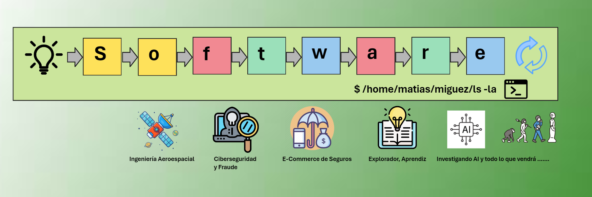

¡Bienvenidos a mi blog personal de Notas Tecnológicas! 🚀 Aquí encontrarás información que he ido recopilando sobre cursos, libros, notas, universidad, posgrados y cualquier otra fuente.

**¿Quién soy?** Conéctate conmigo en LinkedIn y hablemos: [Matias Miguez](https://www.linkedin.com/in/matiasmiguez/) 🤝

**Estado de despliegue en GitHub Pages:**:  🛠️

**Contacto**: Si encuentras algún error tipográfico, imágenes faltantes o problemas en las páginas, no dudes en ponerte en contacto conmigo. Puedes escribirme a [GMAIL](mailto:matiaspakua@gmail.com). 📧

<mark style="background: #BBFABBA6;">IMPORTANTE</mark>: Todas las notas compartidas aquí reflejan mi investigación personal, mi camino de aprendizaje y mis opiniones. Siempre proporciono referencias a los autores originales y respeto los derechos de autor. 🔍📚

--- 

# 🌐General (sin categoria específica)

- [Introduction and notes on NoSQL Databases](/pages/general_topic/nosql_the_basis_of.md) 
- [Specialisation Building Cloud Computing Solutions at Scale](/pages/general_topic/specialization_building_cloud_computing_solutions_at_scale.md)
- [How to build a KnowledgeBase](/pages/general_topic/how_to_build_a_knowledge_base.md)
- [On User Stories notes](/pages/general_topic/on_user_stories_notes.md)
- [Design Thinking notes](/pages/general_topic/design_thinking_explained.md)
- [Tech Trends 2023](/pages/general_topic/tech_trends_2023.md)
- [A reflection on Software Engineering: A Journey of Creativity and Rigor](/pages/general_topic/reflection_on_software_engineering.md)

# 💻 Desarrollo, Programación

- [Spring Framework Notes](/pages/development/spring_framework_notes.md)
- [Notas de Java](/pages/development/on_java_notes.md)
- [On API Notes](/pages/development/on_rest_api_notes.md)
- [Git, Gitflow and Trunk Based development](/pages/development/git_and_gitflow_trunk_based_dev.md) 
- [Getting Started In Spring Development](/pages/development/getting_started_spring_development.md)
- [Advance Your Spring Development Skills](/pages/development/advance_your_spring_development_skills.md)
- [Notas de Programación en C](/pages/development/programacion_c.md)
- [Concurrencia y Java](/pages/development/concurrencia_java.md) 

# 🧪 Software and System Testing

- [Gherkin and Automation](/pages/testing/gherkin_and_automation.md)
- [RobotFramework to test satellites](/pages/testing/robotframework_to_test_satellites.md)
- [On Unit Test, TDD and BDD](/pages/testing/on_unit_test_tdd_and_bdd.md)
- [BDD with Cucumber for Java course](/pages/testing/bdd_with_cucumber_java_notes.md)  ( pendiente... ) 

# 🛠️ Ingeniería de Software

- [Agile and SCRUM. The perks of know nothing](/pages/software_engineering/agile_and_scrum.md)
- [Waterfall: what really means the paper](/pages/software_engineering/waterfall.md)
- [The History of the project A7 by David Parnas](/pages/software_engineering/the_history_of_the_project_A7_by_David_Parnas.md)
- [Software engineering timeline](/pages/software_engineering/software_engineering_timeline.md)  en progreso... 
- [Generative AI](/pages/software_engineering/generative_ai.md)

# 🏗️ Software y Arquitectura de sistemas

- [On hexagonal Architecture notes](/pages/sw_and_system_architecture/on_hexagonal_architecture_notes.md)
- [Vertical Slicing Architectures](/pages/sw_and_system_architecture/vertical_slicing_architectures.md)
- [Sustainable Software Architecture](/pages/sw_and_system_architecture/sustainable_software_architecture.md)

# 🔒 Ciberseguridad

* [Conference h4cked 2022](/pages/cybersecurity/cybersecurity_h4ck3d.md)
* [Cybersecurity Foundations](/pages/cybersecurity/cybersecurity_foundations.md)
* [IT Security Foundations: Core Concepts](/pages/cybersecurity/it_security_foundations_core_concepts.md)
* [Programming Foundations: Web Security](/pages/cybersecurity/programming_foundations_web_security.md)
* [DevOps Foundations: DevSecOps](/pages/cybersecurity/dev_sec_ops_foundations.md)

# 🤝 Liderazgo y colaboración

 - [What The Little Prince teach about engineering](/pages/leadership/what_the_little_prince_teach_about_engineering.md) 
 - [Notes on Masterclass Dev to Tech Lead](/pages/leadership/dev_to_tech_lead.md)
 - [How to Speak by Patrick Winston notes](/pages/leadership/how_to_speak_by_patrick_winston.md)
 - [Negociación y resolución de conflictos](/pages/leadership/resolucion_de_conflictos.md)
 - [Emotional Intelligence](/pages/leadership/emotional_intelligence.md)
 - [Gestión del tiempo (Time Management)](/pages/leadership/time_management.md)

# 🌍 WeAreDevelopers World Congress 2024 Berlin

Charlas --> [Notas de las charlas](/pages/we_are_developers_wc_2024/landing.md)

# 📚 Cursos y Charlas 🎤

 * [Visual Thinking](/pages/cursos/visual_thinking.md)

# 🚀⚙️ Proyectos

 - [Biblioteca Técnica](/pages/projects/biblioteca_tecnica.md)

# 🎓 UCA posgrado de Especialización en Ingeniería de Software 💻

 - [Materias y notas de la especialización](/pages/sw_eng_specialization/landing.md)

# UP (U. de Palermo) Master en tecnología de la Información

 - [Materias y notas del master](pages/master_ti/landing.md)

# 📚 Libros leídos

 * [Modern Software Engineering: Doing What Works to Build Better Software Faster, By David Farley](/pages/books/modern_software_engineering.md)
 * [Extreme Programming Explained](/pages/books/book_extreme_programming_explained.md)
 * [The Mythical Man-Month: Essays on Software Engineering, by Fred Brooks](/pages/books/the_mythical_man_month.md)   transcribiendo notas... 
 *  ReWork: Change the Way You Work Forever, By David Heinemeier Hansson and Jason Fried  transcribiendo notas... 
 * Applying UML and Patterns: An Introduction to Object-Oriented Analysis and Design and Iterative Development, Craig Larman
 * Thinking in Java 2nd Edition, by Bruce Eckel
 * C Programming Language, 2nd Edition, by de Brian W. Kernighan and Dennis M. Ritchie
 * Design Patterns Elements of Reusable Object-Oriented Software by Erich Gamma, Richard Helm, Ralph Johnson, John M. Vlissides
 * Software Engineering, 10th Edition by Ian Sommerville
 * Software Engineering: A Practitioner's Approach, 8th Edition, Roger Pressmann
 * The Object Primer, 3rd Edition, Scott Ambler 
 * Structured Computer Organization, 5 ed. Tanenbaum
 * Computer Networks, 5 ed. Tanenbaum

# 📖 Libros en curso...
 
 - Clean Code: A Handbook of Agile Software Craftsmanship by Robert C. Martin (13%)
 - Refactoring: improving the design of existing code, by Martin Fowler (5%)
 - Working effectively with legacy code, by Michael Feathers (5%)
 - Spring in Action, 5th Edition by Craig Walls (80%)
 - HEAD FIRST JAVA, 3RD EDITION: A BRAIN-FRIENDLY GUIDE (70%)
 - Habito Atomico, James Clear

# 🌐Web interesantes / libros

- [Shape Up. A book, a web site](https://basecamp.com/shapeup)
- [Xtrem TDD](https://xtrem-tdd.netlify.app/)
- [Software Engineering at Google. A book, a web site](https://abseil.io/resources/swe-book)
- [On Agile by Martin Fowler](https://martinfowler.com/agile.html)
- [Software Design By Example. A book, a web site](https://third-bit.com/sdxjs/)
- [On Architecture by Martin Fowler](https://martinfowler.com/architecture/)
- [The C4 model for visualising software architecture by Simon Brown](https://c4model.com/)
- [On Microservices. The complete reference guide](https://microservices.io/)
- [The Architecture of Open Source Applications. A book, a web site](http://aosabook.org/en/index.html)
- [Hexagonal Me](https://jmgarridopaz.github.io/content/articles.html)   nueva web para chusmear!
- [Java SE 21: Programming Complete](https://mylearn.oracle.com/ou/course/java-se-21-programming-complete/138847)

# Otros Libros, Novelas, etc.

 * I, Robot by Issac Asimov (1950)  
 * Caves of Steel  by Issac Asimov (1954)  
 * The Naked Sun  by Issac Asimov (1957)  
 * The Robots of Dawn  by Issac Asimov (1983)  
 * Robots and Empire  by Issac Asimov  (1985)
 * Exhalation, by Ted Chiang
 * The Lord Of the Rings (all three), The hobbit and The Simarilion
 * Millenium Saga (Stieg Larson) I, II and III
 * The Little Prince, by Antoine de Saint-Exupéry
 * El Alquimista, Paulo Cohelo
 * 100 Años de Soledad, Gabriel Garcia Marquez
 * Imperio. En la Arena Estelar.
 * Cuentos completos de Robots.
 * 1984 George Orwell (54%)

---

# Blog siempre en progreso, como el pan de cada día!!

