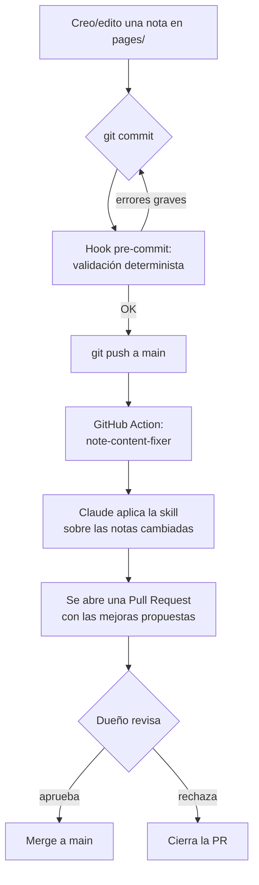

# Note Content Fixer

Automatismo de **pre-validación y mejora de contenido** para las notas de
`pages/`. Garantiza que cada nota nueva o editada siga un template consistente,
con buen formato, tags, referencias y alineada con el estilo de escritura
personal del autor — compatible con **Obsidian** y con el sitio **GitHub Pages**
(just-the-docs).

## Componentes

| Componente | Qué hace | Cuándo corre |
|---|---|---|
| **Skill** `.claude/skills/note-content-fixer/SKILL.md` | Define el template, la taxonomía de tags, el estilo del autor y el checklist de calidad. La aplica Claude. | Manual (en una sesión de Claude Code) y desde la Action. |
| **Validador** `scripts/validate_notes.py` | Chequeo determinista (sin IA): frontmatter, título, HTML legacy, anclas, links internos rotos, H1. | Hook local + Action. |
| **Hook** `.githooks/pre-commit` | Valida las notas en staging antes del commit. Bloquea solo ante errores graves. | Local, antes de cada commit (opt-in). |
| **Workflow** `.github/workflows/note-content-fixer.yml` | Aplica la skill con Claude sobre las notas cambiadas y **abre una PR** con las mejoras. | Push a `main` que toque `pages/**.md`, o manual. |

## Flujo completo



## Puesta en marcha

### 1. Activar el hook local (una vez)

```bash
git config core.hooksPath .githooks
```

A partir de ahí, `git commit` validará las notas en staging. Para saltarlo
puntualmente: `git commit --no-verify`.

### 2. Configurar el secret de la API (requerido para la Action)

La Action usa la API de Anthropic. Añadir el secret en GitHub:

**Settings → Secrets and variables → Actions → New repository secret**

- Nombre: `ANTHROPIC_API_KEY`
- Valor: tu clave de API de Anthropic (`sk-ant-...`).

Sin este secret, la Action fallará en el paso de Claude (el resto del repo y el
sitio siguen funcionando con normalidad).

### 3. (Opcional) Permitir que la Action cree PRs

En **Settings → Actions → General → Workflow permissions**, habilitar:

- *Read and write permissions*.
- *Allow GitHub Actions to create and approve pull requests*.

## Uso manual de la skill

En una sesión de Claude Code, antes de commitear notas nuevas:

```
/note-content-fixer
```

O pedirle a Claude: *"aplicá la skill note-content-fixer a las notas que acabo
de crear"*.

## Validar manualmente

```bash
python3 scripts/validate_notes.py                  # todas las notas
python3 scripts/validate_notes.py pages/x/y.md     # archivos concretos
```

## Notas de diseño

- La Action **nunca** escribe en `main`: solo abre PRs. El dueño revisa y
  mergea.
- El workflow se salta a sí mismo (no re-procesa el merge de sus propias PRs)
  mediante guardas por actor y mensaje de commit.
- El validador es idempotente y no usa IA, por lo que es seguro y gratis correr
  en cada commit.
