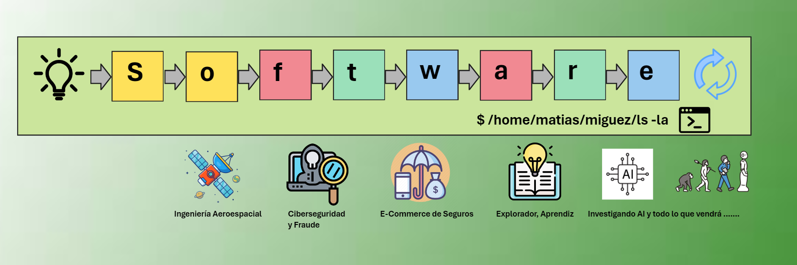

¡Bienvenidos a mi blog personal de Notas Tecnológicas! 🚀 Aquí voy recopilando información sobre cursos, libros, notas, universidad, posgrados y cualquier otra fuente. Una bolsa de sastre básicamente.

**¿Quién soy?** Conectemos en LinkedIn y hablemos: [Matias Miguez](https://www.linkedin.com/in/matiasmiguez/) 

🛠️ **Estado de despliegue en GitHub Pages:**  

> **IMPORTANTE:** Todas las notas compartidas aquí reflejan mi investigación personal, mi camino de aprendizaje y mis opiniones. Siempre pondré las referencias a los autores originales y respeto los derechos de autor.

<button class="libutton" onclick="window.location.href='https://www.linkedin.com/comm/mynetwork/discovery-see-all?usecase=PEOPLE_FOLLOWS&followMember=matiasmiguez'">Follow on LinkedIn</button>

---

## 🌐 Nube de conocimiento

<canvas id="ws-canvas" style="display:block;width:100%;cursor:default;"></canvas>

> [!tip]
> Hacé clic en cualquier término para ir a la nota correspondiente. Usá el **buscador** (arriba a la izquierda) para encontrar notas por palabra clave, o navegá por las secciones de abajo.

---

## 🌐 General

- [Introduction and notes on NoSQL Databases](/pages/general_topic/nosql_the_basis_of.md) 
- [Specialisation Building Cloud Computing Solutions at Scale](/pages/general_topic/specialization_building_cloud_computing_solutions_at_scale.md)
- [How to build a KnowledgeBase](/pages/general_topic/how_to_build_a_knowledge_base.md)
- [On User Stories notes](/pages/general_topic/on_user_stories_notes.md)
- [Design Thinking notes](/pages/general_topic/design_thinking_explained.md)
- [Tech Trends 2023](/pages/general_topic/tech_trends_2023.md)
- [A reflection on Software Engineering: A Journey of Creativity and Rigor](/pages/general_topic/reflection_on_software_engineering.md)
- [Introducción desde cero a Kubernetes](/pages/general_topic/kubernetes.md) 
- [Visual Thinking](/pages/cursos/visual_thinking.md)

## 💻 Desarrollo y Programación

- [Spring Framework Notes](/pages/development/spring_framework_notes.md)
- [Notas de Java](/pages/development/on_java_notes.md)
- [On API Notes](/pages/development/on_rest_api_notes.md)
- [Git, Gitflow and Trunk Based development](/pages/development/git_and_gitflow_trunk_based_dev.md) 
- [Getting Started In Spring Development](/pages/development/getting_started_spring_development.md)
- [Advance Your Spring Development Skills](/pages/development/advance_your_spring_development_skills.md)
- [Notas de Programación en C](/pages/development/programacion_c.md)
- [Concurrencia y Java](/pages/development/concurrencia_java.md) 
- [OpenAPI](/pages/development/OpenApi.md)
- [Interfaces Funcionales en Java](/pages/development/java_interfaces_funcionales.md)

## 🤖 Inteligencia Artificial

- [AI. Conceptos de Introducción](pages/artificial_intelligence/ruta_de_aprendisaje/1.fundamentos_inteligencia_artificial/1_conceptos_generales.md)

## 🧪 Testing de sistemas y software 

- [Gherkin and Automation](/pages/testing/gherkin_and_automation.md)
- [On Unit Test, TDD and BDD](/pages/testing/on_unit_test_tdd_and_bdd.md)
- [BDD with Cucumber for Java course](/pages/testing/bdd_with_cucumber_java_notes.md) 

## 🛠️ Arquitectura e Ingeniería de Software

- [Agile and SCRUM. The perks of know nothing](/pages/software_engineering/agile_and_scrum.md)
- [Waterfall: what really means the paper](/pages/software_engineering/waterfall.md)
- [The History of the project A7 by David Parnas](/pages/software_engineering/the_history_of_the_project_A7_by_David_Parnas.md)
- [Software engineering timeline](/pages/software_engineering/software_engineering_timeline.md) 
- [Generative AI](/pages/software_engineering/generative_ai.md)
- [On hexagonal Architecture notes](/pages/sw_and_system_architecture/on_hexagonal_architecture_notes.md)
- [Vertical Slicing Architectures](/pages/sw_and_system_architecture/vertical_slicing_architectures.md)
- [Sustainable Software Architecture](/pages/sw_and_system_architecture/sustainable_software_architecture.md)

## 🛰️ Espacio, satélites e ingeniería aeroespacial

- [Introducción al Sector Espacial](/pages/space/space_introduccion.md)
- [Propagación Orbital](/pages/space/orbit_propagation.md)

## 🔒 Ciberseguridad

- [Conference h4cked 2022](/pages/cybersecurity/cybersecurity_h4ck3d.md)
- [Cybersecurity Foundations](/pages/cybersecurity/cybersecurity_foundations.md)
- [IT Security Foundations: Core Concepts](/pages/cybersecurity/it_security_foundations_core_concepts.md)
- [Programming Foundations: Web Security](/pages/cybersecurity/programming_foundations_web_security.md)
- [DevOps Foundations: DevSecOps](/pages/cybersecurity/dev_sec_ops_foundations.md)
- [Threat analysis con Falco y AWS security Hub](/pages/cybersecurity/falco_runtime_security_for_container.md)

## 🤝 Liderazgo y colaboración

- [¿Qué nos enseña El Principito para aplicar en la ingeniería?](/pages/leadership/what_the_little_prince_teach_about_engineering.md) 
- [De developer a líder: notas y libros sugeridos](/pages/leadership/dev_to_tech_lead.md)
- [How to Speak by Patrick Winston notes](/pages/leadership/how_to_speak_by_patrick_winston.md)
- [Negociación y resolución de conflictos](/pages/leadership/resolucion_de_conflictos.md)
- [Emotional Intelligence](/pages/leadership/emotional_intelligence.md)
- [Gestión del tiempo (Time Management)](/pages/leadership/time_management.md)
- [Como hacer Presentaciones](/pages/leadership/como_hacer_presentaciones.md)

## 🌍 WeAreDevelopers World Congress 2024 Berlin

Charlas → [Notas de las charlas](/pages/we_are_developers_wc_2024/landing.md)

1. [Evolutionary Architecture: the art of making decisions — Jose Enrique Calderon Sanz](pages/we_are_developers_wc_2024/charla_01.md)
2. [Architecture Antipattern — Andreas Voigt](pages/we_are_developers_wc_2024/charla_02.md)
3. [Next Level Enterprise Architecture: Modular, Flexible, Scalable and IA ready? — Maik Wietheger & Jan-Christoph Schlieker](pages/we_are_developers_wc_2024/charla_03.md)
4. [Architecting the future: leveraging AI, Cloud, and data for business Success](pages/we_are_developers_wc_2024/charla_04.md)
5. [Beyond the hype: Real-World AI strategies](pages/we_are_developers_wc_2024/charla_05.md)
6. [Durable Execution: A revolutionary abstraction for building resilient applications — Maxim Fateev](pages/we_are_developers_wc_2024/charla_06.md)
7. [Real-World Threat Modeling — Ali Yazdani](pages/we_are_developers_wc_2024/charla_07.md)
8. [Intentional code: minimalism in a world of dogmatic design — David Whitney](pages/we_are_developers_wc_2024/charla_08.md)
9. [Specifications as the better way of software development — Artem Manchenkov](pages/we_are_developers_wc_2024/charla_09.md)
10. [From zero to Hero: Launch & manage your cloud apps with free OpenShift — Markus Eisele](pages/we_are_developers_wc_2024/charla_10.md)
11. [Autonomous microservices with event-driven architecture — Florian Lenz](pages/we_are_developers_wc_2024/charla_11.md)
12. [Quantum Computing for classical developers — Julian Burr](pages/we_are_developers_wc_2024/charla_12.md)
13. [The Lifehackers guide to software architecture — Julian Lang](pages/we_are_developers_wc_2024/charla_13.md)
14. [Scaling Databases — Tobias Petry](pages/we_are_developers_wc_2024/charla_14.md)
15. [The Transformative impact of GenAI for software development — Chris Wysopal](pages/we_are_developers_wc_2024/charla_15.md)
16. [The Future of Open Source — Scott Chacon](pages/we_are_developers_wc_2024/charla_16.md)
17. [Micro-Frontends discovery — Luca Mezzalira](pages/we_are_developers_wc_2024/charla_17.md)
18. [Non-Functional user Stories Specification and test — Johannes Bergsmann](pages/we_are_developers_wc_2024/charla_18.md)
19. [Modern data Architectures need software engineering — Matthias Niehoff](pages/we_are_developers_wc_2024/charla_19.md)
20. [Serverless Java in action: cloud agnostic design patterns and tips — Kevin Dubois & Daniel Oh](pages/we_are_developers_wc_2024/charla_20.md)

## 🎓 UCA — Especialización en Ingeniería de Software

### Módulo Ingeniería de Productos de Software 

- [Ingeniería de Requerimientos](pages/sw_eng_specialization/ingenieria_requisitos/software_requirements.md)
- [Modelado de Software con Objetos](pages/sw_eng_specialization/software_modeling/software_modeling_with_objects.md)
- [Arquitecturas de Software](pages/sw_eng_specialization/software_architecture/contenidos.md)
- [Mediciones de Software y Sistemas](pages/sw_eng_specialization/software_and_systems_measurements.md)
  
### Módulo Gestión de Proyectos de Desarrollo

- [Planeamiento y Estimación de Proyectos de Software](pages/sw_eng_specialization/software_planning/sofware_projects_scheduling_and_estimation.md)
- [Administración del Riesgo en Desarrollo de Software](pages/sw_eng_specialization/software_development_risk_management.md)
- [Gestión de Recursos Humanos y Conducción de Equipos](pages/sw_eng_specialization/team_driving_and_human_resource_management.md)
- [Métodos de Desarrollo de Software](pages/sw_eng_specialization/software_development_methods.md)
  
### Módulo Gestión de la Calidad de Software

- [Testing de Software](pages/sw_eng_specialization/software_testing.md)
- [Calidad de Software](pages/sw_eng_specialization/software_quality.md)
  
### Módulo Complementarias

- [Marketing](pages/sw_eng_specialization/marketing.md)
- [Contratos y Aspectos Legales de Software](pages/sw_eng_specialization/software_legal_aspects_and_contracts.md)
- [Ética Profesional](pages/sw_eng_specialization/professional_ethics.md)

### Proyecto Final

- [DevSecOps desde la perspectiva de QA Automation](pages/sw_eng_specialization/final_projects_specialization.md)
- [Materias y notas de la especialización](/pages/sw_eng_specialization/landing.md)

## 🎓 UP — Master en Tecnología de la Información

- [Cloud Computing](pages/master_ti/cloud_computing/landing.md)
- [Transformación Digital](pages/master_ti/transformacion_digital/landing.md)
- [Seguridad Informática](pages/master_ti/seguridad_informatica/landing.md)
- [Materias y notas del master](pages/master_ti/landing.md)

## 🎓 laSalle BCN — Master en Dirección Tecnológica e Innovación Digital

- [Gestión Empresarial y Transformación Digital](pages/master_direccion_tecnologica/01_gestion_empresarial_y_transformacion_digital/landing.md)
- [Habilidades Directivas (Seminario Profesionalizante)](pages/master_direccion_tecnologica/03_seminario_profesionalizado/landing.md)
- [Gestión Económico Financiera](pages/master_direccion_tecnologica/02_gestion_economico_financiera/landing.md)
- [Materias y Notas del master](pages/master_direccion_tecnologica/landing.md)

---

# ⚙️ Proyectos

- [Python Flask ML Demo Project with CI/CD](/pages/projects/uso_modelo_machine_learning.md)
- [Orquestador de Workflows](/pages/projects/orquestador_workflows.md) WIP
- [Biblioteca Técnica](/pages/projects/biblioteca_tecnica.md)
- [Sistema analizador de transacciones basado en Reglas](/pages/projects/tx_analyzer.md) TODO
- [Plataforma de pruebas de SmallSats](/pages/projects/plataforma_pruebas_smallsats.md) TODO

---

# 🌐 Webs y recursos recomendados

- [Shape Up (Basecamp)](https://basecamp.com/shapeup)
- [Xtrem TDD](https://xtrem-tdd.netlify.app/)
- [Software Engineering at Google](https://abseil.io/resources/swe-book)
- [On Agile — Martin Fowler](https://martinfowler.com/agile.html)
- [Software Design By Example](https://third-bit.com/sdxjs/)
- [On Architecture — Martin Fowler](https://martinfowler.com/architecture/)
- [The C4 model — Simon Brown](https://c4model.com/)
- [Microservices.io — Chris Richardson](https://microservices.io/)
- [The Architecture of Open Source Applications](http://aosabook.org/en/index.html)
- [Hexagonal Me — Juan Manuel Garrido](https://jmgarridopaz.github.io/content/articles.html)
- [Java SE 21: Programming Complete](https://mylearn.oracle.com/ou/course/java-se-21-programming-complete/138847)

# 📖 Libros en curso

- Clean Code: A Handbook of Agile Software Craftsmanship — Robert C. Martin 
- Refactoring: improving the design of existing code — Martin Fowler 
- Working effectively with legacy code — Michael Feathers 
- Spring in Action, 5th Edition — Craig Walls 
- Head First Java, 3rd Edition
- Hábito Atómico — James Clear

# 📚 Libros leídos

- [Modern Software Engineering — David Farley](/pages/books/modern_software_engineering.md)
- [Extreme Programming Explained](/pages/books/book_extreme_programming_explained.md)
- [The Mythical Man-Month — Fred Brooks](/pages/books/the_mythical_man_month.md) transcribiendo notas...
- ReWork: Change the Way You Work Forever — David Heinemeier Hansson and Jason Fried transcribiendo notas...
- Applying UML and Patterns — Craig Larman
- Thinking in Java 2nd Edition — Bruce Eckel
- C Programming Language, 2nd Edition — Kernighan & Ritchie
- Design Patterns: Elements of Reusable Object-Oriented Software — GoF
- Software Engineering, 10th Edition — Ian Sommerville
- Software Engineering: A Practitioner's Approach, 8th Ed. — Roger Pressmann
- The Object Primer, 3rd Edition — Scott Ambler
- Structured Computer Organization, 5th ed. — Tanenbaum
- Computer Networks, 5th ed. — Tanenbaum

# 📚 Otros libros, novelas, etc.

- I, Robot — Issac Asimov (1950)  
- Caves of Steel — Issac Asimov (1954)  
- The Naked Sun — Issac Asimov (1957)  
- The Robots of Dawn — Issac Asimov (1983)  
- Robots and Empire — Issac Asimov (1985)
- Exhalation — Ted Chiang
- The Lord Of the Rings + The Hobbit + The Silmarillion
- Millennium Saga (Stieg Larsson) I, II, III
- The Little Prince — Antoine de Saint-Exupéry
- El Alquimista — Paulo Coelho
- 100 Años de Soledad — Gabriel García Márquez
- 1984 — George Orwell

---

