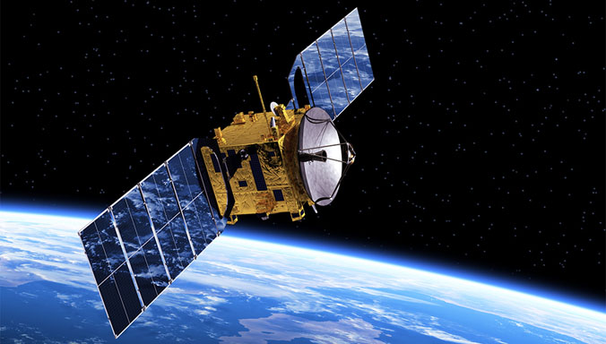
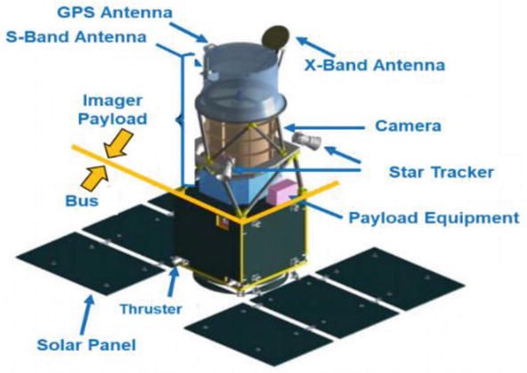
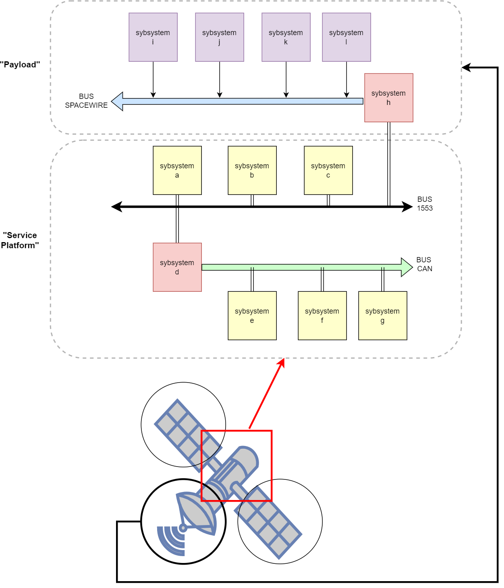
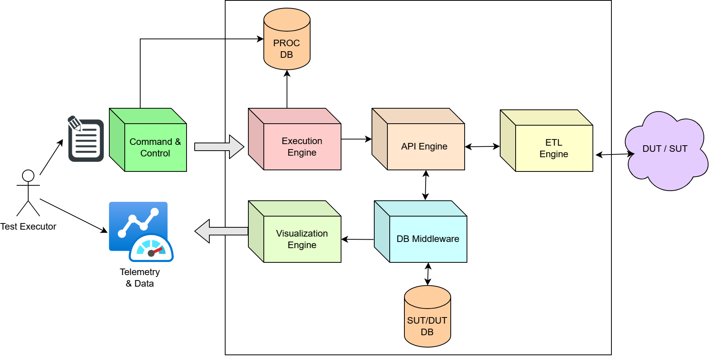
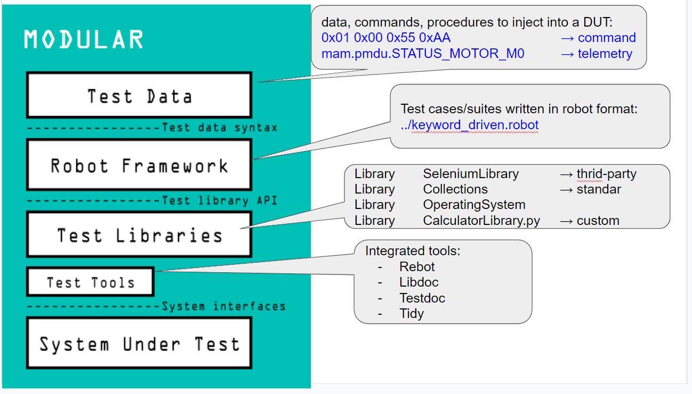

# 03. RobotFramework to test a Satellite

<style>
  .back-button {
    background-color: #4CAF50; /* Green */
    border: none;
    color: white;
    padding: 15px 32px;
    text-align: center;
    text-decoration: none;
    display: inline-block;
    font-size: 16px;
    margin: 4px 2px;
    cursor: pointer;
  }
</style>

<button class="back-button" onclick="window.location.href='https://matiaspakua.github.io/tech.notes.io'">All notes</button>

## Table of content

## Introduction

This notes describe the characteristics and decisions made during a project where I was part of. I've been working in a technology based company with four main business areas: investigation and medical nuclear reactors, telecommunications and scientific satellites (aerospace), commercial and defense ground radars and nuclear medicine.

I worked in the Aerospace area. This company started a new space program that consists of developing a family of generic satellites. To put some context, here a list of definitions:

Artificial Satellite: An artificial satellite is a man-made object that is intentionally placed into orbit around a planet, moon, or other celestial body. These satellites are launched from Earth and are used for a variety of purposes, such as scientific research, communication, navigation, weather observation, and military surveillance. Artificial satellites can be placed in a variety of orbits depending on their intended use, including low Earth orbit (LEO), geostationary orbit (GEO), and polar orbit. A satellite consists of two main components: the payload and the service platform.



**The payload** is the part of the satellite that performs the mission-specific functions. It can include instruments, sensors, cameras, antennas, and other equipment that are designed to gather data, transmit information, or perform other tasks. The payload is usually located on the top of the satellite and is protected by a special cover that shields it from the harsh environment of space.

**The service platform**, also known as the bus, is the framework that supports the payload and provides the necessary infrastructure for the satellite's operation. It includes the power supply, the propulsion system, the communication system, and the attitude control system. The service platform also manages the data that is collected by the payload and sends it back to Earth.

## Satellite Architecture

A generic artificial satellite typically consists of several components:

1. **Power Source**: A satellite is powered by a combination of batteries, solar panels, or fuel cells. Solar panels are commonly used in satellites that orbit the Earth as they can absorb sunlight to generate electricity.

2. **Communication system**: A communication system is used to communicate with the ground station and other satellites. This system can consist of a transmitter, receiver, and antenna.

3. **Control system**: A control system is used to maneuver the satellite in orbit and keep it oriented in the correct direction. This system can include reaction wheels, thrusters, and gyroscopes.

4. **Payload**: A satellite carries a payload, which can include scientific instruments, cameras, and other equipment that are used to collect data and perform experiments.

5. **Structure**: The structure of a satellite is designed to withstand the harsh conditions of space and launch, including extreme temperatures, radiation, and vibrations.

6. **Thermal control**: The thermal control system is responsible for maintaining the temperature of the satellite's components within acceptable limits.

7. **Attitude control**: The attitude control system is responsible for orienting the satellite and keeping it pointing in the desired direction.

Overall, a satellite must be designed to withstand the harsh conditions of space and be capable of performing its intended mission for an extended period of time.



## The problem

The design of the payload and service platform depends on the specific mission requirements of the satellite. Some satellites are designed to observe the Earth's surface, others are used for navigation or communication, and still others are sent to explore other planets and celestial bodies in our solar system.

The company started a new path to develop a new satellite program, with a more generic service platform, that allows the modularization, generalization and reutilization of key componentes (mechanical, computer and software) of the service platform (like a Lego puzzle). As in software engineer, the benefits are the same: 

1. **Reduced development time**: When building a new system, developers can leverage existing modules, which significantly reduces development time and effort.

2. **Lower cost**: Reusing components reduces the cost of development, testing, and maintenance. It also reduces the need for additional resources such as hardware and software.

3. **Improved reliability**: Reusing components that have been thoroughly tested and used in production environments increases the reliability of the new system.

4. **Easier maintenance**: By using modular and well-defined components, maintenance becomes easier since each component can be updated or replaced individually.

5. **Better scalability**: By using a modular approach, components can be added or removed as needed to adjust to changes in demand or requirements.

6. **Increased flexibility**: Using generic and reusable components allows for greater flexibility in system design, making it easier to adapt to changing requirements or customer needs.

Overall, using modular, generic, and reusable components leads to more efficient and cost-effective development and maintenance of software systems.

## A new Testing Platform

To the program to succeed, besides the basic and detail engineering of the mechanical, hardware and software system, was needed a new kind of Testing Platform that help the program to evolve.

The space program start a new development of a testing platform for a complex system, that consists of software and hardware infrastructure that allows for the systematic and comprehensive testing of all aspects of the system's functionality, performance, and resilience.

### The main component required were:

1. Test cases and scenarios that cover all possible system inputs, outputs, and behaviors.
2. Tools for generating test data and measuring system performance and output accuracy.
3. A test environment that closely resembles the system's production environment, including hardware, software, and network configurations.
4. Test automation tools that enable the repeatable and efficient execution of test cases.
5. A test management system that provides visibility into testing progress, results, and defects.
6. Integration with the system's development and deployment processes, to enable continuous testing and feedback loops.
7. Provision for scalability and adaptability to accommodate changes in system requirements or technology stack over time.

A comprehensive and well-designed testing platform can help ensure that a complex system meets all functional and non-functional requirements, performs reliably under various conditions, and is resilient to failures and cyberattacks.

## Project Overview

### The SUT/DUT context diagram

First, the satellite (the SUT/DUT) is a complex system, that mean:  is a system composed of many interconnected and interdependent parts, whose behavior and properties cannot be fully understood or predicted by studying the individual components in isolation. Complex systems are characterized by emergent properties, where the system as a whole exhibits new behaviors and patterns that cannot be explained by the behavior of its individual components.

Each component of the system (the satellite) has it own behaviour, interfaces and connections. To test a fully integrated satellite is a tremendous endeavour. For this reason existen, during the project lifetime, many testing stages (as in a software system), that start with a simple unit and then progresively each unit is connected and integrated with other unit and so forth.




Each unit of the system is called: "subsystem" and each subsystem are interconnected using different communication Buses, depending of a set of constraint associated with the subsystem functionality. 

Exists a variety of communication buses: MIL1553, CAN, SPACEWIRE, and others, but for this example I use this three.

### The testing platform context diagram

Now is time to talk about the high level idea for the testing platform. 

1. First, we need a common, standard, centralized, modular and complete "Command and Control" console. With this "component" we can stimulate the system, subsystem or unit.

2. Then, is needed a visual console, where to retrieve telemetry, data, information, status, health and any information userful. This componente require more than one mechanism to see, process and analyze any kind of information that is retrieve from the SUT/DUT or any other component, even from componentes that are not part of the SUT/DUT, like the underling infraestructure.




## RobotFramework

Robot Framework is an open-source, keyword-driven test automation framework that supports both behavior-driven development (BDD) and acceptance test-driven development (ATDD) approaches. It provides a simple tabular syntax for creating test cases in a way that's easily readable by both technical and non-technical stakeholders. Robot Framework has a modular architecture that allows users to extend its functionality using libraries written in Python or Java. It also supports a variety of test automation tools, including Selenium, Appium, and REST API testing libraries.

## RoboFramework Architecture

The Robot Framework is a generic test automation framework, and its architecture is based on a modular design that allows it to support a wide range of test automation needs. The framework is written in Python and consists of four main components:

1. **Test Data**: This component contains test cases and suites, which can be written in either a tabular format or a more expressive format using a domain-specific language (DSL) based on keywords.

2. **Test Libraries**: This component provides the building blocks for test automation by providing a set of pre-defined keywords that can be used to interact with the system under test (SUT). Libraries can be implemented in Python, Java, or other programming languages, and can be extended or customized to meet specific testing needs.

3. **Test Runner**: This component executes test cases and suites by invoking keywords from the test libraries. It can produce detailed test reports, logs, and metrics to help with test analysis and debugging.

4. **Test Environment**: This component provides the infrastructure and resources required to run tests, such as the SUT, test data, test libraries, and other tools and utilities needed for testing.



## Python and RobotFramework

In RobotFramework, a keyword or step refers to a single action or a small sequence of actions that can be executed by the test script. Keywords are the building blocks of a test case or a test suite, and they can be written in any programming language supported by RobotFramework, such as Python, Java, or .NET.

The concept of keywords in RobotFramework is closely related to Behavior Driven Development (BDD) and Acceptance Test Driven Development (ATDD). In BDD and ATDD, scenarios are described in a natural language, such as English, using a syntax called Gherkin. Each scenario consists of a sequence of steps, which can be translated into keywords or methods in a programming language. By using keywords in RobotFramework, it becomes easier to write test cases that follow the structure of a Gherkin scenario, making it more readable and maintainable. Additionally, keywords in RobotFramework can be reused across multiple test cases, making the testing process more efficient.


```python

from robot.api.deco import keyword

class MyLibrary:
    
    def __init__(self):
        pass

    @keyword
    def add_numbers(self, a, b):
        """Returns the sum of two numbers."""
        return int(a) + int(b)

    @keyword
    def multiply_numbers(self, a, b):
        """Returns the product of two numbers."""
        return int(a) * int(b)
```

In this example we create a custom class with 2 keyword. RobotFramework allows you to import and use this class directly by importing it in a .resource file or packing this class in a package like WHEEL and install it in the local python environment.

## Test Executor and the Command and Control environment

## Procedures Database


## References

 - [Satellite Engineering](https://www.intechopen.com/chapters/72725)