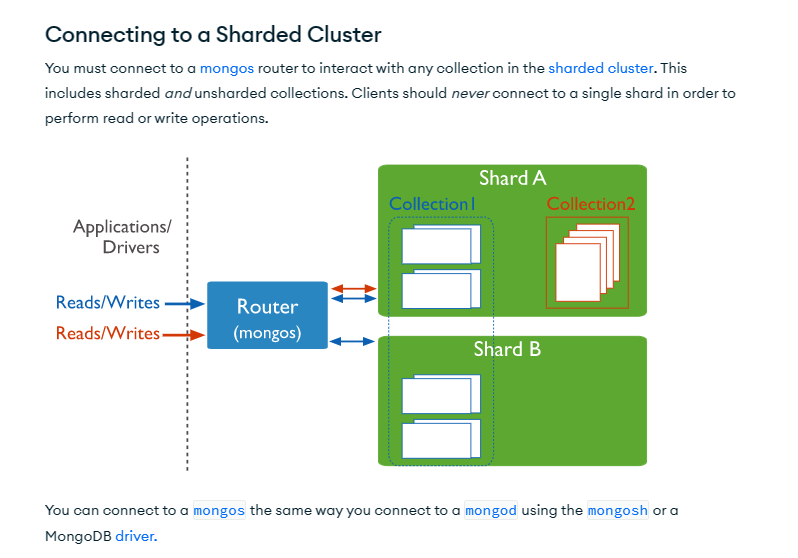

# 1. NoSQL. Concepts, uses, examples and highlights

<style>
  .back-button {
    background-color: #4CAF50; /* Green */
    border: none;
    color: white;
    padding: 15px 32px;
    text-align: center;
    text-decoration: none;
    display: inline-block;
    font-size: 16px;
    margin: 4px 2px;
    cursor: pointer;
  }
</style>

<button class="back-button" onclick="window.history.back()">Back</button>


## Introduction

NoSQL stands for "Not Only SQL", and refers to a type of database that doesn't follow the traditional relational data model used by SQL databases. Instead, NoSQL offers a variety of data models, including document, column, graph, and key-value, that are better suited for a variety of applications and uses.

Some of the key features of NoSQL databases include:

 - Scalability: NoSQL is highly scalable, meaning it's easy to scale to handle massive amounts of data and a large number of users.
 - Flexibility: NoSQL offers greater flexibility in data structure, allowing users to model the data according to their specific needs.
 - Speed: NoSQL is faster than relational databases due to its ability to handle data in a distributed manner.
 - Availability: NoSQL is highly available, meaning data is always available, even when a server or node fails.
 - Query flexibility: NoSQL allows for great flexibility in querying data, meaning users can access the data in multiple ways, such as complex searches, data analysis, and geospatial queries.


Some of the most common uses of NoSQL include:

- Web and mobile applications: NoSQL is ideal for web and mobile applications due to its ability to handle a large volume of data and a high number of users.
- Big data and analytics: NoSQL is well suited for big data and analytics because it can handle massive amounts of data and support real-time processing.
- Real-time applications: NoSQL is ideal for real-time applications because it can handle a large number of simultaneous users and real-time data updates.
- Content management systems: NoSQL is used in content management systems to store and manage large amounts of structured and unstructured content.

## NoSQL Engines

Some of the most important NoSQL databases currently available:

 - MongoDB: A popular document-based NoSQL database that is widely used for web and mobile applications.
 - Cassandra: A highly scalable, column-based NoSQL database designed for high availability and fast data access.
 - Redis: An in-memory key-value store that supports advanced data structures such as hashes, lists, and sets, making it a popular choice for real-time applications.
 - Couchbase: A document-based NoSQL database that offers features such as full-text search, event-driven architecture, and flexible data modeling.
 - Neo4j: A graph database that is well suited for modeling complex relationships between data elements, making it a popular choice for recommendation engines and social networks.
 - Amazon DynamoDB: A managed NoSQL database offered by Amazon Web Services that is designed for high performance and scalability.
 - CouchDB: An open-source document-based NoSQL database that offers features such as versioning, bi-directional replication, and an easy-to-use API.

These are just a few examples of the many NoSQL databases available. The best NoSQL database for you will depend on your specific needs and requirements.

## NoSQL types of databases

Here's a list of some of the most common types of NoSQL databases:

1. Document databases: Store data as documents, often in a JSON format. Examples include MongoDB, CouchDB, and RavenDB.

2. Key-value databases: Store data as key-value pairs. Examples include Redis and Riak.

3. Column-family databases: Store data as columns instead of rows. Examples include Apache Cassandra and HBase.

4. Graph databases: Store data as nodes and edges in a graph structure. Examples include Neo4j and Amazon Neptune.

5. Time-series databases: Optimized for storing and retrieving time-stamped data. Examples include InfluxDB and TimescaleDB.

6. XML databases: Store data as XML documents. Examples include BaseX and eXist-db.

7. Object databases: Store data as objects, similar to object-oriented programming. Examples include db4o and Perst.

This list is not exhaustive and new types of NoSQL databases continue to emerge as the field evolves. The choice of a particular type of NoSQL database often depends on the specific needs of the application and the data being stored.

## MongoDB

MongoDB is a document-oriented database, which means that data is stored in semi-structured BSON (Binary JSON) format as documents within collections. A collection is a group of related documents, similar to a table in a relational database.

Each document in a collection can have a different structure, allowing for great flexibility in the data model. The documents are stored in a distributed manner across multiple servers in a cluster, which is known as a sharded cluster.

In a sharded cluster, data is split into smaller pieces, known as shards, and distributed across multiple servers. This allows for horizontal scaling, as you can add additional servers to handle increased load.

Each server in a sharded cluster contains a MongoDB instance, which is known as a shard. The shards work together to manage the data and provide high availability and fault tolerance.

In addition to the shards, a sharded cluster also includes a number of configuration servers, which maintain a record of the mapping of data to shards. The configuration servers also store metadata, such as the location of the chunks of data.

The data in a MongoDB cluster can be accessed through a number of nodes, known as query routers. The query routers receive queries from the application, route the queries to the appropriate shards, and return the results back to the application.

This basic architecture provides a scalable, flexible, and highly available solution for storing and accessing large amounts of semi-structured data.


## MongoDB use-case

One common use case for MongoDB's scalability is for a web or mobile application with a growing user base.

Let's say you have a web application that is starting to get more popular, and you're finding that your current relational database is struggling to keep up with the growing volume of data and number of users. With MongoDB, you can scale horizontally by adding more servers to your database cluster.

Here's how this could work in practice:

 - Start with a single MongoDB server: When you first launch your application, you might start with a single MongoDB server to handle your data.
 - Add a second server: As your user base grows, you might start to see performance degradation on your single server. To handle the increased load, you can add a second MongoDB server to your cluster.
 - Use sharding to distribute data: To further scale the system, you can use MongoDB's sharding feature to distribute the data across the two servers. Sharding allows you to split a large collection of data into smaller chunks and distribute these chunks across multiple servers.
 - Add more servers as needed: As your user base continues to grow, you can keep adding more servers to the cluster to handle the increased load.

By adding more servers and using sharding, MongoDB allows you to scale horizontally and handle an unlimited amount of data and users. This makes it a great choice for web and mobile applications that need to scale to handle a growing user base.

## Sharding: a key feature to scalability

Sharding is a technique used to distribute a large volume of data across multiple servers in a database cluster. The goal of sharding is to improve performance, scalability, and availability of the database by spreading the data across multiple servers and allowing multiple operations to be performed in parallel.

In MongoDB, sharding is implemented by dividing the data into smaller chunks, known as shards, and distributing these shards across multiple servers in a sharded cluster. Each shard is a self-contained database, and each server in the cluster can contain one or more shards.

Here's a basic overview of how sharding works in MongoDB:

 - Enable sharding on the database: Before you can start sharding, you need to enable sharding on the database that you want to distribute.
 - Choose a shard key: The shard key is a field in the documents that determines how the data is partitioned across the shards. When you choose a shard key, you need to consider the distribution of the data and the queries that will be performed on the data.
 - Create a sharded collection: Once you have enabled sharding on the database and chosen a shard key, you can create a sharded collection by running the sh.shardCollection() method in the MongoDB shell.
 - Add shards to the cluster: After creating a sharded collection, you can add shards to the cluster by setting up additional MongoDB servers.
 - Monitor and optimize the cluster: Finally, you need to monitor the cluster to ensure that the data is distributed evenly across the shards and that the performance is optimal. If needed, you can optimize the cluster by moving shards from one server to another or by adding more shards to the cluster.

Sharding is a complex topic, and there are many factors to consider when implementing sharding in MongoDB, such as the size of the data, the distribution of the data, and the queries that will be performed on the data. However, by following these basic steps, you can get started with sharding in MongoDB and take advantage of the increased performance, scalability, and availability that it offers.



## Flexibility in MongoDB

One of the main benefits of MongoDB is its ability to provide flexibility in the data structure. Unlike traditional relational databases, MongoDB is a document-oriented database, which means that documents within a collection can have different structures. This allows for greater flexibility in the data model and eliminates the need for rigid, predefined schemas.

Here's an example to demonstrate this flexibility:

Let's say you have a collection of user information in a MongoDB database. You might start with documents that look like this:

```json
{
   "_id": ObjectId("5f45a9a9c2d57b86dc22e3e6"),
   "username": "johndoe",
   "email": "johndoe@example.com",
   "age": 32
}
```

As your application evolves, you might find that you need to add additional information to the user documents, such as the user's address:

```json
{
   "_id": ObjectId("5f45a9a9c2d57b86dc22e3e6"),
   "username": "johndoe",
   "email": "johndoe@example.com",
   "age": 32,
   "address": {
      "street": "123 Main St.",
      "city": "San Francisco",
      "state": "CA",
      "zip": "94102"
   }
}

```

With a traditional relational database, you would have to modify the schema of the entire table to add the new field. However, with MongoDB, you can add the new field to only the documents that require it, leaving the other documents unchanged.

This flexibility in the data structure allows you to evolve your data model as your application evolves, without having to make significant changes to your database schema. Additionally, it enables you to store semi-structured data, such as nested arrays or sub-documents, in a single document, rather than having to spread the data across multiple tables in a relational database.

## MongoDB. Example of basic use-case

Example of inserting a document into a MongoDB instance using Python and the PyMongo library:

```python

# Import the PyMongo library
import pymongo

# Connect to a MongoDB instance
client = pymongo.MongoClient("mongodb://localhost:27017/")

# Get a reference to the database
db = client["mydatabase"]

# Get a reference to a collection
collection = db["mycollection"]

# Define the document to insert
document = {
    "name": "John Doe",
    "age": 30,
    "email": "john.doe@example.com"
}

# Insert the document into the collection
collection.insert_one(document)

```

In this example, we first import the PyMongo library, then connect to a MongoDB instance running on the local machine on port 27017 (the default port for MongoDB).

We then get a reference to a database named "mydatabase", and a collection named "mycollection".

Next, we define a Python dictionary to represent the document we want to insert. The keys of the dictionary correspond to the field names in the document, and the values correspond to the field values.

Finally, we use the insert_one method of the collection to insert the document into the collection.

This is just a basic example to get you started. The PyMongo library provides many additional methods for working with MongoDB, such as updating documents, querying for documents, and more.

## MongoDB Collections

In MongoDB, a collection is a group of related documents. It is similar to a table in a relational database, but unlike tables in relational databases, collections can store documents of different structures.

Each document in a collection represents an individual unit of data, and it can have its own unique set of fields and values. This allows for great flexibility in the data model, as you can store a wide variety of data types and structures in a single collection.

Collections can contain any number of documents, and each document can be up to 16 megabytes in size. You can use the collections to store data that can be naturally grouped together, such as information about users, products, orders, or any other type of data that makes sense for your application.

In MongoDB, you can create a collection by simply inserting a document into it. For example, if you insert a document into a collection named "users", the collection will be created automatically if it doesn't already exist.

Collections are a key concept in MongoDB and provide a way to logically group related data in a flexible and scalable manner.

## Best Practices for modeling NoSQL databases

Here are some best practices for modeling a NoSQL database using MongoDB:

1. Embrace the flexibility of the data model: MongoDB's flexible data model allows you to store documents with different structures in the same collection. Embrace this flexibility to create a data model that meets your specific needs.

2. Denormalize data for performance: Unlike relational databases, MongoDB doesn't have joins, so it's important to denormalize data to reduce the number of database queries required to retrieve information.

3. Use atomic operations whenever possible: MongoDB supports atomic operations, which allow you to perform multiple updates to a document in a single operation. Use these operations to reduce the risk of data inconsistencies.

4. Store related data together: Store related data in the same document, rather than spreading it across multiple collections or documents. This can simplify your data model and reduce the number of database queries required to retrieve information.

5. Avoid using arrays for large amounts of data: MongoDB supports arrays, but they can be slow and unwieldy when used to store large amounts of data. If you need to store large amounts of data, consider using a separate collection or a separate document.

6. Index fields appropriately: Indexing fields can improve the performance of queries. However, be mindful of the cost of indexing, as indexes can consume a significant amount of disk space and slow down write performance.

7. Plan for horizontal scaling: MongoDB supports horizontal scaling, which allows you to add more servers to your database as your needs grow. Plan for this from the start by designing a data model that is easy to scale out.

8. Use a consistent naming convention: Consistent naming conventions can help to keep your data model organized and easy to understand.

9. Validate data: MongoDB provides built-in validation features that you can use to validate data before it's written to the database. This can help to ensure that your data is consistent and meets your expectations.

10. Consider using aggregate pipelines: MongoDB provides aggregate pipelines, which allow you to perform complex data processing and analysis. Consider using these pipelines to simplify your application code and improve performance.

These are just a few of the best practices for modeling a NoSQL database using MongoDB. By following these guidelines, you can create a scalable and performant data model that meets the specific needs of your application.

## References

 - Linkedin Learning: [NoSQL Essential Training](https://www.linkedin.com/learning/nosql-essential-training/get-to-know-nosql)
 - ChatGPT talk
 - The Official Documentation: (https://www.mongodb.com/docs/)
 - Sharding: (https://www.mongodb.com/docs/manual/sharding/)