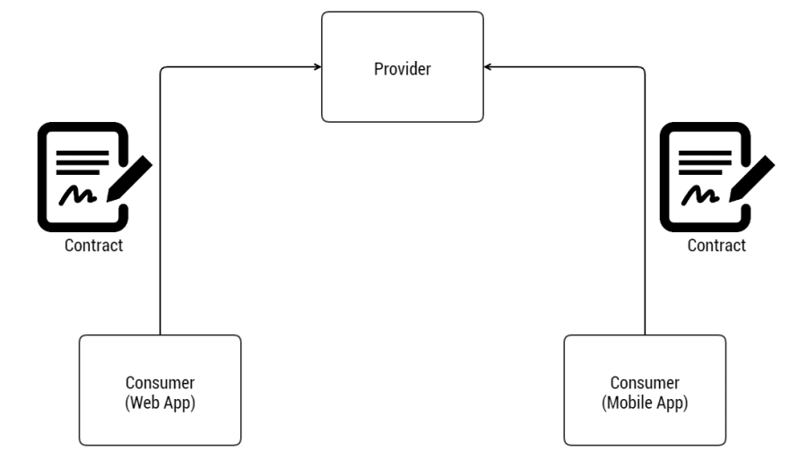

# On APIs Notes

<style>
  .back-button {
    background-color: #4CAF50; /* Green */
    border: none;
    color: white;
    padding: 15px 32px;
    text-align: center;
    text-decoration: none;
    display: inline-block;
    font-size: 16px;
    margin: 4px 2px;
    cursor: pointer;
  }
</style>

<button class="back-button" onclick="window.location.href='https://matiaspakua.github.io/tech.notes.io'">All notes</button>

## Table of Content

## Introduction

API stands for Application Programming Interface. It is a set of protocols, routines, and tools for building software applications. 

APIs define how software components should interact and communicate with each other, allowing different software applications to integrate with each other. 

APIs can be used to access data or functionality from external systems, such as web services, databases, or operating systems, and can also be used internally within an organization to expose functionality between different applications or services.

## Rest API

A REST (Representational State Transfer) API is a type of web service that uses HTTP methods to interact with resources identified by URLs (Uniform Resource Locators). In a REST API, the client sends a request to the server in a specific format, and the server sends back a response in another specific format.

A REST API follows a set of architectural principles, such as being stateless, cacheable, and layered. It allows for easy scalability, as each resource can be managed independently, and can be accessed from a variety of devices and platforms.

Typically, REST APIs use JSON (JavaScript Object Notation) as the data format for requests and responses, although other formats such as XML can also be used. They are widely used for building web and mobile applications, as well as for integrating different systems and services.

## API Contracts

The software industry has adopted several patterns for capturing agreed upon API behavior in documentation and code. These agreements are often called "contracts". Two examples include Consumer Driven Contracts and Provider Driven Contracts. We'll provide resources for these patterns, but won't discuss them in detail in this course. Instead, we'll discuss a lightweight concept called API contracts.



We define an API contract as a formal agreement between a software provider and a consumer that abstractly communicates how to interact with each other. This contract defines how API providers and consumers interact, what data exchanges looks like, and how to communicate success and failure cases.

The provider and consumers do not have to share the same programming language, only the same API contracts.

Example request contract:

```bash
  URI: /cashcards/{id}
  HTTP Verb: GET
  Body: None
  
```

Example response contract:

```bash

  HTTP Status:
    200 OK if the user is authorized and the Cash Card was successfully retrieved
    403 UNAUTHORIZED if the user is unauthenticated or unauthorized
    404 NOT FOUND if the user is authenticated and authorized but the Cash Card cannot be found

  Response Body Type: JSON

  Example Response Body:
    {
      "id": 99,
      "amount": 123.45
    }
```

## Why are API Contracts Important?

API contracts are important because they communicate the behavior of a REST API. They provide specific details about the data being serialized (or deserialized) for each command and parameter being exchanged. The API contracts are written in such a way that can be easily translated into API provider and consumer functionality, and corresponding automated tests. We'll implement both API provider functionality and automated tests in the labs.


## Example of a REST API request/response

Request:

```bash

GET /users/123 HTTP/1.1
Host: example.com
Accept: application/json

```

Response

```bash

HTTP/1.1 200 OK
Content-Type: application/json

{
    "id": 123,
    "name": "John Doe",
    "email": "johndoe@example.com"
}

```


## What is JSON?

JSON (Javascript Object Notation) provides a data interchange format that represents the particular information of an object in a format that you can easily read and understand. We'll use JSON as our data interchange format for the Family Cash Card API.


```json
{
  "id": 99,
  "amount": 123.45
}

```