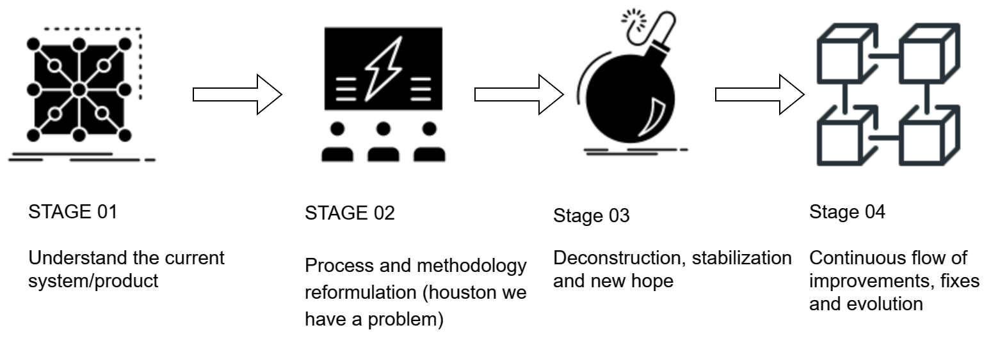

# 2. SCRUM. How we implemented it and works

<button class="back-button" onclick="window.history.back()">Back</button>

## Table of content
- [The Problem](#the-problem)
- [Problem breakdown stages](#problem-breakdown-stages)
- [Agile and SCRUM](#agile-and-scrum)
- [Technical Excellence](#technical-excellence)
- [References](#references)

## The problem

All start with the classical problem of a big company that starts a project/product. The big company says that’s needs rapid development and release of the versions of the product with new features, less bugs…and so forth.

After a year or so, a new team was assembled and was assigned to the brand new system (here is where I started). They need an agile development process without saying “agile”, so here we started.

## Problem breakdown stages

All the process we walk thought can be summarized in 4 big stages:

## Stage #01: Understand the current system/product. For this is needed:

1. **Familiarize with the business domain**: Before diving into the code, it is important to understand the business domain that the system is serving. This helps to identify the main requirements and the critical business flows that the system should support.

2. **Document review**: Go through the available documentation, like design documents, requirement specifications, and any technical documentation that has been created for the system. (if it exists).

3. **Code review**: Start reviewing the code, focusing on the main modules and flows. Try to understand the architecture and design patterns that have been used.

4. **Test case review**: Review the existing test cases and test plans to understand the expected behavior of the system (if there exists).
Stakeholder engagement: Engage with the stakeholders and end-users of the system to understand their requirements and expectations from the system.

5. **Identify potential risks and challenges**: Identify any potential risks and challenges that might impact the development of the system, such as technical debt, complexity, or missing documentation.

## Stage #02: process and methodology reformulation (houston we have a problem)

After the stage 01, we realize that exist several problems in general, than can be summarized as follows:

1. **Lack of clear requirements and specifications**: If the requirements are not clearly defined, it can lead to miscommunication and confusion between the development team and stakeholders. This can result in the development of features that do not meet the needs of the users.

2. **Insufficient resources**: Lack of resources such as skilled developers, project managers, and adequate infrastructure can impede the development process and lead to delays.

3. **Poor project management**: Poor project management can result in a lack of coordination between teams, missed deadlines, and a lack of accountability.

4. **Technical challenges**: The development process can be impacted by unexpected technical issues that arise during development, such as compatibility issues with existing systems, scalability problems, and security vulnerabilities.

5. **Resistance to change**: A lack of support from stakeholders, especially users, can hinder the implementation of new features, as they may be resistant to change.

6. **Poor quality code**: Code quality is critical to the success of a software development project. Poor quality code can result in bugs, security vulnerabilities, and maintenance issues, leading to delays and additional costs.

7. **Poor testing processes**: Inadequate testing processes can lead to the release of features with bugs and other issues, resulting in a negative impact on user experience and business reputation.

After analyzing those problems, we decided to fix it. To start, we need a methodology, a process and tools. The most important aspect we already have: A GREAT TEAM. This is the basement of success, I don’t know another.

With a little search, it was clear: “Agile” is the way. Agile methodologies are a set of values and principles  that prioritize customer collaboration and adaptive planning. Scrum is one of the most popular Agile methodologies, and it is used to manage and complete complex projects (this was the case). In Scrum, a project is broken down into small and manageable iterations called sprints, and the team works closely with the customer to prioritize and deliver the most valuable features first.

## Stage #03: deconstruction, stabilization and new hope

**Deconstruction**: In this stage we fight againts the great, big and common problem of most companies that try "agile" culture: "the resistance to change". Agile requires a shift in the way teams think and work, which can be difficult for individuals and organizations that are used to traditional project management approaches. This can lead to a lack of buy-in and support from team members, stakeholders, and management, making it difficult to fully implement and benefit from agile practices.

Other common challenges include a lack of understanding or training in agile methodologies, difficulty in adapting to new processes and practices, and a lack of alignment and communication between teams and stakeholders. It's important for companies to address these challenges proactively and work to build a strong foundation for their agile culture through education, communication, and collaboration.

**Stabilization and new hope**: after the storm of the first 3 weeks, results appear, not without doubts of course, but things become cleaner, processes start to rise and hope emerges, we know that “real” result for the final users will be available in the next week, so we start with the practice of end of sprint “demos” in an attempt to show new features, bug fixing and another improvements.

## Stage #04: Continuous flow of improvements, fixes and evolution 

In the next 6 to 8 week after the stabilization phase, starts a development flow with the following improvements: 

1. **Increased productivity**: by focusing on iterative development, continuous feedback, and continuous improvement. By breaking down work into small, manageable chunks, the teams can work more efficiently and deliver high-quality software faster.

2. **Better product quality**: By integrating quality assurance into the development process, Scrum can help ensure that the final product meets the customer's requirements and with less defects. This is achieved through continuous testing and feedback loops that allow the team to make adjustments in real-time. This was one of the biggest improvement, start with unit test, integration test and acceptance test into a CI pipeline.

3. **Improved collaboration**: Scrum promotes collaboration and communication among team members and stakeholders, which can lead to a more cohesive and motivated team. By having everyone work towards a common goal, teams can build trust and improve their ability to work together effectively and we had a lots of internal user (of the company), that view more collaboration like a great step forward.

4. **Faster time-to-market**: With its focus on delivering working software in short iterations, Scrum can help companies get their products to market faster. By identifying and addressing issues early in the development process, teams can avoid delays and deliver the product to customers more quickly. It took us several weeks to end sprints with versions ready to go to production, but finally the flow began to accelerate.

5. **Increased adaptability**: Scrum's iterative and incremental approach allows teams to be more adaptable to changes in requirements, market conditions, or technology. By working in short sprints and delivering working software frequently, teams can quickly adjust their priorities and make changes as needed.

## Agile and SCRUM

So far we talk about about Agile Methodology and the SCRUM framework. So here is a brief description of each.

### Agile Methodology

Agile methodology is an approach to software development that emphasizes flexibility and adaptability in the face of changing requirements, customer needs, and evolving technology. The Agile methodology is characterized by iterative and incremental development, early and continuous delivery of working software, close collaboration between developers and customers, and an emphasis on delivering value to the customer.

Agile is based on a set of values and principles outlined in the Agile Manifesto, which emphasizes individuals and interactions, working software, customer collaboration, and responding to change. Agile teams work in short time-boxed iterations or sprints, typically lasting one to four weeks, and focus on delivering a working software product at the end of each iteration.

The Agile methodology includes several different frameworks or methodologies, including Scrum, Kanban, Extreme Programming (XP), and others. Each framework has its own specific practices and processes, but all are based on the Agile values and principles and share a focus on delivering high-quality software that meets the needs of the customer.

### Scrum Framework

Scrum is an Agile framework for software development that is widely used to manage and complete complex projects. It emphasizes collaboration, transparency, and continuous improvement. Here are the key components of the Scrum framework:

1. **Product backlog**: A prioritized list of features or requirements that the team works on, with the most important items at the top.
2. **Sprint planning*: The team selects a subset of items from the product backlog to work on in the upcoming sprint, and creates a sprint goal.
3. **Daily Scrum**: A daily 15-minute meeting where team members discuss their progress and plan their work for the day.
4. **Sprint review**: A meeting at the end of each sprint where the team presents what they have accomplished and gets feedback from stakeholders.
5. **Sprint retrospective**: A meeting at the end of each sprint where the team reflects on what went well, what didn't go well, and identifies areas for improvement.
6. **Sprint**: A time-boxed period (typically 2-4 weeks) in which the team works to complete the selected items from the product backlog.

The Scrum framework emphasizes collaboration and communication among team members, and places a strong emphasis on delivering a potentially shippable product increment at the end of each sprint. The framework is designed to be flexible and adaptable, and can be tailored to fit the specific needs of a development team.

## Technical Excellence

### What is technical excellence and the relation with agile
Technical excellence is a crucial aspect of an agile culture, as it allows teams to continuously improve the quality of their code and the performance of their systems. In an agile culture, there is a focus on delivering working software in short cycles, and technical excellence is essential to achieving this goal. Teams that have strong technical skills and follow best practices for software development, such as automated testing and continuous integration, are better able to deliver high-quality software on a regular basis.

In addition, technical excellence is also important for maintaining agility over the long term. As systems become more complex and requirements change, technical debt can build up, making it harder and harder to make changes and slowing down the delivery of new features. By focusing on technical excellence and continuously improving the quality of their code, teams can avoid this problem and maintain their agility over time.

### Technical excellence by Kent Beck

Kent Beck is a well-known figure in the Agile software development movement, having played a key role in the creation and popularization of Extreme Programming (XP), one of the most well-known Agile methodologies. Beck believes that technical excellence is an essential aspect of Agile software development, as it allows development teams to deliver high-quality software that meets the needs of their users.

In Beck's view, Agile methodologies should emphasize the importance of technical excellence from the very beginning of the development process. This means that Agile teams should focus on building a strong foundation of technical skills and best practices, such as automated testing, continuous integration, and frequent code reviews.

By prioritizing technical excellence, Agile teams can reduce the amount of technical debt that accumulates over time, making it easier to maintain and evolve their software over the long term. Additionally, a focus on technical excellence can help teams avoid common problems such as buggy, unreliable software, and long, unpredictable release cycles.

Overall, Beck believes that a commitment to technical excellence is essential to the success of any Agile development effort. By building a strong technical foundation, development teams can deliver high-quality software that meets the needs of their users, while also maximizing their ability to respond to changing requirements and market conditions.

### Technical excellence by Martin Fowler

Martin Fowler, a well-known software development thought leader, has emphasized the importance of technical excellence in agile methodologies. According to Fowler, agile practices rely heavily on the ability to make changes to the software frequently, quickly, and with confidence. This requires a solid foundation of technical practices, such as continuous integration, automated testing, and refactoring, which ensure that the software can be changed safely and easily without causing defects or errors.

Fowler believes that technical excellence is a prerequisite for successful agile development, as it enables the team to move quickly and confidently in response to changes in requirements or priorities. Without a solid foundation of technical practices, agile development can become difficult, slow, and risky, as changes to the software can introduce defects, cause delays, and erode confidence in the team's ability to deliver high-quality software. Therefore, Fowler stresses the importance of continuous improvement in technical practices and the adoption of technical excellence as a core value of the agile mindset.

### Technical excellence by Alistair Cockburn

Alistair Cockburn is an influential figure in the Agile community and one of the co-authors of the Agile Manifesto. He believes that Agile methodologies and technical excellence go hand in hand. He argues that technical excellence is a necessary prerequisite for Agile development because Agile requires a high degree of adaptability and responsiveness to change, which is only possible with a solid technical foundation.

Cockburn has identified four pillars of technical excellence that are critical to Agile development: communication, simplicity, feedback, and courage. According to him, good communication practices help developers share knowledge and create a shared understanding of the system they are building. Simplicity is important to reduce complexity and make the system more manageable. Feedback is crucial to help teams quickly identify problems and make adjustments. And courage is necessary to take risks, experiment with new ideas, and embrace change.

Cockburn also emphasizes that Agile methodologies require a collaborative and iterative approach to development. He advocates for practices such as pair programming, continuous integration, and test-driven development (TDD) as key components of an Agile development process. These practices help ensure that the code is of high quality, reliable, and maintainable, which is critical for successful Agile development.

## Challenges when trying to implement an AGILE culture

1. **Resistance to change**: The biggest challenge is often the resistance to change. People may be comfortable with the status quo, or may not understand the benefits of agile practices.

2. **Lack of training**: Without proper training, people may not understand the agile process or how to work in an agile environment. This can lead to frustration and failure.

3. **Poor communication**: Agile methodologies rely heavily on collaboration and communication between team members. If communication is poor, it can lead to misunderstandings and delays.

4. **Siloed teams**: Agile methodologies are designed to break down silos and encourage cross-functional teams. If teams are siloed and work in isolation, it can be difficult to implement agile practices.

5. **Unclear goals**: Agile methodologies require clear goals and objectives. Without them, it can be difficult to prioritize work and ensure that everyone is working towards the same objectives.

6. **Lack of leadership support**: Agile transformation requires support and buy-in from senior leadership. Without it, it can be difficult to make the necessary changes and sustain them over time.

7. **Inadequate infrastructure**: Agile practices require modern tools and infrastructure to support rapid development and testing. Without them, it can be difficult to implement agile methodologies effectively.

## References

- [Scrum: How to do twice as much in half the time | Jeff Sutherland | TEDxAix](https://youtu.be/s4thQcgLCqk)
 - [Scrum Guide 2020](https://scrumguides.org/scrum-guide.html)
 - [Scrum The Basics](https://www.linkedin.com/learning/scrum-the-basics)
 - [The Agile Manifesto](https://agilemanifesto.org/)
 - [The Scrum guide 2020](https://scrumguides.org/scrum-guide.html)