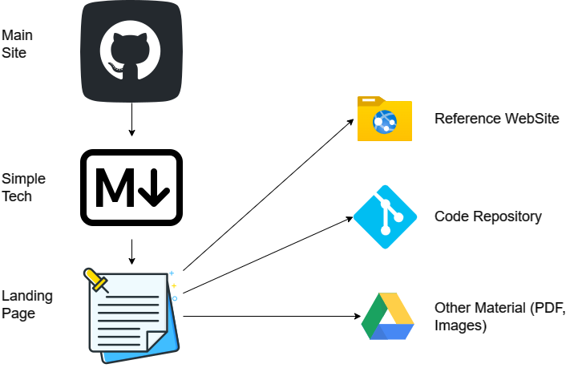

# 30. Knowledge-Base. Main characteristics and pilot

In practice, the structure, technology and attributes of a knowledge-base seem to be very obscure, complitated and some times hard to even think in implement. But with a little of organization and some basic tools availables, you can asemble a great base.

Code, development tools, support, documentation, communication tools, and any other support media used in the development of a software product must be organized. It is common that this aspect is not correctly resolved, which means that there is not a centralized repository (or knowledge base) to store and consult all the information associated with a project or product.

For this project, I decide to use the simples tools available:

**Main Characteristics**:
- Centralize
- Available
- Searcheable
- Shareable
- Ease of create new content
- Simplicity
- Traceable

Basically are the attributes of a Wiki, but inside a organization/company, when there is a legacy project is important to have all of those attributes on mind.