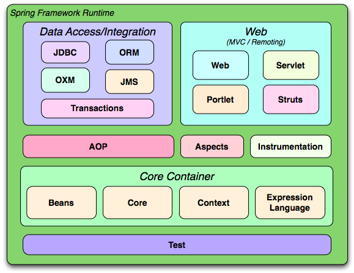

# 9. Spring Framework Notes

<button class="back-button" onclick="window.location.href='https://matiaspakua.github.io/tech.notes.io'">All notes</button>

## Table of Content

## Introduction to Spring

Spring is an open-source application framework for Java. It provides comprehensive infrastructure support for developing Java applications, simplifying the development process and increasing productivity. Spring is based on the principle of inversion of control (IoC), which means that the framework takes control of the flow of the application, leaving developers to focus on writing business logic.

Spring provides a wide range of modules to address various aspects of modern enterprise application development such as database connectivity, transaction management, web applications, security, messaging, and much more. It also provides integration with other popular technologies such as Hibernate, JPA, and Struts.

## Inversion of Control (IoC)

The principle of Inversion of Control (IoC), also known as Dependency Injection, originated in the field of software engineering as part of the Inversion of Control design principle. This principle states that the control flow of a program is inverted or reversed compared to traditional programming, where the program explicitly calls and controls the flow of libraries and frameworks. Instead, in IoC, the flow of control is reversed, and the framework or container controls the flow by calling the program's code through callbacks, interfaces, or annotations.

The IoC principle was first introduced by Martin Fowler and has since become a widely adopted design pattern in software engineering. The idea behind IoC is to remove the tight coupling between different components of a software system by allowing them to interact through interfaces instead of concrete implementations. This allows for greater flexibility, scalability, and maintainability in software systems. The Spring Framework is a popular implementation of the IoC principle in Java

## IoC and Dependency Injection (DI)

Dependency Injection (DI) is a design pattern that allows objects to have their dependencies (i.e., objects they depend on) injected or provided to them by a third party, rather than creating and managing those dependencies themselves.

In other words, DI is a technique for achieving Inversion of Control (IoC) in software development, where the control of object creation and management is delegated to a separate object or framework. DI helps in achieving separation of concerns by ensuring that an object's dependencies are provided externally and thus promoting modularity, testability, and flexibility in the application.

Instead of creating a dependency object inside a class, the dependency is provided to the class through a constructor or a setter method. This makes the code more modular and less coupled, as the dependency can be easily swapped out for a different implementation or mock object during testing.

## Spring Architecture 

The Spring Framework architecture follows a layered architecture and consists of the following modules:

1. **Core Container**: This module provides the fundamental parts of the framework, including the IoC container and the Dependency Injection(DI) features.

2. **AOP (Aspect Oriented Programming)**: This module provides support for implementing cross-cutting concerns.

3. **Data Access/Integration**: This module provides support for JDBC, ORM, OXM, JMS, and Transaction Management.

4. **Web**: This module provides support for web applications, including Spring MVC and WebSocket.

5. **Test**: This module provides support for testing Spring applications with JUnit or TestNG.

6. **Messaging**: This module provides support for messaging protocols such as STOMP, MQTT, and WebSocket.

7. **Security**: This module provides support for securing Spring applications.

8. **Spring Boot**: This module provides a set of tools for developing and deploying Spring applications quickly and easily.

## Spring vs SpringBoot

### Spring

Spring is a comprehensive framework that provides various modules for building different types of applications. It's like having a giant toolbox with every tool you could possibly need to build anything you want. As we build our Family Cash Card API we will use Spring MVC for the web application, Spring Data for data access, and Spring Security for authentication and authorization.

This versatility comes at a cost. Setting up a Spring application requires a lot of configuration, and developers need to manually configure various components of the framework to get an application up and running.

### SpringBoot

Spring Boot is like a more opinionated version of Spring. It comes with a many pre-configured settings and dependencies that are commonly used in Spring applications. This makes it really easy to get started quickly, without having to worry about setting up everything from scratch. Plus, Spring Boot comes with an embedded web server, so you can easily create and deploy web applications without needing an external server.

## Spring’s Inversion of Control Container

Spring Boot takes advantage of Spring Core’s Inversion of Control (IoC) container. Spring Boot allows you to configure how and when dependencies are provided to your application at runtime. This puts you in control of how your application operates in different scenarios.

For example, you might want to use a different database for local development than for your live, public-facing application. Your application code shouldn't care about this distinction; if it did, you’d have to hard-code every possible scenario into your application logic. Instead, Spring Boot allows you to provide an external configuration that specifies how and when such dependencies are used.

## API Contracts

The software industry has adopted several patterns for capturing agreed upon API behavior in documentation and code. These agreements are often called "contracts". Two examples include Consumer Driven Contracts and Provider Driven Contracts. We'll provide resources for these patterns, but won't discuss them in detail in this course. Instead, we'll discuss a lightweight concept called API contracts.

We define an API contract as a formal agreement between a software provider and a consumer that abstractly communicates how to interact with each other. This contract defines how API providers and consumers interact, what data exchanges looks like, and how to communicate success and failure cases.

## References

 - [Official Spring Framework website](https://spring.io/why-spring)
 - [Spring Introduction docs](https://docs.spring.io/spring-framework/docs/3.0.x/spring-framework-reference/html/overview.html)
 - [Spring: Framework in Depth](https://www.linkedin.com/learning/spring-framework-in-depth-2)
 - [Extending, Securing, and Dockerizing Spring Boot Microservices](https://www.linkedin.com/learning/extending-securing-and-dockerizing-spring-boot-microservices/elevate-a-microservice)
 - [Creating Your First Spring Boot Microservice](https://www.linkedin.com/learning/creating-your-first-spring-boot-microservice/build-a-microservice-with-spring-boot)
 - [Spring: Spring MVC](https://www.linkedin.com/learning/spring-spring-mvc-2/spring-mvc-for-robust-applications)
 - [Spring: Test-Driven Development with JUnit](https://www.linkedin.com/learning/spring-test-driven-development-with-junit/welcome)
 - [Curso de Java Spring](https://platzi.com/cursos/java-spring/)
 - [ Spring: Spring Data 2 ](https://www.linkedin.com/learning/spring-spring-data-2-2017/welcome)