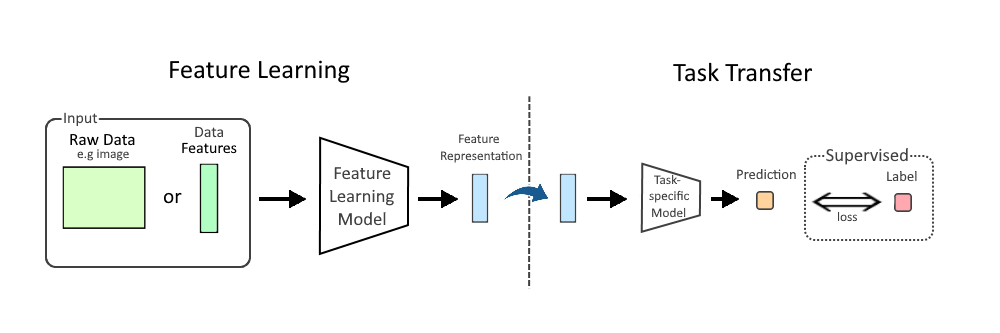
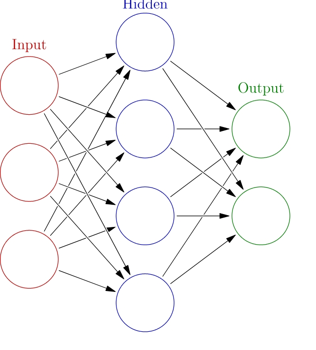

## Machine learning

Es un campo de estudio de la inteligencia artificial que estudia y desarrolla conceptos asociados con algoritmos estadísticos. El objetivo de estos algoritmos es que pueden aprender de los datos y obtener  un tipo de abstracción (<mark style="background: #FFF3A3A6;">generalization</mark>) donde desde las propiedades de los datos de entrada analizados, se puede llegar a generalizaciones de esos conceptos.

De la generalización pueden surgir "modelos conceptuales" sobre el tópico de los datos de entrada.

Este concepto de generalización es muy simular al concepto usado en el paradigma de OO y por lo tanto, del análisis de los datos de entrada se generan modelos conceptuales basados en las características de los datos procesados, para luego ser usado en forma más generica.

Volviendo al concepto de Machine Learning, los algoritmos estadísticos generan modelos conceptuales usando el concepto de generalización y con eso un modelo de ML puede ejecutar tareas sin instrucciones explicitas.

Dentro del campo de ML se han desarrollado 2 ramas complementarias, una en el campo del <mark style="background: #FFF3A3A6;">Deep Learning</mark>, el cual permitió el avance en las llamadas "redes neuronales" (<mark style="background: #FFF3A3A6;">neural networks)</mark>, que son una especialización de los algoritmos estadísticos para mejorar y sobrepasar algunas limitaciones de los modelos de ML tradicionales.

>[!note]
>Como conclusión, Machine learning se enfoca en la predicción, basado en el conocimiento de las propiedades aprendidas del set de datos de entrenamiento.

Referencias:
https://en.wikipedia.org/wiki/Generalization
https://en.wikipedia.org/wiki/Machine_learning

## Deep Learning

Es una especialización del ML que se enfoca en la utilización de múltiples cadas de redes neuronales para ejecutar tareas tales como:

- Clasificación: mecanismos de clasificación usando algoritmos estadísticos:
- Regresión: método estadísticos para estimar la relación entre una variable independientes sobre otro conjunto de variables.

- aprendizaje de representación (representation learning): es una técnica que permite a un sistema de forma automática descubrir representaciones o clasificaciones de los datos crudos.

El Deep Learning toma inspiración de la neurociencia, al tomar el concepto de neurona, aquí, neurona digital que pueden ser entrenadas para procesar datos. Deep (profundo) se refiere al hecho de usar múltiples capas en la red. Existen 3 grandes grupos o categorías de entrenamiento:

1. Supervisado;
2. Semi-supervisado;
3. Sin supervisión;

Algunas de las arquitecturas de redes de deep learning incluyen:

* CNN - Convolutional neural networks
* Transformers

Existen múltiples usos para este tipos de redes de deep learning, basando en el problema a resolver y la arquitectura seleccionada, como un ejemplo sencillo, supongamos un problema de reconocimiento de "caras" en imágenes. Para resolver este problema vamos a utilizar hipotéticamente un esquema de 4 capas de redes neuronales. Luego del obtener el input, el cual corresponde a una imagen en formato RAW, se pre-procesa como un Tensor de Pixeles, donde el tensor es una representación de los pixeles en un arreglo multi-dimensional (M-way array). Luego, en una primera capa de representación el algoritmo puede intentar reconocer formas básicas (lineas, círculos, etc); la segunda capa puede intentar componer bordes, figuras; la tercera capa intentará componer narices y ojos; finalmente, la cuarta capa intentará reconocer si la imagen contiene una cara.

Referencia:
https://en.wikipedia.org/wiki/Deep_learning
https://en.wikipedia.org/wiki/Regression_analysis
https://en.wikipedia.org/wiki/Feature_learning
https://en.wikipedia.org/wiki/Tensor_(machine_learning)

## Neural Network

Aquí hay varios acronimos que se derivan del titulo:

* Neural Nerwork (NN)
* Neural-net (NN)
* Artificial neural network (ANN)

En concreto, una red neuronal es un <mark style="background: #FFF3A3A6;">MODELO COMPUTACIONAL </mark> inspirado en la estructura y funciones de la red neuronal biológica. Entonces, una red neuronal cosiste en un conjunto conectado de nodos llamados "<mark style="background: #FFF3A3A6;">neuronas artificiales</mark>" que pretenden imitar las neuronas de un cerebro.

Lo nodos tienen lo que denominan "edges" (bordes), que emulan las sinapsis o conexiones biológicas de las neuronas. Al igual que en teoría de la computación, los nodos reciben como imput un valor numérico, procesan o computan en base a una función no-lineal (el resultado puede no ser proporcional al input). La señal o input es un numero real que es computado por una función no lineal, llamada "función de activación". La fuerza de la señal tiene asignado un peso que se le asigna durante el proceso de aprendizaje.

Referencias:
https://en.wikipedia.org/wiki/Neural_network_(machine_learning)
https://en.wikipedia.org/wiki/Nonlinear_system

## NPL. Natural Processing language

Se trata de una técnica (y campo de estudio por si mismo), donde se intenta procesar el lenguaje natural humano a través de una computación. Es como enseñar a una máquina a leer, escribir y hablar como un humano. 

NPL se basa en una combinación de modelo basado en reglas, computación linguistica, estadistica, machine learning y deep learning.

Referencia:
https://en.wikipedia.org/wiki/Natural_language_processing

## Uniendo conceptos

Dentro de cada área hay un mundo por si mismo, pero a modo de resumen el siguiente gráfico muestra como se relacionan cada uno de los conceptos:

Gracias a los estudios en AI, y muy asociado a la teoría detrás, aparecen otras aplicaciones que mucho interés:

- <mark style="background: #FFF3A3A6;">Compresión de datos</mark>, gracias a la capacidad probabilista de predicción (GenAI) los próximos "datos" basado en una historia. En estos casos se utilizan técnicas como Arithmetic Coding (AC). La importancia de la compresión de datos es alta, debido a que directamente impacta en eficiencia en el almacenamiento de datos y acelera la transmisión de datos.
- <mark style="background: #FFF3A3A6;">Data mining</mark>: se enfoca en el "descubrimiento" de propiedades "no conocidas" in el set de datos de entrenamiento. Entonces, se utilizan muchos de los mismos métodos que en ML pero con objetivos totalmente distintos.
- <mark style="background: #FFF3A3A6;">Generalización</mark>: aspecto clave de ML, donde se estudia la caracterización de los datos.
- <mark style="background: #FFF3A3A6;">Estadísticas</mark>: mientras que las estadísticas extrae "inferencias" a partir de un conjunta de datos de muestras, donde una inferencia es una conclusión basada en una investigación sobre las evidencias y aplicando un razonamiento; mientras que ML intenta buscar patrones predictivos generalizables.

Referencia:
https://en.wikipedia.org/wiki/Arithmetic_coding

## LLM - Large language Model

Se trata de un modelo de AI entrenado con millones de parametros de datos masivo. La función principal es predecir el siguiente TOKEN (palabra o frase o secuencia de caracteres), permitiendo generar texto coherente en base a una pregunta.

## GenAI - AI generativa

Referencia:
https://es.wikipedia.org/wiki/Inteligencia_artificial_generativa

## AI multimodal

Referencia:
https://es.wikipedia.org/wiki/Inteligencia_artificial_multimodal

Token

Tokenización

## Embeddings

Referencias: 
https://dev.to/aws-builders/from-coffee-products-to-ai-search-building-a-serverless-semantic-search-architecture-with-amazon-5g5b

Vector database

Context Window

Prompt Engineering

Temperatura y Sampling

Fine-tunning

RAG (retrieval-augmented generation)

Hallucinations

MPC (Model context Protocol)

AI Agents

Agentes de CLI

# Referencias

https://dev.to/bladepipe/genai-core-concepts-explained-rag-function-calling-mcp-ai-agent-2bmc

