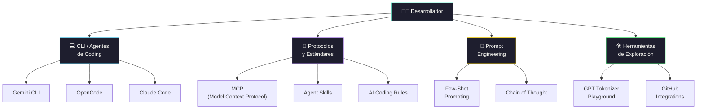

[← Inicio](https://matiaspakua.github.io/tech.notes.io)

# Herramientas de AI

## Ecosistema de Herramientas de AI

# Gemini CLI

[Gemini CLI — Google Gemini, GitHub](https://github.com/google-gemini/gemini-cli)

# OpenCode

[OpenCode — opencode.ai](https://opencode.ai/)

# MCP - Model Context Protocol

[Introduction — Model Context Protocol](https://modelcontextprotocol.io/docs/getting-started/intro)

# Agents Skills

- [Agent Skills Overview — Anthropic](https://platform.claude.com/docs/en/agents-and-tools/agent-skills/overview)
- [Agent Skills Directory — agentskills.io](https://agentskills.io/home)

# Agents Rules (spec)

[AI Coding Rules — aicodingrules.org](https://aicodingrules.org/)

# Prompt Engineering

few-shot

Referencia:
- [Prompt Engineering — Wikipedia](https://en.wikipedia.org/wiki/Prompt_engineering)

# Connect OpenCode and Github

[Connect OpenCode and GitHub — YouTube](https://www.youtube.com/watch?v=-Zr2gI8R-Sk)

# GPT Tokenizer Playground

[GPT Tokenizer Playground — gpt-tokenizer.dev](https://gpt-tokenizer.dev/)

## Notas relacionadas

- [Conceptos de IA](ruta_de_aprendisaje/1.fundamentos_inteligencia_artificial/1_conceptos_generales.md)
- [Generative AI](../software_engineering/generative_ai.md)
- [Claude Code](ruta_de_aprendisaje/claude%20code.md)
