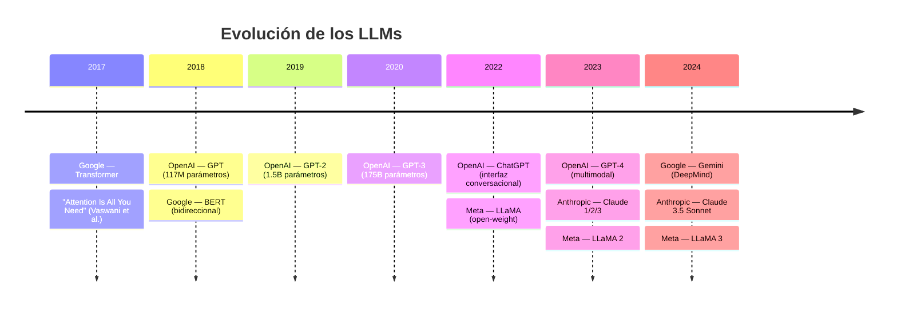

[← Inicio](https://matiaspakua.github.io/tech.notes.io)

# Grandes Modelos de Lenguajes (LLMs)

> [!note]
> Los Large Language Models (LLMs) son modelos de deep learning entrenados sobre enormes corpus de texto. La arquitectura dominante es el Transformer, introducida en 2017 por Vaswani et al. en el paper "Attention Is All You Need".

## Hitos clave

| Año  | Modelo      | Organización | Notas                                             |
|------|-------------|--------------|---------------------------------------------------|
| 2017 | Transformer | Google       | Arquitectura base: "Attention Is All You Need"    |
| 2018 | GPT         | OpenAI       | Primer modelo GPT (117M parámetros)               |
| 2018 | BERT        | Google       | Bidirectional Encoder Representations            |
| 2019 | GPT-2       | OpenAI       | 1.5B parámetros                                  |
| 2020 | GPT-3       | OpenAI       | 175B parámetros                                  |
| 2022 | ChatGPT     | OpenAI       | Interfaz conversacional basada en GPT-3.5        |
| 2023 | GPT-4       | OpenAI       | Modelo multimodal                                |
| 2023 | Claude      | Anthropic    | Familia de modelos: Claude 1, 2, 3+              |
| 2023 | LLaMA       | Meta         | Modelos open-weight, LLaMA 2 y 3 posteriores     |
| 2024 | Gemini      | Google       | Familia multimodal de Google DeepMind            |

## Referencias

- [Large Language Model — Wikipedia](https://en.wikipedia.org/wiki/Large_language_model)
- [Attention Is All You Need — Vaswani et al., 2017](https://arxiv.org/abs/1706.03762)
- [GPT — OpenAI](https://openai.com/research/language-unsupervised)
- [BERT — Google, 2018](https://arxiv.org/abs/1810.04805)
