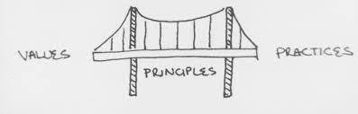
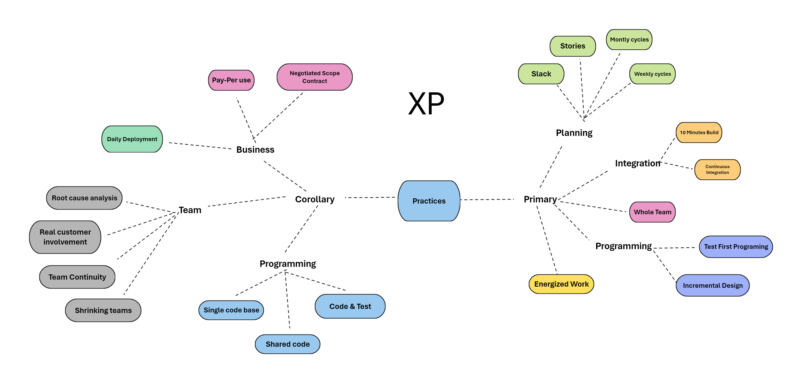
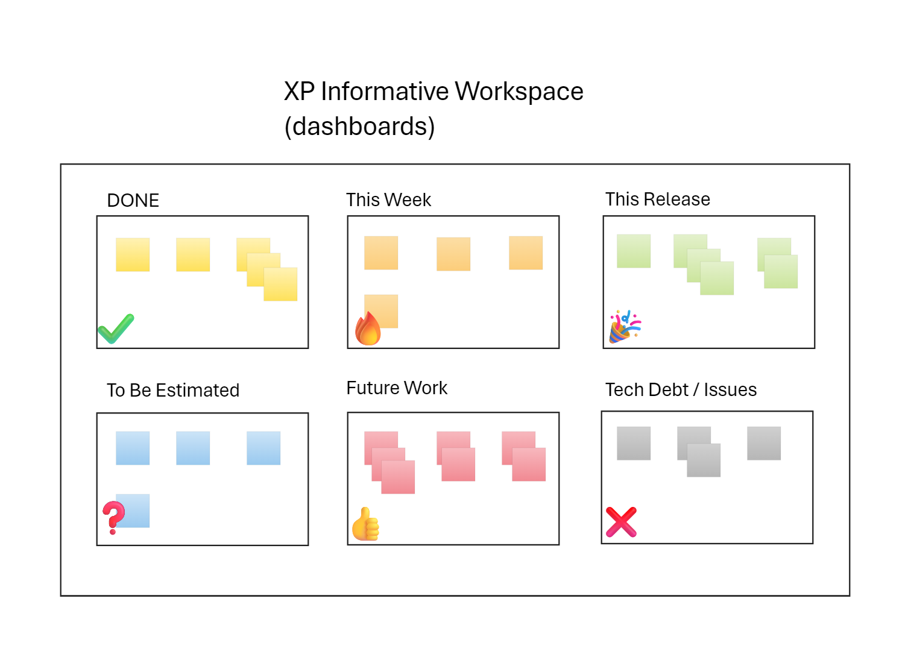
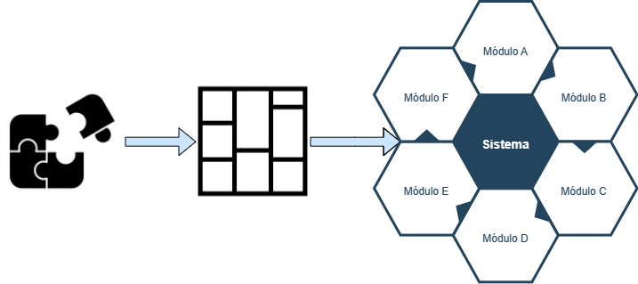
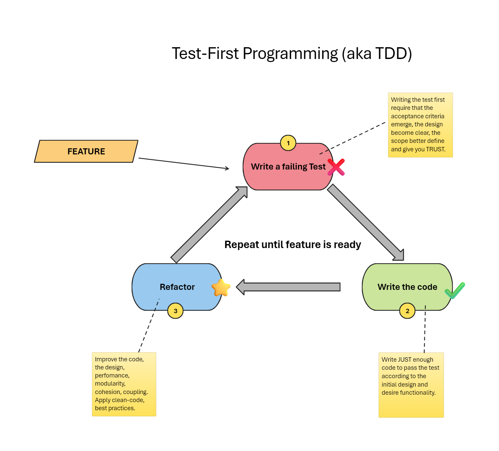
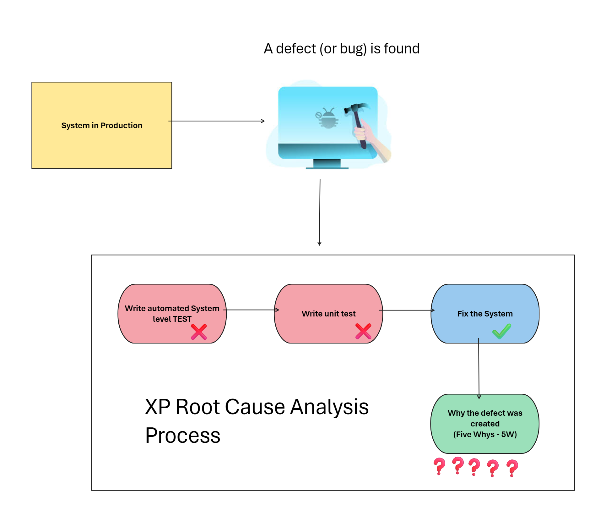
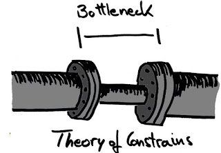
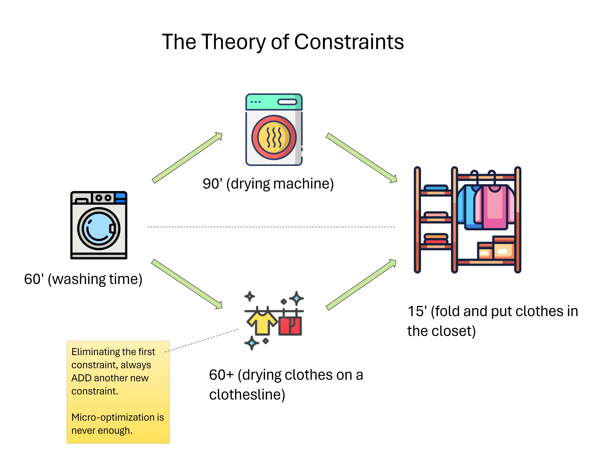
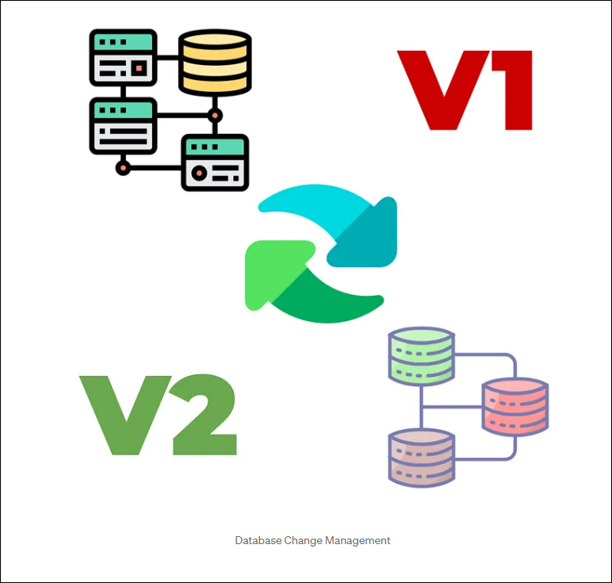

# Extreme Programming Explained by Kent Beck

<button class="back-button" onclick="window.location.href='https://matiaspakua.github.io/tech.notes.io'">All notes</button>

---

# Section 1: Exporing XP

"Extreme Programming Explained: Embrace Change" is a book written by Kent Beck that describes the principles and practices of Extreme Programming (XP), a software development methodology. Here is a summary of the key concepts presented in the book:

1. Continuous Integration: Don't release anything until it passes all the test. XP emphasizes the importance of integrating code into the main branch of the codebase as frequently as possible. This helps to catch problems early and reduce the risk of integration issues.

2. Test-Driven Development: XP promotes writing automated tests before writing code. This helps to ensure that code meets requirements and reduces the risk of bugs.

3. Refactoring: XP encourages code refactoring, which is the process of improving the design of code without changing its behavior. This helps to keep code clean, maintainable, and scalable.

4. Pair Programming: XP involves two developers working together on a single codebase. This helps to increase collaboration, reduce bugs, and improve code quality.

5. User Stories: XP uses user stories to capture the requirements of a system. User stories are short, simple descriptions of a feature or requirement, and they help to prioritize work and ensure that the code is aligned with customer needs.

6. Continuous Feedback: XP involves seeking feedback from stakeholders and incorporating that feedback into the development process. This helps to ensure that the code meets the needs of customers and stakeholders.

7. Planning Game: XP involves regular planning sessions to prioritize work and ensure that the team is aligned on what work needs to be done.

8. Slack: XP recognize that developers need time to learn, experiment, and think about problems. The slack time is built into the schedule to allow for this learning and experimentation.

9. Sustainable Pace (no killer schedules): XP emphasizes the importance of working at a sustainable pace, rather than burning out developers. This helps to ensure that the team can maintain its velocity and deliver quality code over the long term.

10. Don't put in anything that's not in the spec (no matter how temped you are to put in functionality "for the future").

11. <mark style="background: #FFF3A3A6;">KIS: keep it simple. Always.</mark>

## 01 What is XP?

1. Extreme Programming is about social change. It is about being open about what we are capable of doing and then doing it and, it is about writing great code that is really good for business. Do you best and then deal with the consequences. THAT EXTREME!!!!
2. It is relied on oral communication, test and source code to communicate system structure and intent.
3. The more "humanely" I treated myself and others, the more productive we all became.
4. Technique also matters. We are technical people in a technical field.
5. Book recommendation: Colin Turnbull in The Mountain people and the Forest People.
6. You can do your best work even when there are constraints.
7. You can't control others expectation.
8. How XP address the risks in the development process:
   1. Schedule slips: short release cycles, a few months at most.
   2. Project canceled.
   3. Keeps the system in deployable condition. Problems are not allowed to accumulate.
   4. Keep defect rate low.
   5. Avoid business misunderstood.
   6. Embrace business changes.
   7. Avoid "false" feature rich.
   8. Avoid staff turnover (maintains good teams together).

## 02 Learning to Drive

1. What is driving? is about constantly paying attention, making a little correction this way, a little correction that way. This is the paradigm for XP. <mark style="background: #FFF3A3A6;">Stay aware. Adapt. Change</mark>. The problem is our inability to cope with change.

## 03 Values, Principles and Practices

1. **Practices**: the kind of knowledge associated with techniques to do something.
2. **Values**: are the roots of the thinks we like and don't like in a situation. Making values explicit is important because without values, practices quickly become rote.
3. Bringing values together with practices means that the programmer can perform practice, in this case **root-cause** analysis, at effective times and for good reasons. Values bring purpose to practices.
4. Principles: are domain-specific guidelines for life.

**Reference**: Image from the book Extreme programming by Kent Beck

## 04 Values

1. What actually matters is not how any given person behaves as much as how the individuals behave as part of a team and as part of an organization.
2. **Communication**: when you encounter a problem, ask yourselves if the problem was caused by a lack of communication.
3. **Simplicity**: what is simplest thing that could possible work? just to bias tour thinking toward eliminating waster complexity.
4. XP team strive to generate as much feedback as they can handle as quickly as possible. They try to shorten the feedback cycle to minutes or hours instead of weeks or months. The sooner you know, the sooner you can adapt.
5. **Courage**: courage is effective action the the fact of fear. If you know what the problem is, do something about it. Period.
6. **Respect**: if members of a team don't care about each other and what are doing, XP won't work.

## 05 Principles

1. **Traceability**: In the development of safety-critical systems, the principle of traceability is at work. At any time you should be able to trace a path from the work done back to an explicit expressed need from the user.
2. **Humanity**: The magic of great teams is that after the team members develop trust they find that they are free to be more themselves as a result of their work together.
3. **Economics**: Somebody has to pay for all this. Software development that doesn't acknowledge economics risks the hollow victory of a "technical success".
4. **Mutual benefit**: this is the most important XP principle. The computer business is really a people business and maintaining working relationships is important (and HARD). XP solves the communication-with-the-future problem in mutually beneficial ways:
   a. I write automated tests that help me design and implement better today.
   b. I carefully refactor to remove accidental complexity.
   c choose names from a coherent and explicit set of metaphors which speeds my development.
5. **Self-Similarity**: try copying the structure of one solution into a new context, even at different scales.
6. **Improvement**: the cycle is to do the best you can today, striving for the awareness and understanding necessary to do better tomorrow. Put improvement to work by not waiting for perfection. Find a starting place, get started, and improve from there.
7. **Diversity**: Conflict is the inevitable companion of diversity. Two ideas about design present an opportunity, not a problem. The principle of diversity suggest that the programmers should work together on the problem and both opinions should be valued.
8. **Reflection**: good teams don't just do their work, they think about how they are working and why they are working. They analyze why they succeeded or failed. They don't try to hide their mistakes, but expose them and learn from them. Shared meals and coffee breaks provide an informal setting for shared reflection.
9. **Flow**: The principle of flow suggest that for improvement, deploy smaller increments of value ever more frequently.
10. **Opportunity**: Learn to see problems as opportunities for change. As you begin practicing XP, you will certainly encounter problems. Part of being extreme is consciously choosing to transform each problem into an opportunity.
11. **Redundancy**: What you hope to achieve is few enough defect to maintain trust both within the team and with the customer.
12. **Failure**: If you're having trouble succeeding, fail.
13. **Quality**: Sacrificing quality is not effective as a mean of control. Quality is not a control variable.Projects don't go faster by accepting lower quality. They don't go slower by demanding higher quality. Pushing quality higher often results in faster delivery; while lowering quality standard often results in later, less predictable delivery. People need to do work they are proud of.
14. **Baby Steps**: Prefer baby steps (small changes) over big, longer, complicated steps.
15. **Accepted Responsibility**: Responsibility cannot be assigned: it can only be accepted.

## 06 Practices

## 07 Primary Practices

1. **Sit together**: no matter what the client says the problem is, it is always a people problem. Technical fixes alone are not enough. It is important to sit together, to communicate with all senses.
2. **Whole team**: include in the team people with all the skills and perspectives necessary for the project to succeed. The size of the team here is important, because we need to build trust, and trust born of collaboration.
3. **Informative Workspace**: build a workspace where the important information is visible.

4. **Energized Work**: work only as many hours as you can be productive and only as many hours as you can sustain.
5. **Pair Programming**: help you to: keep each other on task; improve the brainstorm refinements to the system; clarify ideas; take initiative when your partner is stuck; hold each other accountable to the team's practices.
6. **Stories**: plan using units of customer-visible functionality.
7. **Weekly cycles**: plan work a week at a time. Have a meeting at the beginning of every week. during this meeting:
	1. review progress to date vs expected progress, blockers and other issues.
	2. Make the customer pick this week stories.
	3. Break the stories into tasks.
	4. <mark style="background: #FFF3A3A6;">Start the week by writing automates tests that will run when the stories are completed</mark>, then work the rest of the week on code to pass the tests. the goal is to have a deployable software at the end of the week.
8. **Quarterly cycle**: Plan the work a quarter at a time.
9. **10 (Ten) minutes build**: automatically build the whole system and run all of the tests in ten minutes. An automated build becomes a stress reliever at crunch time. "Did we make a mistake?, Let's just build and see."
10. **Continuous integration**: the integration step is unpredictable but can easily take more time that the original programming. The longer you wait to integrate, the more it costs and the more unpredictable the cost become.  Waiting for the compiler and the tests is a natural time to talk about what we're just done together and how we might have done it better.

11. **Test-First Programming**:  writing a failing automated test before changing any code. But why?
	1. Avoid scope creep.
	2. Validate coupling and cohesion.
	3. Improve trust.
	4. Rhythm.

---
### Test-First programming AKA TDD 

Write failing automated test before changing any code. Why:

1. Reduce scope creep
2. Improve coupling and cohesion
3. Improve "trust"
4. Create rhythm

### Incremental Design

1. Invest in the design of the system every day. Doing this, XP teams improve confident in their ability to adapt the design to future requirements.
2. Without daily attention to design, the cost of change does "skyrocket". The result is poorly designed, brittle, hard-to-change systems.
3. Design done close to when it is used is more efficient.

## 08 Getting Started

1. How to decide what to change first? Look at what you are doing and what do you want to achieve. Choose the first practice on that path.
2. One option is to use XP-Style planning. Write stories about improving your software development process.
3. Changes begins with awareness. Awareness of the need for change comes from feelings, instincts, facts, or feedback from outsiders.
4. Changes always start at home. the only person you can actually change is yourself.

## 09 Corollary Practices

### Real customer involvement

1. No customer at all, or a "proxy" for a real customer, leads to waste your develop feature that aren't used.
2. <mark style="background: #FFF3A3A6;">If the customer knew how messed up software development was, they'd never trust us</mark>. ==> GOOD POINT!! Are you sure they trust you now? Software reflect the organization that builds it. Like the CONWAY's LAW:

**"Organizations which design systems (in the broad sense used here) are constrained to produce designs which are copies of the communication structures of these organizations."**

— Melvin E. Conway, How Do Committees Invent?

Link: [Conway's law - Wikipedia](https://en.wikipedia.org/wiki/Conway%27s_law)

### Incremental deployment

1. When replacing a legacy system, gradually take over its workloads beginning very early in the project.

### Team Continuity

1. <mark style="background: #FFF3A3A6;">Keep effective teams together</mark>.
2. Value in software is created not just by what people know and do but also by their relationships and what they accomplish together.

### Shrinking teams

1. As a team grows in capability, keep its workload constant but gradually reduce its size.

### Root-Cause analysis

1.  Every time a defect is found after development, eliminate the defect and it cause.
2. In XP, this is the process for responding to a defect:
	1. Write an automated system-level test that demonstrate the defect, including the desire behavior.
	2. Write a unit test with the smallest possible scope that also reproduce the defect.
	3. Fix the system so the unit test works.
	4. Figure out why the defect was created and wasn't caught ==> <mark style="background: #FFF3A3A6;">Apply the 5W (five whys</mark>).

### Shared Code

1. Anyone on the team can improve any part of the system at any time.

### Code and Tests

1. Maintain only the code and the test as permanent artifacts.
2. Any artifact contributing to those two sources of value are themselves valuable. Everything else is waste.

### Single Code Base

1. There is only one code stream. You can develop in a temporary branch, but never let it live longer that a few hours.

### Daily Deployment

1. Put new software into production every night.

### Negotiated Scope Contract

1. Write contracts for software development that fix time, cost and quality but call for an ongoing negotiation of the precise scope of the system.

### Pay-Per-Use

1. Write pay-per-use systems, you charge for every time the system is used.
2. Connecting money flow directly to software development provides accurate, timely information with which to drive improvement.

## 10 The whole XP Team

1. In a good team, they have to work together as a group for each to be successful.
2. Principle of flow: suggests that more value is created in a smooth, steady stream of software than in occasional large deployments.

### Testers

1. Testers on a XP team help customers choose and write automated system-level test in advance of implementation and coach programmers on testing techniques.

### Architects

1. Architects on an XP team look for and execute large-scale refactoring, write system-level tests that stress the architecture, and implements stories.

### Project Managers

1. PM act as team historians, reminding the team how much progress it has made.

### Technical Writers

1. The XP philosophy is to start where you are now and move towards the ideal. From Where you are now, could you improve a little bit?

### Human Resources

1. How much incentive does a person have to help others if he will be evaluated on individual performance?
2. Teams have solved the evaluation problem in two ways
	* Either by continuing individual goals, reviews, and raises or,
	* By moving to team-based incentives and raises.

### Roles

1. Roles in a mature XP team aren't fixed and rigid. NOTE the importance of the word: "MATURE".
2. The goals is not for people to fill abstract roles, but for each team member to contribute all he can to the team.

## 11 The Theory of Constraints

 * Image Reference: [Harnessing Efficiency: The Theory of Constraints in Software Development](https://www.eferro.net/2023/11/harnessing-efficiency-theory-of.html)

1. The theory of constrains says that in any system there is one constraint at a time (occasionally two).
2. To improve overall system throughput you have to first find the constraints;
3. Make it sure it is working full speed (performance tests here);
4. Then find ways either increasing the capacity of the constraint, offloading some of the work onto non-constraints, or eliminating the constraint entirely.

5. There is always a constraints (always)!
6. When eliminate one constraint we create another.
7. Micro-optimization in never enough.
8. To improve our results we must look at the whole situation before deciding what to change.

=> <mark style="background: #FFF3A3A6;">The theory of constraints shares with other theories of organizational change the assumption that the whole organization is focused on overall throughput, not on micro-optimization</mark>.

=> <mark style="background: #BBFABBA6;">If everyone is trying to make sure his function is not seen as the constraint, no change will happen.</mark>

9. So, it's clear that software development is a "human" process not a factory.
10. Executive sponsorship and strong relationship with people outside the team are crucial to applying XP, precisely because applying XP will shift the structure of work in the rest of the organization as soon as software development gets its act together.

## 12 Planning: Managing Scope

1. Planning in XP is like shopping for groceries.
2. There are 3 variables by which to manage projects:
	1. speed;
	2. quality;
	3. price;
3. The sponsor gets to fix two of these variables and the team gets to estimate the third.
4. If the plan in unacceptable, the negotiation starts.
5. **On Pair Programming**: <mark style="background: #FFF3A3A6;">One of the objections to pairing is pairing cuts effective programming in half</mark>. In my experience (clearly: Kent's), pairs are more than twice as effective. The actual time required for me to complete tasks solo versus paired, accounting for debugging time, is more than double; so by pairing you actually **come out ahead in completed, clean code**.
6. When thinks aren't going well is when most need to adhere to our values and principles and modify our practices to remain as effective as possible.

## 13 Testing: Early, Often and Automated

1. <mark style="background: #FFF3A3A6;">Defects destroy the trust requiered for effective software development.</mark>
2. The customer need to be able to trust the software. The managers need to be able to trust reports of progress. The programmers need to be able to trust each other.
3. Defects destroy this trust. Without trust, people spend much of their time defending themselves against the possibility that someone else may have a mistake.
4. Another goal of development is to reduce the occurence of defects to a level where trust can reasonably grow on the team.
5. You can write code to fit a mold or mold to fit code. You can do whichever creates the most benefit.
6. Folk wisdom is software development teaches that interfaces shouldn't be unduly influenced by implementation. Writing a test first is a concrete way to achieve this separation.

## 14 Designing: The value of time

1. Design is make makes software so valuable.
2. BDUF (Big design upfront) isn't no design up front, it's a Little Design Up Front (LDUF) or Enough Design Up Front (ENUF).
3. Far from "design nothing", the XP strategy is "design always".
4. Careful thought woruld lead to a good enough answer, but experience would lead to a better answer.
5. Another factor in deciding when to design is the "cost". If you design early, the initial cost the design is simply the time you spend.
6. A particulary important design problem is the design of databases. Here is a good process:
   a. Start with a empty dababase.
   b. Use automated script to create a V0 (flyway, liquibase, etc)
   c. Sequentially number the scripts.
  

Reference: https://medium.com/@KeivanDamirchi/database-change-management-946af9c02169

7. The most powerfull design heuristic I know is: "Once and only Once". Data, structure, or logic should exist in only one place in the system. I discover the need for design investment by spotting duplication. (DRY = Don't repeat yourself).
8. Make a habit of improving the design that affects you today. Make a public list of bigger improvements that neet to be tacled over time. (Tech debt)
9. Design is deferred until it can be made in the light of experience and the desicions can be used immediately.

### Simplicity

1. XP teams prefer simple solutions where possible.
2. Appropiate for the intended audience (don't overcomplicate, simple is better)
3. Communicative (represent in the system every idea, clearly)
4. Factored <==> DRY
5. Minimal: try that the system had the fewest elements possible.

## 15 Scaling XP

### Number of people

When faced with a big problem I work in three steps:

1. Turn the problem into smaller problems.
2. Apply simple solutions.
3. Apply complex solutions if any problem left.

Faced with the apparent need for larger team, first ask if a small team can solve the problem. If that doesn't work, begin the project with a small team, then split the work amount autonomous teams.

### Time

Projects that start and stop frequently, with the team scattered at each shutdown, are more difficult to maintain over time. In this case, XP teams often write a "<mark style="background: #FFF3A3A6;">Rosetta Stone</mark>" document before shutting down the project.

**Reference**: Rosetta Stone Wikipedia.

### Problem and Solution Complexity

1. Sometime systems grow big and complicated, out of proportion to the problem they solve. The challenge is to stop making the problem worse. It is difficult for a struggling team to keep going when every defect fixed creates three more.
2. The XP strategy for dealing with excess complexity is always the same: chip away at the complexity while continuing to deliver.
3. Brighten the corner where you are. If you are fixing a defect in an area, clean up while you are there.

### Consequences of Failure

1. Traceability, the ability to link what has changed in a system to why it changed, is built into XP, although the information isn't routinely recorder.

# Section 2. Philosophy of XP

## 17 Creation Story

1. At the end of the day, I had laid out the basics of XP: an always-deployable system to which features, chosen by the customer, are added and automatically tested on a fixed heartbeat.

## 18 Taylorism and software

1. Frederick Taylor was the first industrial engineer.
2. He applied the method of science: observation, hypothesis and experimentation.
3. Taylorism has some positive effects and negative ones. The negative ones are the assumptions that: things usually go according to plan; micro-optimization leads to macro-optimization; <mark style="background: #FFF3A3A6;">people are mostly interchangeable and need to be told what to do</mark>.
4. The first step of social engineering in Taylorism is the separation of planning from execution.
5. The second step of Taylorism social engineering is the creation of a separate quality department.
6. Having a separate quality department sends the message that quality is exactly as important to engineering as marketing or sales. <mark style="background: #FFF3A3A6;">No one in engineering is responsible for quality, someone else is.</mark>.
7. Putting QA as a separate department within the engineering organization also sends the message that engineering and quality are separate, parallel activities.

## 19 Toyota Production System

1. Toyota eliminates wasted effort at every step of the process of producing cars.
2. Every worker is responsible for the whole production line. 
3. If anyone spot a defect he pulls a cord that stops the whole line. To finding the root cause of the problem and fixing it.
4. The whole organization is a quality organization.
5. Taiichi Ohno, the spiritual leader of TPS, says the greatest waste is the waste of overproduction.
6. If you make something and can't sell it, the effort that went into making it is lost.

## 20 Applying XP

1. Teams needd to emphasize their commitment to the organizational goals and show how their style of work supports these goals.
2. The way to begin organizational change is still to start with yourself.
3. It is the one change you have control over. First develop your skills, then put then into service. Leading by example is a powerful form of leadership.
4. <mark style="background: #FFF3A3A6;">Choosing a Coach. just because you understand the words doesn't mean you understand.</mark>

## 21 Purity

1. The values, principles, and practices are there to provide guidance, challenge and accountability.

## 22 Offshore development

1. The most beneficial outcome for everyone involved is well-paying jobs (relatively speaking) for programmers everywhere and delighted customers who are willing to pay for much more software because it is so much valuable.
2. Organizations addicted to high labor counts need to gradually reduce their team sizes while increasing throughput.

## 23 The timeless ways of programming

1. The architect <mark style="background: #FFF3A3A6;">Christopher Alexander </mark>(Design Pattern book inspiration author) describes a time not so long age when people knew how to design and build spaces for themselves, uniquely fitted to their own needs and to their climate culture.
2. Alexander's dream was to return the power of designing space to the people whose lives were most affected by it.
3. Harmony and balance are the aims of XP. Writing test is a good thing in itself, but it is only preparation for the bigger task: Fostering strong relationships between the diverse people who come together to make money with software.

## 24 Community and XP

1. A supportive community is a great asset in software development.

## 25 Other notes

1.  Book reference: Quality is Free: breaks out the zero-sum model of the four variable: time; scope; cost; and quality. <mark style="background: #FFF3A3A6;">You can't get software out the door faster by lowering quality. Instead, you get software out the door faster by raising quality</mark>.

---
# References

- Web about XP Programming: [Link](http://www.extremeprogramming.org/rules.html)
- Book: [XP Book on amazon](https://www.amazon.com/Extreme-Programming-Explained-Embrace-Change/dp/0321278658)
