# Visual Thinking: Piensa haciendo dibujos.

---

## Introducción

**¿Que es Visual Thinking?**

Visual Thinking es una técnica que aplica dibujos/diagramas (representaciones visuales) para <mark style="background: #FFF3A3A6;">entender</mark> y <mark style="background: #BBFABBA6;">explicar o comunicar</mark> cosas. Imaginemos que tenemos un problema: como armar un rompecabezas X. En lugar de solo hablar de cómo hacerlo, <mark style="background: #ADCCFFA6;">dibujamos las piezas</mark> y cómo se <mark style="background: #FFF3A3A6;">conectan</mark>. Así, podemos **ver el problema** más claramente y **encontrar la solución** más fácilmente. Es como usar tus ojos y tus manos para pensar mejor, no solo tu cabeza.

---
## Visual Thinking en las empresas

Para que serviría aplicarlo en el trabajo? Bueno, por ejemplo, para transferencia de conocimiento. Las explicaciones visuales ayudan a:

 + Velocidad.
 + Alineación / foco
 + Conceptos "memorables"

==> <mark style="background: #FFF3A3A6;">EFICACIA</mark>

Fuente: [Dibujar para comprender. Casos de Visual Thinking en las empresas — UOC (YouTube)](https://www.youtube.com/watch?v=4TTDuCRiEx0&ab_channel=UOC-UniversitatObertadeCatalunya)

---

## Componentes del Visual Thinking

---

- **Imágenes** 🖼️: Dibujos o símbolos que representan ideas o conceptos. Ayudan a visualizar lo que estás pensando.

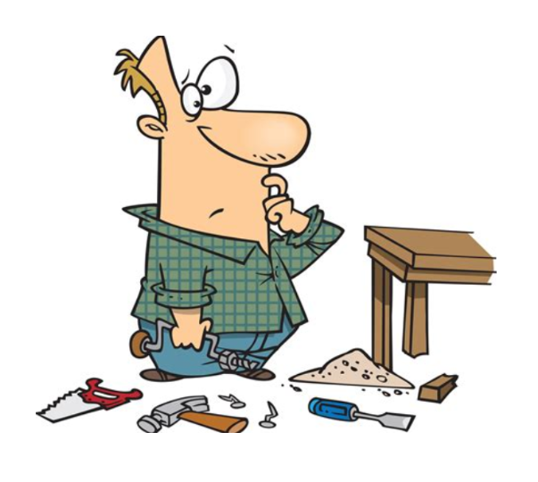

---

- **Palabras** 📝: Usar texto corto y claro junto con las imágenes para explicar mejor las ideas.

---

- **Mapas y Diagramas** 🗺️: Organizar la información de manera que se vea cómo las ideas se conectan entre sí.

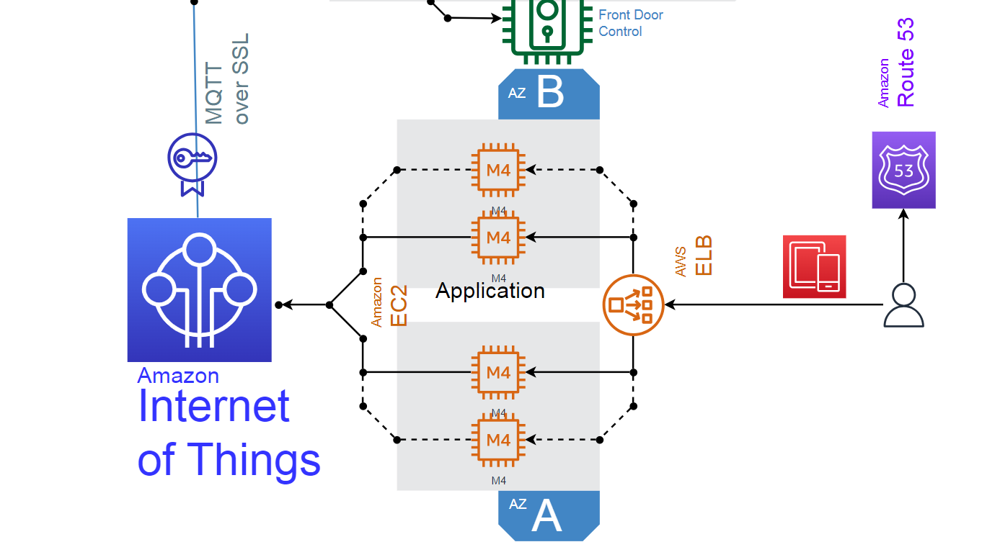

---

- **Esquemas y Flujos** 🔄: Mostrar procesos o secuencias de pasos de forma visual, como un mapa de ruta.

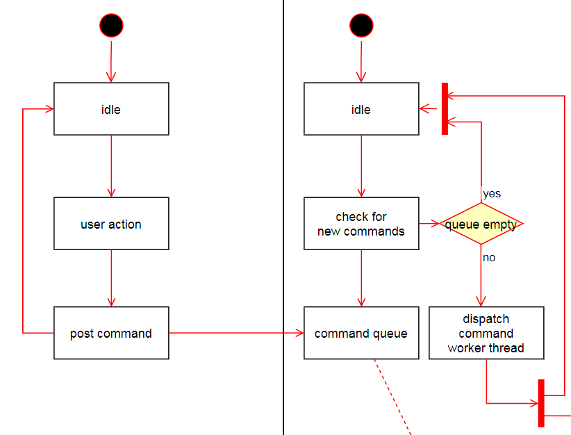

---

- **Colores y Formas** 🎨: Usar diferentes colores y formas para destacar lo importante y diferenciar ideas.

---
## Visual Thinking y Design Thinking

El Design Thinking es un proceso de <mark style="background: #FFF3A3A6;">resolución de problemas</mark> que comienza con la comprensión de las necesidades no satisfechas e implica el desarrollo de <mark style="background: #BBFABBA6;">conceptos</mark>, <mark style="background: #ADCCFFA6;">creatividad</mark>, la creación de <mark style="background: #FFF3A3A6;">prototipos</mark> y la realización de pruebas.

El Design Thinking se puede aplicar a cualquier problema que necesite una solución creativa, no solo a productos físicos, sino también a servicios, modelos de negocio y cuestiones sociales.

---
## Componentes del Design Thinking

- **Comprender el problema** 🔍
- **Explorar posibles soluciones (diagramas, POC, etc)** 💡 
- **Repetir mediante la creación de prototipos y pruebas** 🔄🛠️
- **Implementar el diseño** 🚀
- **Aplicarlo a diferentes dominios** 🌐

---
## Herramientas

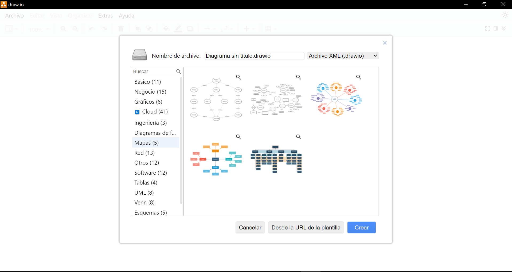

- [Draw.io](https://www.drawio.com/)

---

### Design Thinking Canva en Obsidian

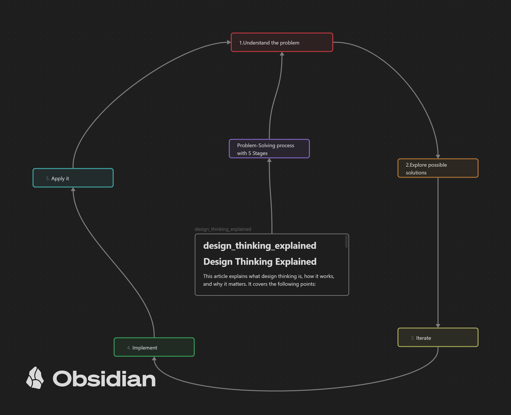

---
### Google Drawings

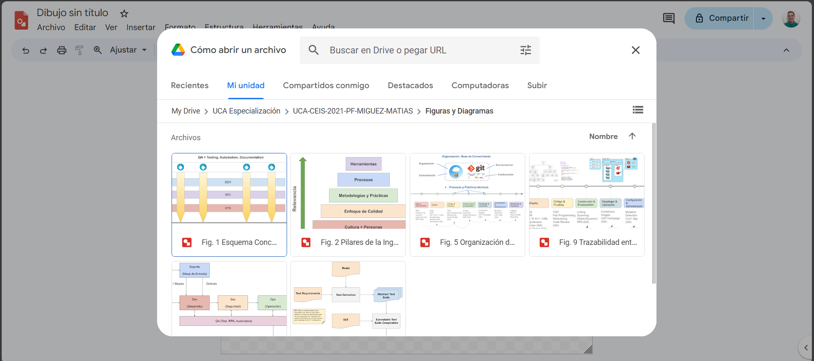

- [Google Drawing](https://docs.google.com/drawings)

---

### Ejemplo Google Drawing

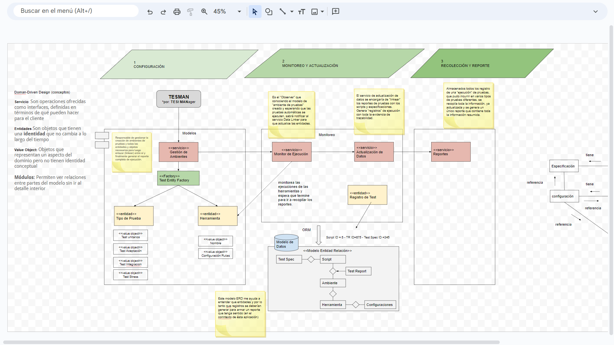

Link: [Ejemplo Test Manager Architecture — Google Drawing](https://docs.google.com/drawings/d/1cBOqUlmJ5NF0shSbG3enm4T4eSLA-ZV8o2X1yrFvIJ4/edit?usp=sharing)

---

### Microsoft Whiteboard

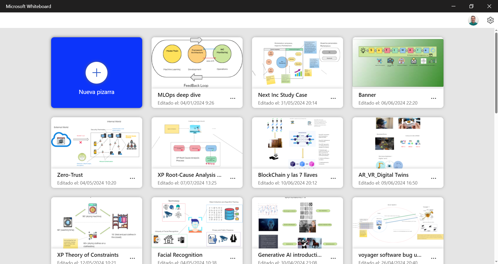

- [Microsoft Whiteboard](https://www.microsoft.com/es-es/microsoft-365/microsoft-whiteboard/digital-whiteboard-app)

---

### Análisis de un problema: SW update Sonda Voyager

[Link Post](https://www.linkedin.com/posts/matiasmiguez_softwareengineering-softwaredebug-spaceengineering-activity-7189696668177416192-1JNV?utm_source=share&utm_medium=member_desktop)

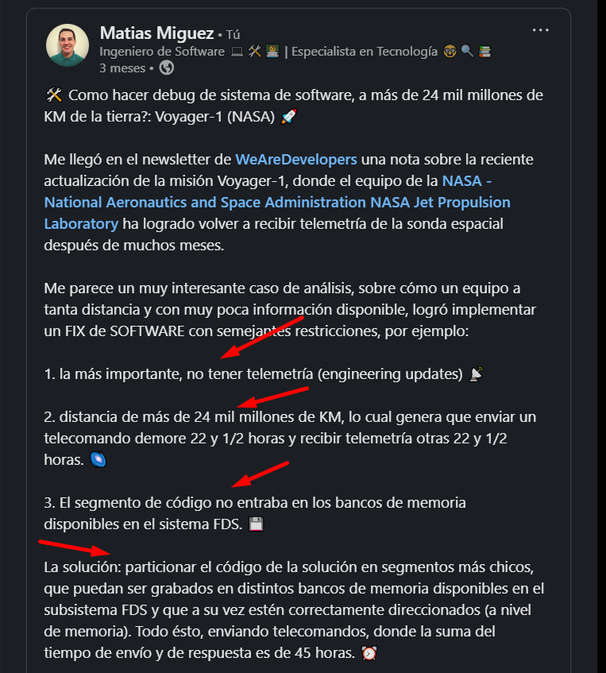

---

### Ejemplo de Whiteboard: Voyager Bugfix NASA

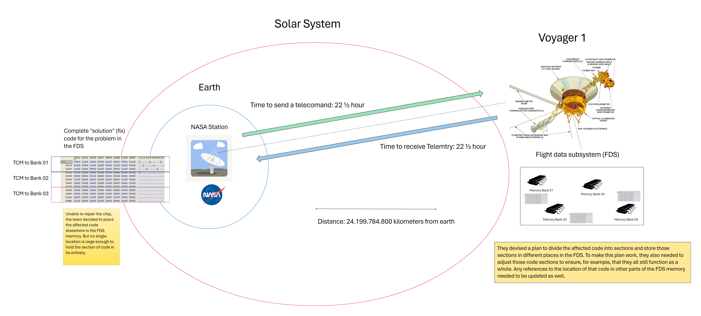

=> [Link](https://wbd.ms/share/v2/aHR0cHM6Ly93aGl0ZWJvYXJkLm1pY3Jvc29mdC5jb20vYXBpL3YxLjAvd2hpdGVib2FyZHMvcmVkZWVtLzZjODBmYTcyNzkzYzQxNDBiNjk5ODM4M2NhODFmYzFjX0JCQTcxNzYyLTEyRTAtNDJFMS1CMzI0LTVCMTMxRjQyNEUzRF8wZjY4NzliYy1jM2ZmLTRlMmEtYjFlOC1kYTY0NzAwZDkxYWI=)

---

### Diagramas interactivos con Draw.io

Link: [Diagrama interactivo de ejemplo — Draw.io Viewer](https://viewer.diagrams.net/?lightbox=1&page=1&highlight=0000ff&edit=_blank&layers=1&nav=1&title=#Uhttps%3A%2F%2Fraw.githubusercontent.com%2Fjgraph%2Fdrawio-diagrams%2Fdev%2Fblog%2Fexplore-with-custom-link.drawio#%7B%22pageId%22%3A%22VdbpzdK1AwvrrNIaupxX%22%7D)

---

# DEMO time

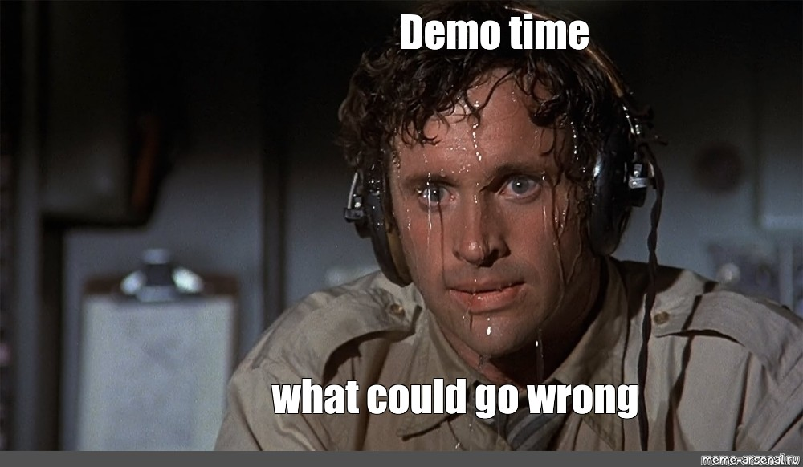

---

# Videos y Recursos adicionales

---
### Dibujar para comprender. Casos de Visual Thinking en las empresas

<iframe width="560" height="315" src="https://www.youtube.com/embed/4TTDuCRiEx0?si=0eL9Nu4cG5M5Me8C" title="YouTube video player" frameborder="0" allow="accelerometer; autoplay; clipboard-write; encrypted-media; gyroscope; picture-in-picture; web-share" referrerpolicy="strict-origin-when-cross-origin" allowfullscreen></iframe>

---
### Visual Storytelling

==> <mark style="background: #FFF3A3A6;">"The Back of the Napkin" de Dan Roam</mark>

**Link**: [The Back of the Napkin — Dan Roam (YouTube)](https://www.youtube.com/watch?v=XEnrQqOHx3I)

<iframe width="560" height="315" src="https://www.youtube.com/embed/XEnrQqOHx3I?si=9SS4xMQaYWtpwMMv" title="YouTube video player" frameborder="0" allow="accelerometer; autoplay; clipboard-write; encrypted-media; gyroscope; picture-in-picture; web-share" referrerpolicy="strict-origin-when-cross-origin" allowfullscreen></iframe>

---

### Doodlers, Unite! 

  - "Doodlers, Unite!" de Sunni Brown

Link: [Doodlers, Unite! — Sunni Brown (YouTube)](https://youtu.be/7fx0QcHyrFk?si=c6a7xIhEi-zl7-fA)

<iframe width="560" height="315" src="https://www.youtube.com/embed/7fx0QcHyrFk?si=j0sw22rApoDVZibu" title="YouTube video player" frameborder="0" allow="accelerometer; autoplay; clipboard-write; encrypted-media; gyroscope; picture-in-picture; web-share" referrerpolicy="strict-origin-when-cross-origin" allowfullscreen></iframe>

---

### Otras Herramientas: Obsidian

[[design_thinking_explained]]

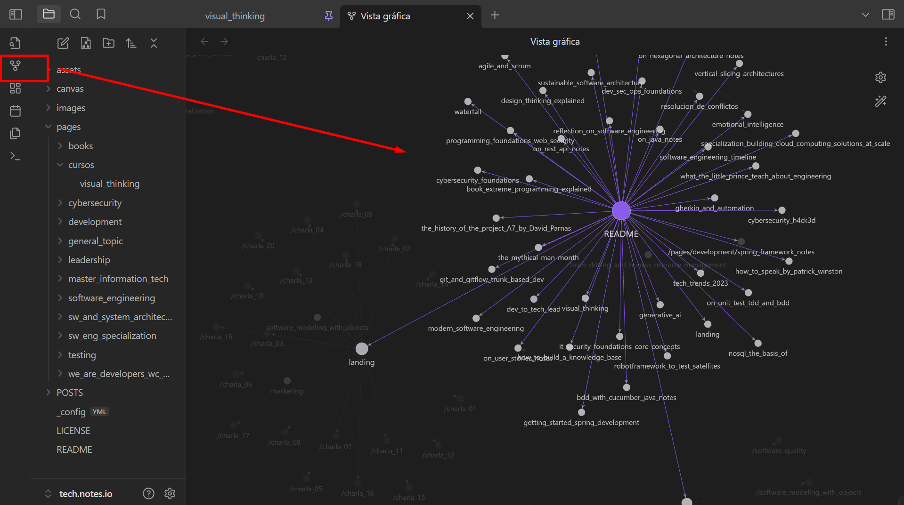

---

### Draw.io de ejemplo

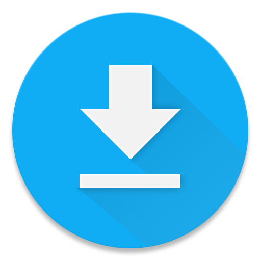 [Descargar Ejemplo:](https://github.com/matiaspakua/tech.notes.io/blob/08c0d9e956789029b2689af4acd98ba1fd51652e/canvas/visual_thinking_and_problem_solving.drawio)
