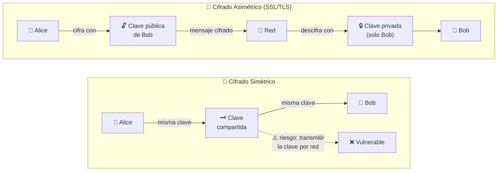

# CyberSecurity H4ck3d conference

[← Inicio](https://matiaspakua.github.io/tech.notes.io)

## Introduction

Excellent 3 days of the #H4CK3D 2022 event organized by Securetia and the Faculty of Engineering of the University of Palermo.

## Day 1 Highlights

### Cifrado simétrico vs asimétrico (SSL/TLS)

 - SSL is essential for encrypting web traffic and ensuring data security.
 - Symmetric encryption uses the same key for encryption and decryption, while asymmetric encryption uses a pair of public and private keys.
 - Symmetric encryption is vulnerable due to the need to transmit the encryption key.
 - Asymmetric encryption eliminates the risk of key transmission by using a public key for encryption and a private key for decryption.
 - Asymmetric encryption is slower than symmetric encryption.
 - SSL plays a crucial role in secure web communication and protects sensitive information.
 - Understanding SSL and encryption methods is important for ensuring data privacy and security. 

## Day 2 Highlights

 - The video explores the anatomy of malware in Latin America, dispelling the misconception that targeted attacks only happen elsewhere.
 - It sheds light on the activities of the Machete cyber espionage group, demonstrating their sophisticated techniques and persistent presence.
 - The talk emphasizes the need for proactive measures and analysis to combat advanced threats in Latin America's cybersecurity landscape.
 - It underscores the global trend of cybercriminals targeting supply chains and critical infrastructures in their attacks.
 - The talk reveals the existence of other cybercriminal organizations and their use of sophisticated malware like the Quasar remote access Trojan.
 - The talk serves as a call to action, urging viewers to stay vigilant and informed about evolving cyber threats in Latin America.
 - It provides valuable insights into the history, evolution, and impact of malware on the region's cybersecurity landscape.

## Day 3 Highlights

- The speaker demonstrates a hardware attack using capacitors to manipulate a CPU's bit supervisor.
- He showcases a modified bike system that changes behavior based on a specific sequence of steps.
- The speaker plans to explore information flow and attacks on hardware using virtual CPUs.
- He demonstrates live hardware attacks on a development board, affecting the system's availability and integrity. 

## References

- [H4CK3D 2022 Schedule — Securetia](https://lnkd.in/d4JPVZcS)
- [Day #01 — YouTube](https://lnkd.in/dn3J_Rxj)
- [Day #02 — YouTube](https://lnkd.in/dwwK55Rm)
- [Day #03 — YouTube](https://lnkd.in/dtXTGXn6)

## Notas relacionadas

- [Cybersecurity Foundations](cybersecurity_foundations.md)
- [IT Security Foundations: Core Concepts](it_security_foundations_core_concepts.md)
- [DevSecOps Foundations](dev_sec_ops_foundations.md)
- [Falco: Runtime Security para contenedores](falco_runtime_security_for_container.md)
