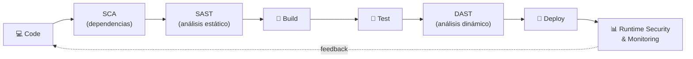

# DevSecOps Foundations

[← Inicio](https://matiaspakua.github.io/tech.notes.io)

> [!note]
> Notas del curso "DevOps Foundations: DevSecOps" en LinkedIn Learning. El curso introduce los principios de DevSecOps y la integración de seguridad en el pipeline de CI/CD.

## La idea central: shift-left

DevSecOps consiste en **incorporar la seguridad desde el inicio** del ciclo de vida del software, en lugar de tratarla como una fase final antes de producción. La seguridad pasa a ser responsabilidad compartida de todo el equipo (Dev + Sec + Ops), no de un silo aparte.

La práctica clave es el *shift-left*: mover los controles de seguridad lo más temprano posible en el pipeline, donde detectar y corregir un problema es más barato.

## Seguridad integrada en el pipeline CI/CD

> [!tip]
> Cada etapa incorpora una *security gate*: SCA revisa librerías de terceros, SAST analiza el código fuente, DAST prueba la aplicación en ejecución, y el monitoreo en runtime (ej. [[falco_runtime_security_for_container|Falco]]) detecta amenazas en producción.

## Referencia

- [DevOps Foundations: DevSecOps — LinkedIn Learning](https://www.linkedin.com/learning/devops-foundations-devsecops-17416896/introduction-to-the-devsecops-course)
