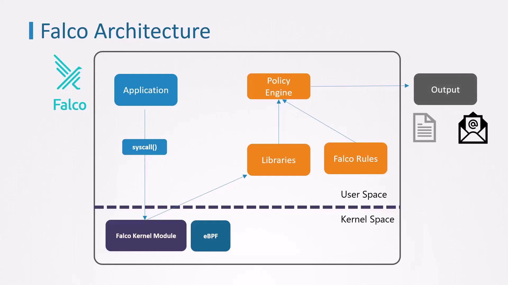
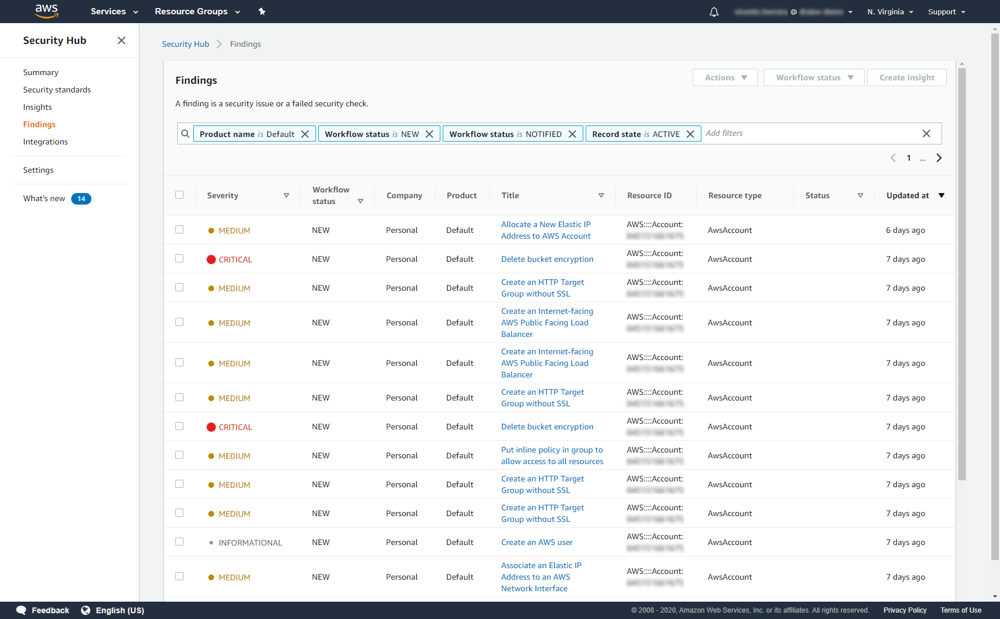

# Falco

**Title**: Detección de amenazas multi-cloud con Falco y AWS Security Hub  
**Speaker:** [Dan Belmonte](https://www.linkedin.com/in/danbelmonte/) | Strategic Alliances Solutions Architect en Sysdyg  
**Duration**: 30-40 mins  
**Abstract**:  
¿Te gustaría probar una solución que detecte amenazas en tiempo de ejecución y que ya esté integrada con un servicio de seguridad en la nube como AWS Security Hub?  
Mostraremos cómo desplegar Falco dentro de clústers EKS de una manera nativa con AWS Security Hub, y así utilizar este servicio como centro unificado de seguridad incluso para entornos multi-cloud.  
Durante la sesión, veremos cómo funcionan las reglas de Falco para detectar comportamientos anómalos y amenazas en tiempo de ejecución a nivel de kernel (dentro de los nodos EKS) y el flujo completo de alertas desde Falco hasta AWS Security Hub (a través de Falcosidekick).  
Al finalizar esta charla, tendrás una mejor comprensión de:  

- Qué es Falco (una herramienta Open Source ampliamente utilizada en entornos _Cloud Native_) y cómo detecta procesos a nivel de kernel.
- Cómo crear un pipeline dentro del ecosistema AWS que integre CloudWatch y Lambda para procesar datos que luego se integrarán con AWS Security Hub.

# What is Falco?

>[!quote] 
>Falco is a cloud native security tool that provides runtime security across hosts, containers, Kubernetes, and cloud environments. It is designed to detect and alert on abnormal behavior and potential security threats in real-time.

Link: https://falco.org/docs/#what-is-falco

# High level overview

# AWS security hub con alertas

