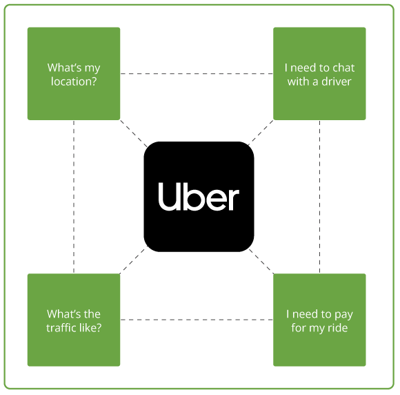
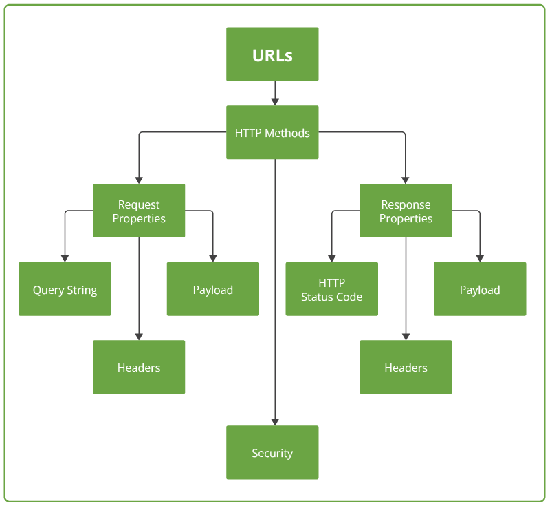
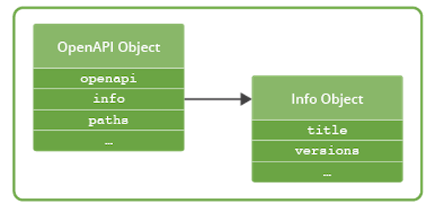
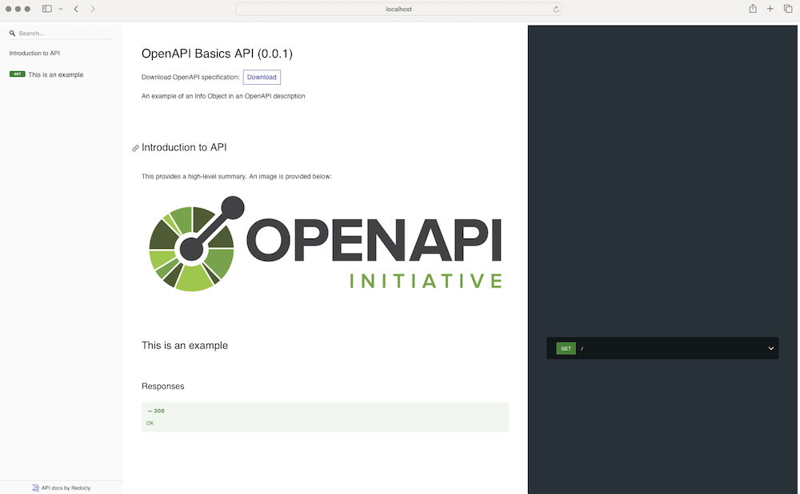

# OpenApi foundations

Definición: es un lenguaje de descripción de API

## API Economy

Nuestro mundo digital es posible gracias a la Economía API ( #APIEconomy ), una colección cada vez más amplia de productos y servicios que tienen algo en común: su <mark style="background: #FFF3A3A6;">presencia en el mercado se ve facilitada por la provisión de una API</mark>. Las API se han convertido en un mecanismo natural para permitir la comunicación entre sistemas distribuidos, proporcionando operaciones y funciones que permiten a las organizaciones construir plataformas descentralizadas, que pueden escalar y crecer de manera más eficaz.

De esa ecosistema de API hay pagar y libres. Tener una forma de describir esas API es un aspecto fundamental de los proveedores.

## El Rol de las API's

El software lleva más de una década devorando al mundo. En esta metáfora culinaria, las API son las herramientas del chef para elaborar la comida y los cubiertos que utilizamos para devorarla. Las <mark style="background: #FFF3A3A6;">API son fundamentales para la forma en que hacemos negocios en muchas industrias diferentes</mark> y son un elemento fundamental en muchas otras tendencias tecnológicas, incluidas las criptomonedas, la banca abierta y la inteligencia artificial.



## Apis-as-products

Cada vez es más común que las organizaciones tomen un aproach de APIs como productos (por ejemplos, existen API Products Managers). 

La evolución de la visión de las API como producto es sorprendente, ya que, en esencia, las API son un tipo de interfaz de software que ha desempeñado la misma función desde los albores de la informática, es decir, la invocación de servicios y el intercambio de datos. Las API permiten el desarrollo de sistemas distribuidos y descentralizados, y las organizaciones han crecido para aprovechar la oportunidad comercial de proporcionar acceso pago a las API que exponen productos comerciales.

Ser un proveedor de API se ha vuelto casi fundamental para hacer negocios en las industrias y verticales.

## Desafíos

Uno de los desafíos más fundamentales es también uno de los más simples: ¿cómo podemos describir nuestras API de una manera que permita a los desarrolladores externos crear clientes de software y también comprender las operaciones y la funcionalidad de la API?

<mark style="background: #BBFABBA6;">Los lenguajes de descripción de API ayudan a enfrentar este desafío.</mark>

## Describir las Interfaces de Software (IDL)

El primer ejemplo es WSDL (Web Service Description Language) => usado en arquitecturas orientadas a software. El problema de este esquema es que están muy acoplados al stack tecnológico, estilo de arquitectura, etc.

El segundo y orientado a la tecnología HTTP es REST.

## Que son los lenguajes de descripción de API's?

Es una forma de comunicar, estandarizar y poner un estructura en común para la definición de las API.s



Una de las forma más estándar de describir los datos es usar el forma de JSON.

Swagger es parte de OpenAPI es el método más común para documentar y describir API's.

## Descripción general de OpenAPI

OpenAPI es un lenguaje que permite la transferencia de conocimiento de los proveedores de API a los consumidores de API (y durante todo el ciclo de vida de la API). Es un estándar abierto para describir sus API, lo que le permite proporcionar una descripción de API codificada en un documento JSON o YAML. Como todos los lenguajes de descripción, proporciona un diccionario completo de términos que refleja conceptos comúnmente entendidos en el mundo de las API, incorporando los fundamentos de HTTP y JSON. Cuando se combina con herramientas de apoyo, puede proporcionar una experiencia enriquecida basada en un documento simple.

## El Rol de HTTP

[Fielding Dissertation: CHAPTER 5: Representational State Transfer (REST)](https://ics.uci.edu/~fielding/pubs/dissertation/rest_arch_style.htm)

Open API está soportado por el protocolo HTTP que es el más extendido en Internet, además del lenguaje JSON para definir el formato del contenido.


## Mapeo OpenAPI a HTTP

| OpenApi concepto    | HTTP                               |
| ------------------- | ---------------------------------- |
| Path                | Uniform Resource Identifiers (URI) |
| Operation Object    | verbs: GET, PUT, POST              |
| Parameter Object    | Query Parameter                    |
| Request Body Object | message payload (json)             |
| Reponses Object     | Response Status codes              |
| Response Object     | response body (json)               |

### HTTP Status Codes Convention 

[RFC 7231 - Hypertext Transfer Protocol (HTTP/1.1): Semantics and Content](https://datatracker.ietf.org/doc/html/rfc7231#section-6)

   o  1xx (Informational): The request was received, continuing process
   o  2xx (Successful): The request was successfully received, understood, and accepted
   o  3xx (Redirection): Further action needs to be taken in order to complete the request
   o  4xx (Client Error): The request contains bad syntax or cannot be fulfilled

## Tecnologías de soporte a OpenAPI

 - JSON y YAML
 - JSON schema
 - Markdown

# Estructura de alto nivel

El primer objeto del documento, es la descripción:

```json

{
  "title": "Sample Pet Store App",
  "summary": "A pet store manager.",
  "description": "This is a sample server for a pet store.",
  "termsOfService": "https://example.com/terms/",
  "contact": {
    "name": "API Support",
    "url": "https://www.example.com/support",
    "email": "support@example.com"
  },
  "license": {
    "name": "Apache 2.0",
    "url": "https://www.apache.org/licenses/LICENSE-2.0.html"
  },
  "version": "1.0.1"
}

```



## Ejemplo:

```yaml

info:  
  title: OpenAPI Basics API  
  description: |  
    An example of an Info Object in an OpenAPI description  
  
    ## Introduction to API
  
    This provides a high-level summary. An image is provided below:  
  
      
  
    These are the services levels available:  
  
    | Name | Description |  
    | --- | --- |  
    | Basic | Free tier available to all consumers |  
  version: 0.0.1

```

y esto se debe renderizar de la siguiente manera:

