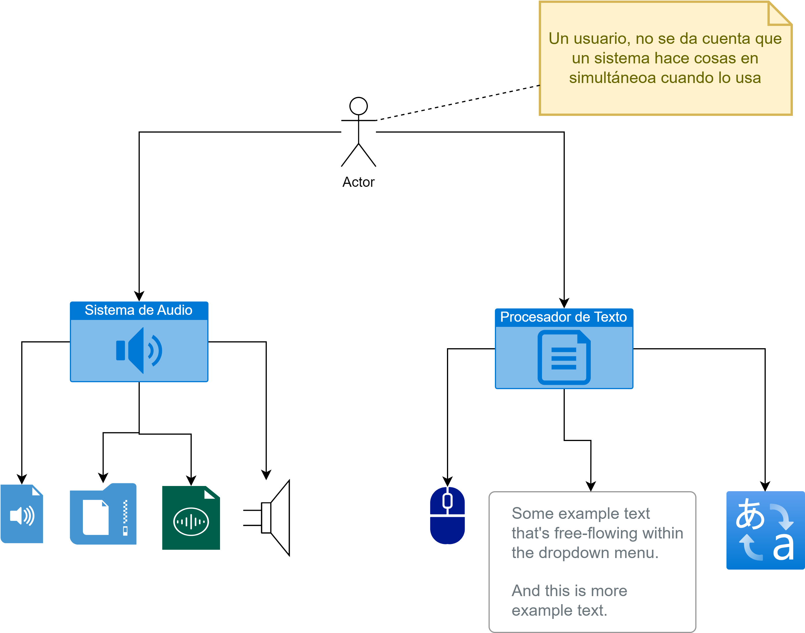
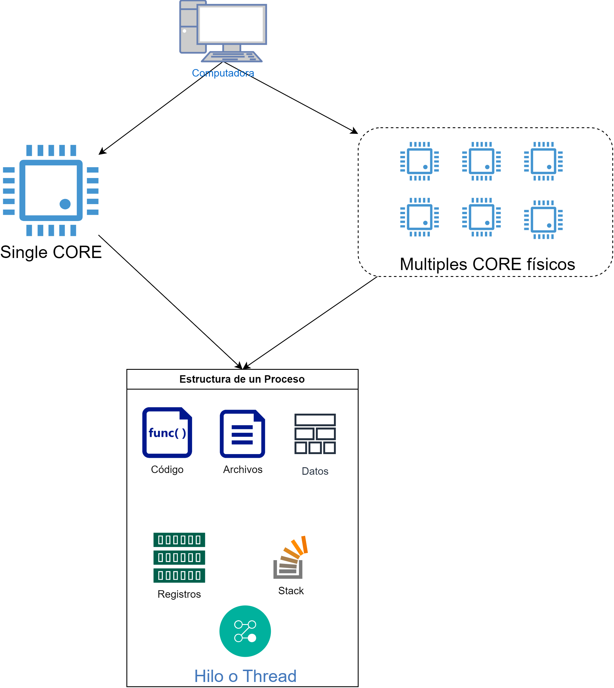
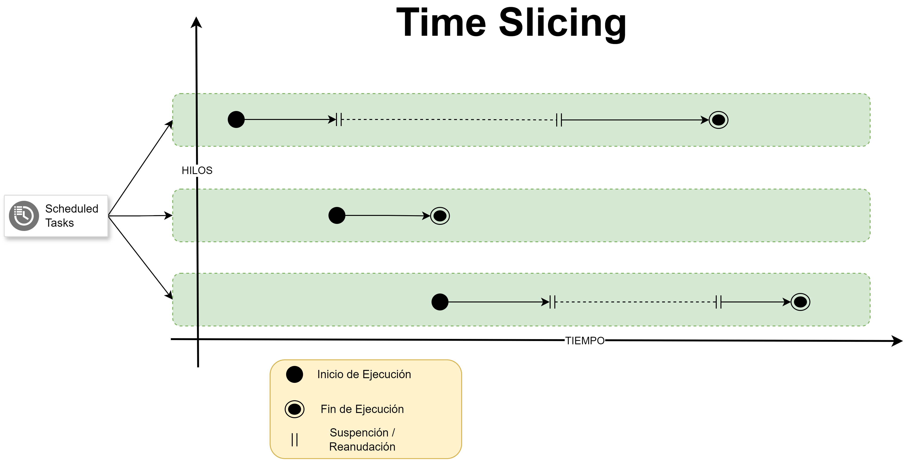
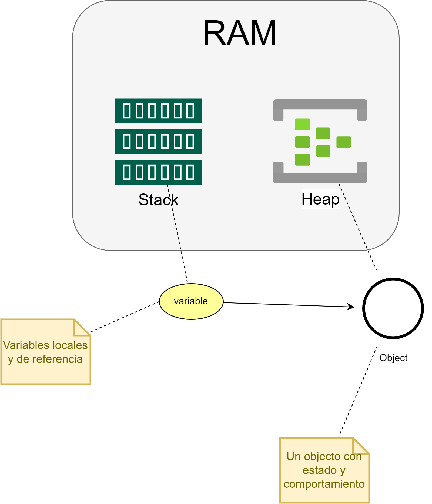
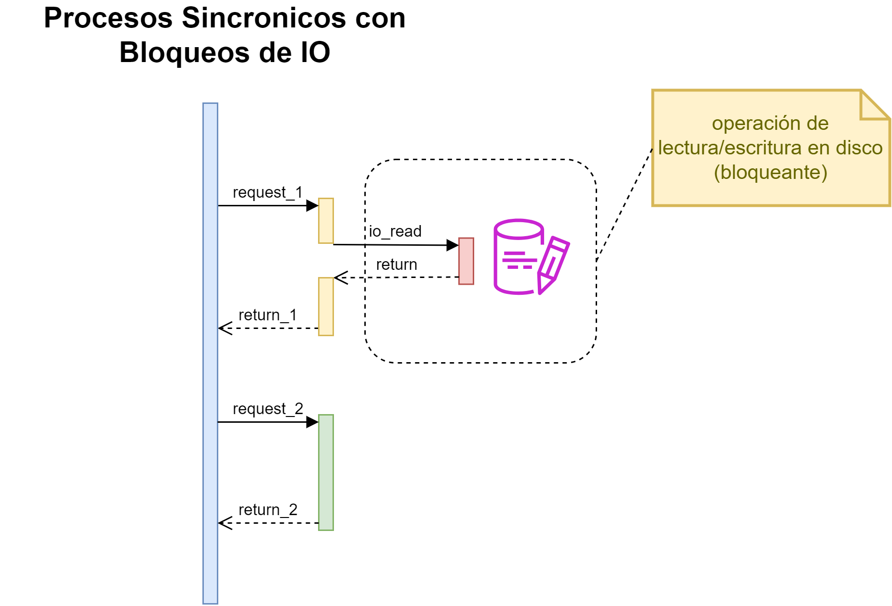

# Concurrencia en Java

<style>
  .back-button {
    background-color: #4CAF50; /* Green */
    border: none;
    color: white;
    padding: 15px 32px;
    text-align: center;
    text-decoration: none;
    display: inline-block;
    font-size: 16px;
    margin: 4px 2px;
    cursor: pointer;
  }
</style>

<button class="back-button" onclick="window.location.href='https://matiaspakua.github.io/tech.notes.io'">All notes</button>

---

# Repositorio GitHub con ejemplos de código

--> [matiaspakua/java_concurerncy: code samples of concurrency in java (github.com)](https://github.com/matiaspakua/java_concurerncy/tree/master)

# Introducción: sincronización

## Que es la concurrencia?

Los usuarios de ordenadores dan por sentado que sus sistemas pueden hacer más de una cosa a la vez. Suponen que pueden seguir trabajando en un procesador de textos mientras otras aplicaciones descargan archivos, gestionan la cola de impresión y transmiten audio. Incluso <mark style="background: #FFF3A3A6;">se espera que una sola aplicación haga más de una cosa a la vez.</mark> Por ejemplo, esa aplicación de transmisión de audio debe leer simultáneamente el audio digital de la red, descomprimirlo, gestionar la reproducción y actualizar su pantalla. Incluso el procesador de textos debería estar siempre preparado para responder a los eventos del teclado y del ratón, sin importar lo ocupado que esté reformateando el texto o actualizando la pantalla. El software que puede hacer estas cosas se conoce como<mark style="background: #BBFABBA6;"> software concurrente</mark>.



## Procesos e hilos

En la programación concurrente, hay dos unidades básicas de ejecución: procesos e hilos. En el lenguaje de programación Java, la programación concurrente se ocupa principalmente de los hilos. Sin embargo, los procesos también son importantes.



Un sistema informático normalmente tiene muchos procesos e hilos activos. Esto es así incluso en sistemas que solo tienen un único núcleo de ejecución y, por lo tanto, solo tienen un hilo ejecutándose en un momento dado. El tiempo de procesamiento de un solo núcleo se comparte entre los procesos e hilos a través de una característica del sistema operativo llamada <mark style="background: #FFF3A3A6;">división de tiempo (time slicing)</mark>.



Cada vez es más común que los sistemas informáticos tengan varios procesadores o procesadores con varios núcleos de ejecución. Esto mejora enormemente la capacidad de un sistema para la ejecución concurrente de procesos e hilos, pero la concurrencia es posible incluso en sistemas simples, sin varios procesadores o núcleos de ejecución.

## Modelo de memoria: RAM

El modelo de memoria y los subprocesos en Java tienen su propia memoria del **stack**, pero comparten la memoria del **heap**. El **stack** contiene variables locales y de referencia, mientras que el **heap** contiene objetos.



## Procesos

Un proceso tiene un <mark style="background: #BBFABBA6;">entorno de ejecución autónomo.</mark> Un proceso generalmente tiene un conjunto completo y privado de recursos básicos de tiempo de ejecución; en particular, cada proceso tiene su propio espacio de memoria.

Los procesos suelen considerarse sinónimos de programas o aplicaciones. Sin embargo, lo que el usuario ve como una única aplicación puede ser en realidad un conjunto de procesos cooperativos. Para facilitar la comunicación entre procesos, la mayoría de los sistemas operativos admiten <mark style="background: #FFF3A3A6;">recursos de comunicación entre procesos (IPC</mark>), como tuberías y conectores. Los  **IPC** se utiliza no solo para la comunicación entre procesos del mismo sistema, sino también para procesos de diferentes sistemas.

La mayoría de las implementaciones de la máquina virtual Java se ejecutan como un único proceso. Una aplicación Java puede crear procesos adicionales utilizando un objeto **ProcessBuilder**.

## Hilos

A veces, los hilos se denominan procesos ligeros. Tanto los procesos como los hilos proporcionan un entorno de ejecución, pero la creación de un nuevo hilo requiere menos recursos que la creación de un nuevo proceso.

Los <mark style="background: #FFF3A3A6;">hilos existen dentro de un proceso</mark>: cada proceso tiene al menos uno. Los hilos comparten los recursos del proceso, incluida la memoria y los archivos abiertos. Esto permite una comunicación eficiente, pero potencialmente problemática.

La ejecución multiproceso es una característica esencial de la plataforma Java. Cada aplicación tiene al menos un hilo, o varios, si se cuentan los hilos del "sistema" que hacen cosas como la gestión de la memoria y el manejo de señales. Pero desde el punto de vista del programador de aplicaciones, se comienza con un solo hilo, llamado hilo principal. Este hilo tiene la capacidad de crear hilos adicionales, como demostraremos en la siguiente sección.


## Java, keywords

```java
/**
A thread is a thread of execution in a program. The Java virtual machine 
allows an application to have multiple threads of execution running 
concurrently.
*/
public class Thread implements Runnable
```

```java

/**
Represents an operation that does not return a result.
This is a functional interface whose functional method is run().
*/
public interface Runnable
```

Algo particular de `Runnable` es que se trata de una interfaz funcional, ahora: ¿Qué es una interfaz funcional?:

--> [Interfaz Funcional en Java](/java_interfaces_funcionales.md)

## Acceso a Memoria en java y sus problemas

- **Data Race**: o interferencia entre thread, cuando varios subprocesos acceden a datos compartidos simultáneamente, puede dar lugar a incoherencias, lo que se conoce como <mark style="background: #FFF3A3A6;">data race</mark>.

```java

public class RunnableCounter implements Runnable {

    int localThreadVariable;
    String nameOfThread;

    @Override
    public void run() {
        for(localThreadVariable = 0; localThreadVariable < 100; localThreadVariable++) {
            System.out.println(this.nameOfThread + " " + localThreadVariable);
        }
    }

    public void setNameOfThread(String name){
        this.nameOfThread = name;
    }
}
```

- **Race Condition**: La falta de un orden de ejecución garantizado entre subprocesos puede causar resultados inesperados, especialmente con operaciones no atómicas como .

```java
public class RunnableCounterDataRace implements Runnable{  
  
    // Recurso compartido por los thread.  
    private int counter;  
  
    @Override  
    public void run() {  
        for (int i = 0; i <1_000_000; i++) {  
            this.counter++;  
        }  
    }  
  
    public int getCounter() {  
        return counter;  
    }  
}
```

El resultado en la ejecución del test: "RunnableCounterDataRace" da un valor superior a 1.000.000 pero inferior a 2 millones, eso se debe a que ambos thread están incrementando el contado, en una situación de "carrera".

Este comportamiento puede o no ocurrir dependiendo de como el SO gestione los thread.

## Race Condition: Operaciones "atómicas"

- **Race Condition**:  se produce cuando varios subprocesos acceden a los datos compartidos y los modifican al mismo tiempo, lo que da lugar a resultados impredecibles.

- **Operaciones no atómicas**: Las operaciones como no son atómicas, lo que significa que constan de varios pasos (lectura, actualización, escritura) que pueden ser interrumpidos por otros subprocesos, lo que provoca resultados incorrectos.

## keyword: "volatile"

**Volatile**: el uso de la palabra clave `volatile` puede ayudar a evitar los **data race** al garantizar la visibilidad de los valores de las variables en todos los subprocesos, pero no bloquea los datos.

## keyword: "synchronized"

**Mecanismo de sincronización**: la sincronización puede evitar tanto las carreras de datos como las condiciones de carrera al usar la palabra clave `synchronized` para marcar secciones críticas, lo que garantiza que solo un subproceso pueda ejecutar el código crítico a la vez.

Por ejemplo, si tenemos un edificio de oficinas con salas de reuniones para reservar:

|Mundo Real     | Java     |
| --- | --- |
| Edificio    | Objetos Java    |
| Sala de reuniones  | Sección Critica |
| Guardia de Seguridad | Objeto Monitor |
| La gente | Los threads |

En código, la sincronización se puede hacer a nivel método u objeto:

```java
@Override  
public void run() {  
    long startTime = System.nanoTime();  
    for (int i = 0; i < 1_000_000; i++) {  
  
        /*  
        En este caso el monitor es el objecto actual (THIS).         */        synchronized (this) {  
            // código critico, sincronizado, solo un thread puede acceder a la vez.  
            counter++;  
        }  
    }  
    long elapsedTime = System.nanoTime() - startTime;  
  
    System.out.println(Thread.currentThread().getName() + " increased the counter up to: " +  
            counter + " in " + elapsedTime / 1000000 + " milliseconds");  
}
```

**Synchronized**: se utiliza para proteger secciones críticas del código y garantizar que solo un subproceso pueda acceder al recurso compartido a la vez.


**Objeto de monitor**: el objeto cuyo monitor se utiliza para sincronizar el bloque de código. Puede ser el objeto actual (this) o cualquier otro objeto.

**Bloqueo de instancia frente a bloqueo de nivel de clase**: los métodos de instancia utilizan el monitor del objeto actual, mientras que los métodos estáticos utilizan el monitor de la clase.

**Sección crítica**: la parte del código en la que se accede a los recursos compartidos y se modifican. Debe estar sincronizada para evitar carreras de datos y condiciones de carrera.
Consideraciones de rendimiento: la sincronización puede provocar sobrecargas de rendimiento, bloqueos y falta de rendimiento, por lo que debe utilizarse con prudencia.


# Programación Asíncrona

## Non-blocking operations

- **Programación sincrónica**: implica una ejecución secuencial en la que las tareas esperan a que se completen entre sí, lo que puede provocar <mark style="background: #FFF3A3A6;">bloqueos</mark>, especialmente con tareas que consumen mucho tiempo, como las operaciones de E/S.



- **Programación asíncrona**: Permite que varias tareas se ejecuten simultáneamente <mark style="background: #BBFABBA6;">sin esperarse unas a otras</mark>, lo que mejora la eficiencia y el rendimiento, especialmente en tareas como operaciones de red o acceso a bases de datos.


- **Subproceso principal**: En la programación sincrónica, el<mark style="background: #ADCCFFA6;"> subproceso principal espera</mark> a que se completen otros subprocesos, lo que puede dificultar la generación de nuevos subprocesos. La programación asincrónica permite que el subproceso principal continúe ejecutando otras tareas sin esperar.


## Keywork: Future (promesas)

```java

/*
A task that returns a result and may throw an exception. Implementors define a single method with no arguments called call.
*/
public interface Callable<V>


/*
An Executor that provides methods to manage termination and methods that can produce a Future for tracking progress of one or more asynchronous tasks.
An ExecutorService can be shut down, which will cause it to reject new tasks. Two different methods are provided for shutting down an ExecutorService.
*/
public interface ExecutorService extends Executor, AutoCloseable

```


- **Objeto Futuro**: Representa el resultado de un cálculo asíncrono, permitiendo a un programa continuar ejecutando otras tareas mientras espera el resultado.
- **Métodos clave**:  
    - `get()`: Recupera el resultado, bloqueándolo si es necesario hasta que se complete el cálculo.
    - `isDone()`: Comprueba si la tarea se ha completado.
    - `cancel()`: Intenta cancelar la ejecución de la tarea.
- **Eficiencia asíncrona**: El uso permite una ejecución más eficiente del programa al permitir que las tareas que consumen mucho tiempo se ejecuten simultáneamente sin bloquear otras operaciones.`Future`


## ExecutorService

Un buen ejemplo del uso y funcionamiento de un ExecutorService está en la misma documentación de java:

```java

class NetworkService implements Runnable 
{   
	private final ServerSocket serverSocket;   
	private final ExecutorService pool;    
	
	public NetworkService(int port, int poolSize) throws IOException {
	    serverSocket = new ServerSocket(port);
	    pool = Executors.newFixedThreadPool(poolSize);
    }    
    
    public void run() { // run the service
         try {       
	         for (;;) {
                  pool.execute(new Handler(serverSocket.accept()));
			 }
		  }
          catch (IOException ex) {
			 pool.shutdown();
		  }   
	  } 
  }

// otra clase

class Handler implements Runnable {
	private final Socket socket;
    
    Handler(Socket socket) {
		this.socket = socket;
	}   
	public void run() 
	{     
		// read and service request on socket   
	} 
}
```
# Referencias

 - [Lesson: Concurrency (The Java™ Tutorials > Essential Java Classes) (oracle.com)](https://docs.oracle.com/javase/tutorial/essential/concurrency/)
 - [JobRunr](https://github.com/jobrunr/jobrunr?tab=readme-ov-file) / [Official Web](https://www.jobrunr.io/en/)
 - [Java Concurrency Video Tutorial](https://www.youtube.com/playlist?list=PLL8woMHwr36EDxjUoCzboZjedsnhLP1j4)
