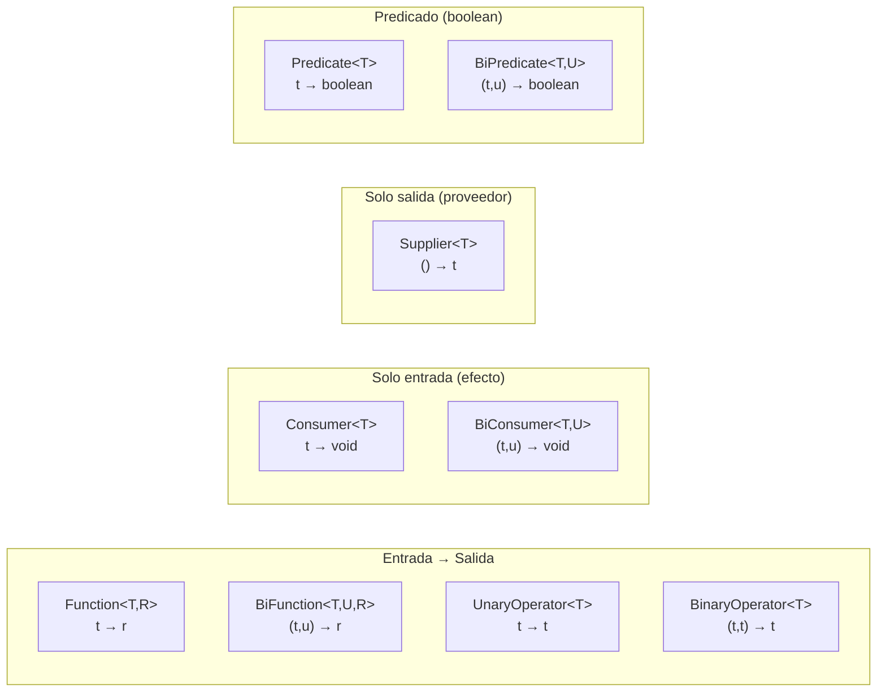

# Java Interfaces Funcionales

[← Inicio](https://matiaspakua.github.io/tech.notes.io)

### ¿Qué es una Interfaz Funcional en Java?

Una **interfaz funcional** en Java es una interfaz que tiene exactamente un método abstracto. Estas interfaces son una parte clave del paradigma de programación funcional introducido en Java 8. Aunque puede tener métodos predeterminados o estáticos, solo un método abstracto es el requisito que la define como funcional. Las interfaces funcionales son especialmente útiles en combinación con expresiones lambda, ya que las lambdas pueden ser utilizadas donde se espera una interfaz funcional.

### Propósito de las Interfaces Funcionales

El propósito principal de las interfaces funcionales es proporcionar una manera clara y concisa de representar funciones, comportamientos, o bloques de código que pueden ser reutilizados y pasados como parámetros. Esto se logra a través de **expresiones lambda** o **referencias a métodos**.

### ¿Cómo se usa?

Para declarar una interfaz funcional, solo necesitas definir una interfaz con un único método abstracto. Además, Java proporciona la anotación `@FunctionalInterface` para indicar explícitamente que una interfaz es funcional, lo que permite al compilador emitir un error si se agregan múltiples métodos abstractos.

```java
@FunctionalInterface
public interface Operacion {
    int ejecutar(int a, int b);
}

// Uso con expresión lambda
public class Calculadora {
    public static void main(String[] args) {
        Operacion suma = (a, b) -> a + b;
        System.out.println("Resultado: " + suma.ejecutar(5, 3)); // Salida: Resultado: 8
    }
}
```

### ¿Dónde conviene utilizarlas?

1. **Expresiones Lambda:** Cuando necesitas pasar un comportamiento como argumento de un método, una interfaz funcional combinada con una expresión lambda es ideal.
   - Ejemplo: Uso en el método `sort` de `Collections` para ordenar listas.
   
2. **Streams API:** En operaciones de filtrado, mapeo y reducción en Streams, donde se espera un comportamiento funcional.
   - Ejemplo: `filter`, `map`, `reduce` en Streams.

3. **Callbacks y Eventos:** Implementación de callbacks y manejo de eventos en una forma más clara y menos verbosa que las clases anónimas.

4. **Configuración de Comportamientos:** En casos donde diferentes implementaciones de una operación pueden ser inyectadas o configuradas en tiempo de ejecución.

### ¿Dónde no conviene utilizarlas?

1. **Lógica Compleja:** Si la lógica dentro de la interfaz funcional es demasiado compleja, una clase completa con múltiples métodos puede ser más adecuada y clara.

2. **Estado:** Las interfaces funcionales no deben manejar estados mutables. Si necesitas trabajar con estados, las clases normales son más adecuadas.

3. **Herencia Compleja:** No conviene usarlas si la interfaz requiere extender múltiples comportamientos, ya que las interfaces funcionales están diseñadas para mantener la simplicidad y singularidad de propósito.

### Conclusión

Las interfaces funcionales en Java son una herramienta poderosa para simplificar la programación, especialmente en el contexto de la programación funcional. Permiten expresar de manera concisa comportamientos que se pueden pasar y reutilizar, reduciendo la cantidad de código boilerplate. Sin embargo, se deben utilizar con cuidado, asegurando que el uso de lambdas y interfaces funcionales no sacrifique la claridad o el diseño de tu código.

Las interfaces funcionales principales del paquete `java.util.function`:



## Referencias

- [java.util.function — Java SE 17 API Docs](https://docs.oracle.com/en/java/docs/api/java.base/java/util/function/package-summary.html)
- [Lambda Expressions — The Java Tutorials (Oracle)](https://docs.oracle.com/javase/tutorial/java/javaOO/lambdaexpressions.html)

## Notas relacionadas

- [Notas de Java](on_java_notes.md)
- [Spring Framework Notes](spring_framework_notes.md)
- [01. Learning Spring with Spring Boot](getting_started_spring_development.md)
- [Spring Cloud Load Balancing](advance_your_spring_development_skills.md)
- [Concurrencia en Java](concurrencia_java.md)
