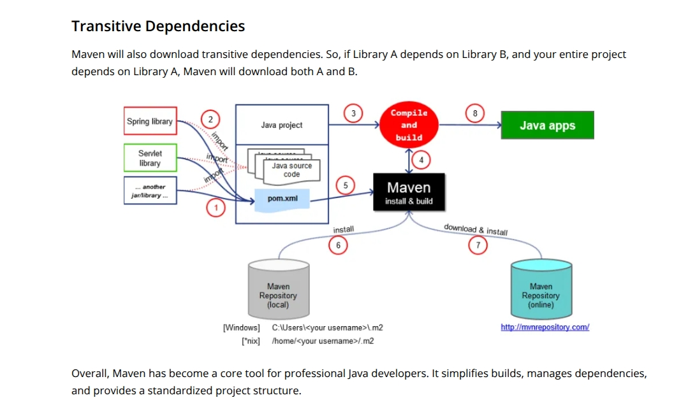
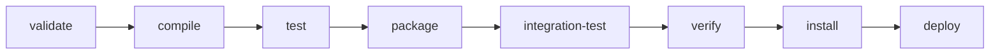

# Cómo funciona Maven?

[← Inicio](https://matiaspakua.github.io/tech.notes.io)

---

<mark style="background: #FFF3A3A6;">Apache Maven</mark> es una herramienta de automatización de builds para proyectos Java (y JVM en general). Gestiona dependencias, compila, testea, empaqueta y despliega proyectos a partir de un archivo de configuración llamado `pom.xml` (Project Object Model).

)

## Conceptos clave

- **POM (`pom.xml`)**: descriptor central del proyecto. Define dependencias, plugins, propiedades y el ciclo de vida.
- **Repositorio local / central / remoto**: Maven descarga dependencias desde repositorios (por defecto Maven Central) y las cachea en `~/.m2/repository`.
- **Coordenadas**: cada artefacto se identifica con `groupId:artifactId:version` (GAV).
- **Plugins**: todo el trabajo en Maven lo hacen plugins (compiler, surefire, jar, deploy, etc.).

## Ciclo de vida de build

Maven define tres ciclos de vida: `default`, `clean` y `site`. El más importante es `default`:

> [!note]
> Ejecutar una fase implica ejecutar **todas las fases anteriores**. Por ejemplo,
> `mvn package` también valida, compila y corre los tests unitarios.

## Comandos más usados

| Comando | Descripción |
|---|---|
| `mvn clean` | Elimina el directorio `target/` |
| `mvn compile` | Compila el código fuente |
| `mvn test` | Ejecuta los tests unitarios |
| `mvn package` | Genera el artefacto (JAR/WAR) |
| `mvn install` | Instala el artefacto en el repo local |
| `mvn deploy` | Publica el artefacto en el repo remoto |
| `mvn dependency:tree` | Muestra el árbol de dependencias |

## References

- [Maven — Apache Software Foundation (oficial)](https://maven.apache.org/)
- [Maven in 5 Minutes — Apache Maven Docs](https://maven.apache.org/guides/getting-started/maven-in-five-minutes.html)
- [Introduction to the Build Lifecycle — Apache Maven Docs](https://maven.apache.org/guides/introduction/introduction-to-the-lifecycle.html)

## Notas relacionadas

- [Notas de Java](on_java_notes.md)
- [01. Learning Spring with Spring Boot](getting_started_spring_development.md)
- [Spring Framework Notes](spring_framework_notes.md)
