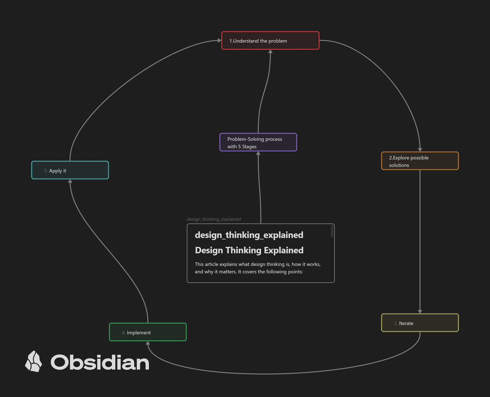

# Design Thinking Explained

This article explains what design thinking is, how it works, and why it matters. It covers the following points:

- Design thinking is an innovative **problem-solving process** that begins with understanding unmet customer needs and involves concept development, applied creativity, prototyping, and testing.
- Design thinking can be applied to any problem that needs a creative solution, not only to physical products, but also to services, business models, and social issues.
- Design thinking has five main steps: 
1. understand the problem, 
2. explore possible solutions, 
3. iterate through prototyping and testing, 
4. implement the design, and 
5. apply it to different domains.
- Design thinking requires a set of skills that can be learned and practiced, such as empathy, brainstorming, modeling, analysis, and feedback.
- Design thinking can help executives across industries rethink their product offerings, grow their markets, offer greater value to customers, or innovate and stay relevant.

## Reference

 * [Design thinking, explained MIT Sloan](http://mitsloan.mit.edu/ideas-made-to-matter/design-thinking-explained?utm_source=mitsloanlinkedin&utm_medium=social&utm_campaign=designthinkingexplainer)