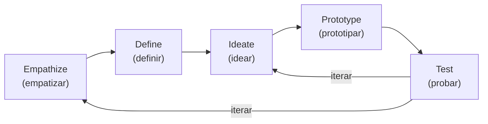

# Design Thinking Explained

[← Inicio](https://matiaspakua.github.io/tech.notes.io)

The article explains what design thinking is, how it works, and why it matters. It covers the following points:

- <mark style="background: #FFF3A3A6;">Design thinking</mark> is an innovative **problem-solving process** that begins with understanding unmet customer needs and involves concept development, applied creativity, prototyping, and testing.
- Design thinking can be applied to any problem that needs a creative solution, not only to physical products, but also to services, business models, and social issues.
- Design thinking has five main steps: 
1. understand the problem, 
2. explore possible solutions, 
3. iterate through prototyping and testing, 
4. implement the design, and 
5. apply it to different domains.
- Design thinking requires a set of skills that can be learned and practised, such as empathy, brainstorming, modelling, analysis, and feedback.
- Design thinking can help executives across industries rethink their product offerings, grow their markets, offer greater value to customers, or innovate and stay relevant.

Las cinco etapas del proceso (modelo de la d.school de Stanford), con su naturaleza iterativa:

```mermaid
flowchart LR
    E["Empathize<br/>(empatizar)"] --> D["Define<br/>(definir)"]
    D --> I["Ideate<br/>(idear)"]
    I --> P["Prototype<br/>(prototipar)"]
    P --> T["Test<br/>(probar)"]
    T -->|iterar| E
    T -->|iterar| I
```

## Example: global platform

Applying Design Thinking to standardize various software platforms into a global one involves a structured and iterative approach to problem-solving. Here's a step-by-step example:

### Step 1: Empathize

1. **Understand Stakeholder Needs:**
    
    - Conduct interviews, surveys, or workshops with stakeholders from different regions and departments.
    - Gather insights on their pain points, preferences, and expectations related to software platforms.
2. **User Personas:**
    - Create user personas to represent different types of users across the organization.

### Step 2: Define

1. **Define the Problem:**
    
    - Synthesize the gathered information to define the core problems and challenges.
    - Clearly articulate the goal of standardizing software platforms globally.
2. **Establish Criteria:**
    
    - Identify criteria for success, considering factors like user satisfaction, efficiency, cost reduction, and scalability.

### Step 3: Ideate

1. **Brainstorming Sessions:**
    
    - Organize cross-functional brainstorming sessions to generate ideas for standardization.
    - Encourage creative thinking without judgment.
2. **Idea Prioritization:**
    
    - Use methods like dot voting or affinity mapping to prioritize and refine the most promising ideas.

### Step 4: Prototype

1. **Concept Prototyping:**
    
    - Develop low-fidelity prototypes or wireframes to visualize how the standardized platform might look and function.
2. **Feedback Loops:**
    
    - Collect feedback from stakeholders and iterate on the prototypes accordingly.

### Step 5: Test

1. **Pilot Programs:**
    
    - Implement pilot programs in specific regions or departments to test the standardized platform.
    - Gather user feedback and performance data.
2. **Iterative Testing:**
    
    - Iterate on the design based on real-world feedback and experiences.

### Step 6: Implement

1. **Rollout Strategy:**
    
    - Develop a phased rollout strategy to implement the standardized platform across the entire organization.
2. **Training and Support:**
    
    - Provide training and support resources to help users transition smoothly to the new platform.

### Step 7: Evaluate

1. **Key Performance Indicators (KPIs):**
    
    - Define KPIs to measure the success of the standardized platform.
    - Monitor metrics such as user adoption rates, system performance, and cost savings.
2. **Continuous Improvement:**
    
    - Establish mechanisms for continuous improvement based on ongoing feedback and changing organizational needs.

### Step 8: Iterate

1. **Feedback and Adaptation:**
    - Continuously gather feedback from users and stakeholders.
    - Iterate on the standardized platform to address emerging needs and challenges.

### Additional Considerations:

- **Cross-Functional Collaboration:** Encourage collaboration between IT, operations, and end-users throughout the process.
    
- **Change Management:** Implement change management strategies to address resistance and facilitate a smooth transition.
    
- **Flexibility:** Design the standardized platform with flexibility to accommodate diverse regional requirements.
    
- **Communication:** Maintain transparent communication to keep stakeholders informed about the progress and benefits.
## Referencias

- [Design Thinking, Explained — MIT Sloan Management Review](https://mitsloan.mit.edu/ideas-made-to-matter/design-thinking-explained)
- [IDEO Design Thinking — IDEO.org](https://www.ideo.org/approach)
- [Design Thinking — d.school Stanford University](https://dschool.stanford.edu/resources/design-thinking-bootleg)

## Notas relacionadas

- [Visual Thinking](../cursos/visual_thinking.md)
- [On User Stories](on_user_stories_notes.md)
- [Tech Trends 2023](tech_trends_2023.md)