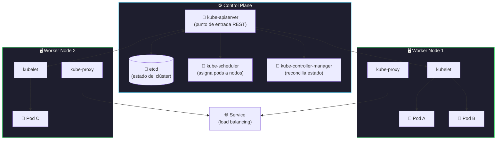

# Charla MeetUp DevOps BCN

[← Inicio](https://matiaspakua.github.io/tech.notes.io)

**Title**: Kubernetes, Componente a Componente  
**Speaker:** [Rael García](https://www.linkedin.com/in/rael/) | SRE en Red Hat  
**Duration**: 45 mins  
**Abstract**: Kubernetes, Componente a Componente  
Introducción a los principios básicos y los componentes que constituyen la arquitectura de Kubernetes. Levantaremos un clúster de Kubernetes desde 0, desplegando cada componente por separado y aprendiendo de forma práctica cómo cada pieza encaja en el puzzle. Daremos los recursos para poder reproducir el tutorial en casa.

## Arquitectura de Kubernetes

## Presentación completa de Kubernetes

[Kubernetes: Componente a Componente — Rael García (Google Slides)](https://docs.google.com/presentation/d/18e4Lg4ARKWPMSl6UrlzPu89vvX1w8W1cKkwaL_Hr3bI/edit?usp=sharing)

## Repositorio de GitHub para levantar desde cero

[raelga/kubernetes-talks: k8s-from-scratch (GitHub)](https://github.com/raelga/kubernetes-talks/tree/master/k8s-from-scratch)

## Referencias

- [Kubernetes Official Documentation](https://kubernetes.io/docs/home/)
- [Kubernetes: Up and Running — Brendan Burns, Joe Beda & Kelsey Hightower, O'Reilly, 2022](https://www.oreilly.com/library/view/kubernetes-up-and/9781098110192/)

## Notas relacionadas

- [Cloud Computing Solutions at Scale](specialization_building_cloud_computing_solutions_at_scale.md)
- [DevSecOps Foundations](../cybersecurity/dev_sec_ops_foundations.md)
- [Docker — WeAreDevelopers charla_20](../we_are_developers_wc_2024/charla_20.md)