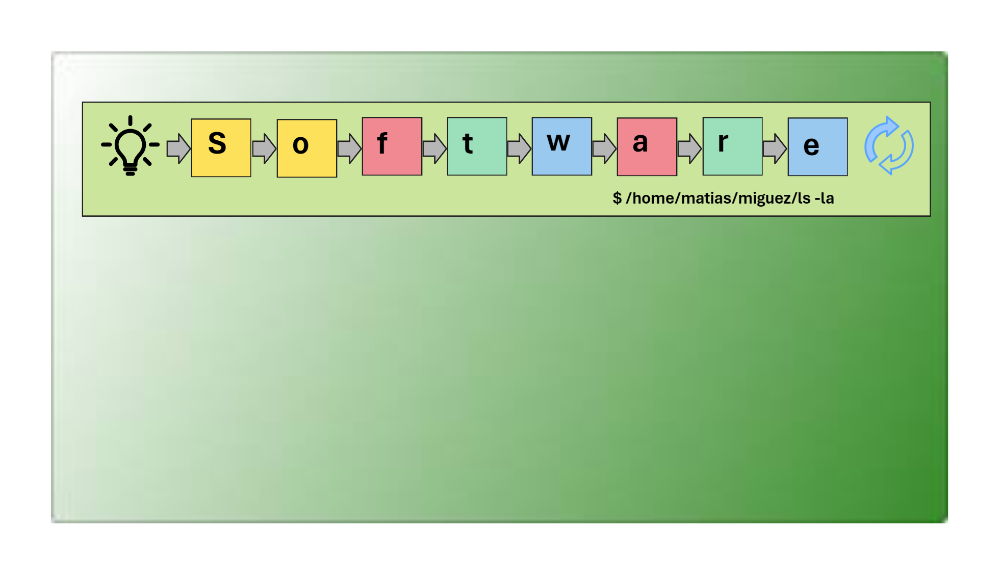

# A reflection on Software Engineering: A Journey of Creativity and Rigor

Software engineering is a fascinating discipline that combines creativity and rigor to solve real-world problems. It’s not just about writing code, but about following a well-defined process that ensures quality, efficiency, and performance. I will explain how this process is illustrated in the image below, which I created, put in my LinkedIn profile and I intent to expose how I understand Software Engineering (so far...):

The image begins with a light bulb icon, which represents the conception of an idea or a problem to solve. This is the spark that ignites the software engineering journey, where we identify a need or an opportunity and come up with innovative solutions.

The word “Software” is spelled out with colorful blocks, each letter representing a crucial element or phase in the software development life-cycle. Let’s look at them one by one:

- **S (Well-Defined Process)**: The process begins with a well-defined methodology, ensuring that every phase of development is planned and executed with some precision and with a clear objective. It’s akin to laying down the blueprint for constructing a robust and efficient software system.
    
- **O (CI/CD)**: Continuous Integration and Continuous Deployment (CI/CD) are represented by the arrows that connect the different phases (as a pipeline in Jenkins), emphasizing automated testing and deployment to streamline and optimize the development workflow.  
    
- **F (TDD)**: Test-Driven Development (TDD) follows, embodied by the red-green-refactor cycle. It underscores writing tests before code (or try it!!!), ensuring that every piece of code is functional and bug-free.
    
- **T (Feedback Loops)**: Feedback loops are integral for iterative improvement. They ensure that feedback is promptly acted upon, enhancing software quality over time.
    
- **W (Iterative-Incremental Development)**: Iterative-incremental development emphasizes refining the software in small, manageable increments, ensuring adaptability and flexibility in meeting changing requirements.
    
- **A (Conceptualization)**: The "light bulb". The conception of an idea or problem to solve marks the inception where innovative solutions are birthed from identifying real-world challenges.
    
- **R (Artifacts Generation)**: Each phase generates artifacts – tangible outputs like documents or code – evidencing progress and facilitating subsequent stages of development.
    

The image ends with a refresh icon, which indicates that the software engineering journey is never over. There is always room for improvement, learning, and innovation.

The little joke inserted—a Linux bash command (`$ /home/matias/miguez/ls -la`)—adds a touch of humor while subtly nodding to the technical acumen integral in software engineering. It shows the contents of an imaginary folder (my LinkedIn profile or my GitHub landing page), where you can see information about my self (project in git, my blog, working experience, courses, certification, posts that I share, etc.)

As you can see, software engineering is a journey of creativity and rigor, where we use our skills and knowledge to create solutions that make a difference in the world. I hope you enjoyed this post and learned something new. Feel free to share your thoughts and comments below. Thank you for reading! 😊
