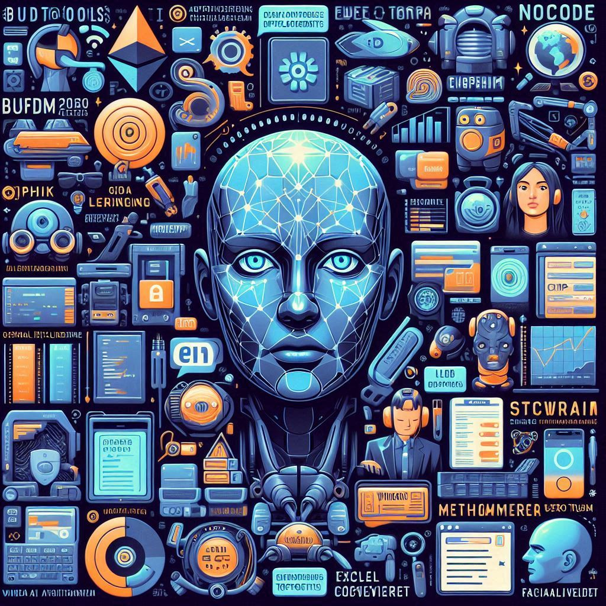
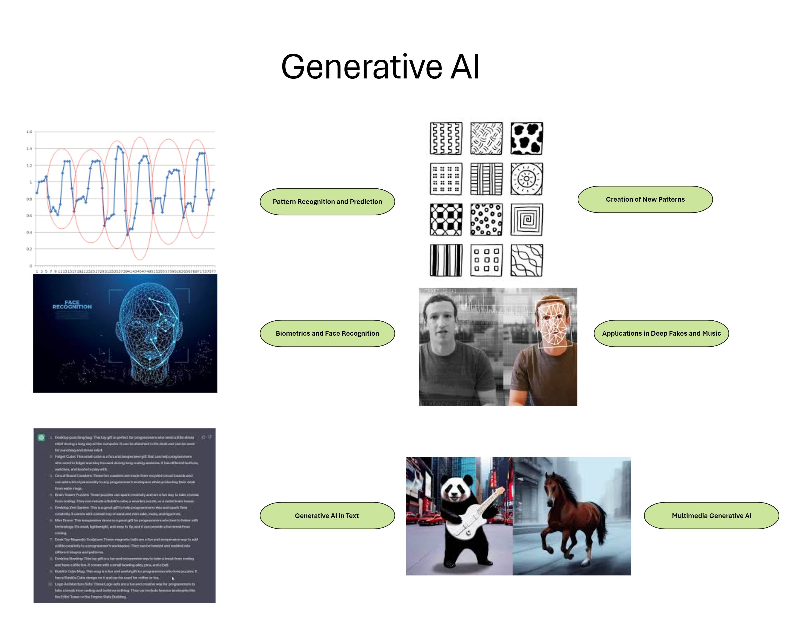

# Tech Trends (2023 so far and 2024)

<button class="back-button" onclick="window.location.href='https://matiaspakua.github.io/tech.notes.io'">All notes</button>

---

# The Latest

### Data BuildTools (DBT)

The topic "Data BuildTools (DBT)" covers a tool designed to address the increasing complexity of data analysis in rapidly growing companies. DBT, or the Data Build Tool, serves as a framework around SQL, providing structure, testing, and documentation for transforming and modeling data in the data warehouse. Key points include:

1. **Purpose of DBT:**
    
    - DBT is aimed at improving data processes and insights within a growing business.
    - It enables data analysts and engineers to transform and model data in the data warehouse.
2. **Functionality of DBT:**
    
    - DBT treats SQL like software, incorporating practices such as version control, automated data testing, and documentation.
    - It follows an ELT (Extract, Load, Transform) approach, where raw data is loaded first and then transformed within the warehouse.
3. **DBT Core vs. DBT Cloud:**
    
    - DBT Core is the open-source offering providing foundational features for running, testing, and documenting SQL transformations.
    - DBT Cloud is a managed service built on top of DBT Core, offering additional features like a web interface, scheduled runs, and collaboration tools.
4. **Data Pipeline with DBT:**
    
    - The data pipeline with DBT is likened to a conveyor belt where raw data is ingested into the data warehouse, and transformations are done within.
5. **Getting Started with DBT:**
    
    - Hands-on experience is encouraged to grasp DBT's functionality.
    - Essential skills include a strong understanding of SQL, data warehousing principles, data modeling, problem-solving, and collaboration.
6. **Continuous Learning:**
    
    - Data engineering is a evolving field, and continuous learning is emphasized to stay updated with new technologies and business use cases.

DBT serves as a valuable tool for teams looking to streamline and enhance their data analytics processes, providing a structured framework for managing SQL transformations and fostering collaboration among team members.

### Microsoft Dev Box

Microsoft Dev Box is an Azure service that allows developers to create and use high-performance cloud-based workstations for coding. It offers several key benefits:

1. **Self-service environment**: Developers can choose from pre-configured dev boxes with all necessary tools, code repositories, and software development kits, enabling them to start working immediately.

2. **Fast provisioning**: Dev boxes can be deployed in minutes, eliminating the need for IT involvement and long wait times.

3. **Centralized management and security**: IT administrators have centralized control over dev boxes through tools like Microsoft Intune and Endpoint Manager, ensuring security, compliance, and cost management.

4. **Collaboration and flexibility**: Developers can work on multiple projects, collaborate with team members through shared dev boxes, and scale resources up or down based on workload.

5. **Integration with existing Microsoft tools**: Seamlessly integrates with Microsoft 365 and Windows licenses, offering a familiar development environment for teams already using these tools.

Microsoft Dev Box presents a option for companies and teams seeking a secure, efficient, and self-service way to provision and manage developer workstations, especially those already invested in the Microsoft ecosystem.

### OpenAI API

**Integration of Generative AI through APIs**

1. **Current Usage of AI**: Presently, AI systems like chatbots require specific prompts to function, but this is just a temporary phase in the journey towards integrating AI seamlessly into our daily lives.
2. **APIs and Specialized Data Services**: APIs allow applications to access specialized data services without human intervention. For example, weather apps call upon APIs to fetch real-time weather data.
3. **Future Integration of Generative AI**: Generative AI services will be integrated invisibly into various applications through their APIs, becoming an integral part of our interactions.
4. **Shift from Standalone Apps to Integrated Services**: The way we interact with generative AI will transition from using standalone apps to using them as integrated components of other services.
5. **APIs as Intermediaries to Information**: APIs will transform generative AI from sources of information to intermediaries and interfaces to information.
6. **Example of Microsoft 365 Copilot**: Microsoft 365 Copilot illustrates how an AI model, such as GPT, integrated through an API, becomes part of a larger product rather than being perceived as a standalone AI system.
7. **Role of APIs in Changing Digital Interactions**: Generative AI APIs provide developers with access to AI functions and features, allowing seamless integration into various products and services.
8. **Advantages of API Integration**: Integrating AI through APIs offers advantages such as improved privacy, security, and customization of user experiences.
9. **Example of Legal Firm**: Instead of building a chatbot from scratch, a legal firm can leverage existing generative AI models through APIs to provide virtual assistance on their website, focusing on customizing the user experience.
10. **Seamless Integration of AI into Daily Apps**: AI will become seamlessly integrated into everyday apps, similar to how users currently interact with weather prediction services without knowing the specific backend systems.
11. **Impact of Generative AI APIs**: Generative AI APIs play a crucial role in making AI an inherent part of the apps people use daily.

### AI Pair Programming

1. **Introduction to AI Pair Programming**:
   - AI pair programming is becoming increasingly prevalent, with tools like ChatGPT, Microsoft Bing, and GitHub Copilot leading the way.
   - These tools generate code based on prompts, detect errors, explain code, add comments, reformat code, translate languages, and write tests.
2. **How AI Pair Programming Works**:
   - Code is treated as language, and large language models like ChatGPT are trained to generate code based on their training data.
   - Generative AI interprets prompts and responds by statistically guessing the next word, assembling sentences that resemble code.
   - However, AI tools mainly rely on existing coding patterns from their training data and may struggle with newer standards.
3. **Comparison of AI Pair Programming Tools**:
   - ChatGPT functions as an interface between humans and data but may lack awareness of newer coding standards.
   - Microsoft Bing sources the internet for information and provides references for its output, making it suitable for online searches.
   - GitHub Copilot works like a collaborator inside a code editor, suggesting code based on comments and providing real-time access to source material.
4. **Implications and Recommendations**:
   - AI programming tools are valuable aids for programmers but won't replace human programmers anytime soon.
   - Incorporating tools like GitHub Copilot into the development process can significantly speed up coding.
   - Using AI tools requires awareness of their limitations, such as their tendency to repeat old coding patterns and lack of awareness of modern standards.
5. **Future Outlook**:
   - Pair programming with AI is becoming the new norm and can benefit programmers at all skill levels.

### GPT-4

1. **Introduction to GPT-4**: GPT-4 is introduced as a significant upgrade to the GPT series, likened to advancements in video game controllers over time.
2. **Understanding GPT**: GPT stands for Generative Pre-trained Transformer, a neural network trained on vast amounts of data to generate new content based on human input.
3. **Improvements in GPT-4**: GPT-4 excels in reasoning and provides more concise answers compared to GPT-3, although it is slightly slower and requires more computational power. OpenAI has focused on reducing hallucinations, biases, and improving safety in the results.
4. **Applications and Availability**: GPT-4 is available through OpenAI's ChatGPT Plus subscription, as well as being integrated into Microsoft's Bing, Microsoft 365, and Azure. It has demonstrated improved performance, such as surpassing the bar exam within the top 10th percentile.
5. **Key Features of GPT-4**: GPT-4 can handle larger inputs, up to 25,000 words of text, and produce longer outputs. It offers steerability, allowing better control over personality, verbosity, and style.  An exciting new feature is the ability to understand photos and graphics, enabling tasks like recipe generation from fridge contents or interpreting data from screenshots.
6. **Integration and Adoption**: GPT-4 is being integrated into various products and services, including ChatGPT, GitHub's Co-Pilot, Duolingo, Stripe, and Morgan Stanley. Microsoft's Semantic Kernel SDK aims to simplify the integration of GPT and other AI features into applications, with features being rolled into Microsoft 365.
7. **Impact and Future Outlook**: GPT-4 is expected to revolutionize interactions with technology, offering new features, improved accuracy, and enhanced creativity.

### Copilot for business 1.0

1. **Introduction to Copilot for Business**: GitHub Copilot has been upgraded since its release in June 2022, and now includes a version tailored for business use.

2. **Usage and Satisfaction Metrics**: Copilot has been widely adopted by developers, generating a significant portion of code across various programming languages, with Java developers particularly relying on it. High levels of satisfaction have been reported, with developers completing tasks faster and having better focus on more satisfying work.

3. **Improvements in OpenAI Codex**: OpenAI Codex, the AI model behind Copilot, has been enhanced with a new model called Fill In the Middle (FIM), which considers both preceding and succeeding code to provide more contextually relevant suggestions. A new lightweight client-side model has been introduced to track user preferences and behavior, resulting in more accurate suggestions.

4. **Enhanced Security Measures**: Copilot has improved in preventing the suggestion of insecure code, ensuring better code quality and security for users.

5. **GitHub for Business Features**: GitHub for Business offers enterprise-grade features such as license and policy management, as well as support for proxy and corporate VPN. The business plan comes at a higher price point compared to the individual plan but provides additional functionalities tailored for enterprise use.

6. **Flexibility in Usage**: Companies can choose to use Copilot without storing their code on GitHub, providing flexibility in their development workflows. Developers can integrate Copilot with other popular editors like JetBrains Visual Studio and Neovim.

### ChatGPT

1. **Introduction to ChatGPT**: ChatGPT is an online application launched in November 2022, allowing users to converse with a technology known as GPT (Generative Pre-trained Transformer).

2. **Understanding GPT**: GPT stands for Generative Pre-trained Transformer, with the goal of generating new content based on its pre-training with up to 175 billion parameters. GPT utilizes transformers, which excel at understanding human-written sentences, to process data and generate content.

3. **Creation and Mission of OpenAI**: ChatGPT was created by OpenAI, a company aiming to develop Artificial General Intelligences (AGIs) that can understand any intellectual task humans can. OpenAI's mission is to create AI systems that benefit humanity without replacing it, with other notable products including DALL·E 2 for creating realistic art and Whisper for speech recognition and synthesis.

4. **Approaches to Creative Tasks**: Developers have created models and algorithms that attempt to replicate how humans solve creative problems, enabling computers to perform tasks traditionally associated with human creativity. An example is provided, illustrating how algorithms mimic human approaches to creative tasks, such as observing artists using reference materials for portraits.

### Ethereum - The Merge

1. **Introduction to the Ethereum Merge**: In September 2022, Ethereum, one of the largest blockchains and platforms for Web3, underwent a significant technological shift known as "The Merge."

2. **Transition from Proof of Work to Proof of Stake**:  The underlying consensus model of Ethereum shifted from proof of work to proof of stake. This transition has implications for the security and operation of the Ethereum network.

3. **Explanation of Blockchain Mechanics**: Blocks on a blockchain are immutable containers where transactions are stored. Once transactions are added to a block and locked, altering the block triggers an alarm, ensuring the immutability of the blockchain.
   
4. **Decentralization and Trustlessness**: Blockchain technology is decentralized and trustless, meaning there is no central authority or intermediary. Unlike traditional banking systems where a bank serves as the single source of truth, in blockchain, everyone has a copy of the ledger, and transactions are verified by consensus among participants.

Reference: [Ethereum the Merge](https://ethereum.org/en/roadmap/merge/)

### Prompt Engineering

- **Definition and Components**: A prompt is a means of communication with AI, ranging from simple questions to complex constructs with instructions, input data, examples, and code.
- **Prompt Engineering**: This emerging discipline involves managing complex prompts at scale, necessary for products with AI backends. It encompasses design, quality assurance (QA), and feedback loops, often involving human evaluation.
- **Evolution and Self-Referencing**: Prompt engineering is rapidly evolving and includes experiments where AI generates prompts for other AI models, leading to AI systems potentially communicating with each other.
- **Challenges and Management**: Managing prompt engineering at scale involves ensuring AI doesn’t deviate from intended behavior, maintaining quality, and productionizing the system for consistent operation.
- **Impact**: Generative AI and prompt engineering will be transformative for the industry and the world.

Reference: [What is Prompt Engineering?](https://promptengineering.org/what-is-prompt-engineering/)

# Artificial Intelligence

### Generative AI

- **Pattern Recognition and Prediction**: The human brain's ability to store information and create rules to predict outcomes is paralleled in generative AI, which can also learn to predict and create new patterns.

- **Biometrics and Face Recognition**: Generative AI can recognize and analyze patterns in biometric data, such as faces, by mapping out distances between facial features.

- **Creation of New Patterns**: A significant advancement in generative AI is its ability to generate new patterns it has been trained to recognize, like creating images of noses or faces from learned data.

- **Applications in Deep Fakes and Music**: Generative AI's pattern generation is used in creating deep fakes by replacing faces in images and in composing original music by learning from various genres.

- **Generative AI in Text**: Technologies like GPT-3, trained on extensive data, can produce human-like text, exemplified by tools like GitHub's Copilot, which assists in coding.

- **Limitations of Generative AI**: Despite its capabilities, generative AI requires vast data sets, may not always yield desired results, and is limited to recombining known patterns rather than creating entirely new concepts.

- **Role in Data Processing**: Currently, generative AI excels at processing large data sets, offering numerous options, and reducing the time needed for repetitive tasks.

**Reference**: [File:Unraveling AI Complexity - A Comparative View of AI, Machine Learning, Deep Learning, and Generative AI.png - Wikimedia Commons](https://commons.wikimedia.org/wiki/File:Unraveling_AI_Complexity_-_A_Comparative_View_of_AI,_Machine_Learning,_Deep_Learning,_and_Generative_AI.png)

### Github Copilot

- **AI-Powered Coding**: GitHub Copilot is an AI tool that writes functions in various programming languages by understanding the context of your code.
- **GPT-3 and Codex**: It utilizes GPT-3 (Generative Pre-Trained Transformer), a natural language processor, and a specialized algorithm called Codex, which is tailored for software source code.
- **Language Proficiency**: Copilot is particularly effective with languages like Python, JavaScript, and Ruby, which have abundant publicly available code.
- **Microsoft and OpenAI**: Microsoft, the owner of GitHub, invested in OpenAI, the creator of Codex, to develop this technology.
- **Learning and Improvement**: Copilot improves as more people use it, enhancing Codex’s ability to provide better coding solutions.
- **Function Generation**: By naming a function or providing detailed comments, Copilot can generate the corresponding code, which is original and not simply copied from existing sources.
- **Future of Coding**: Although in its early stages, GitHub Copilot represents the future of coding, potentially revolutionizing the coding process with its advanced auto-complete capabilities.

### Facial Recognition

- **Technology Behind Facial Recognition**: It involves advanced algorithms, high-speed internet, cloud services, high-resolution cameras, and machine learning AI to identify individuals from photos or videos.
- **Data Collection and Algorithm Training**: Facial recognition systems are trained using vast collections of online photos and videos to recognize faces and their features, improving their ability to identify individuals.
- **Ubiquity of Facial Recognition**: The technology is becoming widespread, used for unlocking devices, security in homes and public spaces, tailored customer services, identity verification, student monitoring, and law enforcement.
- **Privacy and Public Presence**: The prevalence of cameras in both public and private spheres means facial recognition is often at work, raising questions about privacy and consent.
- **Real-World Applications**: Facial recognition simplifies daily interactions like unlocking phones, verifying identity for travel, and aiding in crime prevention and investigation.
- **Machine Learning and Bias**: The technology relies on machine learning and AI, which can inherit biases from the data they’re trained on, leading to misidentification and discrimination.
- **Privacy Concerns**: Facial recognition systems often use images without individuals’ consent, and once a face is in the system, it’s nearly impossible to remove, raising significant privacy issues.
- **Ubiquity and Future Implications**: The widespread use of facial recognition could lead to constant tracking in both public and private spaces, affecting privacy and freedom.
- **Improvements and Challenges**: Efforts are being made to improve the technology to distinguish between direct and indirect images of individuals and to reduce bias.
- **Consumer Awareness**: Users should be aware of where facial recognition is used and how to opt out if desired.
- **Developer Responsibility**: Developers should prioritize privacy and informed consent, and stay informed about AI bias and relevant legislation like GDPR and CPRA.
- **Implementation Ethics**: Organizations should implement facial recognition responsibly, requiring informed consent and considering privacy laws.

# Web3 and related

### Web3

- **Evolution of the Web**: The transition from Web 1.0 (one-way communication) to Web 2.0 (social, interactive web), and the move towards Web 3.0.
- **Key Principles of Web 3.0**: Openness, decentralization, trustlessness, semantic understanding, platform agnosticism, and spatial interaction.
- **Blockchain Technology**: The use of blockchain to create immutable records and give users control over their data.
- **Data Consumption**: Empowering users to access and process data in ways that are meaningful to them, without reliance on intermediaries.
- **User Empowerment**: Shifting power from intermediaries to individuals, enabling direct interactions and transactions.
- **Future Outlook**: The concept of Web 3.0 is still in development, with meaningful implementation expected to be 5 to 10 years away.

### Metaverse

- **Definition and Experience**: The Metaverse is described as an evolution of the internet, offering an immersive experience that blends the digital and physical worlds.
- **Gaming and Virtual Environments**: It provides virtual spaces for activities like gaming, where users can interact with others globally in a simulated reality.
- **Integration with Reality**: The Metaverse allows for the merging of computing with the real world, enhancing experiences like shopping, attending events, and even watching sports.
- **Market Impact**: The Metaverse is already influencing the business world, particularly in gaming, with significant financial success reported by companies like Meta.
- **Industry Involvement**: Major tech and entertainment companies, including Microsoft, are investing heavily in the Metaverse, acquiring gaming studios and developing technologies for virtual world management.
- **Future Prospects**: The Metaverse is poised to revolutionize business and leisure, similar to the transformative impact of the internet, with a new era of digital interaction on the horizon.

# Development Tools

### No-Code (Low-Code)

1. **Introduction to No-Code Movement**: No-code or low-code as an alternative to traditional programming, is growing in relevance and significance.
2. **Role of Software in Modern World**: Software plays a crucial role in various aspects of life, from personal devices like computers and phones to complex systems like medical equipment and agricultural machinery.
3. **Limitations of Traditional Programming**: Despite the prevalence of professional programmers, there's a gap between the demand for applications and the available resources to build them, leading to unmet needs and missed opportunities.
4. **Definition of No-Code Systems**: No-code systems are visual drag-and-drop tools that allow users to create mobile or web applications without extensive coding knowledge. These tools empower users to build application interfaces, connect them to data sources, and customize logic.
5. **Citizen Developers**: The concept of citizen developers refers to non-technical individuals, such as business analysts or office administrators, who use no-code platforms to create applications tailored to their specific needs.
6. **Overview of Power Platform**: Microsoft's Power Platform is highlighted as an example of a no-code platform, consisting of various tools like Power BI, Power Automate, Power Virtual Agents, and Power Apps, which facilitate data analysis, workflow automation, chatbot creation, and custom business app development.
7. **Rise in Adoption of No-Code Platforms**: The ease of use and accessibility.
8. **Future Growth and Potential**: Predictions by Gartner suggest significant growth in the low-code market, with no-code and low-code development expected to account for a significant portion of application development activity by 2024.
9. **Promise of No-Code Platforms**: No-code platforms promise to democratize application development within organizations, enabling individuals to create and share applications easily without concerns about shadow IT.

### Cross-Platform development tools
### Excel and Javascript

# Security

### Zero trust

# Technology Business

### Chip Shortage
### Windows Store Improvements
### Android Apps on Windows 11
