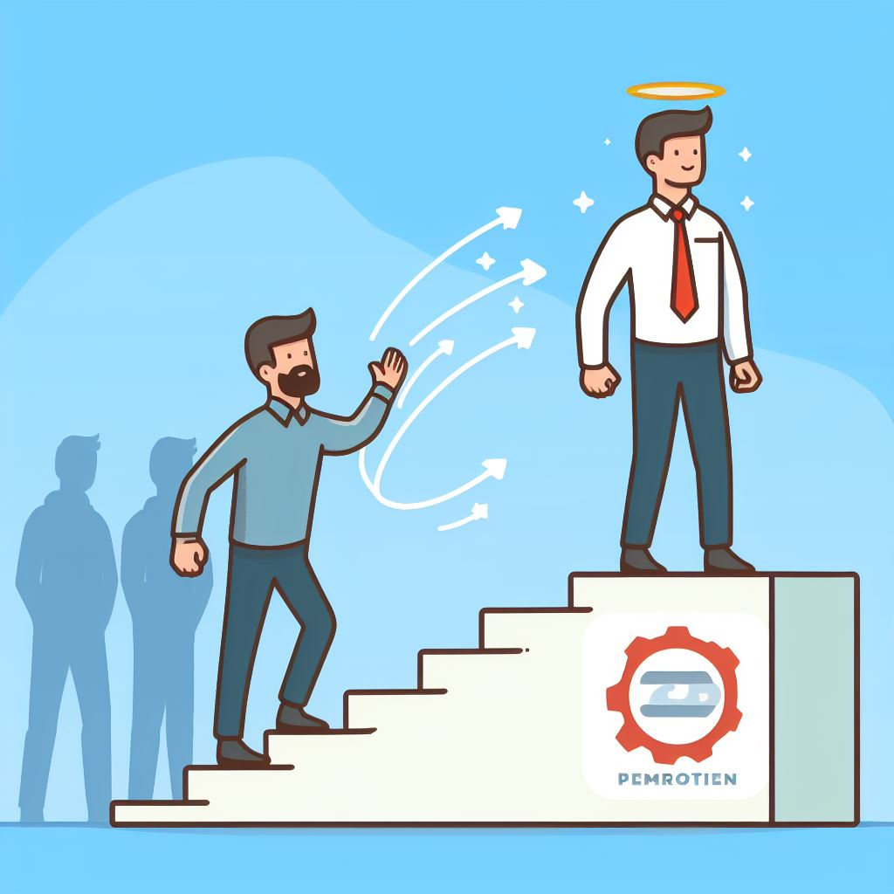

# De developer a líder: notas y libros sugeridos

<button class="back-button" onclick="window.location.href='https://matiaspakua.github.io/tech.notes.io'">All notes</button>

Estas son algunas notas de una Masterclass en la que participé recientemente. En esta reunión, el orador comparte algunos aspectos clave a tener en cuenta cuando un Desarrollador Senior es promovido (o pretende construir un camino hacia un rol de gestión de ingeniería) a un rol gerencial.

## Aspecto clave a tener en cuenta

### Aspecto #1: Entender el nuevo rol

Aprender a gestionar el "tiempo" y la "tarea" del nuevo rol. Cuando este cambio se está dando, se te asigna un nuevo título: "Líder de un equipo de tecnología", lo que implica: "obtener el mejor rendimiento del equipo, orientado a los objetivos principales de la empresa/startup".

Con todas estas consideraciones e implicaciones, gestionar tu tiempo se vuelve fundamental para el éxito.

Una recomendación para planificar el tiempo es la siguiente:

* **Desarrollo** => 20% (solo desarrollo de soporte, mentoría, revisión de pares, revisión de arquitectura, soporte de alto nivel)
* **Producto** => 30% (visión del producto, hoja de ruta, estrategia, arquitectura del sistema)
* **Liderazgo** => 50% (la mayor parte del tiempo debe centrarse en tareas de liderazgo: uno a uno, plan de carrera, incorporación, resolución de conflictos)

### Aspecto n.° 2: Adaptar tu agenda al nuevo rol

Adaptar tu agenda diaria anterior/actual implica un cambio en tus responsabilidades y prioridades. Esto significa con más detalle:

1. **Liderazgo y tutoría:** En un rol superior, se espera que proporciones orientación y tutoría a los miembros de tu equipo. Esto significa asignar tiempo para reuniones individuales, revisiones de código y abordar sus inquietudes. Una gran referencia para el liderazgo es el libro "<mark style="background: #FFF3A3A6;">Leaders Eat Last" de Simon Sinek.
</mark>
2. **Gestión de proyectos:** Serás responsable de la planificación del proyecto, la programación y la garantía de que el equipo alcance sus objetivos. "<mark style="background: #BBFABBA6;">Scrum: The Art of Doing Twice the Work in Half the Time" de Jeff Sutherland </mark>es un excelente recurso sobre gestión de proyectos ágiles.

3. **Pensamiento estratégico:** Tu agenda debe incluir tiempo para el pensamiento estratégico. Esto podría implicar establecer objetivos a largo plazo, seleccionar tecnología y alinear el trabajo del equipo con los objetivos de la organización. "<mark style="background: #BBFABBA6;">Good Strategy Bad Strategy" de Richard Rumelt</mark> es una lectura obligada para el pensamiento estratégico.

4. **Comunicación:** La comunicación eficaz se convierte en una parte fundamental de tu función. Deberás comunicarse con las partes interesadas, los superiores y su equipo. El libro <mark style="background: #FFF3A3A6;">"Crucial Conversations" de Kerry Patterson</mark> ofrece información valiosa sobre la comunicación eficaz.

5. **Gestión del tiempo:** A medida que asumís más responsabilidades, la gestión eficaz del tiempo es crucial. Es posible que desee leer <mark style="background: #ADCCFFA6;">"Getting Things Done" de David Allen</mark> para obtener técnicas prácticas.

6. **Delegación:** Debe asignar tareas a los miembros del equipo de acuerdo con sus puntos fuertes y brindarles la autonomía para completarlas.<mark style="background: #FFF3A3A6;"> "Drive" de Daniel H. Pink</mark> es un gran recurso sobre motivación y delegación.

7. **Resolución de conflictos:** Estar preparado para manejar los conflictos dentro de tu equipo. <mark style="background: #ADCCFFA6;">"Crucial Conversations" y "Difficult Conversations" </mark>de Douglas Stone, Bruce Patton y Sheila Heen son excelentes referencias para gestionar conflictos.

8. **Aprendizaje y desarrollo de habilidades:** El aprendizaje continuo es clave. Asignar tiempo para mantenerse actualizado con las tendencias de la industria y las nuevas tecnologías. Para esto, considerar recursos como cursos en línea en plataformas como Coursera y edX, o servicios de suscripción como Safari Books Online.

9. **Medición y retroalimentación:** Implementar métricas y mecanismos de retroalimentación para realizar un seguimiento del progreso del equipo. <mark style="background: #FFF3A3A6;">"Measure What Matters" de John Doerr </mark>es un recurso valioso sobre este tema.

10. **Conciencia cultural y organizacional:** Comprender la cultura y los valores de tu organización y asegúrese de que tu equipo se alinee con ellos. <mark style="background: #FFF3A3A6;">"The Culture Code" de Daniel Coyle</mark> es un libro útil en este contexto.
### Aspecto n.° 3: Hacer un adecuado onboarding del nuevo rol

Hacer un buen onboarding en tu nuevo rol a medida que realiza la transición a un puesto superior en el campo de la ingeniería de software es clave. Significa tener un proceso estructurado y completo implementado para ayudarte a integrarte sin problemas en tus nuevas responsabilidades. Esto implica:

1. **Introducción a la empresa y la cultura:** Debes recibir una introducción detallada a los valores, la misión y la cultura de la empresa. Comprender el espíritu de la empresa es fundamental para alinear tus acciones con sus objetivos. Esta información puede proporcionarse en forma de documentos, presentaciones o reuniones.

2. **Comprensión del nuevo rol:** Debe recibir documentación o capacitación clara que describa las responsabilidades, expectativas e indicadores clave de desempeño de su nuevo rol. Esto podría incluir descripciones y objetivos laborales específicos del rol.

3. **Reuniones con las partes interesadas clave:** Un proceso de incorporación debe incluir reuniones con las partes interesadas clave, como su gerente directo, pares y subordinados, si corresponde. Estas reuniones brindan información sobre las expectativas y la dinámica dentro de su equipo y ayudan a establecer relaciones laborales.

4. **Capacitación técnica:** Si el nuevo rol implica tecnologías o herramientas con las que aún no te has familiarizado, la incorporación debe incluir capacitación técnica o acceso a recursos como cursos en línea, documentación o tutoría. En última instancia, deberás ser pro-activo y autocapacitarte si fuera necesario.

5. **Capacitación sobre procesos y flujos de trabajo:** Comprender los procesos, flujos de trabajo y métodos de gestión de proyectos de la empresa es fundamental. Deberás recibir capacitación o documentación sobre cómo se hacen las cosas, incluidas herramientas y metodologías como Agile, Scrum o DevOps. Nuevamente, si esto no fuera posible o no existe, no hay nada mejor que ser proactivo y ser uno mismo quien cree/mapee estos flujos.

6. **Acceso a recursos:** Tenes que asegurarte de tener acceso a los recursos necesarios, incluidos software, hardware y permisos de acceso para desempeñar tu función de manera eficaz.

7. **Organigrama:** Recibir o armar un organigrama actualizado que muestre la jerarquía del departamento o área y la organización en general, así como la información de contacto de las personas clave.

8. **Establecimiento de expectativas:** Tu gerente debe comunicarle claramente sus expectativas con respecto a tu desempeño, la entrega del proyecto y cualquier indicador o meta clave de desempeño. También es importante analizar el cronograma para lograr estas expectativas.

9. **Mecanismos de retroalimentación:** Saber cómo y cuándo se realizarán las evaluaciones de desempeño. Comprender los procesos de retroalimentación y revisión de la empresa, incluidas las revisiones de pares o la retroalimentación de 360 ​​grados.

10. **Mentoría y orientación:** Si es posible, que se asigne un mentor o compañero que pueda guiarte a través de las fases iniciales de su nuevo rol. Esta persona puede brindar información, responder preguntas y ofrecer apoyo.

11. **Políticas y cumplimiento de la empresa:** Revisar y comprenda las políticas y pautas de la empresa, especialmente aquellas relacionadas con el cumplimiento, la seguridad y los estándares éticos.

12. **Desarrollo profesional:** Informarte sobre las oportunidades de desarrollo profesional, incluidas capacitaciones, talleres, conferencias o certificaciones o construir tu propio path de desarrollo personal.

13. **Período de prueba (modo de prueba):** Si tu nuevo puesto incluye un período de prueba, comprenda su duración, objetivos y criterios de evaluación.

14. **Documentación y recursos:** El acceso a un repositorio centralizado de documentación relevante, mejores prácticas y recursos relacionados con tu puesto puede ser extremadamente valioso, sino: CREARLO, se pro-activo. Aplicar la técnica del boy-scout: siempre dejar el lugar de acampe mejor que como lo encontramos.

15. **Rollback**: Es una buena práctica analizar la posibilidad de un "rollback" a tu puesto anterior durante tu incorporación. Esta opción debe explorarse en determinadas condiciones, como si la transición al nuevo puesto no es exitosa o si queda claro que el puesto no es el adecuado. Los términos y condiciones de una "rollback" deben definirse claramente durante la incorporación, incluido el plazo dentro del cual se puede ejercer esta opción y los criterios para tomar esta decisión.

Un proceso de incorporación bien estructurado puede facilitar significativamente la transición a su nuevo puesto y preparar el terreno para el éxito. Es importante participar activamente en el proceso de onboarding, hacer preguntas, pedir aclaraciones cuando sea necesario y brindar comentarios para ayudar a mejorar el proceso para los futuros empleados.
### Aspecto n.° 4: Consideraciones para los primeros días

1. **Conocer y saludar:** Dedica tiempo a conocer a tu equipo, a tus compañeros y a tus subordinados. Establecer relaciones es esencial para un liderazgo eficaz.

2. **Escuchar:** Escucha más de lo que hablas. Comprende los desafíos, las preocupaciones y las aspiraciones de los miembros de tu equipo. Mantén reuniones individuales para recopilar información.

3. **Entender los proyectos actuales:** Hazte una idea de los proyectos en curso y su estado. Familiarízate con la carga de trabajo y las prioridades actuales del equipo.

4. **Cultura de la empresa:** Observa y comprende la cultura y los valores de la empresa. Asegúrate de que tus acciones se alineen con estos principios.

5. **Visión y objetivos:** Aclara tu visión para tu equipo y los proyectos bajo tu responsabilidad. Establece objetivos a corto y largo plazo.

6. **Evaluar las habilidades y las carencias:** Evalúa las habilidades y la experiencia de los miembros de tu equipo. Identifique las brechas de habilidades que se deben abordar.

7. **Mecanismos de retroalimentación:** Establecer mecanismos de retroalimentación para fomentar la comunicación abierta. Hágale saber a su equipo que su aporte es valioso.

8. **Delegue de manera responsable:** Delegar tareas y responsabilidades y proporcione expectativas y apoyo claros. Evitar la microgestión.

9. **Conozca los procesos de la empresa:** Comprender los procesos, flujos de trabajo y metodologías de gestión de proyectos de la empresa.

10. **Familiarización técnica:** Si tu nuevo rol implica nuevas tecnologías, dedique tiempo a familiarizarse con ellas. Esto puede implicar revisar la documentación o buscar capacitación.

11. **Reúnase con las partes interesadas:** Programar reuniones con las partes interesadas clave, como su gerente, para analizar las expectativas y los objetivos.

12. **Priorice tu tiempo:** Reconozca que tu tiempo es un recurso valioso. Priorizar las tareas y concéntrese en las actividades de alto impacto.

13. **Buscar mentoría:** Si está disponible, buscar mentoría de líderes experimentados dentro de la organización o de su red profesional.

14. **Formación de equipos:** Considerar actividades de formación de equipos para fomentar la colaboración y la cohesión.

15. **Revisar políticas y cumplimiento:** Revisar las políticas de la empresa, especialmente las relacionadas con el cumplimiento, la seguridad y los estándares éticos. Asegúrese de que su equipo conozca y respete estas políticas.

16. **Comunicación:** Ser claro y transparente en tu comunicación. Informe a su equipo sobre cualquier cambio o nueva dirección.

17. **Aprender y adaptarse:** Estar abierto a aprender de su equipo y a adaptarse al nuevo rol. <mark style="background: #FFF3A3A6;">No dudar en pedir orientación o apoyo</mark>.

18. **Gestionar las expectativas:** Establecer expectativas realistas para el desempeño de tu equipo y el tuyo propio. Está bien reconocer que habrá una curva de aprendizaje.

19. **Cuidado personal:** Asegúrese de cuidarse física y mentalmente. Los primeros días pueden ser exigentes, por lo que es importante mantener un equilibrio saludable entre el trabajo y la vida personal.

20. **Ciclo de retroalimentación:** Crear un ciclo de retroalimentación para mejorar continuamente tu liderazgo y el desempeño de tu equipo.

