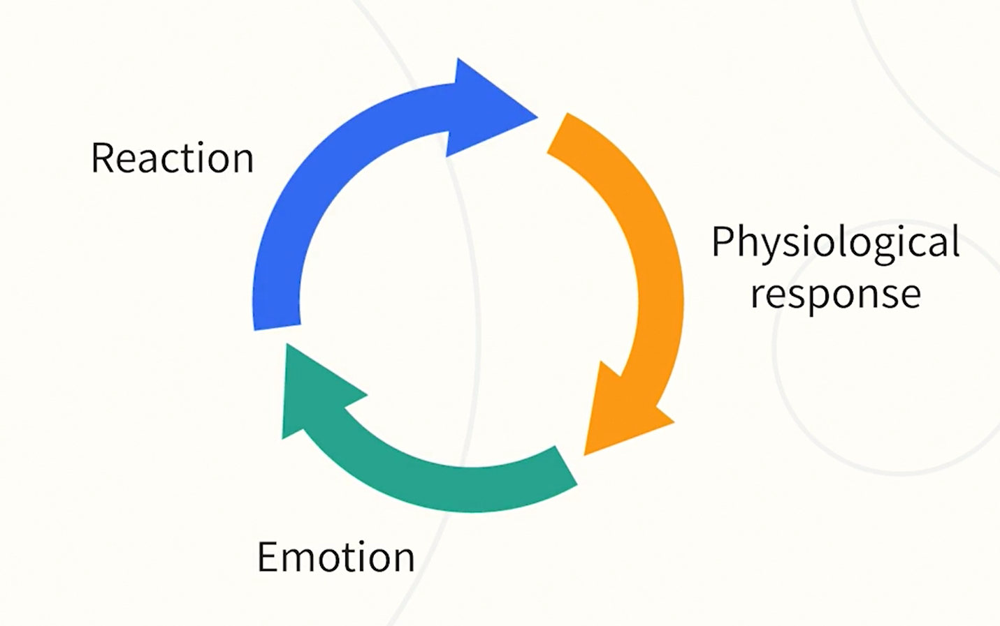

# Emotional Intelligence

<button class="back-button" onclick="window.location.href='https://matiaspakua.github.io/tech.notes.io'">All notes</button>

## Introduction

Emotional intelligence, or EQ, is the ability to be aware of your emotions and triggers, manage your emotional responses positively, understand what's going on around you, and use that information to build strong relationships.

- **Benefits of EQ**: Enhancing your EQ can improve personal performance, support wellbeing, build strong networks, foster meaningful relationships, reduce stress or anxiety, better manage responses to challenges, and help in achieving professional goals.

- **Changeability of EQ**: Unlike general intelligence or personality traits, levels of emotional intelligence can change over time, providing an opportunity to develop EQ to achieve desired results.

- **Four Quadrants of EQ**: The four quadrants of emotional intelligence are self-awareness, self-management, social awareness, and relationship management.

## Emotions

- **Nature of Emotions**: Emotions are complex constructs in our brain that guide our responses to events. They can vary in intensity and can be pleasant or unpleasant.
- **Individual Variation**: There is significant variation in emotional responses among individuals, and even within the same individual at different times.
- **Impact of Emotions**: Emotions can affect our behavior and relationships, and play a role in how we interpret the world.
- **Building Emotional Awareness**: The text suggests a practice of self-reflection, especially after challenging situations, to better understand and manage emotions.

## Managing your Minset

- **Information Processing**: Your brain is constantly processing a multitude of information from your surroundings and your body, even when you're not consciously aware of it.
- **Cognitive Shortcuts**: To avoid feeling overwhelmed, your brain uses cognitive shortcuts to focus on important information and make quick decisions.
- **Emotional Triggers**: Certain events or situations can trigger negative emotional responses, leading to unhelpful interpretations of the situation and potentially detrimental behavioral responses.
- **Self-Reflection**: It's beneficial to pause, reflect, and identify recurring emotional responses or thought patterns that may be hindering your progress or well-being.

## Finding your Flow

- **Concept of Flow**: Flow is a term from positive psychology. It refers to the state of being so absorbed in an activity that you enjoy and are good at, that time seems to stand still.
- **Benefits of Flow**: Working in a state of flow can enhance your performance, develop your skills, and support your psychological wellbeing. It can also help you tackle challenges effectively and increase your chances of reaching your potential.
- **Flow and Emotions**: Flow is a positive experience emotionally. It can lead to feelings of engagement, interest, and achievement, translating to positive emotions.
- **Reflection**: The text encourages reflection on what activities induce a state of flow for you, challenging and stretching you in a positive way.

--- 
<mark style="background: #FFB86CA6;">**Exercise**: Which are you flow activities?</mark>

 - Analysis and design of a problem to solve. 
 - Diagram or think in the architecture or a system.

---

