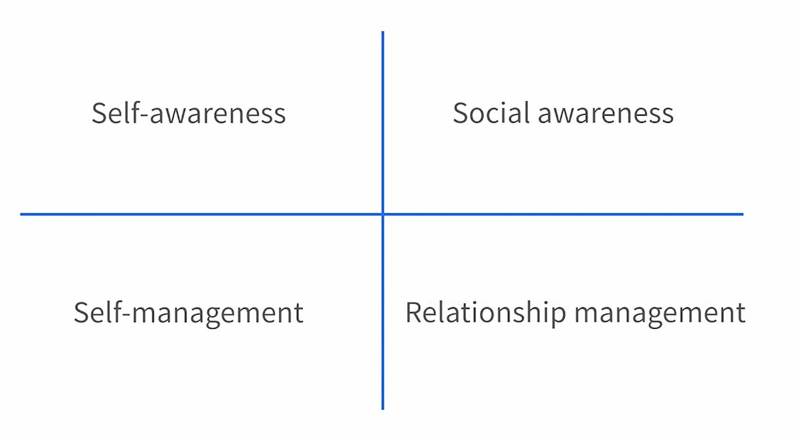
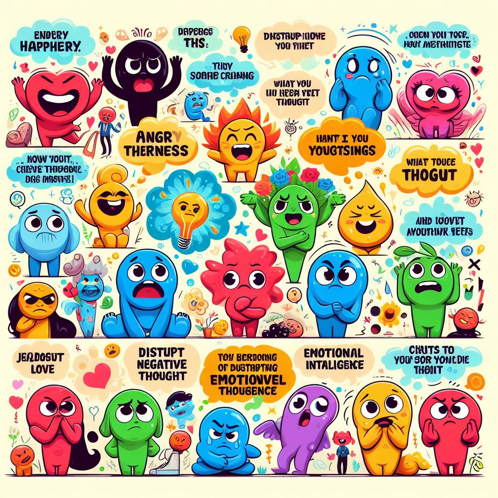
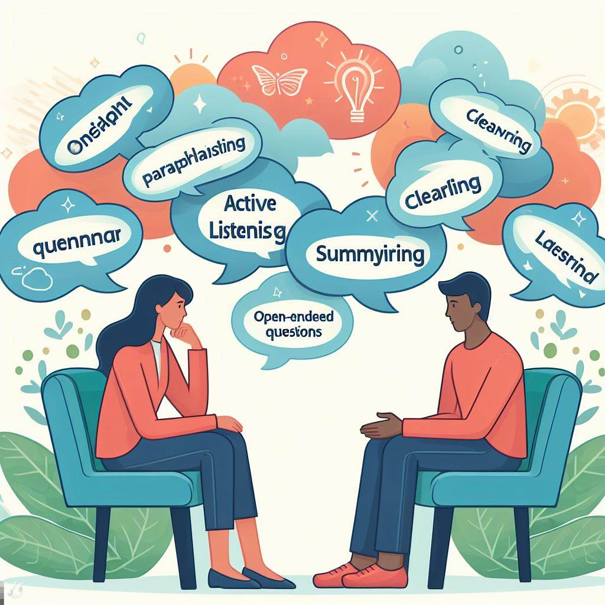

# Emotional Intelligence

<button class="back-button" onclick="window.location.href='https://matiaspakua.github.io/tech.notes.io'">All notes</button>

## Introduction

Emotional intelligence, or EQ, is the ability to be aware of your emotions and triggers, manage your emotional responses positively, understand what's going on around you, and use that information to build strong relationships.

- **Benefits of EQ**: Enhancing your EQ can improve personal performance, support wellbeing, build strong networks, foster meaningful relationships, reduce stress or anxiety, better manage responses to challenges, and help in achieving professional goals.

- **Changeability of EQ**: Unlike general intelligence or personality traits, levels of emotional intelligence can change over time, providing an opportunity to develop EQ to achieve desired results.

- **Four Quadrants of EQ**: The four quadrants of emotional intelligence are self-awareness, self-management, social awareness, and relationship management.

### Quadrants of EQ

|

## 1. Being Self-Aware

### Emotions

- **Nature of Emotions**: Emotions are complex constructs in our brain that guide our responses to events. They can vary in intensity and can be pleasant or unpleasant.
- **Individual Variation**: There is significant variation in emotional responses among individuals, and even within the same individual at different times.
- **Impact of Emotions**: Emotions can affect our behavior and relationships, and play a role in how we interpret the world.
- **Building Emotional Awareness**: practice of self-reflection, especially after challenging situations, to better understand and manage emotions.

### Managing your Mindset

- **Information Processing**: Your brain is constantly processing a multitude of information from your surroundings and your body, even when you're not consciously aware of it.
- **Cognitive Shortcuts**: To avoid feeling overwhelmed, your brain uses cognitive shortcuts to focus on important information and make quick decisions.
- **Emotional Triggers**: Certain events or situations can trigger negative emotional responses, leading to unhelpful interpretations of the situation and potentially detrimental behavioral responses.
- **Self-Reflection**: It's beneficial to pause, reflect, and identify recurring emotional responses or thought patterns that may be hindering your progress or well-being.

### Finding your Flow

- **Concept of Flow**: Flow is a term from positive psychology. It refers to the state of being so absorbed in an activity that you enjoy and are good at, that time seems to stand still.
- **Benefits of Flow**: Working in a state of flow can enhance your performance, develop your skills, and support your psychological wellbeing. It can also help you tackle challenges effectively and increase your chances of reaching your potential.
- **Flow and Emotions**: Flow is a positive experience emotionally. It can lead to feelings of engagement, interest, and achievement, translating to positive emotions.
- **Reflection**: on what activities induce a state of flow for you, challenging and stretching you in a positive way.

--- 
<mark style="background: #FFB86CA6;">**Exercise**: Which are you flow activities?</mark>

 - Analysis and design of a problem to solve. 
 - Diagram or think in the architecture or a system.

---

## 2. Managing Your Self

### Disrupting thoughts and emotional intelligence

The <mark style="background: #FFF3A3A6;">ABCDE model from cognitive behavioral coaching methodology</mark>, is a step-by-step process to manage challenges and emotions:

- **Activating Event**: The situation you’re in.
- **Beliefs**: Your thoughts and emotional responses to the event.
- **Consequences**: The outcome of your response to the event.
- **Disrupting Thought**: Replacing your beliefs and feelings about the event with more useful ones for a better result.
- **Effect**: The outcome of changing your beliefs, feelings, and potentially your emotions about the situation.

Take importance of <mark style="background: #FFF3A3A6;">being objective</mark> when describing the event and considering your beliefs about it. The goal is to disrupt negative or unhelpful beliefs and observe the effect of this change on the situation.

### Dealing with stressful situations

- **Emotional Impulse**: Acting on emotional impulse means being led by emotions, which can be both positive and negative. The outcome depends on the situation and the type of emotion.

- **Reaction Time**: The time between experiencing a thought, feeling, and responding can be quick. Slowing down reaction time is key to managing emotional responses.

- **Steps to Manage Emotions**:
    - **Step 1**: Identify when you’re reacting emotionally and feel that you could be more objective.
    - **Step 2**: When emotions such as anger or fear arise, take a step back and give yourself some breathing space. Regulate your breathing with deep, long breaths.
    - **Step 3**: Give yourself time to recover and let your body settle. Avoid making decisions until your emotions have settled.
    - **Finally**: Choose how you will respond. You may stick with your initial reaction or decide on an alternative approach. The key is to give yourself time to consider your response.

### Shift perspective to shape behavior

- **Open-mindedness**: Encourages seeing things from different points of view, which can lead to new learnings and better understanding of situations.

- **Active Seeking**: Suggests actively seeking out alternative opinions and arguments, which can lead to innovative approaches to challenges.

- **Questioning and Listening**: Recommends asking more questions and listening to others’ views to broaden perspective and build relationships.

- **Networking**: Advocates spending time with new people outside of one’s normal peer group to gain different perspectives.

- **Reading**: Stresses the importance of reading broadly and continuously learning to explore alternative points of view. Even a simple routine of reading during commute or before bed can help.

- **Outcome**: The ability to broaden personal perspective is a common skill displayed by high performing individuals. It helps in making informed decisions and building successful relationships.

## 3. Social Awareness

- **Emotional Intelligence**: Developing self-awareness and social awareness is crucial for enhancing emotional intelligence. This involves understanding how you process information and applying it to build collaborative and rewarding relationships.
- **Sensory Audit**: A sensory audit, where you focus on what you see, hear, and feel, can help develop social awareness. This involves paying attention to the details of your surroundings and using your senses to process information about others.
- **Interpersonal Dynamics**: By observing facial expressions, body language, and tone of voice, you can gain insights into what people are thinking and the dynamics between people.
- **Mindfulness**: The technique requires mindfulness and practice to step outside of oneself and immerse in the surroundings. It’s about noticing the information that is often in front of us but overlooked due to juggling various demands, priorities, and emotions.

### Looking past empathy: Connecting with perspective

- **Empathy and Emotional Intelligence**: Empathy, the ability to understand and share the feelings of others, is often seen as a key component of emotional intelligence. However, for some people, particularly those who are neurodivergent, empathizing can be challenging or emotionally draining.
- **Understanding Perspectives**: shifting the focus from empathy to understanding perspectives. This involves acknowledging and respecting others’ views without necessarily feeling their emotions.
- **Active Exploration**: It encourages active exploration of others’ perspectives during interactions, asking questions to learn more, and avoiding assumptions about others’ experiences.
- **Preparation**: Before interacting with others, it’s beneficial to remind oneself of the intention to understand the other person’s perspective and to reflect on what is already known about them.

### Listen to improve social awareness

- **Effective Communication**: Communication is a two-way process involving both providing and gathering information. <mark style="background: #FFF3A3A6;">The key to effective communication is listening.</mark>
- **Building Relationships**: Listening to others, including their words, tone, and body language, is crucial for building effective and strong relationships.
- **Understanding Others**: By listening and interpreting the other person’s message, you can find a strong middle ground, build a collaborative relationship, and find solutions when facing challenges.
- **Improving Listening Skills**: Reflect on your communication style and if you’d like to improve your listening skills, there are practical ways to do this, such as noting what you would like to learn before heading into meetings.

## 4. Managing Relationships

### Authentic adaptability

- **Communication Strengths**: <mark style="background: #FFF3A3A6;">Being authentic and playing to your communication strengths can make others feel comfortable around you</mark>, helping to build trust over time. It’s important to be aware of your natural communication style and flex it as needed.
- **Adaptability**: <mark style="background: #FFF3A3A6;">There are times when you need to adapt your communication style, especially in different circumstances.</mark> This could involve changing your tone depending on the energy level of the person you’re communicating with.
- **Self-awareness**: Reflecting on your communication strengths, such as clear messaging, active listening, and making genuine connections, can help you improve. If unsure, seek feedback from others.
- **Mindful Communication**: A<mark style="background: #FFF3A3A6;">lways communicate in a way that aligns with your values and feels genuine to you</mark>. Be mindful of communicating in a way that ensures you’re heard and understood by the other person. This could involve matching energy levels, tone of voice, or mirroring body language.

### EQ and positive conflict management

- **Healthy Conflicts**: Healthy conflicts at work can spark debates, helping people to consider alternative perspectives and often resulting in teams pushing the boundaries of what is achievable.
- **Respectful Challenges**: Creating environments where people can respectfully challenge ideas, perspectives, and opinions creates a healthy culture.
- **Emotional Intelligence**: Emotional intelligence plays a key role in managing conflict in a positive way.
- **Rules of Engagement**: Agreeing on the rules of engagement with team members, such as what constitutes a healthy debate and how to address challenges, can help create a robust support system.
- **Conflict Management**: Although conflict can be challenging to navigate, it’s a crucial part of the continuous improvement process. Managing differences of opinion can strengthen relationships when done well.

### Communicate intention and impact

- **Perception and Impact**: How you come across to others may not align with your intentions. The impact you make is more about how others perceive you and your message.
- **Adaptability in Communication**: Being adaptable and flexible in communication is key. Instead of focusing on the exact message, concentrate on the intention and what you want the other person to take away from the interaction.
- **Understanding Intentions**: If people understand your intentions, even if the execution isn’t perfect, they’re more likely to engage with you, leading to trust-building.
- **Confidence and Authenticity**: Focusing on intent can boost your confidence and help you come across as natural and authentic. It also provides the freedom to make mistakes, as long as you can explain your intentions.