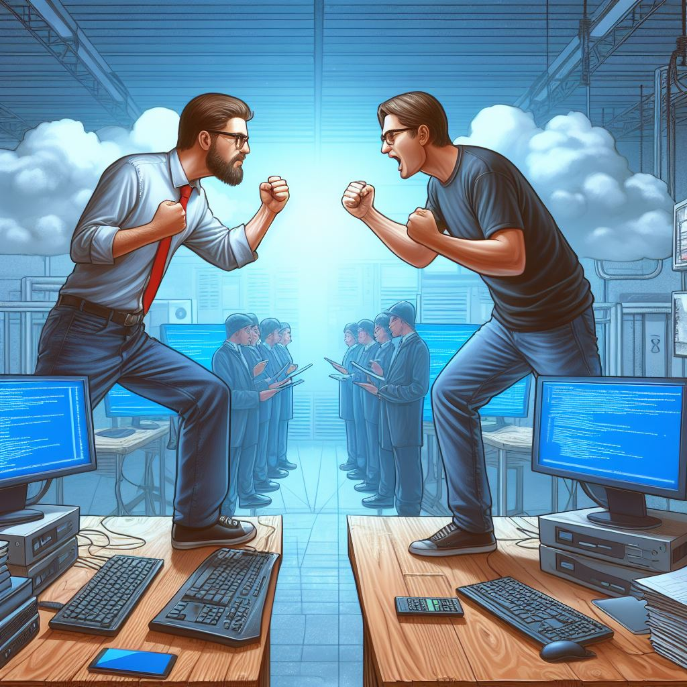

# Curso Resolución de Conflictos

<button class="back-button" onclick="window.location.href='https://matiaspakua.github.io/tech.notes.io'">All notes</button>

# Introducción

**Que es un conflicto**? En términos generales, un conflicto es una situación en la cual dos o más personas con intereses distintos entran en confrontación, oposición o emprenden acciones mutuamente antagonistas, con el objetivo de dañar, eliminar a la parte rival o arrebatarle poder de algún tipo en favor de la propia persona o grupo.

**Según la RAE**: Combate, lucha, pelea. Apuro, situación desgraciada y de difícil salida. Problema, cuestión, materia de discusión. 

Sobre todo, un conflicto es un "<mark style="background: #FFF3A3A6;">rasgo de las relaciones humanas</mark>".

Un conflicto, además de su definición tiene otros componentes:

![[conflictos.canvas]]

## Utilidad de los conflictos

Los conflictos son útiles y se consideran funcionales, siempre y cuando, exista un compromiso para alcanzar una resolución.

1. Evita estancamiento (social, personal, profesional)
2. Estimula intereses
3. Origina cambios
4. Establece indentidad
5. Enseñan a enfrentar problemas
6. Crear relaciones interpersonales mejores y más duraderas
7. Permiten que nos conozcamos mejor a nosotros mismos.

