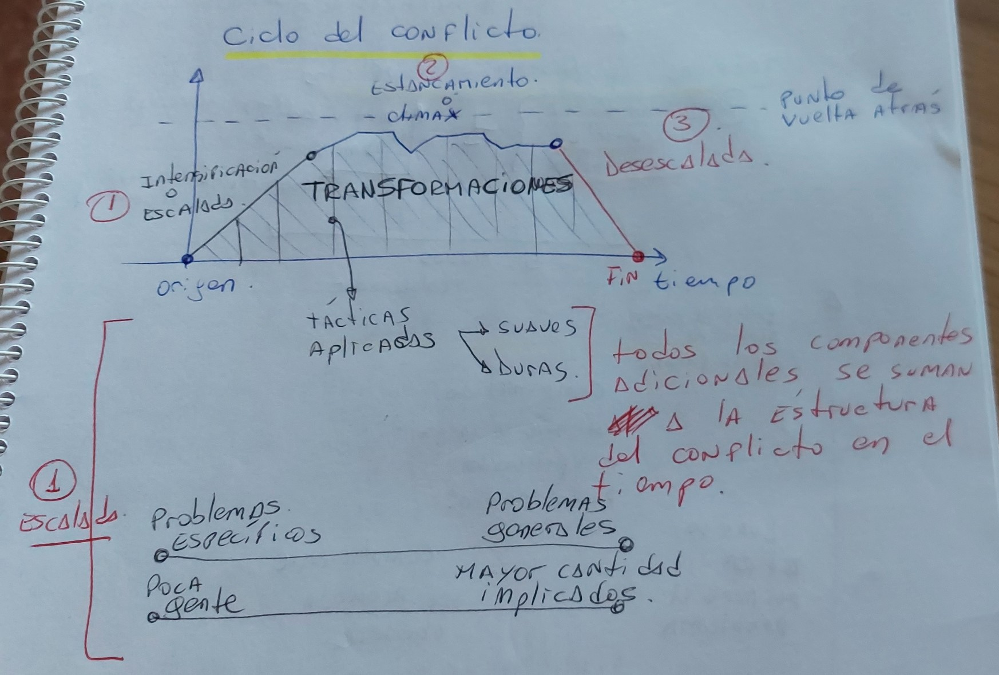
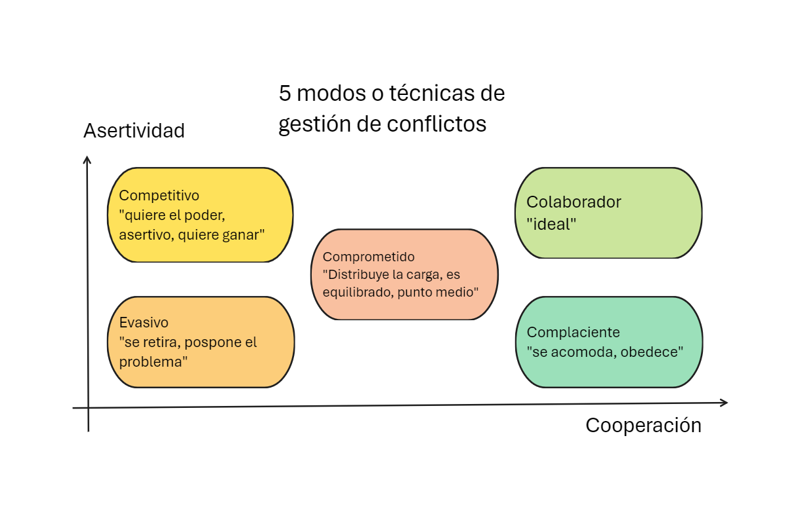

# Curso Resolución de Conflictos

<button class="back-button" onclick="window.location.href='https://matiaspakua.github.io/tech.notes.io'">All notes</button>
---

# Introducción

**Que es un conflicto**? En términos generales, un conflicto es una situación en la cual dos o más personas con intereses distintos entran en confrontación, oposición o emprenden acciones mutuamente antagonistas, con el objetivo de dañar, eliminar a la parte rival o arrebatarle poder de algún tipo en favor de la propia persona o grupo.

**Según la RAE**: Combate, lucha, pelea. Apuro, situación desgraciada y de difícil salida. Problema, cuestión, materia de discusión. 

Sobre todo, un conflicto es un "<mark style="background: #FFF3A3A6;">rasgo de las relaciones humanas</mark>".

Un conflicto, además de su definición tiene otros componentes:

![[conflictos.canvas]]

## Utilidad de los conflictos

Los conflictos son útiles y se consideran funcionales, siempre y cuando, exista un compromiso para alcanzar una resolución.

1. Evita estancamiento (social, personal, profesional)
2. Estimula intereses
3. Origina cambios
4. Establece identidad
5. Enseñan a enfrentar problemas
6. Crear relaciones interpersonales mejores y más duraderas
7. Permiten que nos conozcamos mejor a nosotros mismos.

## Aproximación a los conflictos

Un persona tiene una determinada capacidad de aproximación a un conflicto, dado su contexto personal y social. Asi como un mapa no es la verdadera representación de un territorio, sino una "abstracción", un conflicto es una abstracción que debe ser mapeada con diferentes abstracciones para ser trabajado. Aquí entra en juego las técnicas de resolución de conflictos, como por ejemplo la Negociación.

Las <mark style="background: #FFF3A3A6;">Personas</mark> ante un ==> "<mark style="background: #FFF3A3A6;">conflicto</mark>" ==> actuamos según un <mark style="background: #FFF3A3A6;">estilo de comportamiento</mark>.

El estilo de comportamiento depende de:
 1. La relación entre las partes.
 2. El asunto del conflicto.

De estos aspectos se desprenden 5 tipos de comportamientos:

| Estilo Acomodativo                                                                            | Estilo Colaborador                                                                                           | Estilo Evitador                                                                                                                                           | Estilo Controlador                                                                                                 | Estilo Compromisario                                                                                                         |
| --------------------------------------------------------------------------------------------- | ------------------------------------------------------------------------------------------------------------ | --------------------------------------------------------------------------------------------------------------------------------------------------------- | ------------------------------------------------------------------------------------------------------------------ | ---------------------------------------------------------------------------------------------------------------------------- |
| + compromiso con la relación                                                                  | + compromiso relación                                                                                        | - compromiso relación                                                                                                                                     | + Interés en el asunto                                                                                             | - Interés en la relación                                                                                                     |
| - compromiso con los intereses.                                                               | + compromiso intereses                                                                                       | - compromiso intereses                                                                                                                                    | + Interés en ganar o influir                                                                                       | - No invierte tiempo ni dinero ni energia                                                                                    |
| <mark style="background: #FFB86CA6;">Se valora + la relación que el tema en conflicto.</mark> | <mark style="background: #FFB86CA6;">Motivado para alcanzar resultados satisfactorios en ambas partes</mark> | <mark style="background: #FFB86CA6;">Re-evalua la situación porque es poco probable encontrar una solución. Elige "posponer" o buscar un mediador.</mark> | <mark style="background: #FFB86CA6;">El tiempo es un factor crítico y se debe tomar una decisión inmediata.</mark> | <mark style="background: #FFB86CA6;">Puede aceptar y tener desencanto con el acuerdo y dejar cuestiones sin resolver.</mark> |

## Tipos de Conflictos

1. **Relaciones**: emociones negativas, mala comunicación, malas expectativas.
2. **Información**: falta de información, desinformación, ocultamiento.
3. **Valores**: creencias incompatibles (bueno, malo). Aquí es importante destacar que la imposición de valores (propios) puede generar conflictos.
4. **Intereses**: Competición de necesidades. Se asocia generalmente a cuestiones sustanciales (recursos, dinero, tiempo).
5. **Conflicto Unilateral**: donde sólo una de las partes está inmersa en el conflicto.
6. **Conflicto Bilateral**: donde ambas partes tienen intereses distintos y con aspectos mucho más complejos.

## Aspectos que influyen en el conflicto.

1. Conflicto subyacente: se trata de aspectos íntimos y más personales. Asociados a la persona, sus vivencias y creencias. ==> "<mark style="background: #FFF3A3A6;">origen</mark>"
2. Conflicto Personal o Estructural: Generalmente causado a partir del conflicto subyacente. Se manifiesta con las relaciones entre las personas, las habilidades sociales y de comunicación.
3. Conflicto estructural. Asociado a los roles, las normas, malas relaciones de poder generalmente explican muchas de las tensiones.

# Resolución de conflictos

Para poder resolver conflictos hay que iniciar el proceso con dos elementos fundamentales:

1. Separar a las personas del "verdadero problema" o problema aparente.
2. Identificar la "causa raíz".

El inicio del análisis se basa en identificar:

1. asuntos: clarificar áreas de interés
2. intereses: descubrir necesidades subyacentes.
3. necesidades: identificar principios y valores
4. posiciones: identificar bandos, partes interesadas, contexto externo.

Luego de éste análisis preliminar surgirá que un conflicto es en esencia: <mark style="background: #FFF3A3A6;">GENUINO</mark> o <mark style="background: #FFB86CA6;">INNECESARIO</mark>.

Queda claro en éste punto, que se debe comenzar a trabajar en el conflicto GENUINO.

## Componentes del conflicto

## Ciclo del conflicto

Los componentes del ciclo de un conflicto son los siguientes:

1. **Identificación y escalada**: Se origina cuando se identifican problemas específicos y hay poca gente involucrada.
2. **Establecimiento**: Se aplican tácticas, y los problemas se vuelven más generales con una mayor cantidad de personas implicadas.
3. **Climax**: Es el punto máximo del conflicto donde ocurren transformaciones.
4. **Desescalada**: El conflicto comienza a disminuir en intensidad.
5. **Punto de no retorno**: El conflicto no puede volver a su estado original.

La  gráfica lineal que muestra la progresión del conflicto con puntos marcados para “identificación/escalada”, “establecimiento”, “clímax”, “desescalada” y “punto de vuelta atrás”.

Las causas de un estancamiento o el clímax pueden ser:

1. Fracaso en las tácticas aplicadas
2. Agotamiento de recursos, tácticas.
3. Perdida de apoyo
4. No se acepta el costo

En el des-escalamiento (que ocurre luego de haber llegado al punto límite) sucede lo siguientes:

1. Se incrementa la comunicación / contacto entre las partes.
2. Construcción de momentos (acción sobre los problemas).
3. Se establecen objetivos comunes.
4. Comienzan las iniciativas de conciliación individuales.

## Técnicas de Gestión de Conflictos

1. Transacción
2. Arbitraje
3. Negociación

Estas técnicas se relacionan además con el nivel de asertividad y cooperación, por lo tanto, combinando éstos factores, se reconocer 5 modos o tipos de técnicas.

### Técnica de transacción

Se trata de un acuerdo entre las partes, sin una mediación de un tercero. Las propiedades de una "transacción" son:

1. Consensual
2. Bilateral
3. Onerosa
4. Obligatoria

### Técnica de Arbitraje

Se recurre a una persona/entidad tercerizada, que actuará de mediador objetivo. Esta técnica generalmente es las recomendada cuando el conflicto entre las partes impide que el juicio objetivo de cada una se oriente a buscar una solución. Las características más importantes de ésta técnica son:

 1. Rapidez
 2. Especialización (del mediador / arbitro)
 3. Confidencialidad.

## El proceso de mediación

La mediación es un mecanismo que ya se comenzó a utilizar en China, Japón y Africa. Actualmente la "mediación" como concepto se aplica al mundo empresarial y judicial principalmente. Esta forma de aplicar la mediación comenzó en los años 60 en EEUU y luego en los años 70 en Europa.

## Beneficiarios de la mediación

El o los principales beneficiados en los procesos de mediación son: las persona y en general la sociedad.

1. Ventajas
	1. Agiliza la resolución de conflictos y acuerdos.
	2. disminuye la carga emocional
	3. tiene una mayor confidencialidad
	4. aumenta los compromisos de las partes
	5. es mucho más flexible
	6. produce acuerdos bilaterales
2. Desventajas:
	1. No voluntariedad
	2. Alguna de las partes puede obstaculizar el proceso
	3. dificultad en casos donde exista violencia
	4. asimetría de poder.