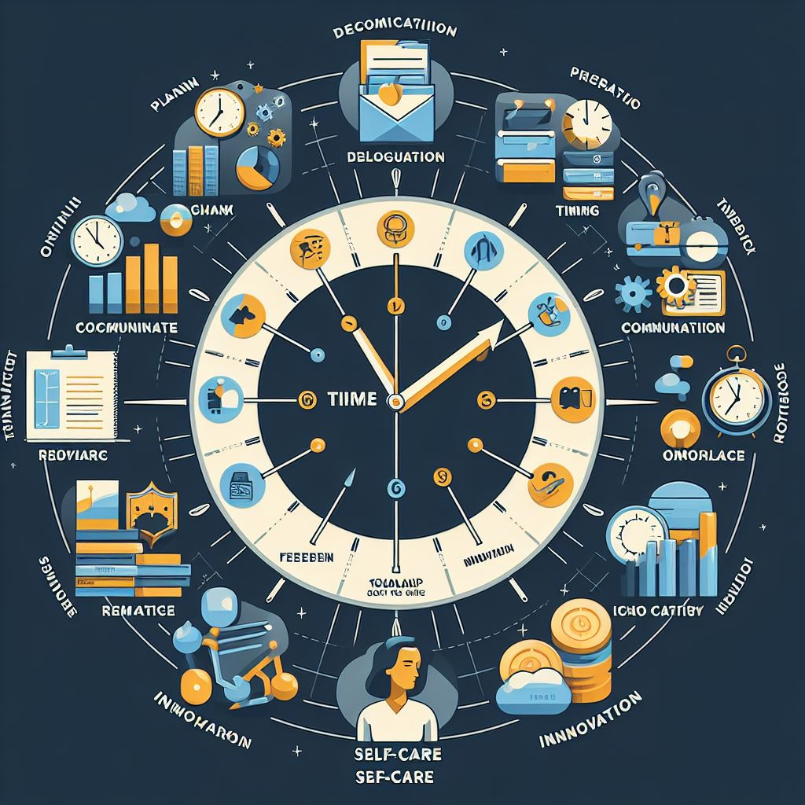
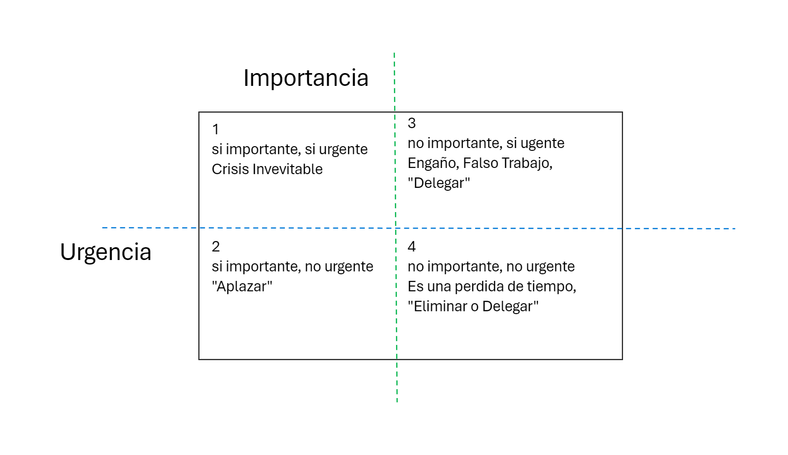
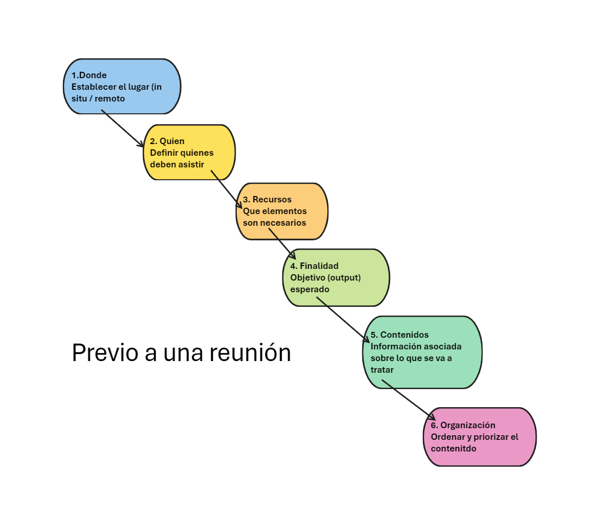
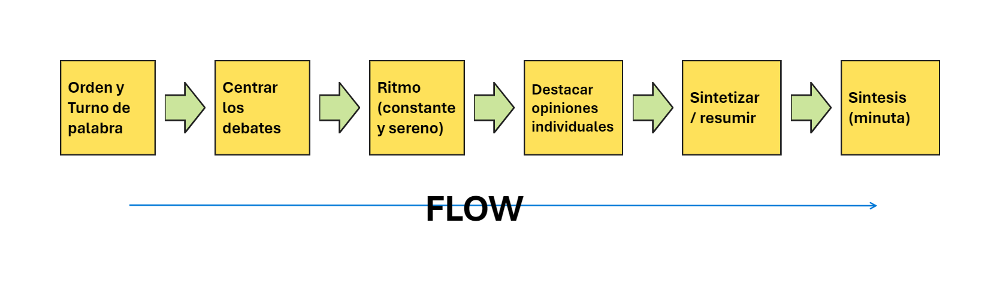
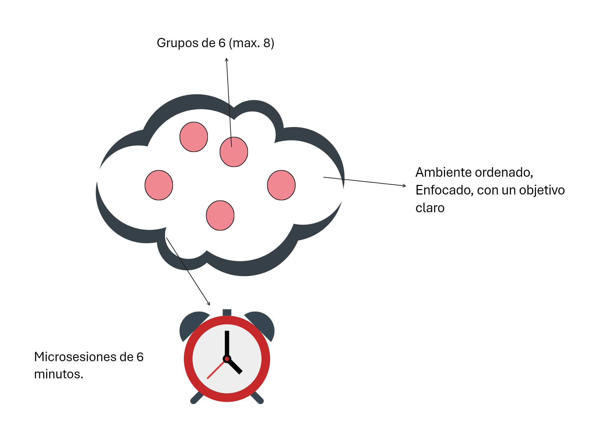
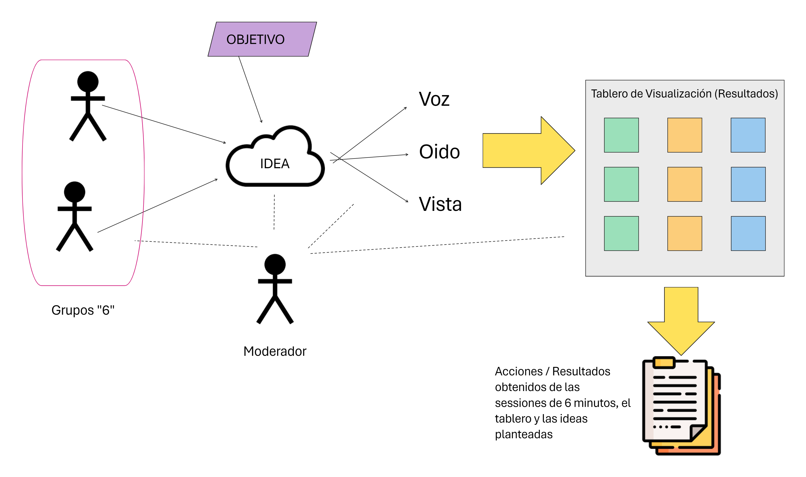
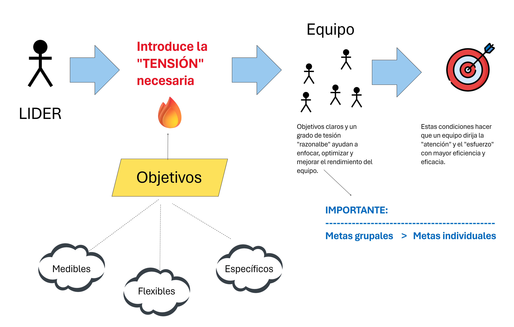

# Gestión del tiempo

<button class="back-button" onclick="window.location.href='https://matiaspakua.github.io/tech.notes.io'">All notes</button>

---

## Introducción

### Causas de la mala gestión

1. Mala gestión ==> conduce al stress
1. Muchos frentes de batalla abiertos (distracciones) + otras complicaciones

**1. Mala gestión:**

- **Falta de planificación:** No tener un plan claro para el día o la semana puede llevar a perder tiempo en tareas irrelevantes o dejar las importantes para último momento.
- **Priorización deficiente:** No saber distinguir entre lo urgente e importante puede hacer que se dediquen recursos a tareas que no impactan significativamente en los objetivos.
- **Procrastinación:** Posponer las tareas puede generar estrés y ansiedad, además de afectar la productividad.
- **Falta de organización:** Un espacio de trabajo desorganizado y un sistema de gestión de tareas ineficiente pueden consumir tiempo valioso.

**2. Muchos frentes de batalla abiertos (distracciones):**

- **Multitarea:** Intentar hacer varias cosas al mismo tiempo puede afectar la calidad del trabajo y reducir la productividad.
- **Interrupciones constantes:** Correos electrónicos, llamadas, notificaciones y otras interrupciones pueden desviar la atención y dificultar la concentración.
- **Reuniones innecesarias:** Asistir a reuniones que no son relevantes para el trabajo o que podrían ser un correo electrónico puede ser una pérdida de tiempo.
- **Redes sociales y otras distracciones digitales:** La constante revisión de redes sociales o plataformas de entretenimiento puede consumir tiempo valioso.

**3. Otras complicaciones:**

- **Falta de delegación:** Asumir todas las tareas y responsabilidades puede ser una carga excesiva y afectar la gestión del tiempo.
- **Exceso de carga de trabajo:** Tener más responsabilidades de las que se pueden manejar puede generar estrés y afectar la eficiencia.
- **Falta de herramientas adecuadas:** No contar con las herramientas y recursos necesarios para realizar las tareas de forma eficiente puede ralentizar el trabajo.
- **Problemas personales:** Dificultades en la vida personal pueden afectar la concentración y la productividad en el trabajo.

### Acciones para mejorar la gestión del tiempo 

1. Tomar conciencia de la situación
2. Formar la voluntad (propia)
3. Modificar tus hábitos

**1. Tomar conciencia de la situación:**

- **Analizar cómo se utiliza el tiempo:** Registrar las actividades durante un día o una semana para identificar las áreas donde se pierde tiempo.
- **Identificar las causas de la mala gestión del tiempo:** Reflexionar sobre los factores que dificultan la gestión del tiempo, como la falta de planificación o las distracciones.
- **Evaluar el impacto del estrés:** Reconocer cómo la mala gestión del tiempo afecta el nivel de estrés y la productividad.

**2. Formar la voluntad (propia):**

- **Establecer objetivos claros:** Definir metas específicas, medibles, alcanzables, relevantes y con un plazo determinado.
- **Desarrollar una actitud positiva:** Enfocarse en las soluciones y no en los problemas.
- **Cultivar la disciplina:** Ser constante en la aplicación de las estrategias de gestión del tiempo.

**3. Modificar tus hábitos:**

- **Planificar el día o la semana:** Crear un plan de trabajo que incluya las tareas prioritarias y los tiempos estimados.
- **Priorizar las tareas:** Distinguir entre lo urgente e importante y enfocarse en las tareas que impactan en los objetivos.
- **Aprender a decir no:** Evitar asumir responsabilidades innecesarias que puedan afectar la gestión del tiempo.
- **Eliminar las distracciones:** Desactivar notificaciones, silenciar el teléfono y trabajar en un espacio tranquilo.
- **Establecer límites de tiempo para las tareas:** Definir un tiempo específico para cada tarea y evitar la multitarea.
- **Delegar tareas:** Distribuir el trabajo entre el equipo y evitar sobrecargarse.
- **Utilizar herramientas de gestión del tiempo:** Agendas, aplicaciones de tareas, calendarios, etc.
- **Tomar descansos regulares:** Hacer pausas para descansar la mente y el cuerpo puede mejorar la concentración y la productividad.
- **Evaluar y ajustar el plan:** Revisar periódicamente el plan de gestión del tiempo y realizar ajustes según sea necesario.

### Gestión del tiempo en entornos competitivos

1. Lo importante aquí es armar una <mark style="background: #FFF3A3A6;">"Estrategia"</mark> ==> con unas "metas" claras a a) CORTO, b) MEDIANO c) LARGO plazo.

* Los principios del éxito para la gestión del tiempo:
1. <mark style="background: #FFF3A3A6;">Brújula</mark> ==> Planificación, tener un NORTE claro, un hilo conductor.
2. <mark style="background: #FFF3A3A6;">Reloj</mark> => Organización, orden, secuencialidad.

* Acciones para Planificar:
1. Recolectar, Organizar, listar, categorizar la información, eventos, tareas, TO-DO, etc.
2. Aplicar la regla de "Pareto" del 80/20. Priorizar el 20% de todo lo organizado con mayor prioridad que el resto 80%.

* Valor del tiempo
1. Se trata del único recurso limitado y en constante uso y (perdida)
2. Comenzar con la organización genera una "reacción en cadena"
3. Respeto, del tiempo propio y de los demás.
4. Ser muy atento de los "ladrones" del tiempo.
5. Evitar el "desorden".
  
## Programación Eficaz del Tiempo

Como primer paso es importante "priorizar", el siguiente cuadrante de prioridades puede ayudar:

### Planificación y ejecución eficaz

Establecer estrategias y planes premeditados.

**Planificación:**

- **Definir objetivos:** ¿Qué quieres lograr? ¿Cuáles son tus metas a corto, mediano y largo plazo?
- **Desarrollar un plan:** ¿Cómo vas a alcanzar tus objetivos? ¿Qué pasos debes seguir? ¿Qué recursos necesitas?
- **Priorizar tareas:** ¿Cuáles son las tareas más importantes? ¿Qué tareas puedes delegar o eliminar?
- **Establecer plazos:** ¿Cuándo debes completar cada tarea?

**Estrategias y planes premeditados:**

- **Utilizar herramientas de gestión del tiempo:** calendarios, agendas, aplicaciones, etc.
- **Establecer límites:** Aprende a decir no a las peticiones que te quitan tiempo.
- **Delegar tareas:** Distribuye el trabajo entre tu equipo.
- **Tomar descansos:** No intentes trabajar sin parar.
- **Aprender a decir no:** No te comprometas con más de lo que puedes hacer.

### Preparación y Fijación de objetivos

- Divide tus metas en objetivos más pequeños y manejables.
- Crea un plan de acción para alcanzar tus objetivos.
- Visualiza tu éxito.
- Mantén una actitud positiva y perseverante.

### Capacidad Anticipatoria y pensamiento complejo

**Capacidad Anticipatoria:**

La capacidad <mark style="background: #FFF3A3A6;">anticipatoria</mark> es la habilidad de predecir eventos futuros a partir de la información disponible en el presente. Esta habilidad se basa en la experiencia previa, el conocimiento del mundo y la capacidad de analizar datos y patrones.

**Pensamiento Complejo:**

El pensamiento complejo es la capacidad de <mark style="background: #FFF3A3A6;">comprender y analizar situaciones que tienen múltiples variables interconectadas.</mark> Este tipo de pensamiento requiere ser capaz de ver el panorama general, identificar las relaciones entre las diferentes partes del sistema y comprender las consecuencias de las acciones.

**Relación entre Capacidad Anticipatoria y Pensamiento Complejo:**

La capacidad anticipatoria y el pensamiento complejo están estrechamente relacionados. Para poder anticipar eventos futuros, es necesario tener una comprensión profunda de la situación actual y de las diferentes variables que pueden influir en el futuro. El pensamiento complejo nos permite analizar las diferentes posibilidades y tomar decisiones informadas.

**Ejemplos de Capacidad Anticipatoria y Pensamiento Complejo:**

- Un médico que diagnostica una enfermedad a partir de los síntomas del paciente.
- Un inversor que predice la tendencia del mercado de valores.
- Un político que desarrolla estrategias para resolver problemas sociales complejos.

**Habilidades para desarrollar la Capacidad Anticipatoria y el Pensamiento Complejo:**

- **Observación:** Prestar atención a los detalles y a las relaciones entre las diferentes partes de un sistema.
- **Análisis:** Identificar las variables relevantes y comprender cómo interactúan entre sí.
- **Síntesis:** Integrar la información de diferentes fuentes para obtener una comprensión completa de la situación.
- **Evaluación:** Juzgar las diferentes posibilidades y tomar decisiones informadas.
- **Creatividad:** Encontrar soluciones innovadoras a problemas complejos.

**Beneficios de la Capacidad Anticipatoria y el Pensamiento Complejo:**

- **Mejora la toma de decisiones:** Permite tomar decisiones más informadas y con mayor probabilidad de éxito.
- **Resolución de problemas:** Facilita la identificación de soluciones a problemas complejos.
- **Adaptabilidad:** Permite adaptarse mejor a los cambios y a las nuevas situaciones.
- **Innovación:** Favorece la creatividad y la innovación.

### Mejorar la administración del tiempo

1. Principio de delegación, saber delegar es un aspecto fundamental.
2. Reuniones de trabajo (se estima que entre un 30% hasta un 50% del tiempo en las empresas se dedica a reuniones)

Ahora <mark style="background: #FFF3A3A6;">¿para qué sirven las reuniones?</mark>. 

1. Difundir información y toma de decisiones son los dos mayores objetivos.
2. Intercambio de ideas, mejoras en la integración y compromiso (son los objetivos secundarios.)

## Reuniones

Estar siempre atento al "<mark style="background: #BBFABBA6;">peligro de REUNIONITIS</mark>" (las malas reuniones, recurrentes, obsesivas en cantidad y duración)

Existen una serie de criterios a tener en cuenta para mejorar las reuniones:
1. Tener una "orden del día"
2. Preguntarse si ¿Se puede evitar la reunión?
3. Generar un acta/minuta

### Tipos de Reuniones

1. Informativas
2. Formativas
3. Toma de decisiones

En cualquiera de los casos, el objetivo de "tener" reuniones es ==> Cumplir con determinados objetivos.

### Antes de la Reunión

Un ejemplo de un proceso y pasos a seguir puede ser el siguiente:

### Inicio de la Reunión

1. Puntualidad
2. Ver la orden del día
3. Establecer bien claro el "objetivo"
4. Claridad y precisión en el desarrollo
5. Priorización de los temas tratados

### Desarrollo de la Reunión

Mantener el foco constante en los siguientes dos aspectos:

1. <mark style="background: #FFF3A3A6;">Efectividad</mark>
2. <mark style="background: #BBFABBA6;">Comunicación</mark>

### Estrategias de conducción de Reuniones

### Finalización de una Reunión

Generar los siguientes artefactos:

1. Acta o minuta ==> MUY IMPORANTE.
2. Evaluar la reunión
3. En caso de existir Action Items, realizar un seguimiento y monitoreo sobre las acciones.

### Otros aspectos de las reuniones

1. **Dirección de Reuniones**: Aspectos al iniciar la reunión, finalizar, resumir lo hablado, gestionar los tiempos, gestionar la participación, realizar aclaraciones, votación en caso de ser necesario.
2. **Toma de Decisiones**: Existen distintas técnicas como el consenso, la votación, subgrupo, delegación.
3. **Dificultades comunes**: El silencio de los participantes, la desviación de la atención, un "saboteador" y las evasiones de los participantes.
4. **Técnicas de Conducción**: La reformulación es una buena herramienta para dar dinámica, también existe la re-estimulación donde se pretende "animar" a los participantes con diferentes propuestas: preguntas test, complemento,  puntos de vista, preguntas ECO, preguntas rebote, preguntas recuerdo.

### Dinámica 66 (Philips)

La dinámica 66, también conocida como "método Philips 66", es una técnica de dinámica de grupos que se utiliza para fomentar la participación activa y la generación de ideas en reuniones con un número elevado de participantes. Se basa en la organización del grupo en subgrupos de 6 personas que discuten un tema específico durante 6 minutos.

En estas dinámicas es conveniente que un moderador lleve el hilo conductor (lenguaje, tiempos, foco).

En éstas dinámicas se sugiere el uso de un tablero para la visualización de las ideas, propuestas, soluciones, etc. Tanto los objetivos y los temas a tratar deben ser bien aclarados y enfocados en todo momento. Finalmente, se deben generar "accionables" (notas, documentos, etc.) con los resultados de los análisis para poder llevar el registro de lo acordado y luego mantener un seguimiento, monitoreo o trazabilidad de ser necesario. Los artefactos generados son una importante fuente de conocimiento para luego poder comunicar información relevante.

## Trabajo en Equipo

1. Se trata de una capacidad <mark style="background: #BBFABBA6;">innata</mark> del ser humano.
2. Es una <mark style="background: #FFF3A3A6;">sumatoria</mark> de habilidades > habilidades individuales (es tanto una condición genética como un elemento social) 
3. Genera una <mark style="background: #FFF3A3A6;">Sinergia</mark>, comunicación y colaboración.

### Características

1. Personas unidas
2. Requiere de habilidades específicas y complementarias.
3. Tiene un objetivo y un propósito.
4. Requiere de compromiso y responsabilidad de parte de todos.

### Cuando "NO" funciona un equipo

<mark style="background: #BBFABBA6;">1.</mark> Falta de liderazgo.

<mark style="background: #BBFABBA6;">2. </mark>Objetivos mal definidos.

<mark style="background: #BBFABBA6;">3. </mark>Escasa o mala comunicación

<mark style="background: #BBFABBA6;">4. </mark>Desmotivación

<mark style="background: #BBFABBA6;">5. </mark>Complejidad (y falta de formación)

<mark style="background: #BBFABBA6;">6. </mark>Falta de reconocimiento.

<mark style="background: #BBFABBA6;">7. </mark>Falta de relación entre miembros del equipo.

### Características de "Buenos" Equipos

1. Grado de cohesión. Atracción y relación entre los miembros de los equipos; Resistencia a abandonar el equipo; interés en los objetivos y las metas.
2. Tienen una meta, objetivo y valores bien definidos. Generalmente trasladados desde la organización o creados orgánicamente (interno) en el equipo.
3. Equipo se caracteriza por cumplir con las siguientes características:
	a. Una organización interna clara.
	b. Funciones especificas o especialización.
	c. normas pre-establecidas
	d. Dirección (norte)
	e. Calendario de actividades, eventos y team-building.
	f. Respeto mutuo.
4. Hay <mark style="background: #FFF3A3A6;">medidores</mark> bien definidos (tanto interno como a nivel organizacional):
	a. Mecanismo de feedback.
	b. Recompensas ==> <mark style="background: #BBFABBA6;">IMPORTANTE</mark>
	c. Objetivos claros.

### Definición de Metas

### Planificación Eficaz

Para una planificación eficaz, se requiere de "buenos equipo" (o lo que comúnmente se conoce como equipos de "alto rendimiento"). Estos equipos se denominan EEE:

1. E => **Equilibrados**: habilidades, técnicas y motivación homogéneamente distribuidos.
2. E => **Eficaces**: gestión, organización, metas, procesos.
3. E => **Energéticos**: interés, motivación, feedback.

Un equipo EEE es básicamente un equipo de alto rendimiento, donde entre los miembros del equipo existe mucha cohesión.

### Habilidades de Integración

1. Escucha activa
2. Comunicación (verbal y escrita)
3. Solución de problemas
4. Asignación de trabajo
5. Delegación
6. Objetivos realistas

### Escucha Activa

La escucha activa es una forma de comunicación que va más allá de simplemente oír lo que la otra persona dice. Se trata de prestar atención plena al mensaje, tanto verbal como no verbal, con el objetivo de comprender en profundidad lo que la persona está comunicando.

 * El <mark style="background: #FFF3A3A6;">otro me interesa</mark>, escuchar "realmente"
 * <mark style="background: #FFF3A3A6;">Leer entre líneas</mark> (aquí el pensamiento sistémico es importante para entender el contexto)
 * <mark style="background: #FFF3A3A6;">Empatía</mark> (parafrasear, atención).
 * Observar el <mark style="background: #FFF3A3A6;">lenguaje corporal</mark>.
 * <mark style="background: #BBFABBA6;">Evitar</mark>:
	 * Distraernos (celular, chat, interrupciones exteriores).
	 * No interrumpir, no juzgar.
	 * No emitir opiniones prematuras.

### Gestión de Conflictos