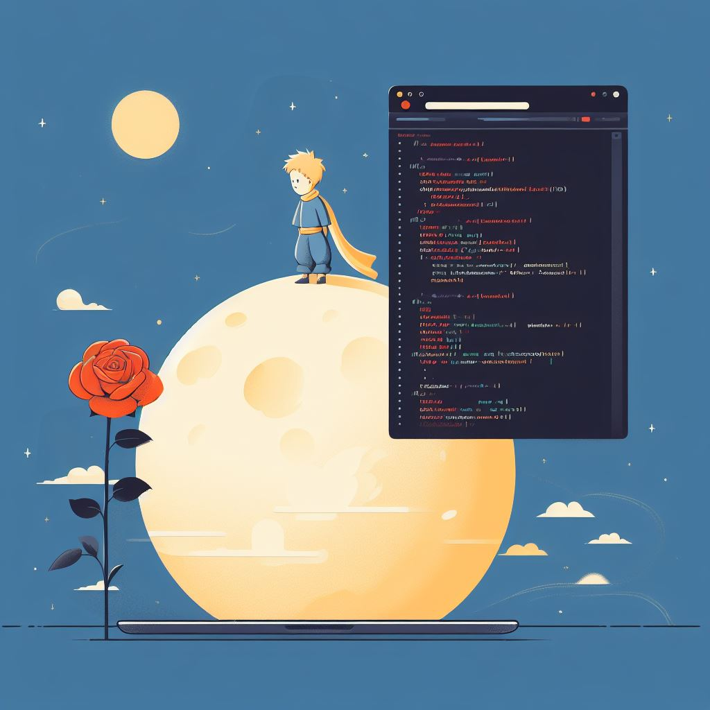

# ¿Qué nos enseña _El Principito_ para aplicar en la ingeniería?

<button class="back-button" onclick="window.location.href='https://matiaspakua.github.io/tech.notes.io'">All notes</button>

_"El Principito"_ de Antoine de Saint-Exupéry es una historia clásica que comparte un montón de enseñanzas de vida. Si bien no está directamente ligado a ser un gran ingeniero de software, hay varios principios universales que se pueden aplicar tanto a nuestro crecimiento personal como profesional (incluyendo la programación). Acá van algunos de los más interesantes (mente abierta):

1. **Imaginación y Creatividad:**  

_El Principito_ nos invita a mirar el mundo con ojos de niño, llenos de curiosidad y asombro. En la ingeniería de software, pensar fuera de la caja y meterle imaginación es clave para resolver problemas y encontrar soluciones innovadoras.

2. **Curiosidad:**  

El niño del cuento siempre anda haciendo preguntas y buscando respuestas. En tecnología, ser curioso te lleva a aprender cosas nuevas y a entender sistemas complicados. No hay nada más copado (o que es lo mismo: "que te entusiasma") que explorar para descubrir cómo funcionan las cosas.
   
3. **Atención al Detalle:**  

La historia muestra la importancia de fijarse en los detalles más mínimos. Cuando programamos, prestar atención a cada parte del código es fundamental para que no se nos pasen bugs y para que el software ande como se espera.

4. **Ver con el Corazón:**  

_El Principito_ nos enseña que lo esencial es invisible a los ojos. En el desarrollo de software, entender a fondo lo que necesita el usuario y diseñar interfaces amigables requiere empatía y la capacidad de ver más allá de lo obvio.

5. **Exploración y Aventura:**  

Toda la aventura de _El Principito_ consiste en viajar y descubrir. De la misma manera, como programadores vivimos en constante aprendizaje, probando nuevas tecnologías y encontrando soluciones interesantes a problemas complejos.

6. **Conexiones y Relaciones:**  

El libro resalta el valor de conectar con los demás. En el mundo tech, el trabajo en equipo, la buena onda y la comunicación clara son fundamentales para sacar proyectos adelante.

7. **Simplicidad:**  

_El Principito_ valora la belleza de lo simple. En ingeniería de software, mantener el código y los sistemas lo más simples posible garantiza que sean fáciles de mantener y que anden mejor.

# Sobre el autor

Antoine de Saint-Exupéry tuvo una conexión muy intensa con la Patagonia argentina porque laburó como piloto de correo aéreo para la Aeroposta Argentina en los años 30. Le tocaba volar rutas bien largas y solitarias que pasaban por esa región, incluyendo Península Valdés. Dicen que la inmensidad y la belleza medio desolada de la Patagonia lo inspiraron en varias de sus obras. De hecho, se comenta que algunos pasajes de _El Principito_ y otros libros reflejan un poco esa mezcla de soledad y maravilla que sintió mientras sobrevolaba esos paisajes argentinos.

## Referencia

_**El Principito**_ de Antoine de Saint-Exupéry.
[El principito - Wikipedia, la enciclopedia libre](https://es.wikipedia.org/wiki/El_principito)
[Antoine de Saint-Exupéry - Wikipedia, la enciclopedia libre](https://es.wikipedia.org/wiki/Antoine_de_Saint-Exup%C3%A9ry)
