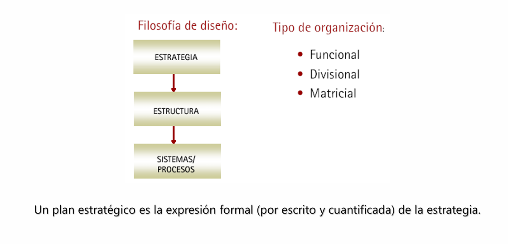
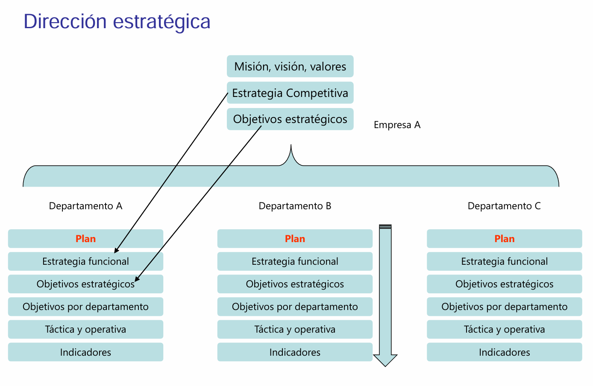
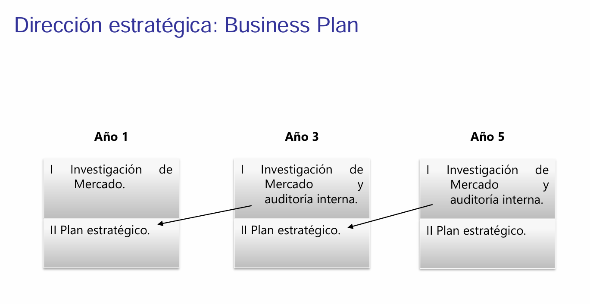

# Tema 1

## Alineación de la estrategia empresarial con IT

Se trata de cómo las estrategias de tecnología de la información deben estar integradas en la planificación estratégica general de la empresa.

Una empresa desde el punto de vista estratégico se estructura basándose en los conceptos de:

1. Misión: a lo que se dedica de forma diferenciada.
1. Visión: Que es lo que vamos a generar a "futuro".
2. Valores: son las competencias corporativas con las cuales se trabajará.

### Proceso de planeamiento estratégico

1. **Definición de la Misión y Visión**: La misión establece el propósito de la organización, mientras que la visión describe lo que la empresa aspira a ser en el futuro.
2. **Evaluación de Variables Internas**:Se analiza la situación actual de la empresa, incluyendo:
        - **Fortalezas**: Capacidades y recursos que pueden ser aprovechados.
        - **Debilidades**: Áreas que requieren mejora y limitaciones internas.
3. **Evaluación de Variables Externas**: Se examinan factores externos que afectan a la organización, tales como:
        - **Oportunidades**: Condiciones favorables en el mercado que pueden ser explotadas.
        - **Amenazas**: Desafíos externos que pueden impactar negativamente en la empresa.

La planificación estratégica es esencial para que las organizaciones definan su rumbo y logren sus objetivos a largo plazo.  Se desarrollan estrategias que alinean las fortalezas internas con las oportunidades externas, buscando mitigar debilidades y amenazas.

Implementación de Estrategias: Se ejecutan planes de acción concretos para llevar a cabo las estrategias formuladas. Esto incluye la asignación de recursos y la designación de responsables.

**Monitoreo y Evaluación**: Se establecen indicadores de desempeño (KPIs) para medir el progreso. La evaluación continua permite ajustes en la estrategia y la implementación según sea necesario.

<iframe width="560" height="315" src="https://www.youtube.com/embed/UCFaXHPqynI?si=f4maCNfGuq3N88Sh" title="YouTube video player" frameborder="0" allow="accelerometer; autoplay; clipboard-write; encrypted-media; gyroscope; picture-in-picture; web-share" referrerpolicy="strict-origin-when-cross-origin" allowfullscreen></iframe>

[Referencia]
https://www.stratgia.com/files/images/ilustraciones/proceso-de-planeamiento-estrategico.jpg
https://www.youtube.com/watch?v=UCFaXHPqynI&ab_channel=StraTgia-PlaneamientoEstrat%C3%A9gico

## Estrategia Competitiva

 1. <mark style="background: #FFF3A3A6;">¿A qué me dedico?</mark>
- **Descripción**: Este primer punto se refiere a la **definición de la misión y el propósito de la empresa**. Es fundamental entender claramente el negocio en el que opera la organización y los productos o servicios que ofrece. La claridad sobre a qué se dedica la empresa permite enfocar los esfuerzos estratégicos de manera coherente.
- **Importancia**: Ayuda a establecer una base sólida para todas las decisiones estratégicas posteriores y asegura que todos los miembros de la organización comprendan el objetivo común.

 2. Mercados Geográficos
- **Descripción**: Este aspecto se refiere a **la identificación de las áreas geográficas donde la empresa planea operar**. Puede incluir mercados locales, nacionales o internacionales, dependiendo de la capacidad y los objetivos de la organización.
- **Importancia**: La elección del mercado geográfico impacta en la estrategia de marketing, distribución y la adaptación de productos o servicios a las necesidades locales, lo que puede ser clave para el éxito en diferentes regiones.

 3. Segmento o Nicho
- **Descripción**: Este punto implica **la identificación y selección de un grupo específico de consumidores** a los que la empresa desea dirigirse. Un nicho puede estar basado en demografía, comportamiento, preferencias, o necesidades específicas que no están completamente satisfechas por la competencia.
- **Importancia**: Enfocarse en un segmento o nicho permite a la empresa ofrecer propuestas de valor más personalizadas y diferenciarse de la competencia, mejorando así la lealtad del cliente y la efectividad de las estrategias de marketing.

 4. Ventajas Competitivas
- **Descripción**: Se refiere a los **aspectos únicos que permiten a la empresa superar a sus competidores**. Estas pueden incluir calidad superior, innovación en productos, eficiencia en costos, servicio al cliente excepcional, o una marca fuerte.
- **Importancia**: Las ventajas competitivas son cruciales para la sostenibilidad a largo plazo. Ayudan a la empresa a crear una oferta diferenciada en el mercado, lo que puede traducirse en mayor cuota de mercado y rentabilidad.

 5. Objetivos de Posicionamiento
- **Descripción**: Este punto aborda cómo la empresa **quiere ser percibida por el mercado** en comparación con sus competidores. El posicionamiento implica la creación de una imagen o identidad que resuene con el segmento de mercado objetivo.
- **Importancia**: Un posicionamiento efectivo facilita que los consumidores comprendan qué hace única a la empresa y por qué deben elegir sus productos o servicios sobre los de la competencia. Esto es clave para construir una marca fuerte y una base de clientes leales.

## Dirección estratégica

La dirección estrategica deberá ser creada para cada uno de los departamentos y a nivel táctico se deberá definir siguiente el<mark style="background: #FFF3A3A6;"> método de las 4P.  La</mark>s "4P" del marketing, son fundamentales en el desarrollo de la estrategia corporativa y el plan estratégico, especialmente a nivel táctico:

1. Política de Producto
- **Descripción**: Se refiere a las decisiones sobre **los bienes o servicios que una empresa ofrece al mercado**. Incluye aspectos como las características, calidad, diseño, marca, y la variedad de productos.
- **Importancia**: Una política de producto sólida asegura que la oferta cumpla con las necesidades y deseos del consumidor, lo que es crucial para la diferenciación y la satisfacción del cliente.

 2. Política de Precios
- **Descripción**: Involucra las estrategias para **determinar el precio de los productos o servicios**. Esto puede incluir descuentos, financiación, y estrategias de precios psicológicos.
- **Importancia**: La política de precios impacta directamente en la percepción de valor del producto, la competitividad en el mercado y la rentabilidad de la empresa. Establecer un precio adecuado es clave para atraer clientes y maximizar ingresos.

3. Política de Plaza (Distribución)
- **Descripción**: Se refiere a las decisiones sobre **cómo y dónde se distribuyen los productos o servicios**. Incluye la selección de canales de distribución, ubicación de puntos de venta, y la logística necesaria para hacer llegar el producto al consumidor.
- **Importancia**: Una estrategia de distribución efectiva asegura que los productos estén disponibles en los lugares adecuados y en el momento oportuno, facilitando así el acceso del consumidor y mejorando la experiencia de compra.

4. Política de Promoción
- **Descripción**: Comprende las estrategias para **comunicar y promocionar los productos o servicios**. Esto incluye publicidad, relaciones públicas, promociones de ventas, y marketing digital.
- **Importancia**: Una promoción bien planificada aumenta la visibilidad del producto, genera interés, y motiva a los consumidores a realizar una compra. Es esencial para crear conciencia de marca y fomentar la lealtad del cliente.

## Plan Estratégico de IT

### 1. Arquitectura del Sistema
- **Descripción**: La arquitectura del sistema se refiere al **diseño estructural y a la organización de los componentes del sistema de información** de la empresa. Esto incluye hardware, software, redes, bases de datos y las interacciones entre estos elementos.
- **Importancia**: Una buena arquitectura del sistema asegura que todos los componentes tecnológicos funcionen de manera integrada y eficiente. Facilita la escalabilidad, la interoperabilidad y el mantenimiento del sistema, alineando la infraestructura tecnológica con los objetivos empresariales.

### 2. Tecnología
- **Descripción**: Esta sección abarca las **herramientas y plataformas tecnológicas** que la organización utilizará para soportar sus operaciones. Incluye decisiones sobre sistemas de gestión, aplicaciones, lenguajes de programación, y dispositivos.
- **Importancia**: La elección de la tecnología adecuada es fundamental para optimizar procesos, mejorar la productividad y facilitar la innovación. Una infraestructura tecnológica bien seleccionada puede proporcionar una ventaja competitiva y mejorar la agilidad del negocio.

### 3. Gobierno de Datos
- **Descripción**: El gobierno de datos implica las políticas, prácticas y procedimientos que garantizan que los datos de la organización sean **gestionados adecuadamente**. Esto incluye la calidad de los datos, su integración, y la forma en que se almacenan y acceden.
- **Importancia**: Un sólido gobierno de datos es esencial para asegurar la integridad, la privacidad y la disponibilidad de la información. Ayuda a cumplir con regulaciones y estándares, y permite a la organización tomar decisiones informadas basadas en datos confiables.

### 4. Seguridad
- **Descripción**: La seguridad en un plan estratégico de IT se refiere a las medidas y protocolos implementados para **proteger la infraestructura tecnológica y la información** contra amenazas, ataques cibernéticos y accesos no autorizados.
- **Importancia**: La seguridad es un componente crítico para proteger los activos de información y la reputación de la empresa. La implementación de prácticas robustas de seguridad ayuda a mitigar riesgos, garantizar la continuidad del negocio y cumplir con requisitos legales y normativos.

## Business Plan

Un **Business Plan** o plan de negocio es un documento formal que describe los objetivos de una empresa, las estrategias que se utilizarán para alcanzarlos, los recursos necesarios y las proyecciones financieras. Este documento actúa como una hoja de ruta para guiar las operaciones y decisiones estratégicas de la organización. Generalmente, un business plan incluye secciones sobre el análisis de mercado, la estructura organizativa, la estrategia de marketing, y los planes financieros.

1. **Creación Inicial**: Al inicio, el business plan se elabora para establecer los fundamentos de la empresa, definiendo su visión, misión, y los objetivos estratégicos a largo plazo. Esta etapa incluye una investigación de mercado para entender el entorno competitivo y las necesidades del cliente.
2. **Revisión Anual**: Cada año, el business plan se revisa y actualiza mediante una auditoría interna. Esto implica evaluar el rendimiento del negocio en relación con los objetivos establecidos y el entorno de mercado actual. Las revisiones permiten adaptar la estrategia a nuevas circunstancias, identificar áreas de mejora, y ajustar proyecciones financieras.
3. **Adaptación y Flexibilidad**: La estrategia implica no solo mantener una dirección clara, sino también ser flexible y receptivo a cambios en el mercado o en la industria. Esto es esencial para asegurar la sostenibilidad y la competitividad de la empresa a lo largo del tiempo.
4. **Uso de Datos e Información**: La incorporación de datos e información actualizada durante la auditoría interna ayuda a la empresa a tomar decisiones informadas y basadas en evidencias. Esto asegura que el plan estratégico sea relevante y eficaz en el contexto del entorno cambiante.

## Estrategia ganadoras según Philip Kotler

<iframe width="560" height="315" src="https://www.youtube.com/embed/UJHPZwXA-R0?si=mGHF8paXaJoX2THw" title="YouTube video player" frameborder="0" allow="accelerometer; autoplay; clipboard-write; encrypted-media; gyroscope; picture-in-picture; web-share" referrerpolicy="strict-origin-when-cross-origin" allowfullscreen></iframe>

1. **Estrategias de Precio**:
   - **Liderazgo en Costos**: Ofrecer productos o servicios a precios más bajos que la competencia, manteniendo márgenes de beneficio adecuados.
   - **Descremado de Precios**: Introducir productos a precios altos para atraer a clientes dispuestos a pagar más, y luego reducir el precio para captar segmentos más sensibles al precio.

2. **Estrategias de Calidad**:
   - **Calidad Superior**: Proporcionar productos o servicios de alta calidad que justifiquen un precio premium y fomenten la lealtad del cliente.
   - **Calidad Consistente**: Mantener estándares de calidad constantes para asegurar la satisfacción y confianza del cliente.

3. **Estrategias de Innovación**:
   - **Innovación de Producto**: Desarrollar nuevos productos o mejorar los existentes para satisfacer mejor las necesidades del mercado.
   - **Innovación de Proceso**: Mejorar los procesos internos para aumentar la eficiencia y reducir costos.

4. **Estrategias de Enfoque**:
   - **Enfoque en Segmentos Específicos**: Dirigirse a nichos de mercado específicos con ofertas adaptadas a sus necesidades particulares.
   - **Enfoque Geográfico**: Concentrarse en mercados geográficos específicos donde la empresa pueda tener una ventaja competitiva.

Kotler enfatiza la importancia de elegir una estrategia que se alinee con las capacidades internas de la empresa y las condiciones del mercado, y destaca que la combinación de estas estrategias puede ser efectiva para lograr una ventaja competitiva sostenible.

En otro ejemplo, el auto nombra una estrategia que básicamente es basada en el modelo de negocios y es ofrece algo diferente, pero no orientado al producto, sino al modelo de negocio en si mismo.

## Visionado: Sturbucks SWOT analysis

El **análisis SWOT** (Strengths, Weaknesses, Opportunities, Threats) es una herramienta estratégica que permite evaluar los factores internos y externos que afectan a una organización. Este análisis se divide en cuatro cuadrantes:

1. **Fortalezas (Strengths)**: Aspectos internos que otorgan ventajas competitivas.
2. **Debilidades (Weaknesses)**: Áreas internas que representan desventajas frente a competidores.
3. **Oportunidades (Opportunities)**: Factores externos que la organización puede aprovechar para su beneficio.
4. **Amenazas (Threats)**: Elementos externos que podrían perjudicar el desempeño de la organización.

**Caso de Starbuks**

- **Fortalezas**: Se destacan aspectos internos como la fuerte presencia de marca, la calidad del producto y la lealtad del cliente.
- **Debilidades**: Se identifican áreas como la dependencia de mercados específicos y los altos costos operativos.
- **Oportunidades**: Se mencionan tendencias como la expansión en mercados emergentes y la diversificación de productos.
- **Amenazas**: Se reconocen factores externos como la competencia creciente y las fluctuaciones económicas.

<iframe width="560" height="315" src="https://www.youtube.com/embed/mR9eICQJLXA?si=IFyM0XxJtd0WsvCk" title="YouTube video player" frameborder="0" allow="accelerometer; autoplay; clipboard-write; encrypted-media; gyroscope; picture-in-picture; web-share" referrerpolicy="strict-origin-when-cross-origin" allowfullscreen></iframe>

## Caso Artículos para fiestas SA

<mark style="background: #FFF3A3A6;">Consigna #01: Definir las estrategias que ha seguido la empresa hasta el momento</mark>

1. **Expansión de la Red de Tiendas**:
   - Artículos para Fiestas S.A. ha crecido significativamente desde su fundación, estableciendo 360 puntos de venta, de los cuales el 30% son franquicias. La empresa ha enfocado sus esfuerzos en la expansión tanto a nivel nacional como internacional, incluyendo países como España, Portugal, Italia, Turquía, México, Colombia y Ecuador.

2. **Fortalecimiento del Sistema de Compras y Logística**:
   - La empresa ha priorizado el desarrollo de un sistema de compras eficiente, que le permite adquirir hasta el 80% de sus productos en Asia. Esto les ha proporcionado una ventaja competitiva al ofrecer un amplio surtido y las últimas novedades en productos para fiestas.

3. **Diversificación de la Oferta**:
   - Artículos para Fiestas S.A. ha adaptado continuamente su oferta para satisfacer la demanda durante diferentes épocas del año (Halloween, Navidad, etc.), lo que ha aumentado su relevancia en el mercado.

4. **Estrategia de Precios y Promociones**:
   - La empresa se enfoca en mantener una imagen de precios bajos y variedad en sus productos, utilizando productos gancho adquiridos a buen precio para atraer a más clientes. A pesar de no invertir en publicidad, ha logrado un reconocimiento de marca del 10% entre el público potencial.

5. **Incorporación de Tecnología y Profesionalización**:
   - Con la llegada del nuevo Director General, se ha profesionalizado la gestión interna mediante la implementación de un sistema ERP (SAP) para mejorar la gestión del backoffice y de los puntos de venta. Esta estrategia apunta a optimizar la toma de decisiones basada en datos históricos de ventas.

6. **Capacitación y Formación de Personal**:
   - La empresa ha establecido programas de formación para el personal de sus tiendas, asegurando que el equipo esté capacitado para adaptarse a las necesidades de los clientes en diferentes regiones.

7. **Adaptación a la Competencia**:
   - Aunque enfrenta competencia de otras cadenas y tiendas online, Artículos para Fiestas S.A. ha mantenido su liderazgo mediante la calidad de su oferta y el conocimiento del mercado. Se ha centrado en un enfoque minorista tradicional, creando una experiencia de compra atractiva para los clientes.

**Conclusión**

En resumen, Artículos para Fiestas S.A. ha seguido una estrategia centrada en la expansión, la optimización de su sistema de compras, y la diversificación de su oferta, al tiempo que profesionaliza su gestión interna y se adapta a la competencia en el mercado. Estas acciones han permitido a la empresa consolidar su posición como líder en el sector de artículos para fiestas.

<mark style="background: #ADCCFFA6;">Consigna #02: Definir cuál va a ser la estrategia competitiva a seguir a partir de ahora.</mark>

1. **Diversificación de Productos y Servicios**:
   - **Descripción**: Ampliar la gama de productos y servicios ofrecidos, incluyendo no solo artículos para fiestas, sino también servicios complementarios como la organización de eventos, decoraciones personalizadas y alquiler de equipos.
   - **Justificación**: Esto podría atraer a nuevos segmentos de clientes y diferenciar la empresa de competidores que solo venden productos. La inclusión de servicios podría fomentar la lealtad del cliente y generar ingresos adicionales.

2. **Mejorar la Presencia en Línea**:
   - **Descripción**: Desarrollar una plataforma de eCommerce robusta que permita a los clientes realizar compras en línea, ofreciendo entregas a domicilio y recogidas en tienda.
   - **Justificación**: Con el crecimiento del comercio electrónico, una fuerte presencia en línea no solo aumentaría la accesibilidad para los consumidores, sino que también permitiría a la empresa capturar datos sobre las preferencias del cliente y optimizar su oferta.

3. **Optimización de la Logística y Gestión de Inventario**:
   - **Descripción**: Implementar un sistema avanzado de gestión de inventario que permita una mejor rotación de productos y reduzca costos de almacenamiento.
   - **Justificación**: Mejorar la logística asegurará que los productos más populares estén siempre disponibles, al tiempo que reduce el desperdicio y los costos asociados con el exceso de inventario.

4. **Fortalecimiento del Marketing y la Comunicación**:
   - **Descripción**: Crear campañas de marketing enfocadas en las redes sociales y otras plataformas digitales para aumentar el reconocimiento de marca y atraer a un público más amplio.
   - **Justificación**: Dado que la empresa ha sido reacia a invertir en publicidad, es fundamental cambiar esta estrategia para crear conciencia sobre la marca y sus ofertas, especialmente en nuevos mercados donde ha entrado.

5. **Personalización de la Experiencia del Cliente**:
   - **Descripción**: Implementar un enfoque más personalizado en el servicio al cliente, utilizando datos de compra y preferencias para ofrecer recomendaciones y promociones específicas.
   - **Justificación**: Esto no solo mejora la experiencia del cliente, sino que también puede aumentar las ventas a través de estrategias de venta cruzada y up-selling.

6. **Expansión a Nuevos Mercados Internacionales**:
   - **Descripción**: Investigar y entrar en nuevos mercados donde hay una demanda creciente de productos para fiestas, especialmente en regiones donde la competencia es limitada.
   - **Justificación**: La expansión geográfica puede ofrecer nuevas oportunidades de crecimiento y diversificar el riesgo asociado con depender de mercados existentes.

**Conclusión**

La estrategia competitiva a seguir por Artículos para Fiestas S.A. debe centrarse en diversificar su oferta, mejorar la presencia digital y optimizar sus operaciones logísticas. Al implementar estas acciones, la empresa podrá consolidar su posición en el mercado, responder a las necesidades cambiantes de los consumidores y aprovechar nuevas oportunidades de crecimiento en un entorno cada vez más competitivo.