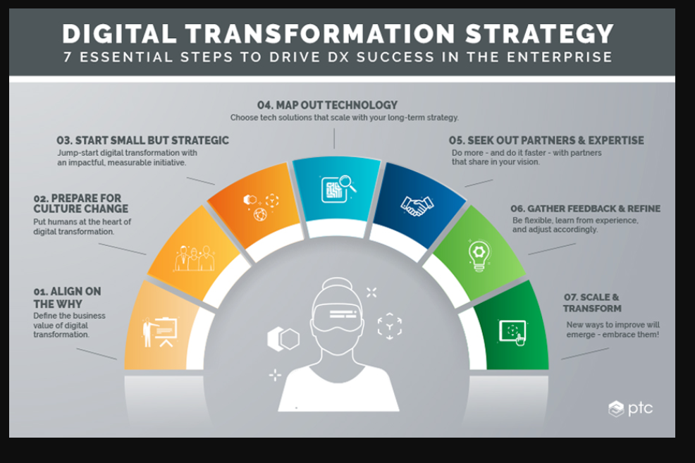

# TEMA 4: Plan estratégico de Transformación Digital

Link: [7 Key Principles of Digital Transformation Strategy | PTC](https://www.ptc.com/en/blogs/corporate/digital-transformation-strategy#technology_implementation)

La estrategia debe centrarse en los objetivos comerciales antes de la implementación de tecnología.

### 7 Aspectos Claves de la Estrategia de Transformación Digital

1. **Alineación con Objetivos Empresariales**: La transformación digital debe estar directamente vinculada a los objetivos comerciales de la organización para asegurar que el esfuerzo tenga un impacto real. => <mark style="background: #ADCCFFA6;">el PORQUE?</mark>

2. **Preparación para el Cambio Cultural**: Es fundamental gestionar el cambio cultural dentro de la organización, fomentando una mentalidad abierta hacia la innovación y la adopción de nuevas tecnologías.

3. **Proyectos Pequeños y Estratégicos**: Comenzar con iniciativas pequeñas que sean fácilmente escalables y que muestren resultados rápidos ayuda a ganar confianza y a demostrar el valor de la transformación. => <mark style="background: #FFF3A3A6;">QUICK Wins</mark>.

4. **Colaboración Multifuncional**: Crear equipos de trabajo que incluyan miembros de diferentes departamentos promueve la colaboración y asegura que todas las perspectivas sean consideradas. => <mark style="background: #BBFABBA6;">MAPA de la tecnología.</mark>

5. **Inversión en Tecnología**: La implementación de tecnología debe ser considerada como un medio para alcanzar los objetivos comerciales, no como el fin en sí mismo. Buscar <mark style="background: #FFF3A3A6;">partners y expertise</mark> que acompañen la inversión.

6. **Evaluación Continua**: Es esencial realizar un seguimiento y evaluación constante del progreso de las iniciativas para adaptarse rápidamente a los cambios y optimizar los resultados.

7. **Involucrar a la Alta Dirección**: El apoyo y la participación de la alta dirección son cruciales para el éxito de la transformación, asegurando que se otorgue la prioridad adecuada a las iniciativas digitales.

### 4 Tendencias a Futuro

1. **Adopción de la Inteligencia Artificial (IA)**: La IA seguirá revolucionando procesos y toma de decisiones, permitiendo a las empresas operar de manera más eficiente y efectiva.

2. **Automatización de Procesos con AI y ML**: Se espera un aumento en la automatización de tareas y procesos, lo que permitirá a las organizaciones optimizar su productividad y reducir costos.

1. Foco en los procesos y no tanto en las tecnologías.

2. **Integración de Tecnología en Todos los Sectores**: La transformación digital no se limitará a la tecnología de la información, sino que se integrará en todos los aspectos de las operaciones comerciales, afectando a cada departamento y sobre todos los objetivos de Sostenibilidad.

# **Sesión 4: Plan Estratégico de Transformación Digital**

La **transformación digital** no es simplemente la adopción de nuevas tecnologías, sino una reconfiguración integral de la manera en que las empresas operan. Un **plan estratégico de transformación digital** proporciona una guía clara para llevar a cabo este cambio, incorporando tecnología, personas, procesos y la cultura organizacional. A continuación, se detallan los elementos clave para desarrollar y gestionar un plan de transformación digital efectivo.

1. **Objetivos del Plan de Transformación Digital**:
   - **Mejorar la eficiencia operativa**, **reducir costes** y **aumentar ingresos**, asegurando una integración fluida de las tecnologías en cada fase.
   - Fomentar una **cultura de innovación** que permita a la empresa adaptarse rápidamente a los cambios del entorno digital.

2. **Fases del Plan Estratégico**:
   - **Evaluación Inicial y Diagnóstico**: Realizar un análisis FODA y evaluar las capacidades tecnológicas actuales.
   - **Revisión de la Cadena de Valor y Procesos**: Rediseñar procesos para mejorar la eficiencia, utilizando nuevas tecnologías.
   - **Definición de Visión y Objetivos Estratégicos**: Establecer una visión digital a largo plazo con objetivos SMART (específicos, medibles, alcanzables, relevantes y temporales).
   - **Estrategias de Transformación Digital**: Desarrollar estrategias en áreas clave como tecnología, ciberseguridad, experiencia del cliente y automatización de operaciones.

3. **Gestión del Cambio y Cultura Organizacional**:
   - Fomentar la **colaboración y la innovación**, gestionando la resistencia al cambio y promoviendo la comunicación efectiva entre equipos.

4. **Desarrollo del Talento y Capacitación**:
   - Implementar programas de **formación continua** para asegurar que los empleados tengan las habilidades necesarias para apoyarse en las nuevas tecnologías.

5. **Iniciativas de Innovación y Sostenibilidad**:
   - Promover iniciativas que no solo mejoren la eficiencia tecnológica, sino que también impulsen **nuevas ideas y modelos de negocio**.
   - Integrar prácticas de **sostenibilidad digital**, optimizando el uso de recursos y reduciendo el impacto ambiental de las operaciones tecnológicas.

6. **Implementación y Monitoreo**:
   - Definir un **plan de acción** con un cronograma claro, asignación de recursos y métricas de éxito.
   - Monitorear el progreso mediante **KPIs** y realizar ajustes según sea necesario para asegurar el cumplimiento de los objetivos.

7. **Riesgos y Mitigación**:
   - Identificar riesgos potenciales relacionados con la adopción de nuevas tecnologías, la resistencia cultural o la gestión de recursos, y desarrollar estrategias para mitigar estos riesgos.

Este plan debe ser **flexible y dinámico**, permitiendo la adaptación a medida que se avanza en la transformación. La **comunicación constante** con los **stakeholders** es clave para garantizar su compromiso y apoyo continuo a lo largo de todo el proceso de transformación digital.