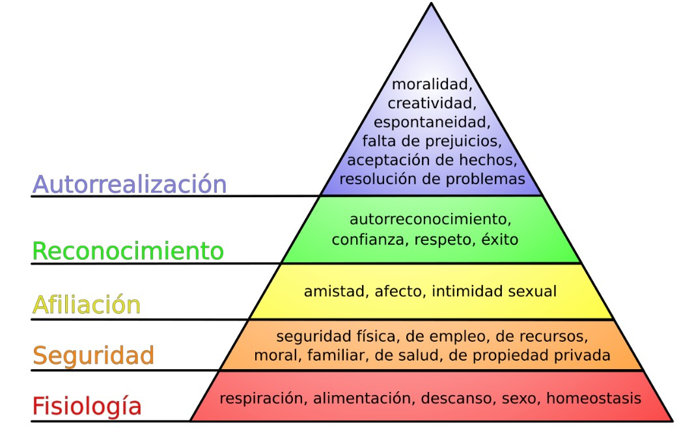
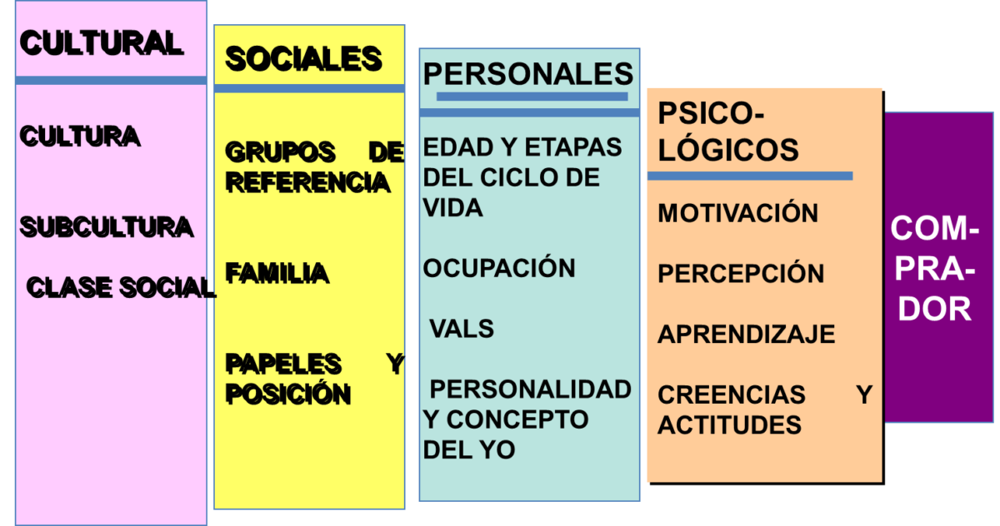

# Formas de diseñar el Future Mode Operations I
## Lecturas previas a clase

## Lectura 1: Pirámide de Maslow

Jerarquía de las necesidades humanas. Necesidades básica (base) a deseos elevados (punta, aspectos menos básicos)

Las características de las personas autorrealizadas:
- centradas en la <mark style="background: #FFF3A3A6;">realidad</mark>, que sabían diferenciar lo falso o ficticio de lo real y genuino;
- centradas en los <mark style="background: #ADCCFFA6;">problemas</mark>, que los enfrentan en virtud de sus soluciones;
- con una percepción diferente de los significados y los <mark style="background: #BBFABBA6;">fines</mark>.

Las personas autorrealizadas se caracterizan por ser **independientes, auténticas, creativas y resistentes a la presión social**, con una **aceptación genuina** de sí mismas y de los demás, además de disfrutar de la **privacidad** y experimentar la vida con **intensidad y frescura**.

>[!NOTE]
>En la medida que las personas van cumpliendo con las necesidades básicas, nacen nuevas necesidades en dirección de la autorealización.

Link: [Pirámide de Maslow - Wikipedia, la enciclopedia libre](https://es.wikipedia.org/wiki/Pir%C3%A1mide_de_Maslow)

## Lectura 2: Las clases sociales y el marketing

Clase social => mercado META (gustos y preferencias)

Indicadores:
- **Prestigio:** Que se refiere al valor social que tiene una profesión u ocupación.
- **Renta:** Se refiere a los ingresos por el salario más los que se derivan de las inversiones.
- **Patrimonio:** Que hace referencia a los bienes muebles e inmuebles.

Estos indicadores ayudan a <mark style="background: #FFF3A3A6;">dirigir los productos y servicios </mark>de las empresas.

Las clases sociales se clasifican: desde alta hasta muy baja.

Link: [Las clases sociales y el marketing](https://eldinero.com.do/19048/las-clases-sociales-y-el-marketing/)

## Lectura 3: Las clases sociales para marketing ya no existen

Antes se lanzaban productos y servicios basados en **segmentación** por:
- Edad
- genero
- poder adquisitivo
- clase social

Ahora la estrategia va más allá de las clases sociales y se aplica el <mark style="background: #FFF3A3A6;">"estilo de vida"</mark>.

Link: [Las clases sociales para marketing ya no existen](https://pacolorente.es/las-clases-sociales-para-marketing-ya-no-existen/)

## Lectura 4: Los principales factores que influyen en la conducta del consumidor

Investigación del consumidor y su comportamiento => son las decisiones que toman los consumidores cuando adquieren productos y/o servicios.

* Consumidor Personas.
* Consumidor organizacional.
### Factores principales que influyen en la conducta del consumidor:

1. **Factores culturales**:
    - La cultura determina valores, percepciones y preferencias. Subculturas (como grupos étnicos o religiosos) tienen sus propios estilos de vida y comportamientos de compra.
2. **Factores sociales**:
    - Los grupos de referencia, como amigos, familia y asociaciones, influyen significativamente en las decisiones de compra, así como el estatus social.
3. **Factores personales**:
    - Edad, ciclo de vida familiar, ocupación, situación económica, estilo de vida y personalidad afectan las elecciones del consumidor.
4. **Factores psicológicos**:
    - La motivación, percepción, aprendizaje y actitudes moldean el comportamiento y las decisiones de compra.

### Proceso de decisión del consumidor:

El proceso incluye:

1. Reconocimiento de la necesidad.
2. Búsqueda de información.
3. Evaluación de alternativas.
4. Decisión de compra.
5. Comportamiento posterior a la compra.

### Conducta en el mercado de negocios:

Las empresas toman decisiones basadas en:

- **Recompra directa**: Compra sin cambios significativos.
- **Recompra modificada**: Ajuste en especificaciones o términos.
- **Nueva tarea**: Compra de productos o servicios por primera vez.

El análisis de estos factores permite a los mercadólogos diseñar estrategias personalizadas para diferentes mercados y necesidades.

Link: [Los principales factores que influyen en la conducta del consumidor - Blog Marketing Link - Universidad del Pacífico](https://marketinglink.up.edu.pe/los-principales-factores-influyen-la-conducta-del-consumidor/)