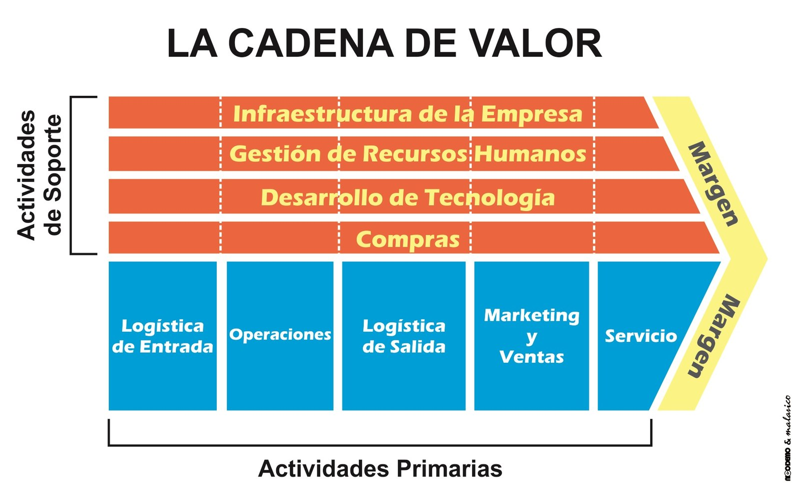
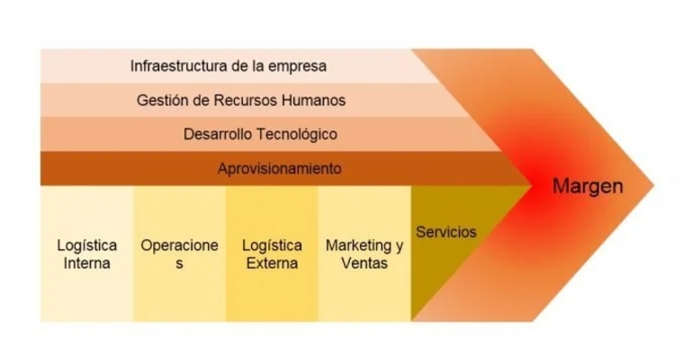
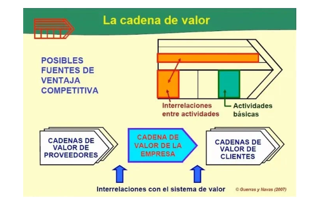

# Formas de diseñar el Future Mode Operations II

# Cadena de Valor (Wikipedia)

>[!info] 
Crear valor para el cliente, lo que se traduce en un margen entre lo que se acepta pagar y los costos incurridos por adquirir la oferta

La cadena de valor ayuda a definir el "core business" que permiten generar una ventaja competitiva. Tener una ventaja de mercado es tener una rentabilidad relativa superior a los rivales en el sector industrial en el cual se compite, la cual tiene que ser sustentable en el tiempo

#pensamientosistemico

>[!tip]
>​Rentabilidad significa un margen entre los ingresos y los costos

Unidad de negocio aplica una <mark style="background: #FFF3A3A6;">estrategia de negocios.</mark>. Son las actividades de una cadena de valor. Las actividades son múltiples y complementarias.

El modelo considera a la empresa como una serie de actividades primarias y de apoyo que agregan valor a los productos y servicios de una empresa.

#benchmarking

La <mark style="background: #ADCCFFA6;">cadena de valor</mark>  y el <mark style="background: #BBFABBA6;">modelo de negocios</mark> están estrechamente relacionados.

La cadena de valor de una empresa se debe enlazar con las cadenas de valor de sus proveedores, distribuidores y clientes. El uso de <mark style="background: #ABF7F7A6;">"sistemas de información"</mark> es clave.

Ventaja competitiva: 
 1. Liderazgo en costos y 
 2. diferenciación.

Lecturas: [Cadena de valor - Wikipedia, la enciclopedia libre](https://es.wikipedia.org/wiki/Cadena_de_valor)

### Resumen de los puntos más importantes del artículo sobre la **Cadena de Valor**:

1. **Definición**:
        - La cadena de valor es un modelo teórico desarrollado por Michael Porter que describe cómo las actividades de una organización generan valor al producto final, optimizando procesos y recursos para maximizar la ventaja competitiva.
2. **Componentes Principales**:
       - **Actividades Primarias**: Incluyen logística interna, operaciones, logística externa, marketing y ventas, y servicios posventa.
    - **Actividades de Apoyo**: Comprenden la infraestructura organizacional, gestión de recursos humanos, desarrollo tecnológico y abastecimiento.
3. **Objetivo**:
    - Identificar y optimizar las actividades que aportan más valor al cliente, asegurando un margen competitivo sostenible.
4. **Ventaja Competitiva**:
    - La cadena de valor ayuda a las empresas a identificar sus competencias distintivas y cómo estas pueden traducirse en rentabilidad superior al promedio del sector.
5. **Aplicaciones**:
    - Además de usarse en análisis internos, el concepto se extiende a cadenas de suministro y redes de distribución, involucrando múltiples actores económicos.
6. **Estrategia**:
    - La estrategia competitiva de una organización depende de cómo gestiona y optimiza su cadena de valor en relación con sus rivales.

Este modelo sigue siendo fundamental para la planificación estratégica y la creación de valor en las empresas.

# Cadena de Valor (Michael Porter): Qué es y 2 Ejemplos

1. **Definición**: La Cadena de Valor, propuesta por Michael Porter, describe las actividades que una empresa realiza para generar valor para el cliente y obtener un margen competitivo.

>[!tip]
>** Margen:** Es la diferencia entre el valor total y el costo colectivo de desempeñar las actividades de valor.

>[!tip]
> **Actividades de Valor**: Son las distintas actividades que realiza una empresa. Se dividen en dos amplios tipos:

1. **Actividades Primarias**:
    
    - **Logística interna**: Recepción y almacenamiento de materias primas.
    - **Operaciones**: Transformación de insumos en productos finales.
    - **Logística externa**: Distribución de productos terminados.
    - **Marketing y ventas**: Promoción y venta de productos.
    - **Servicio**: Soporte posventa para clientes.
3. **Actividades de Apoyo**:
    
    - Infraestructura, recursos humanos, desarrollo tecnológico y adquisiciones, que sostienen las actividades primarias.
4. **Ventaja Competitiva**: Una empresa obtiene ventaja competitiva al reducir costos o incrementar valor para los clientes mediante optimización en su cadena de valor.
    
5. **Aplicación**: Es útil para identificar áreas de mejora y analizar cómo cada actividad contribuye al éxito general del negocio.

>[!warning]
>importante la interacción de sistemas y la cadena de valor, tanto con los proveedores como con los clientes.

