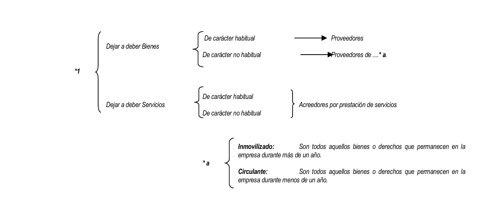

# 1. Introducción a la Contabilidad

La contabilidad se centra en el **registro y análisis de las transacciones financieras** de una empresa, aplicando el _método de partida doble_. Este método asegura que cada movimiento tiene un efecto en al menos dos cuentas: una de débito (Debe) y otra de crédito (Haber), manteniendo el sistema en equilibrio. Un asiento contable típico incluye:

- **Fecha** de la transacción.
- **Debe (D)**: valor que entra o se aumenta en una cuenta.
- **Haber (H)**: valor que sale o se disminuye en una cuenta.
- **Importe**: valor monetario de la transacción. Este método garantiza que "lo que entra" sea igual a "lo que sale", y que el asiento esté siempre cuadrado

## Método de Partida Doble

El **método de la partida doble** es un principio fundamental de la contabilidad que establece que, para cada transacción financiera realizada en una empresa, deben registrarse al menos dos movimientos en las cuentas contables: uno en el **Debe** y otro en el **Haber**. Esto asegura que el sistema de contabilidad esté equilibrado y que siempre se cumpla la ecuación básica:

>[!tip]
>Activos=Pasivos+Patrimonio Neto

## Principios Básicos del Método

1. **Dualidad de la Transacción**: Cada operación afecta a dos o más cuentas al mismo tiempo. Por ejemplo, si una empresa compra maquinaria y la paga en efectivo, esta transacción afectará a la cuenta de "Maquinaria" (aumentará) y a la cuenta de "Caja o Tesorería" (disminuirá).
    
2. **Equilibrio del Asiento Contable**: El valor total registrado en el **Debe** debe ser igual al registrado en el **Haber**. Esto se denomina tener el asiento "cuadrado". De esta forma, se asegura que no haya desbalances en los registros y que todos los movimientos de recursos sean reflejados correctamente.
3. **Ejemplo del Método de Partida Doble**:
    
    - Imaginemos que una empresa compra mercaderías por 1,000 euros y paga 400 en efectivo, dejando los 600 euros restantes a deber. En este caso, el asiento contable sería:
        - **Debe**:
            - Compras (Gasto): 1,000 euros
        - **Haber**:
            - Caja o Tesorería (Activo): 400 euros
            - Proveedores (Pasivo): 600 euros

Este método permite que el balance de situación siempre refleje correctamente la situación financiera de la empresa, facilitando el análisis y la gestión económica. Además, es el sistema contable aceptado y normativo en la mayoría de los marcos contables internacionales

| Fecha      | **Debe**                    | **Haber**                    |
| ---------- | --------------------------- | ---------------------------- |
| 01/11/2024 | Compras (Gasto)   - 1,000 € | Caja/Tesorería (A) ↓ - 400 € |
|            |                             | Proveedores (P) ↑ - 600 €    |

En este caso:
- **Caja/Tesorería (A)** representa un **activo** que disminuye (flecha hacia abajo) por el pago en efectivo.
- **Proveedores (P)** representa un **pasivo** que aumenta (flecha hacia arriba) porque se debe una parte de la compra.
- **Compras** se considera un gasto, por lo que no lleva flecha ya que no afecta directamente al activo o pasivo, sino al resultado de la empresa. 

## Definiciones importantes

### Activo

En contabilidad, un **activo** se define como cualquier <mark style="background: #BBFABBA6;">recurso controlado económicamente por una empresa, que ha surgido de eventos o transacciones pasadas</mark>, y del cual se espera que genere beneficios o rendimientos económicos en el futuro. Los activos son esenciales porque representan los bienes y derechos que una empresa utiliza para operar y producir valor.

#### Ejemplos de Activos en una Empresa Tecnológica
1. **Efectivo y equivalentes de efectivo**: Dinero en efectivo o en cuentas bancarias que la empresa tiene disponible de inmediato para cubrir sus necesidades operativas.  
   - *Ejemplo*: Saldo en la cuenta bancaria de la empresa de 50,000 €.

2. **Equipos Informáticos**: Computadoras, servidores y otros dispositivos tecnológicos usados en el desarrollo de software y la operación diaria de la empresa.
   - *Ejemplo*: Servidores de alta capacidad utilizados para alojar las aplicaciones de la empresa, valorados en 100,000 €.

3. **Software y licencias**: Programas o licencias de software adquiridos para el funcionamiento o la producción de servicios.
   - *Ejemplo*: Licencias anuales de herramientas de desarrollo de software como IDEs o sistemas de gestión de proyectos, valoradas en 10,000 €.

4. **Propiedad Intelectual**: Patentes, marcas o derechos de autor que protegen la propiedad intelectual de la empresa, como códigos fuente o diseños.
   - *Ejemplo*: Patente registrada para una tecnología de ciberseguridad innovadora, con un valor de 200,000 €.

5. **Clientes o Cuentas por cobrar**: Facturas pendientes de cobro por servicios ya prestados o productos vendidos, que representan ingresos futuros.
   - *Ejemplo*: Facturas emitidas a clientes por servicios de desarrollo de software, por un valor total de 30,000 €.

6. **Inversiones en desarrollo**: Costos de investigación y desarrollo en proyectos tecnológicos, que pueden convertirse en productos o servicios futuros.
   - *Ejemplo*: Inversión en el desarrollo de una nueva aplicación móvil, con un valor acumulado de 150,000 €.

Estos activos permiten a una empresa tecnológica mantener su operatividad, mejorar sus capacidades y generar ingresos futuros, todos componentes clave en el análisis financiero de la empresa.

### Pasivos

En contabilidad, un **pasivo** es una <mark style="background: #ADCCFFA6;">obligación financiera </mark>que una empresa tiene hacia terceros, la cual <mark style="background: #FFF3A3A6;">debe cumplir en el futuro. Los pasivos representan deudas o compromisos adquiridos</mark> por la empresa, generalmente como resultado de transacciones pasadas, y cuya liquidación implicará la salida de recursos que generan beneficios económicos.

#### Ejemplos de Pasivos en una Empresa Tecnológica

1. **Préstamos Bancarios**: Créditos obtenidos de una institución financiera que la empresa debe devolver en el futuro, junto con los intereses.
   - *Ejemplo*: Un préstamo a largo plazo de 200,000 € para financiar la compra de nuevos servidores.

2. **Cuentas por Pagar a Proveedores**: Deudas que la empresa mantiene con proveedores por la adquisición de productos o servicios, aún no pagados.
   - *Ejemplo*: Factura pendiente de 15,000 € por servicios de consultoría en ciberseguridad.

3. **Salarios y Nóminas por Pagar**: Obligaciones con empleados por trabajo realizado y no pagado al cierre de un período contable.
   - *Ejemplo*: Sueldos y bonificaciones a pagar a desarrolladores y personal de soporte por 20,000 €.

4. **Obligaciones de Arrendamiento**: Compromisos de pago por el uso de oficinas o equipos tecnológicos bajo contratos de alquiler.
   - *Ejemplo*: Alquiler mensual de un espacio de oficina en un edificio de tecnología, con una obligación acumulada de 5,000 € por pagar.

5. **Obligaciones Tributarias**: Impuestos o contribuciones fiscales pendientes de pago, como el IVA o impuestos de sociedades.
   - *Ejemplo*: IVA pendiente de liquidación por 3,500 € sobre ventas de servicios de software en el último trimestre.

6. **Provisiones para Gastos Legales o Contingencias**: Reservas para posibles gastos futuros derivados de litigios, multas o indemnizaciones.
   - *Ejemplo*: Provisión de 10,000 € para cubrir posibles costos legales asociados a una disputa de propiedad intelectual.

Los pasivos son cruciales para evaluar la solvencia y el riesgo financiero de una empresa, ya que reflejan las deudas que esta deberá cubrir, afectando directamente a su flujo de caja y, en muchos casos, a su reputación y estabilidad económica.

### Patrimonio Neto

El **patrimonio neto** es la parte residual de los activos de una empresa después de deducir sus pasivos. En otras palabras, representa los recursos propios de la empresa que pertenecen a sus accionistas o propietarios y refleja la capacidad de la empresa para autofinanciarse sin depender de deudas externas. El patrimonio neto incluye aportaciones iniciales de los socios o propietarios, ganancias retenidas (beneficios acumulados no distribuidos) y otras reservas.

#### Ejemplos de Patrimonio Neto en una Empresa Tecnológica

1. **Capital Social**: Aportes iniciales que los socios o accionistas realizan para la creación y operación de la empresa.
   - *Ejemplo*: En una startup de software, los fundadores y algunos inversores aportan 100,000 € como capital inicial para comenzar las operaciones.

2. **Reservas**: Fondos que la empresa aparta de sus beneficios anuales para cubrir futuras necesidades, como inversiones o contingencias, en lugar de distribuirlos como dividendos.
   - *Ejemplo*: La empresa decide retener 30,000 € de sus beneficios anuales para formar una reserva para futuros desarrollos tecnológicos.

3. **Resultados Acumulados o Ganancias Retenidas**: Beneficios generados por la empresa en ejercicios anteriores que no se han distribuido entre los accionistas y que se han reinvertido en la empresa.
   - *Ejemplo*: Una empresa de ciberseguridad ha generado beneficios acumulados de 200,000 € en los últimos años, los cuales se mantienen en la empresa para financiar el crecimiento.

4. **Aportaciones de Socios o Ampliaciones de Capital**: Inyecciones de capital adicionales que los socios o accionistas realizan para financiar expansiones o nuevos proyectos.
   - *Ejemplo*: Los accionistas de una empresa de tecnología aportan 50,000 € adicionales para financiar el desarrollo de una nueva plataforma de inteligencia artificial.

<mark style="background: #FFF3A3A6;">El patrimonio neto es un indicador de la fortaleza financiera de la empresa, ya que representa los fondos propios disponibles para respaldar las operaciones y el crecimiento a largo plazo</mark>. En resumen, un patrimonio neto elevado puede indicar una estructura financiera sólida y una menor dependencia de financiamiento externo.

En contabilidad, las **cuentas de ingresos** y las **cuentas de gastos** son categorías fundamentales dentro de la cuenta de resultados, también conocida como estado de pérdidas y ganancias. Estas cuentas reflejan la actividad operativa de la empresa y contribuyen a determinar el beneficio o pérdida neta del período.

## Cuenta de Ingresos
Las **cuentas de ingresos** registran los aumentos en el patrimonio neto derivados de las actividades principales de la empresa, es decir, de la venta de bienes o la prestación de servicios. Estos ingresos representan las entradas de recursos económicos, ya sea en efectivo o en cuentas por cobrar, y aumentan el valor total de la empresa.

**Ejemplos en una empresa tecnológica:**
   - **Ventas de software**: Ingresos obtenidos por la venta de licencias de un software desarrollado por la empresa.
   - **Servicios de consultoría**: Honorarios recibidos por asesorías en implementación de tecnología para otras empresas.
   - **Mantenimiento y soporte**: Cobros periódicos por contratos de mantenimiento y soporte técnico de productos o sistemas vendidos previamente.

## Cuenta de Gastos
Las **cuentas de gastos** registran los decrementos en el patrimonio neto debido a los costos y consumos necesarios para operar la empresa. Estos gastos representan salidas de recursos, ya sea en efectivo o en aumento de obligaciones (cuentas por pagar), y disminuyen el valor total de la empresa. 

**Ejemplos en una empresa tecnológica:**
   - **Salarios y beneficios del personal**: Gastos en sueldos para desarrolladores, analistas y otros empleados de la empresa.
   - **Gastos en infraestructura tecnológica**: Costos de servidores, redes y almacenamiento necesarios para operar y desarrollar productos.
   - **Licencias de software y suscripciones**: Gastos recurrentes en herramientas de software (por ejemplo, IDEs, servicios en la nube) que la empresa necesita para su operación.
   - **Gastos de marketing**: Costos de promoción de productos, campañas digitales y eventos tecnológicos para atraer clientes.

En conjunto, las cuentas de ingresos y de gastos permiten evaluar la **rentabilidad** de la empresa. Cuando los ingresos superan los gastos, la empresa registra una ganancia, mientras que si los gastos son mayores, se produce una pérdida.

## Resumen de Cuentas

Hasta ahora, hemos estudiado los siguientes **cinco tipos de cuentas** en contabilidad, cada una con un rol específico en el registro y análisis de la situación financiera de una empresa:

1. **Cuentas de Activo**: Representan los recursos controlados por la empresa que se espera generen beneficios futuros. Ejemplos incluyen efectivo, cuentas por cobrar, inventarios, maquinaria, y propiedad intelectual.

2. **Cuentas de Pasivo**: Reflejan las obligaciones y deudas que la empresa tiene con terceros, que deben liquidarse en el futuro. Ejemplos comunes son los préstamos bancarios, cuentas por pagar a proveedores y obligaciones tributarias.

3. **Cuentas de Patrimonio Neto**: Representan los recursos propios de la empresa, es decir, la parte residual después de deducir los pasivos de los activos. Ejemplos incluyen el capital social, reservas, y resultados acumulados o ganancias retenidas.

4. **Cuentas de Ingresos**: Registra las entradas de recursos económicos derivados de la actividad principal de la empresa, como la venta de bienes o servicios. Ejemplos en una empresa tecnológica incluyen ingresos por ventas de software y servicios de consultoría.

5. **Cuentas de Gastos**: Registra las salidas de recursos económicos necesarias para las operaciones de la empresa, disminuyendo el patrimonio neto. Ejemplos incluyen los salarios del personal, el alquiler de oficinas, y los costos de marketing.

Estos cinco tipos de cuentas son esenciales para mantener el equilibrio financiero y permiten analizar la rentabilidad, solvencia y estabilidad de la empresa.

## Ejemplos:

1. Compro una mesa y cuatro sillas por 1.500 euros. Pago 500 en efectivo y el resto con un cheque.

| Fecha        | **Debe**                               | **Haber**                                        |
|--------------|---------------------------------------|--------------------------------------------------|
| 01/11/2024   | Mobiliario (A) ↑ - 1,500 €            | Caja/Tesorería (A) ↓ - 500 €                     |
|              |                                       | Bancos (A) ↓ - 1,000 €                           |

2. Compro un ordenador por 2.000 euros. Pago 300 euros en efectivo, 200 mediante un cheque y dejo a deber el resto

| Fecha        | **Debe**                                   | **Haber**                                          |
|--------------|-------------------------------------------|----------------------------------------------------|
| 01/11/2024   | EPI (A) ↑ - 2,000 €                       | Caja/Tesorería (A) ↓ - 300 €                       |
|              |                                           | Bancos (A) ↓ - 200 €                               |
|              |                                           | Proveedores (P) ↑ - 1,500 €                        |

3. Compro mercaderías por 1.000 euros. Pago 100 en efectivo, 200 en cheque, 300 con una letra y el resto me lo dejan a deber.

| Fecha        | **Debe**                                      | **Haber**                                                    |
|--------------|----------------------------------------------|--------------------------------------------------------------|
| 01/11/2024   | Mercaderías (A, Circulante) ↑ - 1,000 €      | Caja/Tesorería (A) ↓ - 100 €                                 |
|              |                                              | Bancos (A) ↓ - 200 €                                         |
|              |                                              | Efectos comerciales a pagar, habitual (P) ↑ - 300 €          |
|              |                                              | Proveedores (P) ↑ - 400 €                                    |

**Explicación**:
- **Mercaderías** es un activo circulante que aumenta (flecha hacia arriba), representando la compra de productos por 1,000 €.
- **Caja/Tesorería** y **Bancos** son activos que disminuyen (flechas hacia abajo) debido al pago en efectivo (100 €) y con cheque (200 €), respectivamente.
- **Efectos comerciales a pagar, habitual** es un pasivo que aumenta (flecha hacia arriba) por 300 €, representando el compromiso de pago mediante una letra de cambio en una operación de carácter habitual.
- **Proveedores** es un pasivo que aumenta (flecha hacia arriba) por el importe restante de 400 €, quedando pendiente de pago a crédito. 

4. Compro mercaderías por 1.000 euros. Pago 100 en efectivo, 200 en cheque, 300 con una letra y el resto me lo dejan a deber.

| Fecha        | **Debe**                                      | **Haber**                                                    |
|--------------|----------------------------------------------|--------------------------------------------------------------|
| 01/11/2024   | Mercaderías (A, Circulante) ↑ - 1,000 €      | Caja/Tesorería (A) ↓ - 100 €                                 |
|              |                                              | Bancos (A) ↓ - 200 €                                         |
|              |                                              | Efectos comerciales a pagar, habitual (P) ↑ - 300 €          |
|              |                                              | Proveedores (P) ↑ - 400 €                                    |

### Letra (pagaré)

Una **letra de cambio** es un documento mercantil que representa una promesa de pago por parte del deudor hacia el acreedor. Es un título de crédito que obliga al emisor a pagar un monto específico en una fecha futura acordada, siendo una forma de financiar una transacción o aplazar un pago sin necesidad de liquidar inmediatamente en efectivo. En contabilidad, una letra de cambio (pagaré) se clasifica como un pasivo o un activo, según si representa una obligación de pago o una cuenta por cobrar.

### Definición de "Letra" (o Pagaré)
Una **letra de cambio** es un documento mercantil que representa una promesa de pago por parte del deudor hacia el acreedor. Es un título de crédito que obliga al emisor a pagar un monto específico en una fecha futura acordada, siendo una forma de financiar una transacción o aplazar un pago sin necesidad de liquidar inmediatamente en efectivo. En contabilidad, una letra de cambio (pagaré) se clasifica como un pasivo o un activo, según si representa una obligación de pago o una cuenta por cobrar.

### Asiento Contable para la Venta de Mercaderías

5. Ventas de mercaderías por 1.000 euros. Cobro 100 en efectivo, 200 en cheque, 300 con una letra y el resto lo dejo a deber.

| Fecha        | **Debe**                                          | **Haber**                                                    |
|--------------|--------------------------------------------------|--------------------------------------------------------------|
| 01/11/2024   | Caja/Tesorería (A) ↑ - 100 €                     | Ventas (I) ↑ - 1,000 €                                       |
|              | Bancos (A) ↑ - 200 €                             |                                                              |
|              | Efectos comerciales a cobrar, habitual (A) ↑ - 300 € |                                                              |
|              | Clientes (A) ↑ - 400 €                           |                                                              |

# Introducción al IVA

Se trata de un impuesto gravado al consumo de bienes y/o servicios. Se trata de un impuesto inocuo (no se gana dinero ni se pierde dinero) para la empresa.

Aquí veremos 2 tipos de IVA:

1. IVA soportado (A): es el iva que se aplica cuando adquirimos bienes/servicios 
2. IVA Repercutido (R): es el iva que se aplica cuando vendemos (realizamos una enajenación) de bienes/servicios.

El IVA siempre se aplica sobre una "base imponible" (es el el valor BRUTO sobre el cual se deberá sumar el IVA).