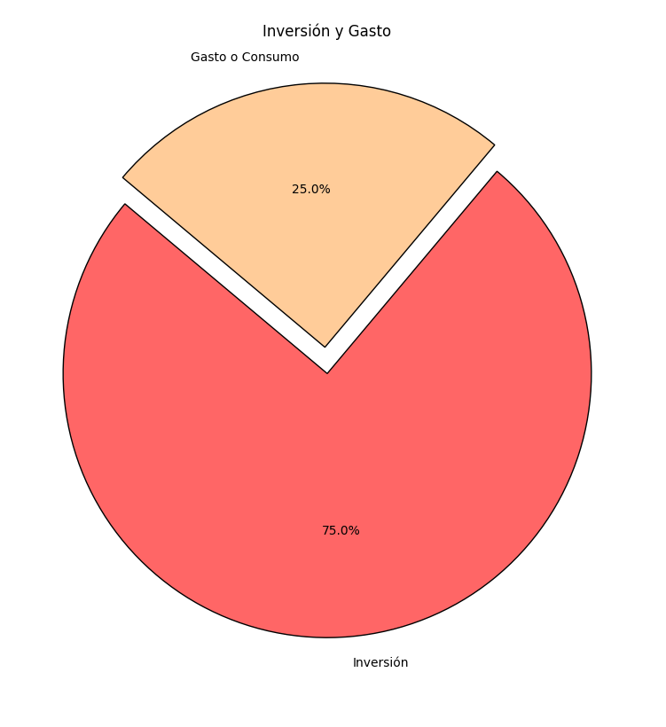
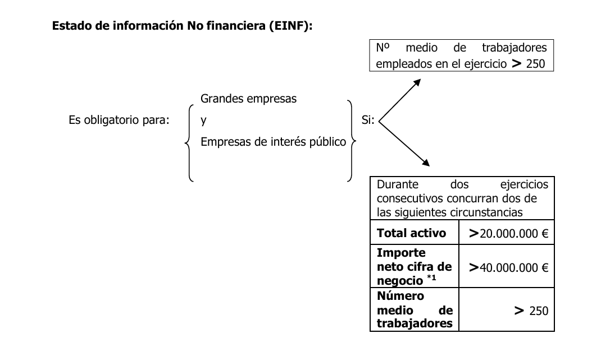

# INTERPRETACIÓN DE LAS CUENTAS ANUALES. ANÁLISIS DEL BALANCE DE SITUACIÓN

### Inversión y gasto: pizza

En una empresa se pueden generar gastos que no implican salida de dinero: <mark style="background: #ADCCFFA6;">amortizaciones </mark>y <mark style="background: #FFF3A3A6;">deterioros</mark>.

Aquí tienes las definiciones de **amortización** y **deterioro** en el contexto contable y financiero:

## Amortización

La **amortización** es el proceso contable de<mark style="background: #BBFABBA6;"> distribuir el costo de un activo a lo largo de su vida útil.</mark> Representa la pérdida de valor de un activo fijo (tangible o intangible) debido al uso, el paso del tiempo o el desgaste natural. En cada período contable, se registra un gasto de amortización que reduce el valor del activo en el balance y afecta el resultado en la cuenta de pérdidas y ganancias. La amortización permite reflejar de manera realista el valor de los activos en el tiempo y planificar su renovación.

**Ejemplo**: Una empresa compra maquinaria por 10,000 € con una vida útil estimada de 5 años. Cada año, la empresa registra una amortización de 2,000 € para reflejar el desgaste del activo.

## Deterioro

El **deterioro** ocurre cuando un activo sufre una <mark style="background: #BBFABBA6;">pérdida de valor significativa y permanente</mark>, y su valor recuperable es menor que su valor contable (es decir, el valor en libros). A diferencia de la amortización, que es un gasto programado y predecible, el deterioro se reconoce cuando surgen indicios de que un activo ha perdido valor debido a factores externos o internos (como cambios en el mercado, daño físico o tecnologías obsoletas). Esta pérdida se registra como un gasto en la cuenta de pérdidas y ganancias y reduce directamente el valor del activo en el balance.

**Ejemplo**: Una empresa tiene un edificio valorado en 500,000 €, pero debido a un declive en el mercado inmobiliario, su valor actual de mercado cae a 400,000 €. Se registra una pérdida por deterioro de 100,000 € para reflejar esta disminución en el valor del activo. 

## Inversión

Una **inversión** es el <mark style="background: #FFF3A3A6;">uso de recursos financieros con la expectativa de obtener un beneficio o rendimiento en el futuro</mark>. En el contexto empresarial, se trata de destinar fondos a la adquisición de activos o proyectos que se espera generen ingresos, aumenten el valor de la empresa o mejoren su eficiencia operativa. Las inversiones pueden ser de diferentes tipos y plazos, y son fundamentales para el crecimiento y desarrollo de una organización.

### Tipos de Inversiones

1. **Inversiones en Activos Fijos o Tangibles**: Son inversiones en bienes físicos que se utilizarán a largo plazo para la operación de la empresa, como maquinaria, edificios, terrenos y tecnología. Estas inversiones incrementan los activos de la empresa y suelen requerir amortización.

2. **Inversiones en Activos Intangibles**: Incluyen la compra de derechos, patentes, software, marcas o licencias. Aunque no son físicos, estos activos aportan valor a la empresa y pueden mejorar su posición competitiva.

3. **Inversiones Financieras**: Consisten en adquirir participaciones en otras empresas, acciones, bonos o instrumentos financieros. Su objetivo es obtener rendimientos por dividendos, intereses o la apreciación de su valor en el tiempo.

4. **Inversiones en Proyectos**: Recursos destinados a iniciativas específicas, como el desarrollo de nuevos productos, expansión a nuevos mercados o mejora de procesos operativos. Su rentabilidad puede evaluarse mediante herramientas como el Valor Actual Neto (VAN) y la Tasa Interna de Retorno (TIR).

### Ejemplo

Una empresa de tecnología invierte 200,000 € en desarrollar una nueva plataforma de software. Esta inversión inicial puede generar ingresos a largo plazo a través de las ventas del software y sus licencias, aumentando el valor de la empresa y fortaleciendo su posición en el mercado.

En resumen, una inversión representa el compromiso de recursos hoy con la expectativa de generar beneficios o crecimiento en el futuro.

## Activación de un gasto => Inversión

La **activación** de un gasto es el proceso contable mediante el cual un gasto que inicialmente no genera beneficios inmediatos se convierte en un **activo** cuando se espera que contribuya a generar ingresos o beneficios futuros. Es decir, en lugar de registrar el gasto de manera directa en la , se capitaliza y registra en el balance como un activo. Esto permite que el<mark style="background: #BBFABBA6;"> gasto se reconozca</mark> de forma gradual en los resultados de la empresa mediante **amortización** a lo largo del tiempo.

>[!abstract]
>ACTIVACION = gasto (inversión) se convierte en un activo.

### ¿Cómo Funciona la Activación?

Cuando una empresa incurre en gastos que no son productivos de inmediato, pero que en el futuro generarán rentabilidad (como la investigación y desarrollo de un producto, o gastos de marketing en una nueva campaña), estos gastos pueden capitalizarse y registrarse como un activo intangible o fijo. Así, el costo se distribuye en varios periodos contables, permitiendo que el gasto se refleje en la medida en que genera ingresos.

### Ejemplo de Activación

Una empresa invierte 50,000 € en desarrollar un nuevo software. En el momento del gasto inicial, estos fondos no producen ingresos inmediatos. Sin embargo, como se espera que el software genere beneficios en el futuro, el gasto se "activa" y se registra como un activo llamado "Desarrollo de Software". Posteriormente, cada año, se amortiza una parte del costo del software para reflejar su uso y la generación de ingresos.

### Ventajas de la Activación

- **Mejora la Presentación Financiera**: Al activar el gasto, se evitan picos de gasto en la cuenta de resultados y se muestra el costo en relación a los beneficios obtenidos.
- **Refleja la Generación de Valor a Largo Plazo**: Permite que los estados financieros representen de manera más precisa el valor y el potencial de ingresos de la inversión realizada.

La activación es común en sectores con inversiones en desarrollo, tecnología y marketing, donde los beneficios se producen a lo largo de un tiempo más extenso.

## Balance

Es el documento que muestra el patrimonio de la empresa, la situación económico-financiera. Los elementos del balance son, en consecuencia, el conjunto de activos, que constituyen la estructura económica, y de pasivos y patrimonio neto, que reflejan la estructura financiera de la empresa.

>[!abstract]
> el balance tiene un horizonte temporal, desde el inicio de la actividad hasta el día actual, ese horizonte es de: 12 MESES

## Cuenta de Perdidas y Ganancias

Recoge los gastos e ingresos originados en el ejercicio para mostrar, por diferencia, el resultado obtenido por la empresa en el desarrollo de su actividad. No todos los gastos e ingresos registrados contablemente aparecen en la cuenta de resultados, sino que aquellos contemplados en los grupos 8 y 9 se imputan directamente al patrimonio neto. El modelo de presentación es en forma de lista en la que a los ingresos se van restando los gastos para calcular el resultado del ejercicio.

## Estado de cambios en el patrimonio neto

En él se concilian los saldos de las partidas que forman parte del neto, con el detalle de las operaciones que han originado cambios en dichas partidas durante el ejercicio. 

Se justifica por la posibilidad de registrar directamente en cuentas representativas de patrimonio neto, gastos e ingresos, a través de los grupos 8 y 9, que no pasan por la cuenta de resultados. 

Uno de los principales cambios que se introduce, siguiendo lo dispuesto en las normas internacionales de contabilidad, es que el resultado global de la empresa no aparece en su totalidad en el estado de resultados. Y ello justifica la existencia de este estado que muestre el conjunto de las variaciones patrimoniales.

## EFE

El concepto de <mark style="background: #FFF3A3A6;"> EFE se refiere al Estado de Flujos de Efectivo</mark>. Este es uno de los principales estados financieros de una empresa y muestra las entradas y salidas de efectivo durante un periodo contable específico. El objetivo del EFE es proporcionar información sobre la **liquidez** y la **capacidad de la empresa para generar efectivo**, facilitando la evaluación de su capacidad para cubrir sus obligaciones y realizar inversiones.

### Componentes del Estado de Flujos de Efectivo

El EFE se divide en tres actividades principales, que reflejan distintas áreas de la generación y el uso de efectivo:

1. **Actividades de Explotación (Operativas)**:
   - Incluyen las entradas y salidas de efectivo relacionadas con las operaciones principales de la empresa, como la venta de productos o servicios y el pago de proveedores y empleados. Estas actividades reflejan el efectivo generado o utilizado en el funcionamiento diario de la empresa.

2. **Actividades de Inversión**:
   - Reflejan las entradas y salidas de efectivo por la compra o venta de activos a largo plazo, como maquinaria, propiedades, inversiones en otras empresas, y activos intangibles. Estas actividades muestran cómo la empresa está invirtiendo en su crecimiento futuro.

3. **Actividades de Financiación**:
   - Incluyen las entradas y salidas de efectivo relacionadas con las fuentes de financiamiento de la empresa, como préstamos, emisión de acciones o pago de dividendos. Estas actividades indican cómo la empresa financia sus operaciones y distribuye sus beneficios.

### Ejemplo de un Estado de Flujos de Efectivo (Simplificado)

| Actividad                  | Entrada de Efectivo | Salida de Efectivo |
| -------------------------- | ------------------- | ------------------ |
| **Operativas**             | 50,000 €            | 30,000 €           |
| **Inversión**              | 10,000 €            | 20,000 €           |
| **Financiación**           | 15,000 €            | 5,000 €            |
| **Flujo Neto de Efectivo** |                     | 20,000 €           |

### Importancia del EFE

El EFE es esencial para <mark style="background: #BBFABBA6;">entender la **situación de liquidez** de la empresa</mark>, ya que proporciona una visión clara de cómo se generan y utilizan los recursos de efectivo. Además, ayuda a evaluar la capacidad de la empresa para:
   - **Cubrir sus deudas** y compromisos financieros.
   - **Realizar inversiones** en activos y crecimiento.
   - **Pagar dividendos** o repartir beneficios a los accionistas.

En resumen, el Estado de Flujos de Efectivo es fundamental para analizar la salud financiera de una empresa, al destacar su capacidad para generar efectivo y mantener la liquidez.

## EFE positivo o Negativo

Cuando el resultado total del **Estado de Flujos de Efectivo (EFE)** es positivo o negativo, indica si la empresa ha generado o ha consumido efectivo neto durante el periodo contable.

### Resultado Positivo

Si el resultado total del EFE es positivo, significa que la empresa ha generado más efectivo del que ha utilizado. Esto puede interpretarse como una **situación favorable** de liquidez y suele indicar que la empresa tiene una posición de efectivo fortalecida para:
   - **Cubrir sus deudas** a corto y largo plazo.
   - **Financiar futuras inversiones** sin necesidad de recurrir a préstamos adicionales.
   - **Pagar dividendos** a los accionistas, si decide distribuir los beneficios.

Un flujo de efectivo positivo puede provenir de:
   - Operaciones sólidas que generan ingresos consistentes.
   - Desinversión en activos que ya no son necesarios o productivos.
   - Nuevos financiamientos que incrementan el efectivo disponible.

### Resultado Negativo

Si el resultado total del EFE es negativo, indica que la empresa ha consumido más efectivo del que ha generado durante el periodo. Esto no siempre es una señal negativa, pero puede ser un **indicador de advertencia** si persiste en varios periodos. Un flujo de efectivo negativo puede deberse a:
   - **Altas inversiones** en nuevos activos, lo cual puede ser positivo si estas inversiones generarán rendimientos futuros.
   - **Pagos de deudas o dividendos significativos**, que no necesariamente indican problemas financieros si la empresa posee reservas de efectivo adecuadas.
   - **Déficit en las operaciones** de la empresa, lo cual podría ser preocupante si no se generan ingresos suficientes para cubrir gastos y mantener la actividad.

### Ejemplo de Interpretación:

- Un EFE positivo generalmente refleja una empresa que está generando efectivo y podría ser atractiva para inversores y acreedores.
- Un EFE negativo en el corto plazo puede estar justificado por grandes inversiones o expansión. Sin embargo, si una empresa muestra un flujo de efectivo negativo de manera recurrente, podría tener dificultades de liquidez en el futuro y podría necesitar financiamiento externo para continuar sus operaciones.

En conclusión, el signo del EFE total ayuda a evaluar si la empresa está en una posición saludable de liquidez y si podrá cumplir con sus obligaciones, además de permitirle una buena toma de decisiones estratégicas de inversión y financiamiento.
## Cuentas Anuales y sus Componentes

Las cuentas anuales presentan la situación económica y financiera de la empresa. Los componentes son:
- **Balance**: Muestra el patrimonio de la empresa, detallando sus activos, pasivos y patrimonio neto. Los activos representan la estructura económica (qué posee la empresa), mientras que los pasivos y el patrimonio neto constituyen la estructura financiera (cómo está financiada).
- **Cuenta de Pérdidas y Ganancias**: Registra los ingresos y gastos del ejercicio, mostrando el resultado neto. Su formato es una lista donde los ingresos se restan de los gastos para calcular el beneficio o pérdida.
- **Estado de Cambios en el Patrimonio Neto**: Refleja las variaciones en las partidas de patrimonio neto durante el ejercicio. Muestra cambios directos en el patrimonio que no pasan por la cuenta de resultados.
- **Estado de Flujos de Efectivo**: Presenta las entradas y salidas de efectivo, mostrando la variación neta de la tesorería. Permite evaluar la capacidad de la empresa para generar efectivo y cumplir con sus obligaciones.
- **Memoria**: Complementa y explica las cifras de los estados financieros con información adicional sobre las políticas contables y otros detalles relevantes.

## Análisis del Balance de Situación

El balance de situación es una fotografía de la situación financiera de la empresa, detallando activos, pasivos y patrimonio neto.

#### Principales Elementos del Balance:
- **Activo No Corriente**: Incluye elementos duraderos como maquinaria y propiedad intelectual. Representa la estructura económica a largo plazo.
- **Activo Corriente**: Bienes y derechos que se convertirán en efectivo en menos de un año, como inventarios, cuentas por cobrar y tesorería.
- **Pasivo No Corriente**: Deudas y obligaciones a largo plazo (más de un año), como préstamos a largo plazo.
- **Pasivo Corriente**: Deudas a corto plazo, como cuentas por pagar y obligaciones a liquidar en el año próximo.
- **Patrimonio Neto**: Recursos propios de la empresa, incluyendo el capital social, reservas, y beneficios no distribuidos.

## Tipos de Análisis
Existen diversos métodos para interpretar los estados financieros y realizar el análisis de las cuentas anuales:

#### 3.1 Análisis Horizontal y Vertical
- **Análisis Horizontal**: Compara la evolución de una misma cuenta en varios ejercicios, para identificar tendencias. Se mide como porcentaje de variación año a año.
- **Análisis Vertical**: Permite ver el peso relativo de cada partida frente al total de activos o pasivos dentro del mismo ejercicio, útil para ver la importancia de cada cuenta en el contexto del balance.

#### 3.2 Ratios Financieros Clave
Los ratios son indicadores que relacionan distintas cuentas para medir aspectos específicos de la situación financiera:

- **Ratio de Endeudamiento**: Proporción entre pasivo y patrimonio neto. Indica el grado de financiación ajena; un valor alto sugiere un alto nivel de deuda.
  \[
  \text{Ratio de Endeudamiento} = \frac{\text{Pasivo}}{\text{Patrimonio Neto}}
  \]

- **Ratio de Solvencia**: Mide la capacidad de la empresa para cubrir sus deudas a largo plazo, considerando el patrimonio neto.
  \[
  \text{Ratio de Solvencia} = \frac{\text{Patrimonio Neto}}{\text{Pasivo}}
  \]

- **Coeficiente de Liquidez**: Mide la capacidad de la empresa para cubrir sus pasivos corrientes con sus activos corrientes. Un valor entre 1.5 y 2 es generalmente aceptable.
  \[
  \text{Coeficiente de Liquidez} = \frac{\text{Activo Corriente}}{\text{Pasivo Corriente}}
  \]

- **Test Ácido (o Ratio de Tesorería)**: Similar al coeficiente de liquidez, pero excluye los inventarios del activo corriente. Un valor mayor a 1 es óptimo, ya que muestra capacidad de pago sin depender de ventas futuras.
  \[
  \text{Test Ácido} = \frac{\text{Activo Corriente - Inventarios}}{\text{Pasivo Corriente}}
  \]

- **Fondo de Maniobra**: Mide el capital disponible para operar a corto plazo, calculado como la diferencia entre activo corriente y pasivo corriente. Un fondo de maniobra positivo indica estabilidad financiera.
  \[
  \text{Fondo de Maniobra} = \text{Activo Corriente} - \text{Pasivo Corriente}
  \]

### 4. Solvencia, Liquidez y Equilibrio Financiero

- **Solvencia**: Capacidad de la empresa para cumplir con sus obligaciones a largo plazo. Una empresa solvente tiene un patrimonio neto adecuado que respalda su deuda.
- **Liquidez**: Capacidad de convertir activos en efectivo rápidamente para cubrir deudas a corto plazo.
- **Equilibrio Financiero**: Una empresa está en equilibrio financiero si puede pagar sus deudas a medida que vencen, manteniendo un fondo de maniobra adecuado para operar sin tensiones financieras.

### 5. Estado de Información No Financiera (EINF)

El EINF complementa las cuentas anuales con aspectos no financieros, como políticas medioambientales, derechos humanos, y anticorrupción. Es obligatorio para grandes empresas o aquellas de interés público que cumplan ciertos criterios de tamaño y actividad.

