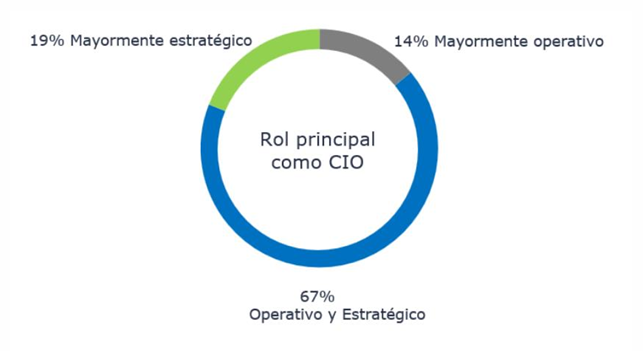

# Rol del CIO

Reflexión sobre la figura del CIO en su empresa 

Lectura artículo:  [El papel del CIO en 2024: una retrospectiva del año en clave TI | CIO](https://www.cio.com/article/3624204/el-papel-del-cio-en-2024-una-retrospectiva-del-ano-en-clave-ti.html?amp=1)

Inteligencia Artificial 
El incidente Crowdstrike
Ciber resiliencia
Oleada de ciberataques (ramsomware)

Caso de Lefevre => IA Generativa judicial
Digitalización y Dato: Decathlon => digitalización, boleta electrónica
Infraestructura => Coca-Cola (integrar la infraestructura)

Resumen: IA Generativa se ha llevado el papel protagónico en 2024.

---

### Sesión 1: Rol del CIO

#### Contenido Clave

1. **Propuesta de Valor del CIO**:    
    - Diseñar e implementar soluciones que respondan a necesidades del negocio.
    - Garantizar la seguridad de la información.
    - Facilitar procesos eficientes.
    - Contribuir en la estrategia del negocio mediante reducción de costos o aumento de ingresos.
2. **Competencias Relevantes**:
    - Visión estratégica.
    - Liderazgo para impulsar la transformación digital.
    - Gestión efectiva del talento del equipo

![[competencias_CIO.png]]

## Aterrizando la propuesta de valor de un CIO

• DISEÑAR e IMPLEMENTAR SOLUCIONES respondiendo a necesidades del negocio 
• Garantizar la SEGURIDAD de la información 
• que los PROCESOS funcionen 
• ENTENDER y ATERRIZAR RETOS de NEGOCIO. 
• Incrementar INGRESOS o reducir COSTES 
• Participar en DEFINIR la ESTRATEGIA del NEGOCIO

Dependiendo del momento de la empresa y el rol, se puede ser un CIO: <mark style="background: #FFF3A3A6;">estratégico</mark>, <mark style="background: #ADCCFFA6;">operativo</mark> o un mix de <mark style="background: #BBFABBA6;">ambos</mark>.

Un CIO puede tener las <mark style="background: #FFF3A3A6;">características</mark> de:
 - **Operador**: mantiene el delivery de TI, otros C-levels son sponsors
 - **Explorador**: ayuda a dotar de habilidades digitales a otros C-levels.
 - **Empoderador**: ayuda a otros, hace delivery, distribuye el conocimiento.

**Preferencias del CEO sobre proyectos IT**:
    - 39% prioriza proyectos que ahorren costos.
    - 37% busca iniciativas generadoras de ingresos.
    - 24% valora proyectos estratégicos como la satisfacción del cliente o la sostenibilidad