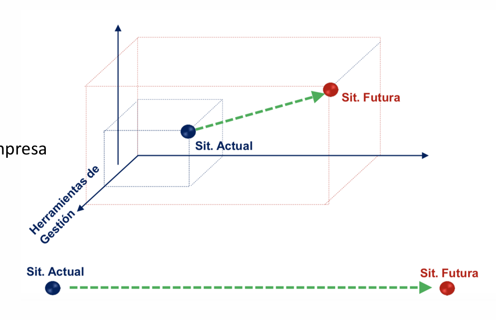

# Gobierno TI

## Lectura 1: ¿Qué es el gobierno de TI_ _ IBM.pdf

1.  **Elementos Fundamentales del Gobierno de TI**
	- Establecimiento de marcos y políticas para <mark style="background: #FFF3A3A6;">alinear TI con objetivos empresariales</mark>
	- <mark style="background: #ADCCFFA6;">Optimización</mark> de recursos tecnológicos
	-<mark style="background: #BBFABBA6;"> Gestión efectiva de riesgos e</mark>mpresariales
1. **Marcos de Referencia Destacados: Estándares Principales**
	- COBIT para control y auditoría de TI
	- ITSM para gestión de servicios tecnológicos
	- CMMI para evaluación y mejora de procesos
1. **Aspectos Críticos de Gestión Seguridad y Cumplimiento**
	- Protección de información corporativa y de terceros
	- Conformidad con normativas y regulaciones
	- Implementación de procedimientos de auditoría
1. **Continuidad Operativa**
	- Planificación de recuperación ante desastres
	- Mantenimiento de la continuidad del negocio
	- Responsabilidad financiera en la gestión de TI
 1. **Tendencias Emergentes**
	- Incorporación de IA generativa en la gobernanza
	- Actualización de políticas para nuevas tecnologías
	- Adaptación a cambios regulatorios y tecnológicos

---

# Gobierno TI

Para poder gestionar un departamento de TI, si se trabaja con proyectos, es conveniente tener un esquema de gobernanza. Esto implica:

 - <mark style="background: #FFF3A3A6;">Metodología</mark>
 - <mark style="background: #FFF3A3A6;">Procesos</mark>
 - <mark style="background: #FFF3A3A6;">Métricas, indicadores</mark>
 - Equipo alineado
 - Estructura organizativa
 - Apoyo de la dirección  y del negocio

## PMO (Project Manager Office)

Una PMO debe ser responsable de las metodologías, procesos y métricas. Esta gestión nos debe permitir ir desde la "situación actual" --> Hacia la "situación futura."

## Estructura de una PMO

![[PMO_arbol_estructura_funciones.png]]
Una PMO debe ser consistente y coherente con la estructura de la organización y es clave la buena comunicación. El enfoque debe ser totalmente pragmático, donde se pueda ver que se toman acciones y no es solo "papel". 

Para arrancar se deben realizar relevamiento, hablar con las personas, entender la situación actual y la estructura de la organización.

Un ejemplo de un punto de partida para el "alcance" de lo que se espera de una PMO sería:

![[PMO_situacion_actual.png]]

Con una tabla sencilla como este se puede tener un panorama general, un proceso, status actual de cada área (business line o vertical) de la empresa y con esta foto inicial se puede iniciar el trabajo.

El objetivo es llevar la foto inicial a una versión mucho mejor a medio/largo plazo:

![[pmo_objetivo_largo_plazo.png]]