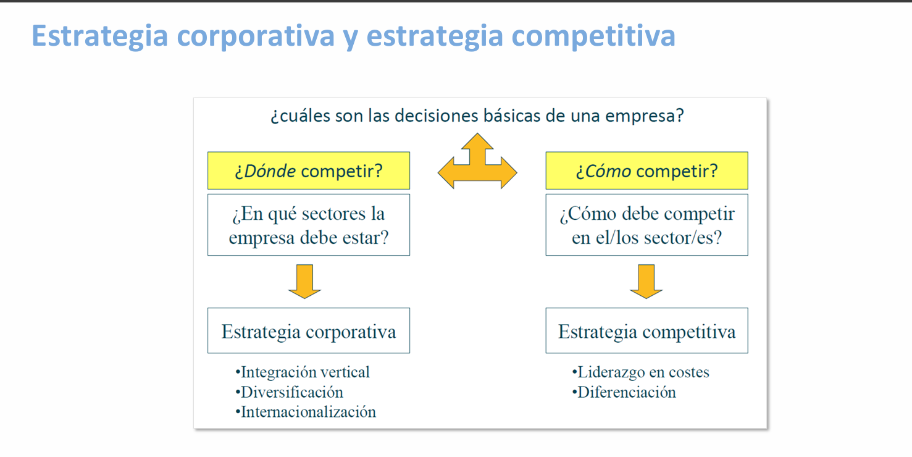
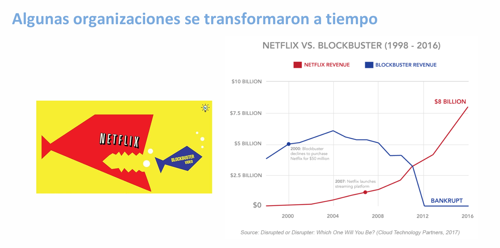

# Estrategia Empresarial y Digital

[← Inicio](https://matiaspakua.github.io/tech.notes.io)

## Qué es la estrategia? 

>[!quote]
>“La esencia de la formulación de una estrategia competitiva consiste en relacionar a una empresa con su medio ambiente y supone emprender acciones ofensivas o defensivas para crear una posición defendible frente a las cinco fuerzas competitivas en el sector industrial en el que está presente y obtener así un rendimiento superior sobre la inversión de la empresa” 
>
> Michael Porter, 1982

<mark style="background: #FFF3A3A6;">Dirección estratégica</mark>: planificar y gestionar cómo una organización alcanzará sus objetivos. 

<mark style="background: #FFF3A3A6;">Estrategia (la):</mark> conjunto de acciones planificadas sistemáticamente para lograr un determinado fin o objetivo

)

## Transformación a Digital: Netflix

)

## Índice de temas

- [Organizaciones digitales](sesion_2)
- [Rol del CIO y la función TI](sesion_3)
- [Sesion 4](sesion_4)
- [Alineamiento IT con Negocio](sesion_5)
- [Sesion 6](sesion_6)
