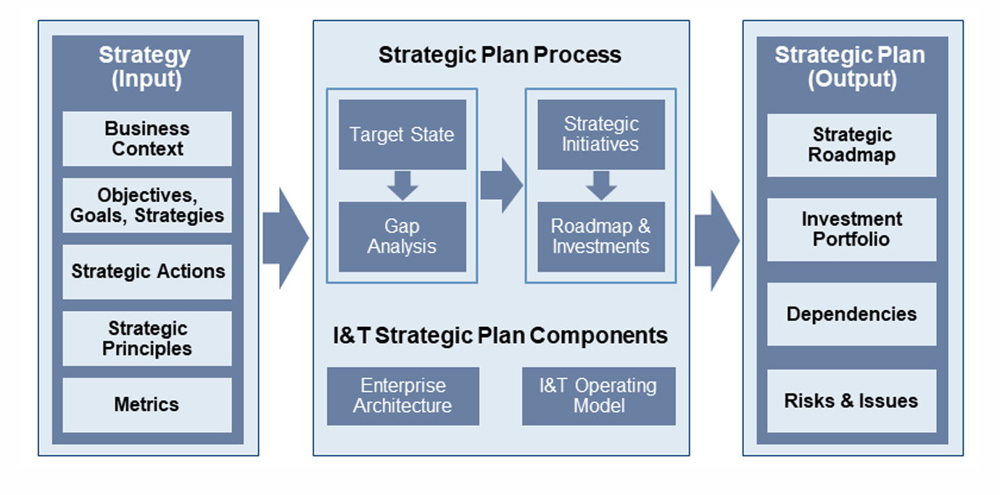

# Sesion 4

[← Estrategia Empresarial y Digital](sesion_1)

[← Inicio](https://matiaspakua.github.io/tech.notes.io)

Plan Estratégico: las acciones del día a día para ejecutar un plan.
Estrategia => largo plazo
Planes estratégicos => medio plazo
Planes operacionales => día a día

)

Capacidad de Negocio: son las competencias que se hacer (como negocio).

