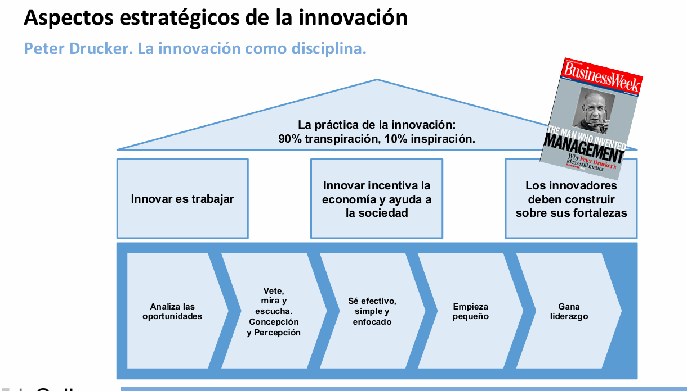
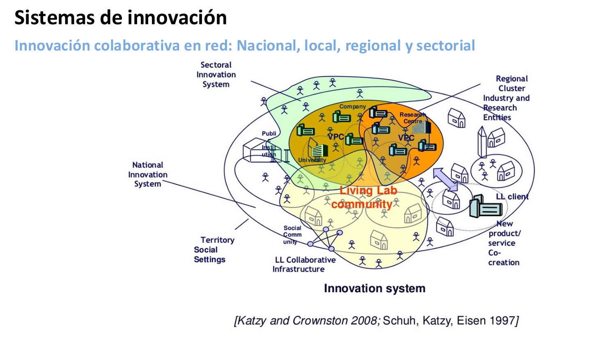

# Organización para innovar

[← Lecturas previas](sesion_1)

[← Inicio](https://matiaspakua.github.io/tech.notes.io)

Cada vez es más transversal. La innovación aplica a varios sectores.

)

## Open innovation

)

