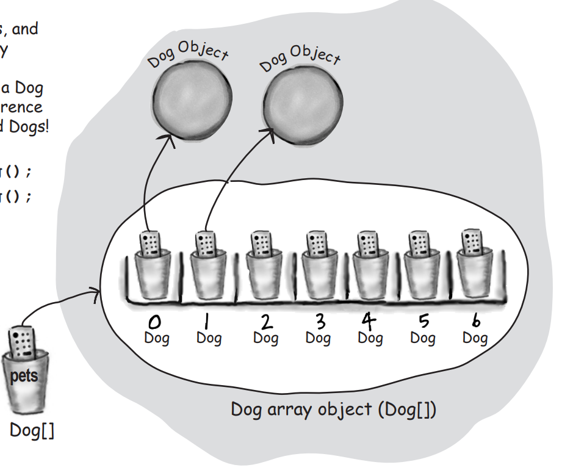
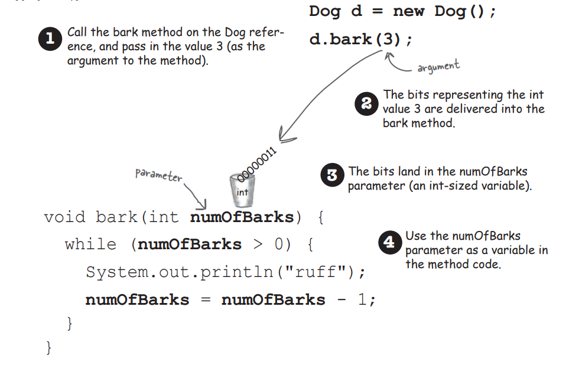

# On JAVA notes and other POO concepts

<style>
  .back-button {
    background-color: #4CAF50; /* Green */
    border: none;
    color: white;
    padding: 15px 32px;
    text-align: center;
    text-decoration: none;
    display: inline-block;
    font-size: 16px;
    margin: 4px 2px;
    cursor: pointer;
  }
</style>

<button class="back-button" onclick="window.location.href='https://matiaspakua.github.io/tech.notes.io'">All notes</button>

## Table of content


## Java, JVM and general topics

On Speed and memory usage, Java isn't the fastest language, but is almost as fast as C and Rust, BUT java uses a lot of memory.

Every java program needs a main() method, this isthe entry point.

```java

class SomeClass{
    public static void main(String[] args){
        // get the ball rolling.
    }
}
```

### the Java Virtual Machine

One of the importan responsabilities of the JVM is "dinamic binding". At runtime, a java program can include new objects that were's even known to the original programmer, so the JVM have to allow a centain amount of flexibility.

Another importan task of the JVM is avoid datatype violation and prevent access violation to memory, methods or classes.

There are some consideration about the size of a variable and what happens when you try to put a large value into a small variable: you get a "Spillage".

### References

All object are handled by Java using references: a bit pattern that point to a specific memory address that only the JVM can manage. As a developer, we do not care about the size and the internals of how Java manage the object references.

Exist a special reference: NULL, that point to nothing.



### Memory, Heap and Garbage Collection

Every object created in java goes into an area of memory known as THE HEAP (AKA The garbage collectible HEAP).

### Variables

In Java varaibles can store two general types os things: primitives and references (never as a programmer you work directly with an object)

Java is a strongly typed language, so, java cares about type, so every variable must hace a type and a name.

## Main concepts of OO and POO in Java

### Objects

Java is an object-oriented language, which means that everything in Java is an object. Objects have state, behavior, and identity, and they are instances of classes.

```java
public class BankAccount {
    private String accountNumber;
    private double balance;
    
    public BankAccount(String accountNumber, double balance) {
        this.accountNumber = accountNumber;
        this.balance = balance;
    }
    
    public String getAccountNumber() {
        return accountNumber;
    }
    
    public double getBalance() {
        return balance;
    }
    
    public void deposit(double amount) {
        balance += amount;
    }
    
    public void withdraw(double amount) {
        if (balance >= amount) {
            balance -= amount;
        } else {
            throw new RuntimeException("Insufficient funds");
        }
    }
}
```

In this example, BankAccount is a Java object with state, behavior, and identity:

 - **State**: The BankAccount object has two pieces of state: accountNumber and balance.
 - **Behavior**: The BankAccount object has two behaviors: deposit and withdraw, which allow you to add or subtract money from the account.
 - **Identity**: Each BankAccount object has a unique identity, determined by its memory address. This allows you to distinguish one BankAccount object from another.


In Java, the equals() and hashCode() methods are used to compare objects for equality and for using them as keys in hash-based data structures such as HashMap, HashSet, etc. The equals() method compares the object's state to determine whether two objects are equal or not, while the hashCode() method returns a unique integer value for each object, which is used to store objects in hash-based data structures.

The object identity is determined by the memory address where the object is stored. Each object has a unique identity that is not changed during its lifetime. The == operator in Java compares the identity of two objects, rather than their state.

When overriding the equals() method, it is recommended to also override the hashCode() method to ensure that objects that are equal according to the equals() method produce the same hash code. This is necessary for correct operation of hash-based data structures.

Therefore, in summary, the identity of a Java object is not directly related to the equals() and hashCode() methods, but these methods are important for comparing and storing objects based on their state.

```java
public class BankAccount {
    private int accountNumber;
    private String accountHolderName;
    private double balance;

    // Constructor and other methods omitted for brevity
    
    @Override
    public boolean equals(Object o) {
        if (this == o) return true;
        if (!(o instanceof BankAccount)) return false;
        BankAccount that = (BankAccount) o;
        return accountNumber == that.accountNumber &&
                Double.compare(that.balance, balance) == 0 &&
                Objects.equals(accountHolderName, that.accountHolderName);
    }

    @Override
    public int hashCode() {
        return Objects.hash(accountNumber, accountHolderName, balance);
    }
}

```

In this example, we're overriding the equals() and hashCode() methods to check for equality based on the account number, account holder name, and balance of two BankAccount objects. We're also using the Objects class to generate a hash code based on these three fields. This allows us to use BankAccount objects in collections such as HashSet and HashMap, where we need to be able to quickly look up objects and check for equality.


#### Methods and parameters

In POO we say "a caller passes arguments to a method. A Method takes parameter from outside". And there are some rules about this. If a method takes parameters, you must pass it something when you call it. And that something must be a value of the appropriate TYPE (java cares aboout type!!).



Methods can return values or VOID (nothing). And again, if you define a return value, you must return it.

**IMPORTANT**: Java is pass-by-value, that means pass-by-copy. With references, what happens is that the method copy the reference (the pointer) to the object.

To manipulate objects we use Getters (accessors) and Setters (mutators). And here appear a new concept: **ENCAPSULATION**

#### Encapsulation

Encapsulation is one of the fundamental principles of Object-Oriented Programming (OOP) that aims to protect the data of an object from being modified or accessed directly from outside the object. It is the practice of hiding the implementation details of an object and providing a well-defined interface for accessing and manipulating its data.

In encapsulation, an object's data is protected by making its properties private, which means they can only be accessed or modified through public methods (getters and setters) defined in the class. This way, the internal state of the object is safe from accidental or intentional modification, ensuring that the object remains in a consistent state.

To implement encapsultation exist the access modifiers: PUBLIC, PRIVATE, PROTECTED. In general, all the attributes (state) of an object must be private and you need to provide getters/setters methods to manage the object state.

#### Default values

Instance variables (defined in a class) always get a default value.

 * Integers = 0
 * floating points = 0.0
 * booleans = false
 * references = null

Local variables (inside a method) do NOT get a default value. Here the compile complains if you try yo use a local variable before the variable is initilized.


### Classes

 A class is a blueprint for creating objects. It defines the properties and methods that an object will have. In Java, a class is defined using the class keyword.

```java

BankAccount account1 = new BankAccount("John", 1000);
BankAccount account2 = new BankAccount("Mary", 500);

// Transfer 200 from account1 to account2
account1.transfer(200, account2);

// Display the balance of account1
System.out.println("Balance of account1: " + account1.getBalance());

```
In this example, account1 and account2 are two instances of the BankAccount class, each with a unique identity. We transfer 200 from account1 to account2 by calling the transfer() method on account1 and passing account2 as a parameter. The transfer() method can use the identity of both accounts to perform the transaction.

We can also display the balance of account1 by calling its getBalance() method. Again, the identity of account1 is used to retrieve its balance from the system.


### Inheritance

Inheritance is a mechanism that allows one class to inherit the properties and methods of another class. This promotes code reuse and helps to create a hierarchy of classes.

```java 
public class BankAccount {
    private double balance;
    
    public BankAccount(double balance) {
        this.balance = balance;
    }
    
    public double getBalance() {
        return balance;
    }
    
    public void deposit(double amount) {
        balance += amount;
    }
    
    public void withdraw(double amount) {
        balance -= amount;
    }
}

public class SavingsAccount extends BankAccount {
    private double interestRate;
    
    public SavingsAccount(double balance, double interestRate) {
        super(balance);
        this.interestRate = interestRate;
    }
    
    public double getInterestRate() {
        return interestRate;
    }
    
    public void setInterestRate(double interestRate) {
        this.interestRate = interestRate;
    }
    
    public void addInterest() {
        double interest = getBalance() * interestRate;
        deposit(interest);
    }
}

public class CheckingAccount extends BankAccount {
    private double overdraftLimit;
    
    public CheckingAccount(double balance, double overdraftLimit) {
        super(balance);
        this.overdraftLimit = overdraftLimit;
    }
    
    public double getOverdraftLimit() {
        return overdraftLimit;
    }
    
    public void setOverdraftLimit(double overdraftLimit) {
        this.overdraftLimit = overdraftLimit;
    }
    
    @Override
    public void withdraw(double amount) {
        if (amount > getBalance() + overdraftLimit) {
            throw new IllegalArgumentException("Insufficient funds");
        }
        balance -= amount;
    }
}

```
In this example, the SavingsAccount and CheckingAccount classes inherit from the BankAccount class. They both have additional attributes and methods that are specific to their types of accounts. The SavingsAccount has an interest rate attribute and a method to add interest, while the CheckingAccount has an overdraft limit attribute and an overridden withdraw method that allows overdrafts up to the limit. By using inheritance, the common behaviors and attributes of bank accounts are defined in the BankAccount class and reused in the SavingsAccount and CheckingAccount classes.

### Encapsulation

Encapsulation is the practice of hiding the internal details of an object from the outside world. This is done by making the internal state of an object private and providing public methods to access and modify that state.

In the first example, the accountNumber and balance fields are marked as private, meaning that they can only be accessed within the BankAccount class. However, public getter and setter methods have been provided to allow access to these fields in a controlled manner.

The getter and setter methods ensure that clients of the BankAccount class can only access the accountNumber and balance fields in a way that is safe and controlled by the class's implementation. This is an example of encapsulation, where the internal workings of a class are hidden from the outside world and can only be accessed through well-defined interfaces.


### Polymorphism

Polymorphism is the ability of an object to take on many forms. In Java, this is achieved through method overloading and method overriding.

Let's say we want to create a program that accepts a list of bank accounts and prints out their current balance. We can use polymorphism to achieve this by creating an abstract class BankAccount with a method getBalance() that is implemented differently by its subclasses CheckingAccount and SavingsAccount.

```java
abstract class BankAccount {
    protected double balance;
    
    public BankAccount(double balance) {
        this.balance = balance;
    }
    
    public abstract double getBalance();
}

class CheckingAccount extends BankAccount {
    private double overdraftLimit;
    
    public CheckingAccount(double balance, double overdraftLimit) {
        super(balance);
        this.overdraftLimit = overdraftLimit;
    }
    
    public double getBalance() {
        return balance + overdraftLimit;
    }
}

class SavingsAccount extends BankAccount {
    private double interestRate;
    
    public SavingsAccount(double balance, double interestRate) {
        super(balance);
        this.interestRate = interestRate;
    }
    
    public double getBalance() {
        return balance + (balance * interestRate);
    }
}

```

Sure! Let's say we want to create a program that accepts a list of bank accounts and prints out their current balance. We can use polymorphism to achieve this by creating an abstract class BankAccount with a method getBalance() that is implemented differently by its subclasses CheckingAccount and SavingsAccount.

Here's an example implementation:

```java
abstract class BankAccount {
    protected double balance;
    
    public BankAccount(double balance) {
        this.balance = balance;
    }
    
    public abstract double getBalance();
}

class CheckingAccount extends BankAccount {
    private double overdraftLimit;
    
    public CheckingAccount(double balance, double overdraftLimit) {
        super(balance);
        this.overdraftLimit = overdraftLimit;
    }
    
    public double getBalance() {
        return balance + overdraftLimit;
    }
}

class SavingsAccount extends BankAccount {
    private double interestRate;
    
    public SavingsAccount(double balance, double interestRate) {
        super(balance);
        this.interestRate = interestRate;
    }
    
    public double getBalance() {
        return balance + (balance * interestRate);
    }
}
```

In this example, BankAccount is an abstract class with a protected balance variable and a constructor that sets the initial balance. It also has an abstract method getBalance() that will be implemented differently by the subclasses.

CheckingAccount and SavingsAccount are subclasses of BankAccount that each implement the getBalance() method differently. CheckingAccount adds the overdraftLimit to the balance, while SavingsAccount calculates interest on the balance based on the interestRate.

Now we can create a list of BankAccount objects that contains both CheckingAccount and SavingsAccount objects, and iterate through the list to print out their balances:

```java
List<BankAccount> accounts = new ArrayList<>();
accounts.add(new CheckingAccount(1000, 500));
accounts.add(new SavingsAccount(2000, 0.02));

for (BankAccount account : accounts) {
    System.out.println("Current balance: " + account.getBalance());
}
```

The output will be:
```bash
Current balance: 1500.0
Current balance: 2040.0
```

Notice how we were able to use polymorphism to iterate through the list of BankAccount objects and call the getBalance() method on each one, without needing to know the specific implementation of that method in each subclass. This makes our code more flexible and easier to maintain.

One problem that can arise when using polymorphism in Java is the possibility of runtime errors caused by incorrect casting or mismatched method signatures. For example, if a superclass has a method with a certain signature and a subclass overrides it with a different signature, this can lead to unexpected behavior or even runtime errors if the wrong method is called at runtime. Additionally, polymorphism can sometimes make code harder to read and understand if it's not used carefully and appropriately.

For example, let's say we have a superclass BankAccount with a method withdraw that subtracts a specified amount from the account balance. Now, let's say we have a subclass SavingsAccount that extends BankAccount and overrides the withdraw method to impose a penalty fee if the withdrawal amount exceeds the account's balance.

Here's an example implementation of the SavingsAccount class:


Abstraction: Abstraction is the process of simplifying complex systems by breaking them down into smaller, more manageable parts. In Java, this is achieved through abstract classes and interfaces.

Exception Handling: Exception handling is the mechanism that Java uses to handle errors and other exceptional events that occur during program execution. Java provides a set of keywords and constructs for catching and handling exceptions.

**Primitive types**: Java has both primitive types (such as int, double, boolean, etc.) and object types (such as String, Integer, Double, etc.). Primitives types are not objects, they are basic data types that represent simple values. However, in Java, the primitive types are wrapped by their corresponding object types, such as Integer, Double, etc. These object types provide additional functionality and allow the primitive types to be treated like objects in certain contexts, such as passing them as arguments to methods that expect objects or using them in collections that require objects. This process is known as "autoboxing" and "unboxing".


What is the difference between Overloading and Overriding

soluciones declarativas (por ejemplo el uso de colecciones con Stream, no utilizar únicamente for + if),
Mejorar algunas cuestiones de modelado (por ejemplo con expresiones booleanas o fechas como strings
SOLID
CRUD
MVC

Tecnologías:
Docker, Jenkins, Travis, and Kubernetes.
Ruby on Rails 

Testing:
Testing
Web Testing Selenium


Java
Stream
Sort
Filters
Reduce
Parallel

Métodos de Ordenamiento
Buble Sort


Creemos que investigando más sobre estos conceptos: POO, SOLID y Clean Code podrás fortalecer mucho tu perfil profesional. Te comparto algunos artículos o contenido en videos, para fortalecer estos conceptos que para nosotros son de suma importancia: 


SOLID
Sandro Mancuso - SOLID: https://reversecoding.net/solid-principles-explained-sandro-mancuso/
Clean Code
https://medium.com/mindorks/how-to-write-clean-code-lessons-learnt-from-the-clean-code-robert-c-martin-9ffc7aef870c
https://medium.com/s/story/reflections-on-clean-code-8c9b683277ca
https://williamdurand.fr/2013/06/03/object-calisthenics/
https://sourcemaking.com/refactoring/smells
Capitulo Nro 2 del libro Clean Code de Robert C. Martin


TDD
Martin Fowler - TDD: https://martinfowler.com/bliki/TestDrivenDevelopment.html
Robert C. Martin - Cycles of TDD: http://blog.cleancoder.com/uncle-bob/2014/12/17/TheCyclesOfTDD.html
Robert C. Martin - ¿Por qué hacer TDD?: https://www.youtube.com/watch?v=GvAzrC6-spQ
Interaction Domain Driven Design (IDD)
IDD - Sandro Mancuso vimeo.com/130256611
Domain Driven Design (DDD)
DDD - https://medium.com/the-coding-matrix/ddd-101-the-5-minute-tour-7a3037cf53b8

