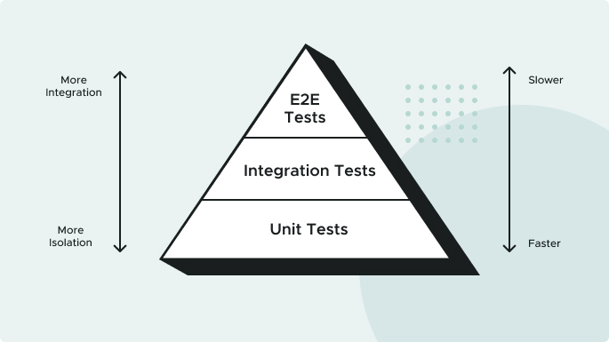
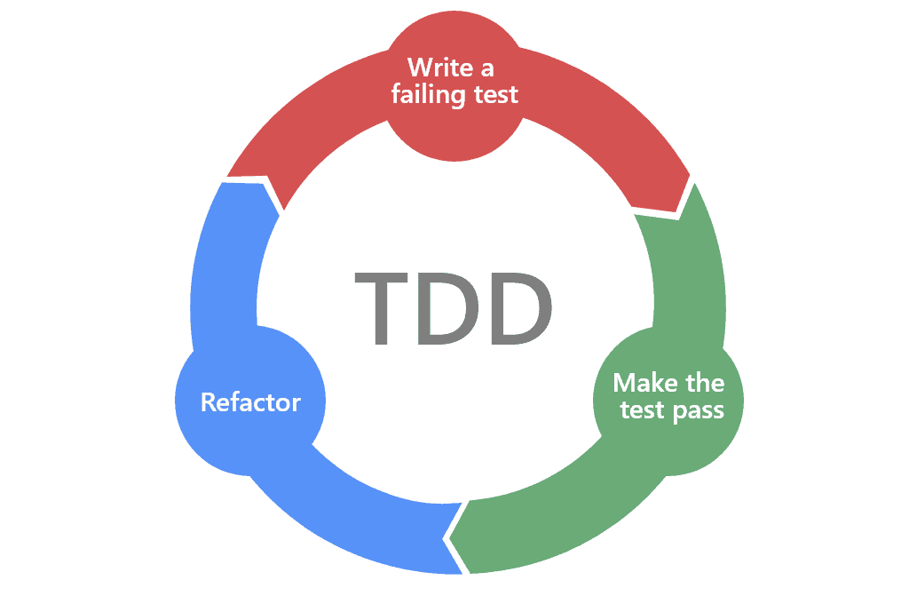

# On Unit Test, TDD and BDD

<button class="back-button" onclick="window.location.href='https://matiaspakua.github.io/tech.notes.io'">All notes</button>

## Table of content

## What is unit testing

The idea of "unit testing" is to test individual units or components of software to ensure that they are working correctly and meeting their intended functionality. Unit testing involves writing and running automated tests that isolate a specific piece of code, such as a function or method, and verify its behavior under different scenarios or inputs. By catching errors early and ensuring that each unit works as intended, unit testing can help improve the quality and reliability of software, while also reducing the time and cost of debugging and fixing issues later in the development cycle.

## The Testing Pyramid

Different tests can be written at different levels of the system. At each level, there is a balance between the speed of execution, the “cost” to maintain the test, and the confidence it brings to system correctness. This hierarchy is often represented as a “testing pyramid”.

**Unit Tests**: A Unit Test exercises a small “unit” of the system that is isolated from the rest of the system. They should be simple and speedy. You want a high ratio of Unit Tests in your testing pyramid as they’re key to designing highly cohesive, loosely coupled software.

**Integration Tests**: Integration Tests exercise a subset of the system and may exercise groups of units in one test. They are more complicated to write and maintain, and run slower than unit tests.

**End-to-End Tests**: An End-to-End Test exercises the system using the same interface that a user would, such as a web browser. While extremely thorough, End-to-End Tests can be very slow and fragile because they use simulated user interactions in potentially complicated UIs. Implement the smallest number of these tests.

## TDD. Testing First

What is Test Driven Development? It’s common for software development teams to author automated test suites to guard against regressions. Often these tests are written after the application feature code is authored. We'll take an alternative approach: we'll write tests before implementing the application code. This is called test driven development (TDD).

Why apply TDD? By asserting expected behavior before implementing the desired functionality, we’re designing the system based on what we want it to do, rather than what the system already does.

Another benefit of “test-driving” the application code is that the tests guide you to write the minimum code needed to satisfy the implementation. When the tests pass, you have a working implementation (the application code), and a guard against introducing errors in the future (the tests).

## The Red, Green, Refactor Loop

Software development teams love to move fast. So how do you go fast forever? By continuously improving and simplifying your code–refactoring. One of the only ways you can safely refactor is when you have a trustworthy test suite. Thus, the best time to refactor the code you're currently focusing on is during the TDD cycle. This is called the Red, Green, Refactor development loop:

1. **Red**: Write a failing test for the desired functionality.
2. **Green**: Implement the simplest thing that can work to make the test pass.
3. **Refactor**: Look for opportunities to simplify, reduce duplication, or otherwise improve the code without changing any behavior—to refactor.
4. Repeat!

## References
- [10 Pines videos](https://academia.10pines.com/webinars_and_videos)
- [10 pines Diseño a la Gorra](https://academia.10pines.com/disenio_a_la_gorra)
- [TDD Cycle Wikipedia](https://en.wikipedia.org/wiki/Test-driven_development)