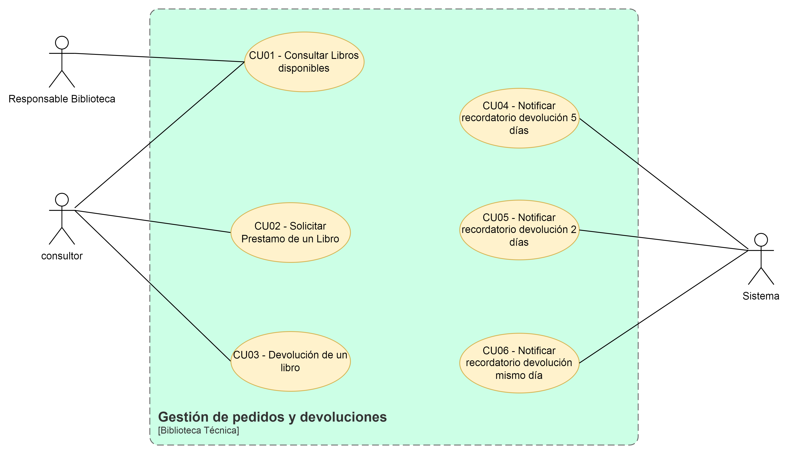
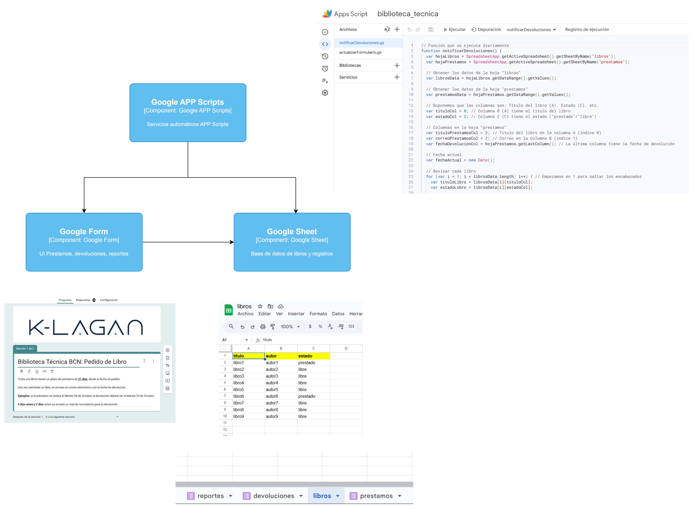

<button class="back-button" onclick="window.location.href='https://matiaspakua.github.io/tech.notes.io'">All notes</button>

---
# Introducción 

GitHub Repository:

[matiaspakua/biblioteca_tecnica: POC de un sistema de biblioteca técnica](https://github.com/matiaspakua/biblioteca_tecnica)

## Origen de la propuesta

Entre los consultores de la empresa, existe un gran interés por la formación y el desarrollo profesional en temas específicos y/o avanzados. Para ello, la lectura de libros técnicos con autores de referencia es una herramienta fundamental. Sin embargo, estos libros suelen ser de difícil acceso, ya que solo se pueden adquirir a través de Amazon o editoriales especializadas (O’Reilly, Wiley, etc.), no suelen estar traducidos al español y tienen un precio elevado (entre 30 y 60 euros).

La creación de una biblioteca técnica permitiría a los consultores acceder a información especializada y económica (los compraría KLAGAN), lo que resultaría en una mejora de las habilidades y en la calidad de los proyectos que se desarrollan.

Además, la creación de una biblioteca técnica es una inversión que se traduciría en un beneficio tangible para la empresa, mejorando la formación y el desarrollo profesional de los consultores, y por ende, la calidad de los servicios que se ofrecen.

## Reglas básicas de uso

1. Adquirir libros técnicos (desarrollo/programación, arquitectura, certificaciones, etc.) por medio de K-LAGAN y que serán de propiedad de K-LAGAN, para que sean utilizados por todos los empleados.
2. IMPORTANTE: debido a que son libros físicos, el problema que se genera es que empleados de otras locaciones no podrían acceder al beneficio.
3. Pedir un libro nuevo: tiene que haber al menos 3 interesados en un libro para poder realizar el pedido de compra a K-LAGAN. Se debe analizar bien el libro a solicitar, donde lo ideal es que sean libros que soporten el paso del tiempo en cierto grado o libros de referencia muy conocidos, de autores reconocidos, de manera tal que el contenido no pierda vigencia con el tiempo: ejemplo: El libro de Patrones de Diseño (de 1994) y aún vigente.
4. Si un libro es dañado, se le descontará el precio total a la persona que lo dañó (para poder reponerlo) y se volverá a comprar.
5. Al pedir un libro para leer, se le da un plazo de 20 días antes de devolverlo y no se puede volver a pedir de forma consecutiva, salvo que NO haya nadie más interesado en leer el libro en el periodo siguiente.
6. Los libros estarían disponibles en la oficina de KLAGAN y solamente desde ahí se podrían devolver y pedir prestados nuevamente.
7. Se deberá llevar un registro de quien solicitó un libro, cuando y quienes están en lista de espera para ese libro (se puede comenzar con un Excel inicialmente donde solo una persona de KLAGAN tenga permisos de escritura para llevar el registro de préstamos)
8. De esta lista preliminar, se envía una “encuesta” a todos los empleados de KLAGAN (Barcelona) y los 3 (tres) libros más votados serían los candidatos para comprar. 
9. Luego de 3 o 4 meses, repetir la encuesta, con los libros que quedaron sumados a otros sugeridos (quizás en la misma encuesta solicitar sugerencias).

## Funcionamiento esperado de la Bibliotecas Técnica

[Descripción del caso de negocio]

La bibliotecas técnica es un herramienta de aprendizaje que pretende ser un punto de formación para las personas. A través de la adquisición de libros técnicos reconocidos y de interés en distintos campo/áreas de interés, se pretende que las personas tengan la oportunidad de solicitar a préstamo por un tiempo especificado (por ejemplo, 3 semanas) alguno de los libros de interés. 

La biblioteca se irá actualizado de acuerdo a la necesidad y solicitud de las personas, donde se pretende adquirir libros nuevo según esa necesidad. Este aspecto requiere que lo libros sean mantenidos en algún tipo de registro (titulo, autor y cualquier información relevante). Este registro deberá permitir incluir nuevos libros, modificar los existentes, por ejemplo, una corrección en el titulo, la eliminación de libros en los casos donde alguno sea dañado físicamente, perdido o destruido por alguna razón externa. El o las personas encargadas de la administración de la bibliotecas deberán tener la capacidad de acceder a toda ésta información, desde la lista de libros disponibles hasta los registros de prestamos y devoluciones a lo largo del tiempo.

Las personas interesadas en solicitar un préstamo de libro deberán tener la capacidad de poder solicitar la lista de libros disponible para elegir. Una persona que este interesada en un libro, debería poder solicitar un préstamo de uno de los libros disponibles y ese préstamo deberá quedar registrado, de igual manera el estado del libro solicitado deberá pasar de "libre" a "prestado" y otras personas que quieran solicitar dicho libro no deberían tener la capacidad de hacerlo hasta que dicho libro sea devuelto.

Las personas que han solicitado prestado un libro tendrán un plazo de 3 semanas (21 días) para tener el libro en su poder. Para mejorar la comunicación, se requiere algún mecanismo de "recordatorios" que permita notificar a los usuario 5 y 2 días antes del plazo de vencimiento del préstamo por medio de un correo electrónico. Luego de pasado dicho plazo, si el libro no ha sido devuelto, se deberá notificar a alguno de los administradores de la bibliotecas para que tome acción.

La devolución de libros la deberá realizar cada persona que haya solicitado un préstamo y al igual que los prestamos, las devoluciones también deberán quedar registradas a modo de registro histórico. Al momento de registrarse una devolución, el estado del libro deberá pasar de "prestado" a "libre" y con este cambio de estado, pasara a estar disponible para ser solicitado a préstamo por otras personas.

Tanto los registros de prestamos como devolución deberán contener como mínimo la siguiente información:

 - Fecha de préstamo o devolución
 - Nombre y apellido de la persona
 - Correo electrónico
 - Titulo del libro prestado o devuelto.

## Analisis: DCU

## Tecnologías

Esta POC utiliza:

1. Google Sheet para mantener la base de datos de libros disponibles, registro de devoluciones y préstamos.
2. Google Forms con un formulario para solicitud de libros y otro form para devolución de libros.
3. Google APP Scrips para los CRUD automáticos disparados con los envios de formularios, notificación de devoluciones y otras validaciones internas.

