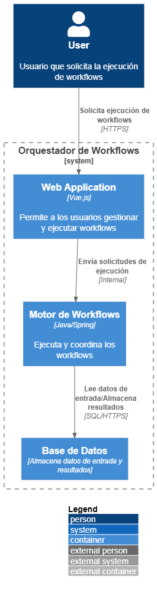

# Proyecto: Orquestador de workflows

## Introducción

Este proyecto tiene como objetivo definir un sistemas de gestión, ejecución y monitoreo de workflows. Un <mark style="background: #FFF3A3A6;">workflow</mark> se define como una secuencia de tareas que se deben llevar a cabo por uno o varios componentes de un sistema. 

Cada tarea de un workflow se define de forma independientes, autónoma y autosuficientes, esto quiere decir que al ser llamada para su ejecución, recibe una entrada (<mark style="background: #FFF3A3A6;">data input</mark>) y genera una salida (<mark style="background: #FFF3A3A6;">data output</mark>). Tantos los data inputs como outputs pueden ser de diversa naturaleza (un mensaje, datos en formato binario, un txt, csv, json, etc).

Un workflow se debe define en un archivo YAML donde cada archivos es un "<mark style="background: #FFF3A3A6;">workflow definition</mark>", dentro del YAML, cada sección es una tarea y cada tarea es ejecutada por uno (y solo uno) componente del sistema o interfaz externa (componente externo).

## Repositorio de código

URL:
https://github.com/matiaspakua/orquestador_workflows

## Alcance

// TODO

## Definiciones

La lista de tareas del workflow definition (archivo .yaml) se definen de la siguiente manera:

```terminal
$ workflow_1.yaml
```


```yaml

workflow_name: workflow_1
steps:
- step:
  component: component_A
  imput: input_data_A
  output: output_data_A
  wait_for_return: false

```


## Contexto





