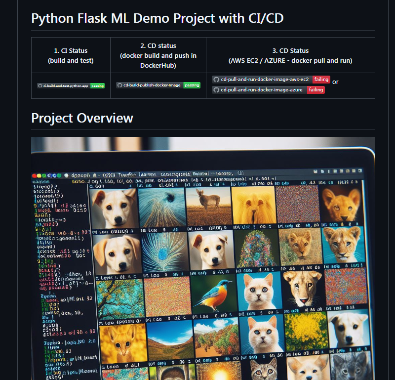
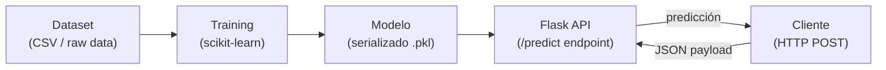

# Python Flask ML Demo Project with CI/CD

[← Inicio](https://matiaspakua.github.io/tech.notes.io)

Link to GitHub Repo: [matiaspakua/ml-demo-project — Demonstration project for the Specialization Building Cloud Computing Solutions at Scale](https://github.com/matiaspakua/ml-demo-project)

)

## Stack

- **Python / Flask** — API REST que expone el modelo como endpoint
- **scikit-learn** — entrenamiento y serialización del modelo ML
- **Docker** — contenerización del servicio
- **CI/CD** — pipeline de integración continua (GitHub Actions)

## Flujo del sistema

## Referencias

- [Flask — Official Documentation](https://flask.palletsprojects.com/)
- [scikit-learn User Guide](https://scikit-learn.org/stable/user_guide.html)
- [Building Machine Learning Powered Applications — Emmanuel Ameisen, O'Reilly, 2020](https://www.oreilly.com/library/view/building-machine-learning/9781492045106/)

## Notas relacionadas

- [Conceptos de IA](../artificial_intelligence/ruta_de_aprendisaje/1.fundamentos_inteligencia_artificial/1_conceptos_generales.md)
- [Fundamentos de estadística y ML](../artificial_intelligence/ruta_de_aprendisaje/1.fundamentos_inteligencia_artificial/2_fundamentos_estadistica_aprendizaje_automatico.md)
- [Cloud Computing Solutions at Scale](../general_topic/specialization_building_cloud_computing_solutions_at_scale.md)