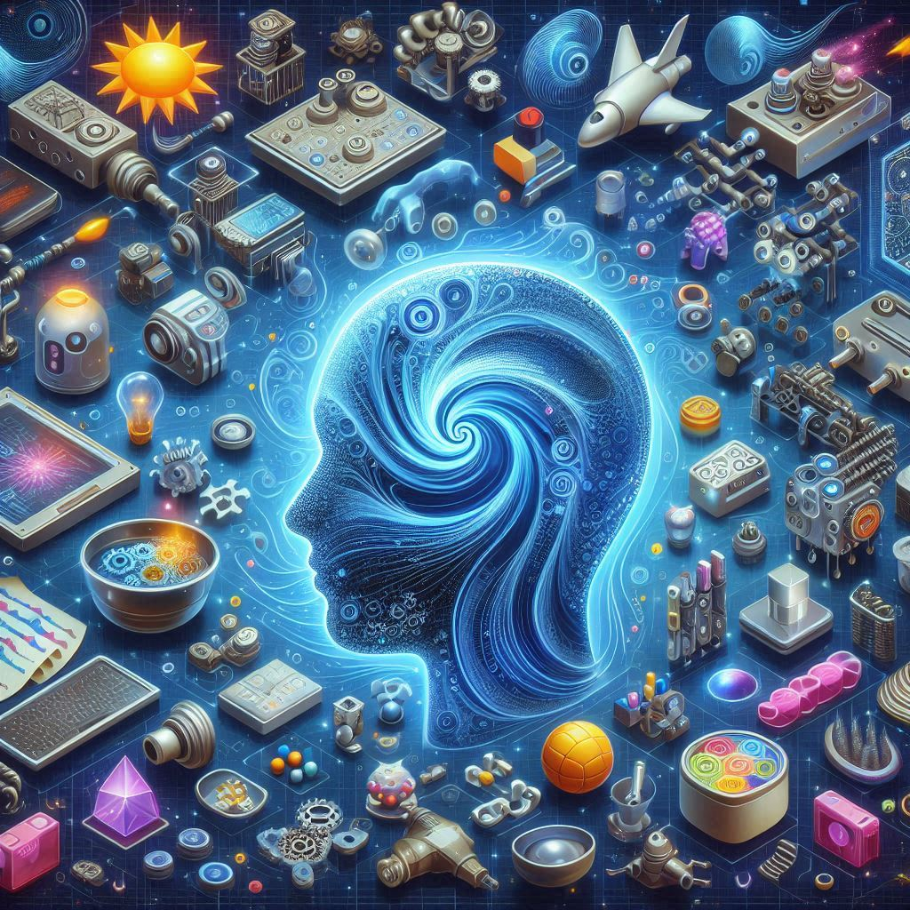
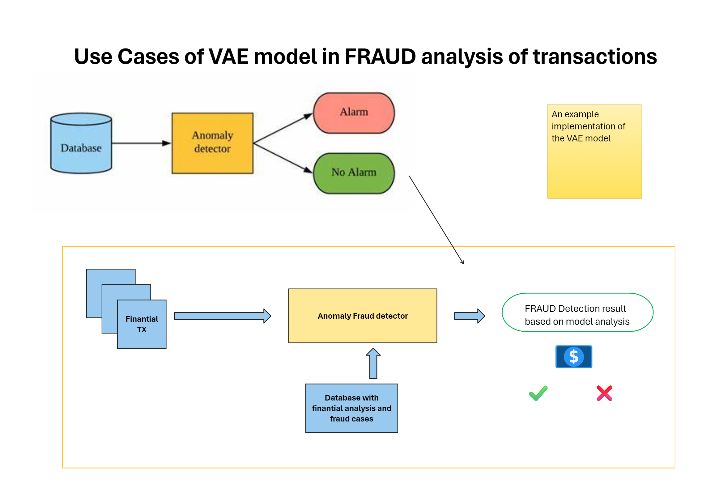

# Generative IA

<button class="back-button" onclick="window.location.href='https://matiaspakua.github.io/tech.notes.io'">All notes</button>

# Table of content

 * Introduction
 * Differents types of generative IA
 * Understanding how Generative AI works
 * Using Generative AI Models for Content Creation
 * Main models
 * Text to image applications
 * Generative Adversarial Networks (GANs)
 * VAE and Anomaly Detection
 * Future predictions
 * The Future of Jobs
 * Moral and executive skill set required to work with GenAI
 * Caution when working with generative AI
 * Reference

---

## Introduction

**Concept**: Generative AI is a technology that can create new content, like images, text, or music, based on existing data.
**Impact**: Generative AI is revolutionizing how we work by automating repetitive tasks and allowing us to focus on more creative and strategic aspects. Here are some specific examples:
1. Easier content creation (text, music, images)
2. Faster access to information
3. Design assistance
4. Automation of repetitive tasks

### Differents types of generative IA

* **Generative AI**: A specific type of AI that focuses on creating new content (text, images, music) as its primary function.
* **Discriminative AI**: A broader category of AI that analyzes and categorizes existing data.
* **Subcategories of AI**: The text mentions various subcategories like reactive AI (self-driving cars), limited memory AI (weather forecasting), Theory of mind AI (customer service chatbots), and others.
* **Key Distinction**: Generative AI is specifically designed to create new content, while other AI subcategories might generate content as a secondary function.

### Understanding how Generative AI works

 * **Building Blocks of AI**: Similar to how we can identify objects based on past experiences, AI is trained on massive amounts of data to perform tasks.
 * **Generative AI vs Traditional AI**: Generative AI is a specific type of AI designed to create entirely new content, whereas traditional AI might generate content as a byproduct of its function.
 * **Generative AI Models**: These are the "engines" that power generative AI, built by specialists and funded by companies and universities. Examples include models from OpenAI, NVIDIA, Google, etc.
 * **Accessibility of Generative AI**: There are different levels of access depending on technical expertise:
 * **Business Leaders**: Partner with companies that have generative AI models or use open-source models for their projects.
 * **Creative Users**: Use pre-built generative AI models from repositories like GitHub and then combine them with AI notebooks (like Google Colab) to run the model.
 * **General Users**: Access generative AI through online services or apps like DALL-E, Midjourney, etc.

### Using Generative AI Models for Content Creation

**Generative AI Models**: The core element, a set of algorithms trained on specific data to create new content.

 - User Access Levels:
 * **Beginners**: Use pre-built applications with minimal customization (e.g., Midjourney, Lensa).
 * **Intermediate Users**: Utilize AI notebooks (e.g., Google Colab) with pre-existing generative AI models for more control.
 * **Advanced Users (Creative Technologists)**: Access generative AI models directly from code repositories (e.g., GitHub) and integrate them into notebooks for maximum customization.
 * **Programmers**: Create their own notebooks using model code from repositories.
 * **AI Notebooks (e.g., Google Colab)**: Platforms specifically designed to run generative AI model code, often offering customization options for the generated content.
 * **Creative Applications**: Pre-built interfaces that utilize generative AI models for specific creative tasks (e.g., avatar creation).
 * **Generated Outcome**: The final creative product produced by a user through a generative AI service or notebook.

## Main models

- **GPT Overview**: GPT (Generative Pre-trained Transformer) is a language model by OpenAI known for generating human-like text, using transformer architecture for widespread use in natural language processing
- **Industry Applications**: GitHub Copilot and Microsoft's Bing have integrated generative AI to enhance coding and search functionalities, respectively.
- **Rapid Adoption**: ChatGPT's public release saw 1 million users in a week, indicating quick adoption compared to other companies.
- **Limitations and Considerations**: GPT has limitations like lack of common sense and potential biases, requiring careful development and use, especially in creative writing.

###  Text to image applications

- **Rise of Services**: In 2022, there was a significant increase in commercial image generation services known as text to image, where users type descriptions and algorithms create images.
- **Main Tools**: The three primary services are Midjourney, DALL-E, and Stable Diffusion, each with unique characteristics akin to different operating systems.
- **Industrial Uses**: Examples include Cuebric for film backgrounds, Stitch Fix for fashion, and various marketing campaigns using generative AI for efficiency and a unique aesthetic.

 [Example comparison]

### Generative Adversarial Networks (GANs)

- **GAN Mechanics**: GANs consist of two parts, **The Generator** and **The Discriminator**, which work together in a competitive game to create realistic data. The Generator attempts to create data that is indistinguishable from real data, while The Discriminator tries to detect the difference.

- **Real-World Applications**: GANs have been used by **Audi** for wheel design inspiration, by **Beko** for creating a brand-funded AI film, and in **financial fraud detection** to generate synthetic transaction data for training fraud detection models.

- **Versatility of GANs**: The same GAN model can be applied to diverse fields, showcasing its versatility in creating new styles for automotive design, producing visual effects for films, and solving financial fraud detection problems.

### VAE and Anomaly Detection

- **Variational Autoencoders (VAE)**: A type of generative AI model used for anomaly detection by learning from a dataset of normal data.
- **Anomaly Detection Applications**: VAEs are applied in various fields such as fraud detection in financial transactions, manufacturing quality control, and network security
- **Real-World Examples**: Companies like Uber and Google use VAEs for detecting financial fraud and network intrusions, respectively.
- **Healthcare Utilization**: VAEs help in medical anomaly detection, like predicting sepsis risk from electronic health records at Children's National Hospital.

### Future predictions

- **Generative AI in Creative Industries**: In the next 2-3 years, generative AI will enhance computer graphics and animation to create more realistic characters and environments, especially in 3D modeling.

- **Virtual Assistants & Chatbots**: Generative AI will improve natural language understanding, making virtual assistants and chatbots more adept at handling complex conversations.

- **Energy & Transportation**: It will optimize energy consumption and production, manage renewable energy sources, and improve energy distribution efficiency. In transportation, it will optimize traffic flow and predict vehicle maintenance needs.

- **Long-Term Predictions (10-15 years)**: Generative AI will create accurate simulations in architecture, urban planning, and engineering, develop new materials and products, and enhance content creation in media. It will also impact self-driving cars, advanced robotics, and precision agriculture.

### The Future of Jobs

1. **Impact on Job Market**: The discussion highlights the inevitability of changes in the job market as a result of advanced technologies like generative AI. It emphasizes that while certain jobs may become obsolete, new opportunities will emerge, as has been the case throughout history.

2. **Historical Examples**: Examples such as the transition from knocker uppers to alarm clocks and the disappearance of switchboard operator jobs with the advent of automated telephone exchange systems are few changes that we had pass throught. These examples illustrate how technological advancements have reshaped the job landscape in the past.

3. **Automation of Repetitive Tasks**: The potential for automation of tasks that are repetitive, dirty, dull, dangerous, or difficult (the four D's) through generative AI. This automation would free up human resources to focus on more human-centric skills such as creativity, problem-solving, empathy, and leadership.

4. **Role of Humans in Generative AI Companies**: Despite the use of generative AI technology, companies in this space still heavily rely on human involvement across various roles including developers, artists, customer relations, project managers, writers, creative directors, and producers.

5. **Liberation and Creativity**: The generative AI revolution will liberate individuals from mundane tasks, enabling them to become creators in their own right. The barriers to creative expression will diminish, allowing for the simplification and democratization of creative production tools.

6. **Emphasis on Human Skills**: The importance of strengthening unique personal emotional skills that computers cannot replicate. Skills like creativity, empathy, problem-solving, and leadership are highlighted as essential for success in the future job market.

7. **Advice for Individuals**: Invest in expanding their consciousness, understanding their uniqueness, and honing their interpersonal, emotional, and creative skills to thrive in the evolving job landscape.

These topics collectively paint a picture of a future where generative AI plays a significant role in reshaping the job market, while emphasizing the continued importance of uniquely human skills and creativity.

### Moral and executive skill set required to work with GenAI

1. **Caution and Quality Control**: Leaders and executives should approach generative AI tools with caution, consistently assessing whether the generated results meet quality and satisfaction standards. Just because AI generates content doesn't guarantee its greatness or readiness for final use.

2. **Moral Compass and Responsibility**: It's crucial for founders and executives in generative AI companies to prioritize transparency, fairness, empathy, and responsibility. Establishing an ethical foundation within the organization through boards or councils ensures alignment with ethical principles.

3. **Ethical Guidance and Education**: Providing ethical guidance and education to all employees on effectively using generative AI tools helps overcome fears, challenges, and biases. As technology evolves, understanding the distinction between human and AI-generated content becomes increasingly important.

4. **Human-Centered Approach**: Maintaining human consciousness at the center of generative AI companies and solutions ensures human decision-makers remain in control. This approach aligns content with company values and goals, serving the betterment of humanity.

5. **Understanding Capabilities and Limitations**: Deepening the team's understanding of generative AI capabilities and limitations helps mitigate risks associated with blind reliance on AI decision-making. Striking a balance between leveraging AI to enhance creativity and maintaining human oversight is essential.

### Caution when working with generative AI

1. **Human Superiority Complex**: The greatest bias in AI is not based on race, ethnicity, or gender, but rather on humans' inferiority complex. Placing AI on a pedestal above humans or viewing humans as incapable beings can lead to skewed perceptions of AI's role and capabilities.

2. **Emphasis on Human Creativity and Decision-Making**: Despite popular headlines suggesting otherwise, it's crucial to recognize that humans are the architects behind AI algorithms and oversee their implementation. Highlighting the central role of human creativity and decision-making in the process is essential.

3. **Risk of Dehumanization**: Overemphasis on AI and technology in storytelling workflows risks dehumanizing the creative process and may lead to the elimination of human jobs in the future. Instead, the focus should be on highlighting humans' integral role in AI creation and utilization.

4. **Correction of Collective Sentiments**: Despite common phrases attributing achievements to AI, efforts should be made to center actions and self-expression around humans. Acknowledging that humans create art using generative AI tools and collaborate to advance human-benefiting technologies is essential.

5. **Modeling Tools after Humans**: Designing AI tools to mirror human judgment and capabilities necessitates addressing human insecurities and limitations. Approaching AI as a tool to augment and empower humans rather than compete or replace them is crucial for creating AI systems that contribute positively to humanity's progress.

---

# Reference

 * [Generative artificial intelligence Wikipedi](https://en.wikipedia.org/wiki/Generative_artificial_intelligence)
 * [A Beginner's Guide to Generative AI | Pathmind](https://wiki.pathmind.com/generative-adversarial-network-gan)
 * [What is Generative AI?](https://www.nvidia.com/en-us/glossary/generative-ai/)
 * [Introduction to Generative AI](https://www.linkedin.com/learning/what-is-generative-ai/)
 * [Generative Models OpenAI](https://openai.com/research/generative-models)

